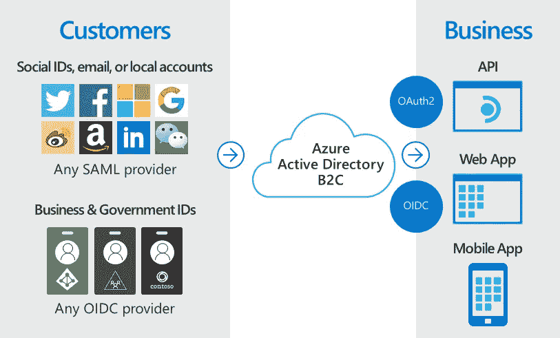
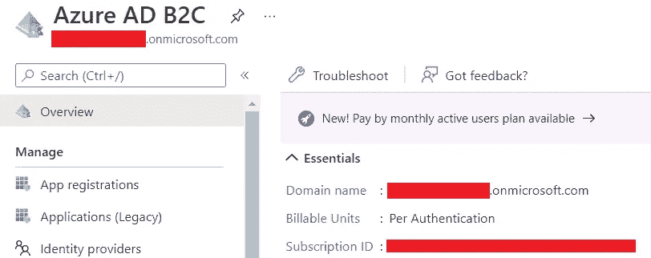
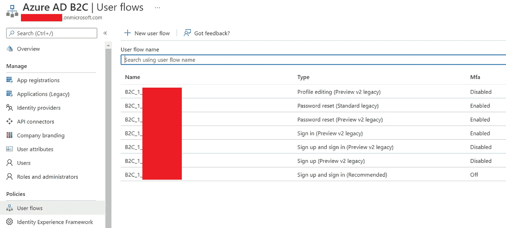
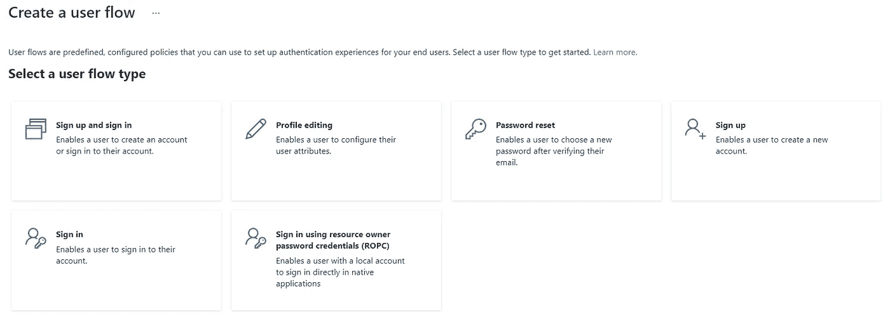

# Azure 广告 B2C。NET 4.8:老狗可以学新把戏

> 原文：<https://blog.devgenius.io/azure-ad-b2c-for-net-4-8-old-dogs-can-learn-new-tricks-3b8f8db623a9?source=collection_archive---------7----------------------->

来自微软技术文档的照片

我的一个项目目前正在使用 Azure AD 进行身份验证。它的工作是为注册用户提供访问权限，并将不良行为者排除在系统之外。然而，它带来了一个非常重要的小限制。

Azure AD 就像某种联合用户账户系统。您可以在其中创建一个帐户。但它只存在于你的 Azure 目录中。无论你创建什么账号，不管权限什么的，永远是一个 **<目录名> .onmicrosoft.com** 账号(如 testuser @ azure directory . on Microsoft . com)。在你尝试接纳 Azure 生态系统之外的人之前，这并不是什么大问题。

有些时候，您希望容纳更多的用户，但是这些用户不愿意在您的目录下创建一个帐户。一些用户已经是不同联合帐户系统的一部分。一些用户只是使用谷歌、亚马逊或微软的通用账户，还有一些用户可能只是想使用他们的社交媒体账户登录一切(这不是我建议的，但不同的人有不同的方式)。

如果你和我们的情况一样，那么你可能应该考虑转向 Azure AD B2C。

在这一点上，我仍在试图理解整个 Azure 生态系统，我还有很多要学的。所以我继续寻找关于它如何工作以及如何实现的文章。网上有很多资料讨论它是如何工作的。然而，这些材料中的大部分(如果不是全部的话)是用。网芯。我做的项目还在用。净 4.8。我知道 B2C 的实现很有可能是专门为。NET Core 和更高版本，因为我找不到任何关于它的文章。净 4.8。但是我知道我不是唯一一个想到这么做的人，可能有人已经做了一些事情。所以我继续挖掘。

您瞧，实际上在。NET 4.8 中有一个 B2C 实现。**你可以在这里找到:** [**Azure AD B2C:从 ASP.NET Web App**](https://github.com/Azure-Samples/active-directory-b2c-dotnet-webapp-and-webapi)调用 ASP.NET Web API

我最初认为从 Azure AD 到 Azure AD B2C 的迁移会非常困难，因为我正在使用旧版本的框架来实现新功能。但这并没有我想象的那么难。

乍看之下，Azure AD 和 Azure AD B2C 中使用的约定并没有太大差别。他们使用同一个库**微软。Owin.Security.OpenIdConnect** 和接口 **IAppBuilder** ，这意味着类、方法和接口是相同的，这意味着修改应该是最小的。

现在，仅仅因为库是相同的，接口是相同的，这并不意味着声明也是相同的。

有一些特定的部分是相同的，比如 **ClientID** 、 **RedirectUri** 和**postlogutredirecturi**。但是有些字段对于我们的实现来说是新的，比如**元数据地址**。它似乎是为给定租户和用户流策略组合提供 OpenID 配置的地址。

元数据地址应该是这样的:https://<directory>. B2C login . com/TFP/<tenant>/<userflowpolicy>/v 2.0/。众所周知的/openid 配置</userflowpolicy></tenant></directory>

**租户**是你的 B2C 实例的域名。

**用户流策略**是您将在 Azure Portal 中 B2C 配置的用户流部分定义的策略。

**用户流**基本上是预定义类型的流程流，开发人员可以使用它们来使用户的帐户管理变得简单和安全。这就像是制作你自己的账户管理页面，除了你让 Azure AD B2C 为你做。示例用户流包括注册和登录(SUSI)、简档编辑和密码重置。

这里有很多东西要讨论。但是本文只是为了说明您不需要最新版本的。NET 来实现你自己的 B2C 认证。已经有很多关于这个主题的视频被制作出来了，尽管是在。网芯。但他们很好地解释了如何做到这一点，从建立自己的目录到创建自己的用户流。我推荐一个来自 WintellectNOW 的视频。

【https://www.youtube.com/watch?v=RNfJW8Fv10U】

至于 web.config，这里有一个快速参考:

1.  **租户**—B2C 域名。
2.  **TenantID** —目录 ID。你可以在应用程序注册中或者当你试图在 Azure 门户中切换目录时找到它。
3.  **ClientID** —应用程序 ID。这也可以在应用程序注册中找到
4.  ClientSecret —这是一个计算机生成的代码，有助于保证你的 B2C 实现的安全性。在应用程序注册中，您将在管理部分看到证书和密码。您可以在那里创建密钥。
5.  **AadInstance** —这是具有正确租户和用户流策略的 B2C 登录实例的 URL。应该是这样的:https:// <目录> .b2clogin.com/tfp/ <租户> / <用户流策略>
6.  **RedirectUri** —经过身份验证的用户的重定向页面的 URL
7.  **signussigninpolicyid**、 **EditProfilePolicyId** 和**resetpasswordpolicid**——这些分别是注册/登录、编辑个人资料和重置密码的用户流策略
8.  **ApiIdentifier** —这是定义请求范围所必需的。

感谢你阅读这篇文章。

如果你觉得这篇文章有趣，点击👏按钮，并分享这篇文章。

我的文章发布在 [**媒体**](https://medium.com/@bien.baldonado) 和我的网站[**www.thebeet21.com**](https://www.thebeet21.com)