# AZURE AZ-900 笔记

> 原文：<https://blog.devgenius.io/azure-az-900-notes-4bd94e166978?source=collection_archive---------0----------------------->

***在准备微软 Azure AZ-900 的时候，我准备了这些笔记。它包含了官方 Microsoft learn 文档中的所有主题，并有直观的解释。***

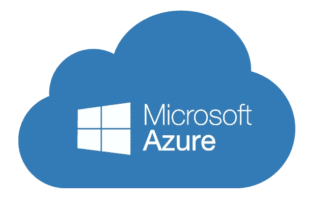

# 描述云计算

# 云计算

它通过互联网提供计算服务，如虚拟机、存储、数据库、网络、人工智能、ML 和物联网服务。你不需要物理基础设施，也不需要管理它，所有的服务都可以通过互联网使用。

# 云中的共享责任模型

1.  IaaS —允许您租赁硬件并控制操作系统(虚拟机、虚拟网络)
2.  平台即服务—允许您管理应用程序，而无需控制底层操作系统(数据库)
3.  SaaS —允许订阅软件(Office 365)

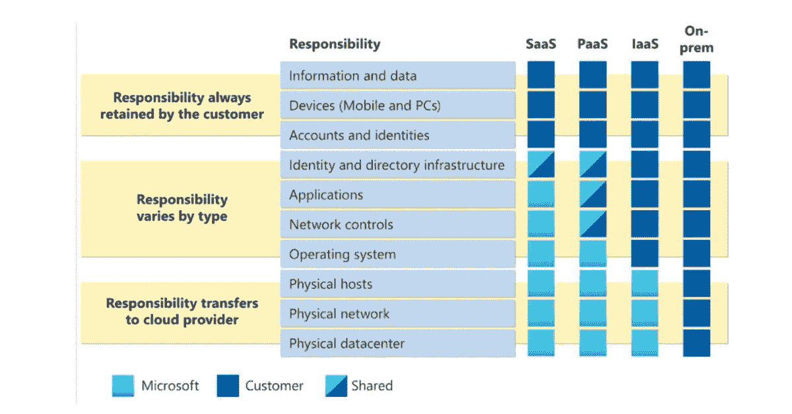

# 云模型

1.  私有云—由单个实体构建、维护和使用的云
2.  公共云由第三方维护，任何人都可以使用其服务
3.  混合—在互连的环境中同时使用公共云和私有云。用户可以选择将哪些数据保存在哪里
4.  多云—不止一个公共云，一些服务来自云 1，另一些来自云 2，等等..
5.  Azure arc —帮助管理云(无论是混合云、私有云、单一云还是多云)
6.  VMware(提供虚拟机)—轻松将 VMware 从私有云转移到 azure

# 基于消费的模型

云计算属于 OpEx(运营基础设施),因为云计算基于消费模式运行。有了云计算，你不用为物理基础设施买单，而是为你使用的 IT 资源买单。

# 描述云计算的优势

# 高可用性和可扩展性的优势

1.  可用性—非常少的停机时间(无法使用服务时的维修和维护时间)，这是 SLA(服务级别协议)的一部分
2.  可扩展性—轻松调整资源以满足需求。

> 垂直—意味着增加或减少资源的容量(更多的数据存储空间，增加虚拟机的处理能力)
> 
> 水平—意味着添加或删除资源

# 可靠性和可预测性的优势

1.  可靠性—云是分散的，因此如果一个中心关闭，其他中心仍在运行
2.  可预测性

> 成本—可以实时跟踪资源并做出相应的规划
> 
> 性能—自动扩展、负载平衡、高可用性

# 治理和安全性的优势

1.  确保公司标准的模板
2.  帮助审计任何不符合标准的资源
3.  维护和修补会自动进行
4.  比 IaaS 更能抵御 DDOS 攻击

# 云中管理的优势

1.  易于扩展
2.  基于预设模板部署资源
3.  监控资源健康状况

# 描述云服务类型

# 情节

1.  *IaaS*

> 提升和转移迁移:您正在建立类似于本地数据中心的云资源，然后简单地将本地运行的东西转移到 IaaS 基础架构上运行。
> 
> 测试和开发:您已经为需要快速复制的开发和测试环境建立了配置。您可以使用 IaaS 结构快速启动或关闭不同的环境，同时保持完全的控制。

2.Paas

> 开发框架:PaaS 提供了一个框架，开发人员可以在此基础上开发或定制基于云的应用程序。与创建 Excel 宏的方式类似，PaaS 允许开发人员使用内置软件组件创建应用程序。包括可伸缩性、高可用性和多租户功能等云特性，减少了开发人员必须编写的代码量。
> 
> 分析或商业智能:通过 PaaS 作为服务提供的工具，组织可以分析和挖掘他们的数据，发现见解和模式，并预测结果，以改善预测、产品设计决策、投资回报和其他业务决策。

3.Saas

> 电子邮件和信息。
> 
> 商业生产力应用。
> 
> 财务和费用跟踪。

# 描述 Azure 的核心架构组件

Azure 核心架构可以分为两个部分:物理基础设施和管理基础设施

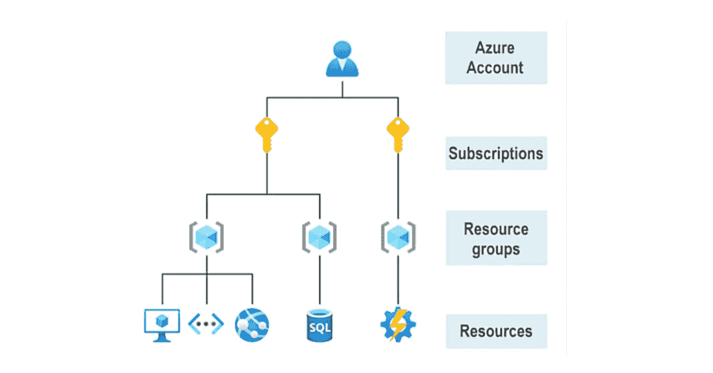

# Azure 物理基础设施

1.  区域—包含一个或多个联网的数据中心
2.  可用性区域 azure 区域内物理上独立的数据中心
3.  区域对-大多数 Azure 区域都与同一地理区域内至少 300 英里以外的另一个区域(如美国、欧洲或亚洲)配对。

# Azure 管理基础设施

1.  Azure 资源和资源组

> 资源是基本块—虚拟机、虚拟网络、数据库、认知服务等。
> 
> 资源组—资源的分组

1.  订阅—是管理、计费和扩展的单位。如果您正在使用/转移到 Azure，首先需要创建的是
2.  管理组 Azure 管理组提供了订阅之上的范围级别。您将订阅组织到称为管理组的容器中，并将治理条件应用于管理组。

# 实践:创建 Azure 资源

1.  登录到 [Azure 门户](https://portal.azure.com/learn.docs.microsoft.com)。
2.  选择创建资源>计算>虚拟机>创建。
3.  “创建虚拟机”窗格将打开“基础”选项卡。
4.  为每个设置验证或输入以下值。如果未指定设置，请保留默认值。
5.  创建一个虚拟机后，我们可以验证 Azure 创建了一个虚拟机以及所有相关的资源

# 实践:检验现有资源

1.  选择主页
2.  选择资源组
3.  选择[资源组名称]资源组

# 描述 Azure 计算和网络服务

# Azure 虚拟机

1.  虚拟机以虚拟化服务器的形式提供 IaaS。虚拟机可以从预先存在的模板中创建
2.  在 Azure 中扩展虚拟机—虚拟机可以是单个或多个，以实现可扩展性、可用性和冗余

2.1 虚拟机规模集—虚拟机实例的数量可以根据需求自动增加或减少，或者您可以根据定义的计划对其进行扩展。虚拟机规模集还会自动部署负载平衡器，以确保您的资源得到高效利用。他们还会自动调配虚拟机。

2.2 虚拟机可用性集-

> 更新域—一个更新域中的所有计算机将一起更新
> 
> 容错域—所有虚拟机都分布在不同的容错域中，每个容错域都有相同的电源。这有助于防止停电。

任何可能影响虚拟机可用性的服务故障通知只能在虚拟机中查看。可以使用 IP 地址通过互联网访问

# Azure 虚拟桌面

Azure VDI 是一种 Azure 虚拟机。它是一种运行在云上的桌面和应用虚拟化。支持 Mac 和 IoS 上的远程桌面客户端。对运行 AVD 的虚拟机收费。ADV 用户应该存在于与 Azure AVD 链接的同一个广告中。

# 天蓝色容器

容器捆绑应用程序及其依赖项，然后将其作为一个单元部署到容器主机。与虚拟机非常相似，我们有多个容器。唯一的区别是虚拟机虚拟化硬件，而容器虚拟化操作系统。允许在一台主机上运行多个容器。码头工人

1.  可通过互联网访问
2.  可以在 Windows 或 Linux 上运行
3.  自动缩放

Azure 容器实例——无需任何虚拟机(PaaS)即可运行容器的最简单方式

# Azure 函数

事件驱动的无服务器计算选项，不需要虚拟机或容器。Azure 功能的优势-

1.  根据需求自动缩放
2.  仅在使用该功能时充电

# Azure 应用程序托管选项

主持方式-

1.  虚拟机—一种完全控制托管环境的应用托管方式
2.  容器——很好的选择，因为它可以隔离和单独管理托管解决方案的不同方面
3.  azure App Services——一种基于 HTTP 的服务，用于托管 web 应用程序、REST APIs 和移动后端。它支持多种语言，包括。网，。NET Core、Java、Ruby、Node.js、PHP 或者 Python。它还支持 Windows 和 Linux 环境。使您能够从 Azure DevOps 执行自动化部署。优势-

> 集成到平台中的部署和管理
> 
> 端点可以得到保护
> 
> 负载平衡和流量管理器确保高可用性
> 
> 站点可以快速扩展以管理流量

# Azure 虚拟网络

Azure 虚拟网络和子网支持虚拟机、web 应用、数据库之间以及互联网或内部系统上的用户之间的通信。Azure 网络中有两种端点来实现内部或外部资源之间的通信

1.  私有端点—分配给 Azure 网络内资源的私有 IP 地址
2.  公共端点—公共 IP 地址分配给资源，任何人都可以通过互联网访问

亮点-

1.  隔离和分段——可以在 Azure 中创建多个隔离的网络。公有或私有 IP 地址可以从网络的 IP 地址范围中选择
2.  Azure 资源之间的通信-

> 虚拟机不仅可以连接到虚拟机，还可以连接到任何其他资源
> 
> 服务端点可以连接到多个 Azure 资源

3.与内部资源通信— Azure 支持创建包含本地和云资源的网络，以下是实现这一点的 3 种方法

> 点对点虚拟专用网络连接是从您组织外部的计算机连接回您的公司网络。在这种情况下，客户端计算机启动加密的 VPN 连接来连接到 Azure 虚拟网络。
> 
> 站点到站点虚拟专用网络将您的内部 VPN 设备或网关链接到虚拟网络中的 Azure VPN 网关。实际上，Azure 中的设备看起来像是在本地网络上。该连接是加密的，并通过互联网工作。
> 
> Azure ExpressRoute 为 Azure 提供专用的私有连接，不通过互联网传输。ExpressRoute 适用于需要更大带宽和更高安全级别的环境。

4.路由网络流量——Azure 让您可以通过以下方式控制路由:

> 路由表允许您定义有关流量应该如何定向的规则
> 
> 边界网关协议将内部 BGP 传播到 Azure 网络

5.过滤网络流量-

> 网络安全组—创建多个出站和入站安全规则
> 
> 网络虚拟设备—这是一个虚拟机，帮助信息流向网络上的其他设备

6.连接虚拟网络—对等(直接在互联网服务提供商之间交换数据，而不是通过互联网)用于连接完全私有的虚拟网络

# Azure 虚拟专用网络

虚拟专用网络(VPN)使用另一个网络中的加密隧道。

1.  VPN 网关—每个虚拟网络中只能部署一个 VPN 网关。但是，您可以使用一个网关连接到多个位置，包括其他虚拟网络或内部数据中心。需要定义 VPN 类型-

> 基于政策
> 
> 基于路线

2.高可用性场景—确保 VPN 的高可用性和容错性

> 活动/备用—部署 2 个实例，第二个实例作为替代品
> 
> 主动/主动—为每个实例分配一个唯一的 IP 地址。则创建从本地设备到每个 IP 地址的单独隧道
> 
> 快速路由故障转移—另一个高可用性选项是将 VPN 网关配置为快速路由连接的安全故障转移路径。
> 
> 区域冗余网关

# 蔚蓝高速公路

有助于通过私有连接将内部数据与云连接起来。连接不通过互联网。

1.  特点和优势-

> 全球连通性
> 
> 通过内置冗余实现高可靠性
> 
> 通过边界网关协议的动态路由

2.连通性模型

> CloudExchange 托管—如果您的设施位于云交换的同一位置，您可以请求虚拟交叉连接到 Microsoft 云。
> 
> 点对点以太网连接-您的设施和微软云之间的点对点连接
> 
> 任何对任何网络—使用 Azure 连接您的广域网
> 
> 直接从 ExpressRoute 站点—连接到微软的全球网络

# 描述 Azure DNS

好处-

1.  可靠性和性能-
2.  安全性
3.  易用性
4.  带有私有域的可定制虚拟网络
5.  别名记录

# Azure 存储服务

# Azure 存储帐户

1.  标准通用 v2
2.  高级块 blobs
3.  高级文件共享
4.  高级页面 blobs

# Azure 存储冗余

1.  主区域中的冗余—数据在主区域中复制 3 次，Azure 为此提供了两个选项

> 本地冗余存储(LRS) —在主区域的单个数据中心内复制数据 3 次。最低成本的冗余选项。耐用性最低。

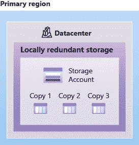

> 区域冗余存储(ZRS) —跨主区域中的 3 个不同可用性区域复制数据。经久耐用

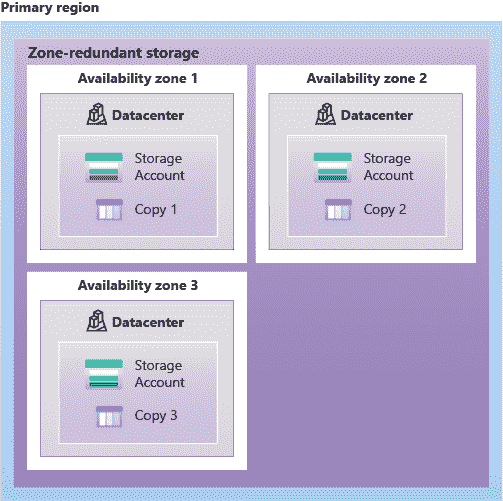

2.辅助区域中的冗余—数据被复制到远离主区域的辅助区域。Azure 提供了两个选项

> 地理冗余存储(GRS) — GRS 使用 LRS 在主区域和辅助区域内复制数据 3 次。

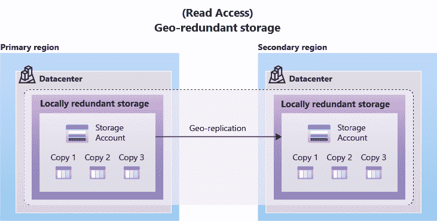

> 地理区域冗余存储(GZRS) —使用 ZRS 在主区域复制数据，使用 LRS 在辅助区域复制数据

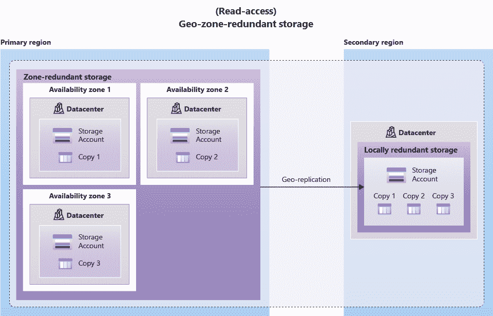

对辅助区域中数据的读访问权限—只有当主区域出现故障时，辅助区域中的数据才是只读的，如果未启用读访问权限，则其他情况下总是可读的

# Azure 存储服务

包括以下服务-

1.  Azure Blob 存储—存储可通过互联网访问的非结构化数据。Blob 存储层—帮助您以经济高效的方式存储数据

> 热访问层—用于频繁访问的数据
> 
> 冷访问层—不经常访问并存储至少 30 天
> 
> 归档访问层—至少在 180 天内很少访问和存储的数据

2 个 Azure 文件—云中完全受管的文件共享，可通过 SMB 或 NFS 协议访问

3 队列存储—存储大量消息。可以使用 HTTP 或 HTTPS 访问。

4.磁盘存储—由 Azure 管理的块级存储卷，用于虚拟机。它们是物理磁盘的云版本。

# 实践:创建存储 Blob

创建存储帐户:

1.  在 https://portal.azure.com[登录 Azure 门户](https://portal.azure.com/learn.docs.microsoft.com)
2.  选择创建资源。
3.  在类别下，选择存储。
4.  在存储帐户下，选择创建。
5.  在创建存储帐户刀片的基本选项卡上，填写以下信息。其他一切都保留默认值。
6.  选择“查看+创建”以查看您的存储帐户设置，并允许 Azure 验证配置。
7.  验证完成后，选择创建。等待帐户创建成功的通知。
8.  选择转到资源。

使用 Blob 存储

1.  在数据存储下，选择容器。

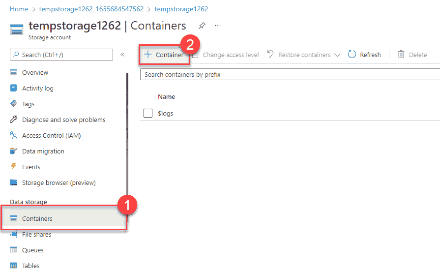

1.  选择+容器并填写信息。
2.  选择创建
3.  回到 Azure 门户，选择您创建的容器，然后选择 Upload。
4.  浏览您想要上传的图像文件。选择它，然后选择上传
5.  选择您刚刚上传的 Blob(文件)。您应该在属性选项卡上。
6.  从 URL 字段复制 URL，并将其粘贴到新选项卡中。您应该会收到类似下面的错误消息。->指定的资源不存在。

更改 Blob 的访问级别

1.  返回 Azure 门户网站
2.  选择更改访问级别
3.  将公共访问级别设置为 Blob(仅限 Blob 的匿名读取访问)
4.  选择确定
5.  刷新您之前试图访问该文件的选项卡。

# Azure 数据迁移选项

Azure 支持使用 Azure Migrate 的基础设施、应用和数据的实时/同步迁移，以及使用 Azure Data Box 的异步迁移

1.  Azure Migrate —提供:
2.  统一迁移平台
3.  一系列工具—

> Azure Migrate:发现和评估—发现和评估本地服务器
> 
> Azure 迁移:服务器迁移—迁移到 Azure
> 
> 数据迁移助理—评估 SQL 服务器
> 
> Azure 数据库迁移服务—将本地数据库迁移到 SQL
> 
> Web 应用迁移助手—帮助内部网站迁移到 Azure 应用服务
> 
> Azure data box——将大量离线数据转移到 Azure。物理迁移服务。大于 40TbB 数据。不支持有限的网络连接。

4.评估和迁移

# Azure 文件移动选项

1.  AzCopy —与存储帐户/云提供商共享 blobs 或文件(包括同步文件)
2.  Azure 存储资源管理器—提供图形界面来管理 Azure 存储帐户中的文件和 blobs
3.  Azure 文件同步—允许您集中文件共享。双向同步 Azure 和本地系统中的文件

# Azure 身份、访问和安全性

# Azure 目录服务

Azure AD 是一种目录服务，使您能够登录并访问微软云应用和您开发的云应用。还可以帮助您维护内部 Active Directory 部署。它用于检索安全令牌。

广告类型-

1.  自由的
2.  办公室 365
3.  高级 P1 — RBAC &有条件接收
4.  高级 P2 —身份保护、自助权限管理和特权身份管理

# Azure 身份验证方法

1.  Microsoft Authenticator 应用程序—通过手机进行多重身份验证
2.  FIDO2 安全密钥—第三方密钥

# Azure 外部身份

确定您可以安全地与组织外的用户进行交互的所有方式。以下功能构成了外部身份:

1.  B2B 协作
2.  B2B 直接连接
3.  Azure 面向客户的广告业务(B2C)

# Azure 条件接收

由 Azure AD 用来基于标识信号允许或拒绝对资源的访问

# Azure 基于角色的访问控制

Azure 向用户分配角色(内置或自定义)，以便他们只被授予他们应该获得的信息。每个角色都有一组相关的权限。

# 零信任模型

假设最坏情况并以此期望保护资源的模型。

# 深度防御

保护信息，防止未经授权的人窃取信息。多层纵深防御-

1.  物理安全——确保进入建筑物的安全
2.  身份和访问—身份是安全的，只向需要的人授予访问权限
3.  边界—网络边界保护您的资源免受基于网络的攻击。DDoS 保护。防火墙
4.  网络—限制资源之间的通信，以限制攻击的影响
5.  计算—确保计算资源的安全
6.  应用程序—确保应用程序安全，将敏感的应用程序信息存储在秘密存储中。将安全性作为所有应用程序的设计要求
7.  数据—正确保护数据

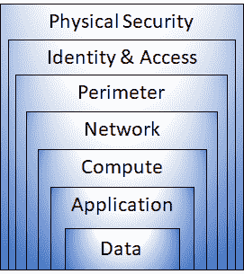

# 微软云卫士

用于安全管理和威胁防护的监控工具。保护所有类型的云基础架构。在 MDFC 的法规遵从性仪表板上，您可以找到总体合规性和分数，以及通过和未通过评估的数量

1.  访问— Defender for cloud 可帮助您持续评估您的环境。
2.  安全-

总体安全分数可以在 MDFC 的安全分数部分找到

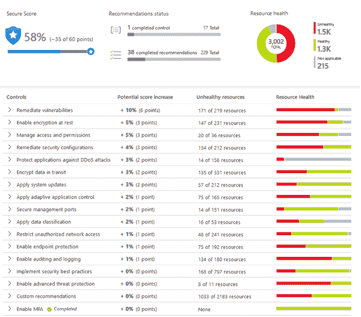

3.保卫-

> 安全警报—按严重性分级的安全变更是安全警报的一部分
> 
> 高级威胁防护

# Azure 中的成本管理

# 影响成本的因素

使用 Azure 成本管理只需要一份企业协议

1.  资源类型
2.  消费
3.  维护
4.  地理
5.  网络信息流通量
6.  订阅类型
7.  Azure 市场

# 定价和总拥有成本计算器

1.  定价计算器—在 Azure 中配置资源的成本
2.  TCO 计算器—比较本地基础架构与 Azure 云的运行成本(定义服务器、存储和网络以比较成本)

# 动手操作:使用定价计算器

使用价格计算器并填写字段

# 动手操作:使用 TCO 计算器

使用总拥有成本(TCO)计算器来比较在数据中心和 Azure 上运行样本工作负载的成本。

# Azure 成本管理工具

快速检查 Azure 资源成本、基于资源支出创建警报以及创建预算的工具。成本分析是成本管理的一个子集，它提供了 Azure 成本的可视化。

1.  成本预警-

> 预算预警
> 
> 信用预警
> 
> 部门支出限额预警

2.预算

# 标签

资源标签是组织资源的一种方式。标签提供了关于资源的额外信息或元数据。

# Azure 中用于治理和合规的特性和工具

# 蔚蓝蓝图

用于定义可重复设置，以便快速扩展资源。Azure Blueprints 让您可以标准化云订阅或环境部署。有了 Azure Blueprints，您不必为每个新订阅配置 Azure Policy 等功能，而是可以定义在创建新订阅时应用的可重复设置和策略

> 工件——蓝图中的每个组件都被称为工件

# Azure 策略

Azure Policy 是 Azure 中的一项服务，使您能够创建、分配和管理控制或审核您的资源的策略。允许您指定可以创建的资源类型

> Azure 策略使您能够定义单个策略和相关策略组，称为计划

# 资源锁

防止资源被意外更改或删除。它适用于所有用户和角色。

# 练习-配置资源锁

应用只读资源锁

1.  向下滚动，直到在屏幕左侧找到 blade 的设置部分。
2.  选择锁。
3.  选择+添加。

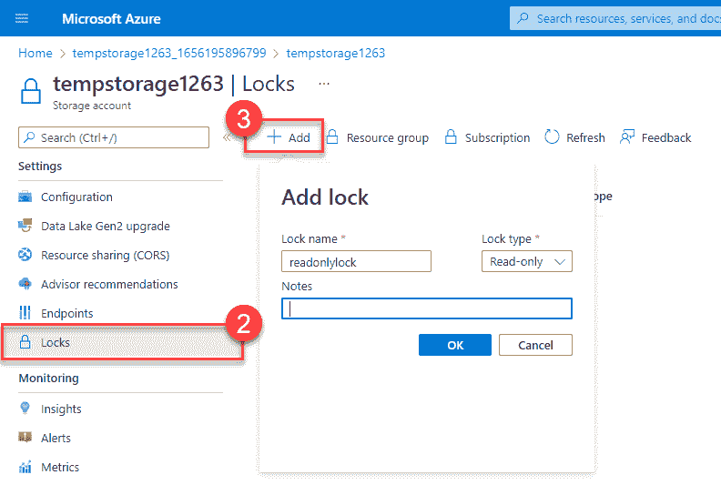

4.输入锁的名称。

5.验证锁定类型是否设置为只读

6.选择确定。

# 服务信任门户

Microsoft Service Trust Portal 是一个门户，它提供对各种内容、工具和其他有关 Microsoft 安全性、隐私和合规性实践的资源的访问。

# 描述管理和部署 Azure 资源的功能和工具

# 与 Azure 交互的工具

1.  Azure 门户——Azure 门户是一个基于 web 的统一控制台，提供了命令行工具的替代方案。有了 Azure 门户，你可以通过使用图形用户界面来管理你的 Azure 订阅。
2.  Azure Cloud shell—Azure Cloud Shell 是一个基于浏览器的 Shell 工具，允许您使用 Shell 创建、配置和管理 Azure 资源。

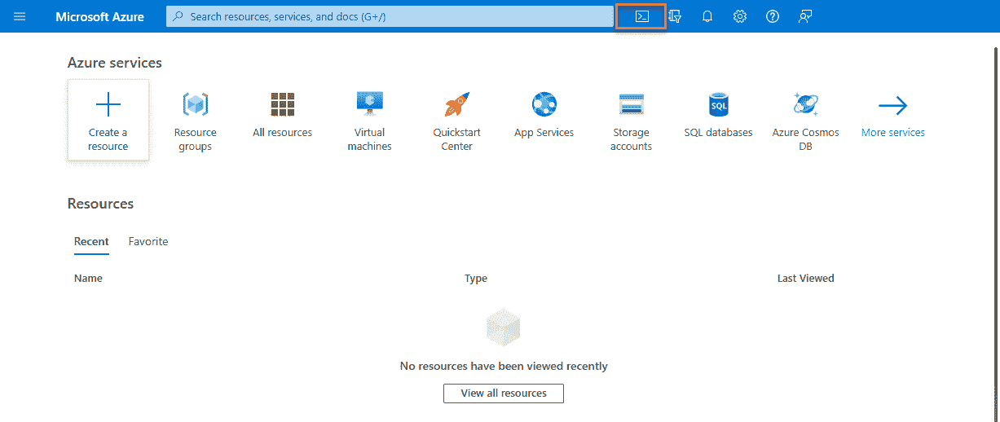

> Azure Powershell —使用 Powershell 命令
> 
> Azure CLI —使用 bash 命令

# 天蓝色电弧

用于监控混合和多云环境的工具

# Azure 资源管理器和 ARM 模板

Azure 的部署和管理服务。ARM 授权用户发送的请求。它提供了一个管理层，使您能够创建、更新和删除 Azure 帐户中的资源。模板使用 JSON 语法

> 手臂模板-
> 
> 声明语法
> 
> 可重复结果
> 
> 编排—负责部署，无论是以特定的顺序还是并行方式
> 
> 模块化文件—重复使用部分模板
> 
> 扩展性-

# Azure 中的监控工具

# Azure Advisor 的用途

评估 Azure 资源并提出建议，以帮助提高可靠性、安全性和性能，实现卓越运营并降低成本。顾问仪表板显示您所有订阅的个性化建议。

# Azure 服务运行状况

服务健康提供了 Azure 服务和区域的更窄的视图。它主要关注你正在使用的 Azure 服务和地区。这是寻找有关停机、计划维护活动、应用服务使用超过配额(健康咨询)和其他健康咨询的服务影响通信的最佳位置，因为认证服务健康体验知道您当前使用的服务和资源。您甚至可以设置服务健康警报，以便在服务问题、计划维护或其他更改可能影响您使用的 Azure 服务和区域时通知您。服务健康允许在您的网站上实现一个 webhook 来显示健康事件。

1.  Azure 状态—通知 Azure 中的服务中断
2.  服务运行状况-您正在使用的服务和区域的运行状况
3.  资源运行状况—查看您的实际云资源

# Azure 监视器

1.  azure Monitor——收集资源数据、分析数据、可视化信息、处理结果的平台。

> Azure Log Analytics——Azure 门户中的工具，您可以在其中编写并运行对 Azure Monitor 收集的数据的日志查询。
> 
> Azure Monitor 警报——当 Azure Monitor 检测到阈值被超越时，保持通知的自动化方式。您设置警报条件和通知操作，然后 Azure Monitor Alerts 在触发警报时发出通知。
> 
> 应用洞察—监控您的 web 应用。Application Insights 能够监控在 Azure、内部或不同的云环境中运行的应用程序

# 祝你好运！

如果你想进一步讨论这个问题，请通过 LinkedIn 与我联系。**在下面留下掌声和评论支持博客吧！关注更多。**