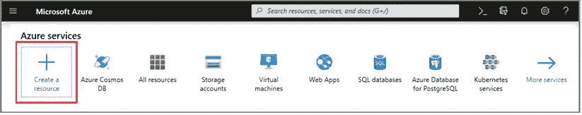
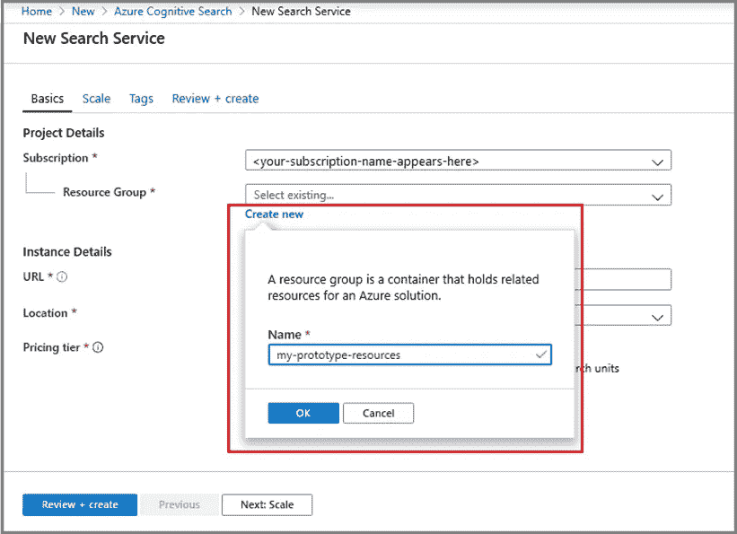
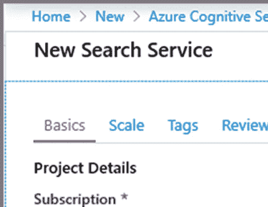
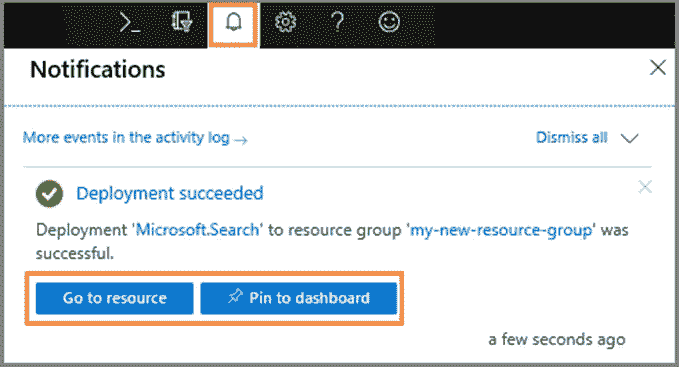
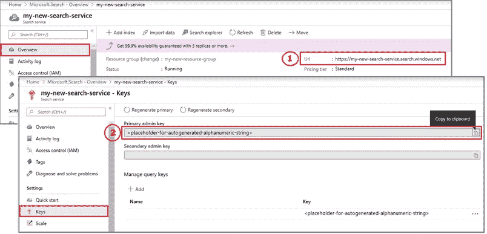
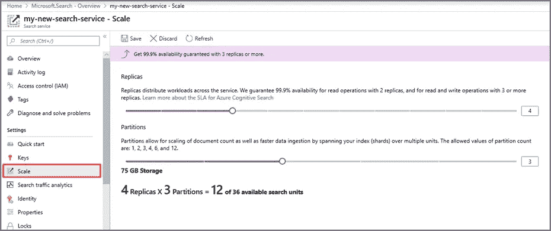

# Azure 认知搜索

> 原文：<https://blog.devgenius.io/azure-cognitive-search-1dd045a3c37c?source=collection_archive---------13----------------------->

**如何设置 Azure 认知搜索以获得深度用户洞察**

Azure Cognitive Search(以前的 Azure Search)是微软 Azure 云平台的一部分，有助于对存储在微软服务器上的数据进行查询和索引。

Azure Cognitive Search 是唯一一个为复杂数据提供内置人工智能功能的云搜索平台，以促进大规模的内容探索。本文将讨论在 Azure 门户中创建 Azure 搜索服务的分步教程。

# 为什么要投资 Azure 搜索服务？

Azure cognitive search 由先进的人工智能技术支持，允许数据工程师使用语言、语音、视觉和定制的机器学习模型，从服务器上存储的所有类型的信息中挖掘出有意义的见解。Azure Cognitive Search 还具有语义搜索功能，利用先进的人工智能和机器学习策略来发现用户意图，并对搜索查询或最相关的搜索结果进行排名。因此，你花在烦人的云搜索解决方案上的时间和资源更少，而花在创新上的时间和资源更多。

# Azure 搜索服务用例

使用 Azure 认知搜索，您可以:

1.将“搜索”作为一项服务来管理，并轻松扩展。

2.通过地理空间搜索、分面、自动完成和过滤功能创建增强的用户体验。

3.利用高级人工智能功能，如关键短语提取、OCR 和命名实体识别，挖掘有关客户的重要信息。

4.使用深度机器学习模型实现语义搜索功能，并深入了解客户的搜索。

# 在 Azure 门户中创建 Azure 认知搜索服务

第一步:创建你的免费 [Azure 账户](https://azure.microsoft.com/pricing/free-trial/?WT.mc_id=A261C142F)或者在 [Visual Studio 订阅中激活你的 Azure 点数](https://azure.microsoft.com/pricing/member-offers/msdn-benefits-details/?WT.mc_id=A261C142F)。

步骤 2:通过以下步骤导航到 Azure 认知搜索:

-登录您的 [Azure 门户网站](https://portal.azure.com/)

-单击左上角用“+”号表示的“创建资源”。

*   在搜索栏中找到“Azure 认知搜索”。

第 3 步:选择 Azure 服务的订阅。

步骤 4:创建资源组。

资源组充当一个容器，保存 Azure 解决方案的相关和相关资源。资源组对于搜索服务是必不可少的。它管理服务，并且可以包含多个可以同时使用的服务。

*注意:您必须为 Azure 认知搜索源创建一个新的资源组。*

步骤 5:命名您的新服务

在实例详细信息的 URL 字段中添加您的服务名。请记住，您的服务名称是 URL 端点的一个组成部分。API 调用是针对端点发出的。

要记住的服务名条件:

-该名称在命名空间中必须是唯一的或原始的:search.windows.net。

-不应超过 60 个字符，也不应少于两个字符。

*   它必须包含(如果有)小写破折号、数字或字母。破折号不应用作最后一个字符或前两个字符内，也不应在连续的序列中使用。

第六步:选择服务地点

选择离您的数据中心最近的地区。

要记住的位置条件

- [AI enrichment](https://docs.microsoft.com/en-us/azure/search/cognitive-search-concept-intro) 功能要求你的认知服务与 Azure 认知搜索位于同一位置。查看哪个[位置](https://azure.microsoft.com/global-infrastructure/services/?products=search)最符合您的需求。

*   您需要在 Azure [区域对](https://docs.microsoft.com/en-us/azure/availability-zones/cross-region-replication-azure#azure-cross-region-replication-pairings-for-all-geographies)中创建多个搜索服务，以满足灾难恢复和业务连续性需求。查看[“可用区域”](https://docs.microsoft.com/en-us/azure/search/search-performance-optimization#availability-zones)以了解特定地区的功能可用性。

第七步:选择你的价格

根据您的具体组织需求，在免费、基本或标准价格之间进行选择。每个定价等级都有自己的特点和限制。

*注意:一旦您选择了您的定价等级，就不能更改；您必须从头开始创建服务页面。*

步骤 8:创建你的 Azure 搜索服务

在必填字段中添加详细信息，然后单击“审查+创建”。该服务将在几分钟内部署。见下面截图。

将服务固定到您门户的控制面板上，以便将来轻松访问。

步骤 9:获取您的身份验证 API 密钥和 URL 端点

对于对新服务的编程访问，您将需要一个身份验证 API 密钥和一个 URL 端点。要同时获得这两者:

-转到概述页面，在窗口右侧找到 URL 端点。复制此 URL。

*   转到密钥页面，复制任意一个管理密钥。见下面截图。更新您的搜索服务需要管理密钥。查询关键字只授予您对索引内容的读取权限。

*对于非基于门户的任务，您只需要密钥和 URL。*

步骤 10:扩展你的搜索服务

设置好服务后，下一步是将其扩展到分区或副本。请注意，扩展不是免费定价层中的选项，对于基本，您只能选择副本。

这就是尺度的两个维度的含义。

副本使您的搜索服务能够处理大量的用户搜索查询。

分区为您的搜索服务提供了筛选更多文档的增强功能。

使用[定价计算器](https://azure.microsoft.com/pricing/calculator/)了解添加更多资源会如何增加您的月账单。

要添加新资源，请转到您的搜索服务页面。*你在步骤 8 中将其添加到 Azure 门户的仪表板中。*

导航到左侧窗格，选择设置，然后选择缩放，如下面的屏幕截图所示。接下来，使用侧栏添加新资源。

仅此而已。你现在有了自己的 Azure 认知搜索服务！您可以添加第二个服务，但通常一次就足够了，因为它可以基于您的定价层托管多个索引。在以下情况下，您可以添加第二个服务:

-当前服务不能在发生灾难或断电时提供即时补救。

-您正在使用需要两个或更多服务的多租户架构。

-您在全球部署了应用程序，这需要多个搜索服务来减少延迟。