# Azure 容器应用(ACA)和 Cloudflare

> 原文：<https://blog.devgenius.io/azure-container-apps-aca-and-cloudflare-e63e16ae1c64?source=collection_archive---------0----------------------->

在本文中，我们将配置并使用 Cloudflare 来保护运行在 Azure 容器应用程序上的面向客户端的 web 应用程序。

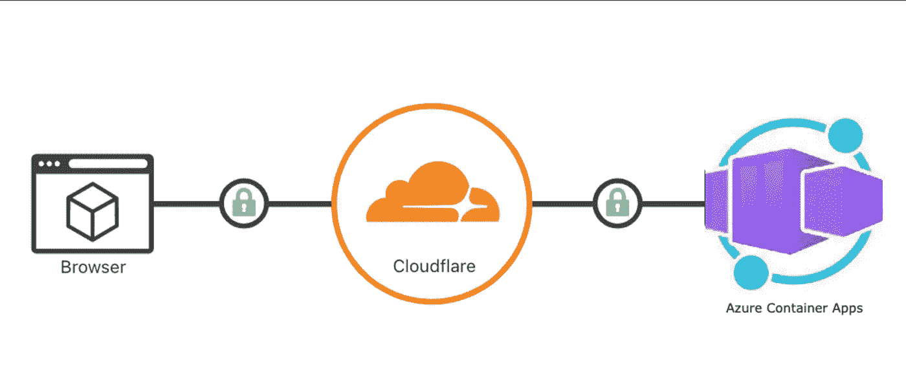

您将需要以下:
-域名
-运行在 ACA
上的 Web 应用程序- Cloudflare 帐户

## 1.启动并运行您的 web 应用程序

在 ACA 中运行容器化的 web 应用程序非常简单和灵活。如果你是 ACA 的新手，跟随这个快速入门是一个很好的起点:
[https://learn . Microsoft . com/en-us/azure/container-apps/quick start-portal](https://learn.microsoft.com/en-us/azure/container-apps/quickstart-portal)

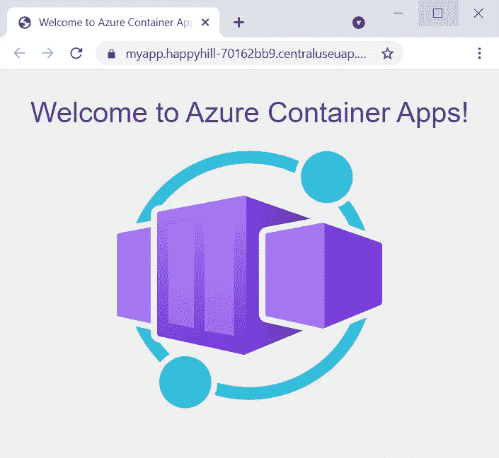

图 1: ACA 快速入门

一旦您的 web 应用程序启动并运行，导航到**自定义域**页面，并点击**添加**按钮**。** 在这里，我们将输入我们的域名，并记下**域名验证**记录。

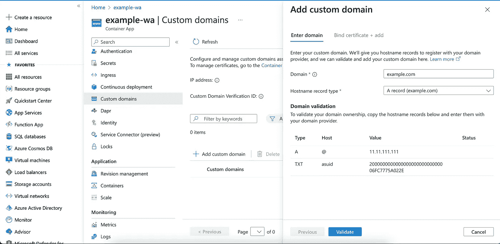

图 2:添加自定义域

## 2.将您的网站添加到 Cloudflare

将您的网站添加到 Cloudflare 后，导航到 SSL/TLS 页面。为了从可用选项中启用端到端加密，我们将选择完整(严格)模式。

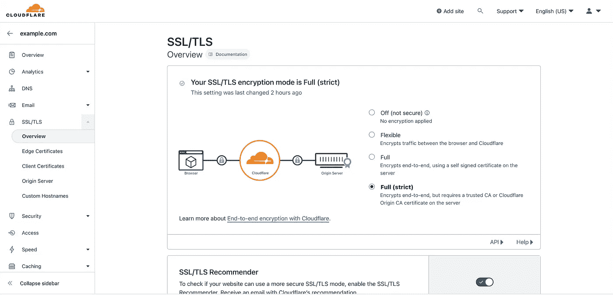

图 3: SSL/TLS 配置 Cloudflare

启用完全 SSL/TLS 加密模式后，导航至**原始证书**页面，并点击**创建证书**按钮。在这里，我们将创建将在 Azure 中使用的可信数字证书。

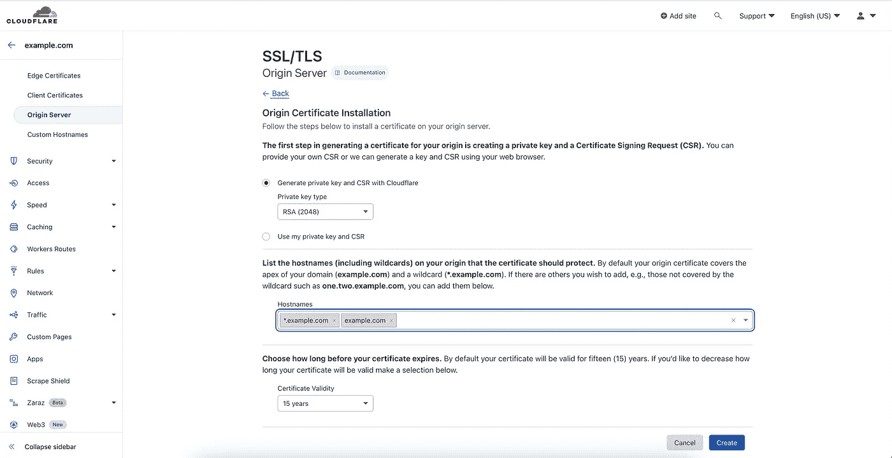

图 4:原始服务器证书

保留默认设置。

*   使用 Cloudflare 生成私钥和 CSR
*   私钥类型 RSA (2048)
*   主机名列表—您域名的顶点(**example.com**)和通配符( ***.example.com** )。

点击**创建**后，您将看到一个生成了您的原始证书和私钥的页面。

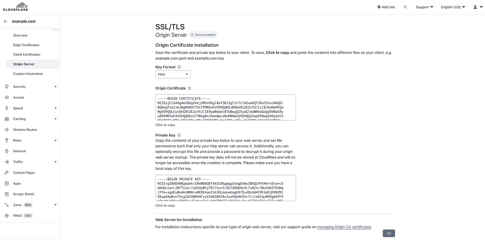

图 5:原始服务器-密钥和证书

将此文件保存在您的本地计算机上。用扩展名**保存原产地证书。pem** 和扩展名为**的私钥。按键**

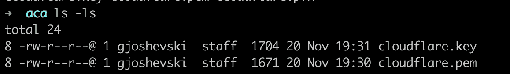

图 5:本地存储的证书

接下来，我们将使用密码保护我们的证书，并生成**。pfx** 通过运行 [openssl pkcs12](https://www.openssl.org/docs/man1.1.1/man1/openssl-pkcs12.html) 命令。

```
openssl pkcs12 -inkey cloudflare.key -in cloudflare.pem -export -out cloudflare.pfx
```

的。我们生成的 pfx 文件将在 Azure 容器应用程序门户中使用，以完成设置，但首先，我们将更新 Cloudflare 中的 DNS 记录，以指向 Azure 容器应用程序。

导航到 Cloudflare 中的 DNS 页面，并按照 Azure 容器应用程序门户的**域验证**部分中的说明添加 A 记录和 TXT 记录。(参见- >图 2:添加自定义域)

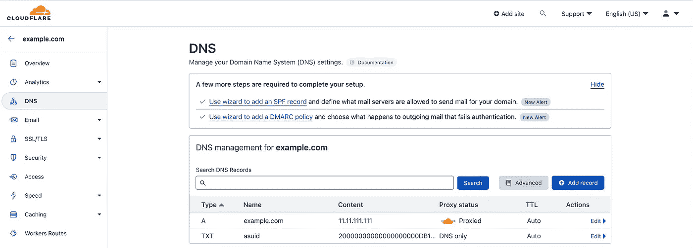

图 6: DNS 配置— Cloudflare

# 3.将自定义域和证书添加到 ACA

导航回 Azure 门户，让我们从上次停止的地方继续。


图 7:添加自定义域— ACA

单击 Validate 按钮后，您应该会看到一条验证通过的消息。

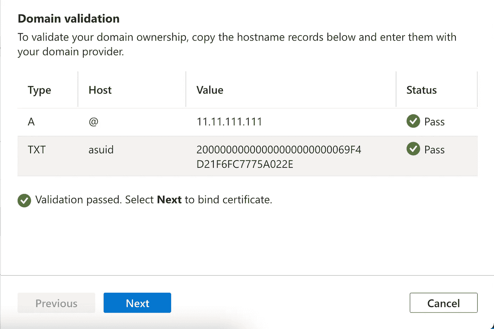

图 8:域验证— ACA

如果您在 Cloudflare DNS 配置中为 A 记录选择了代理选项，您将看到 A 记录的错误状态。您可以忽略此状态，并通过单击“下一步”按钮继续证书配置步骤。

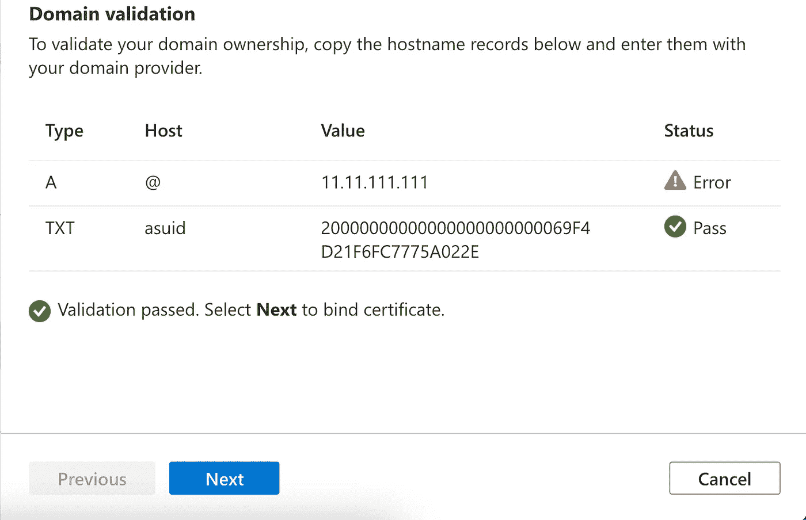

图 9:域验证— ACA — Cloudflare 代理

在下一步中，屏幕将提示您选择证书。由于我们没有要绑定的任何证书，我们将单击**创建新的**链接，在下一个屏幕中，我们将添加**。我们之前生成的 pfx** 证书。

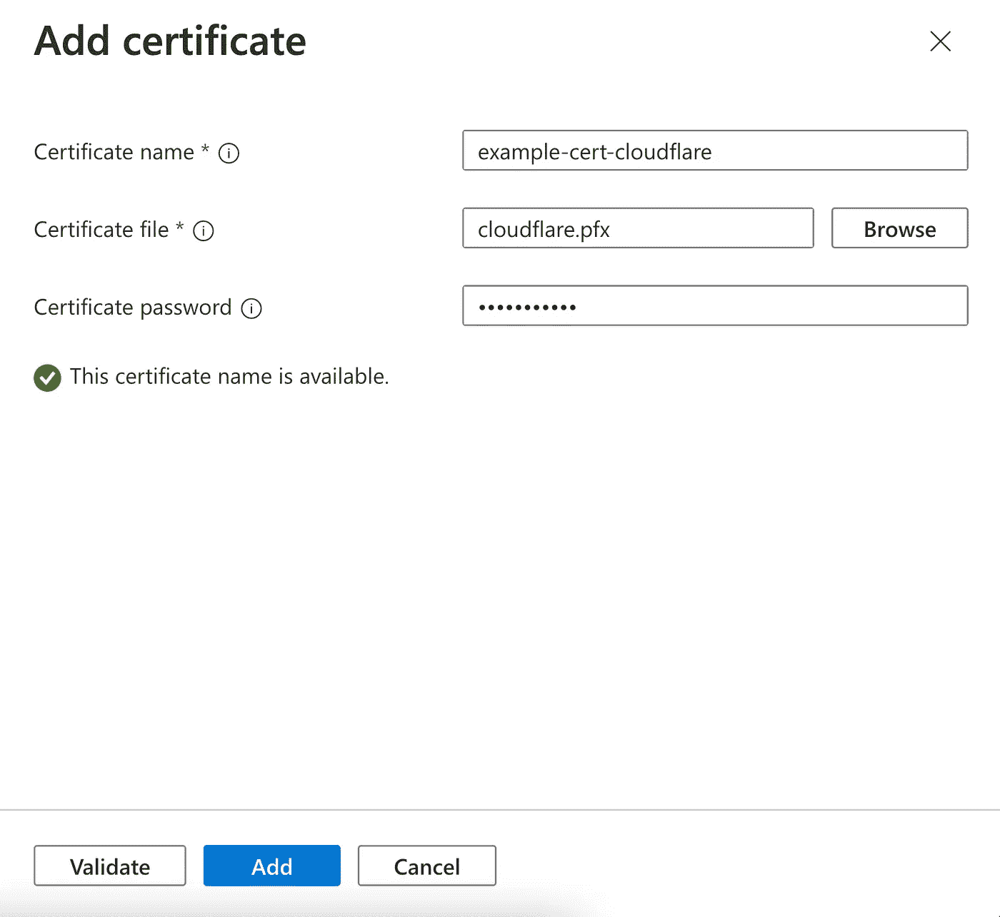

图 10:添加证书 ACA

验证证书后，我们将添加它。

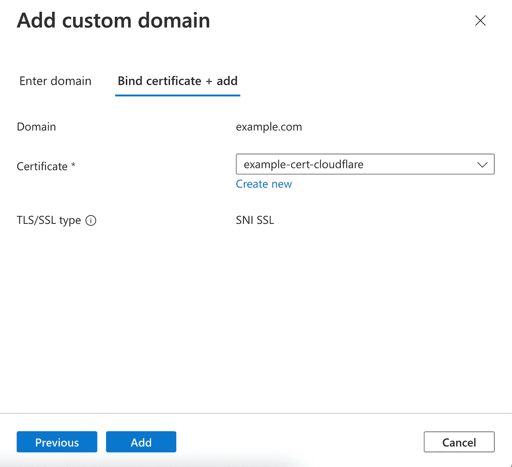

图 11:添加自定义域— ACA

完成上述步骤后，我们将在自定义域列表中看到我们的域。

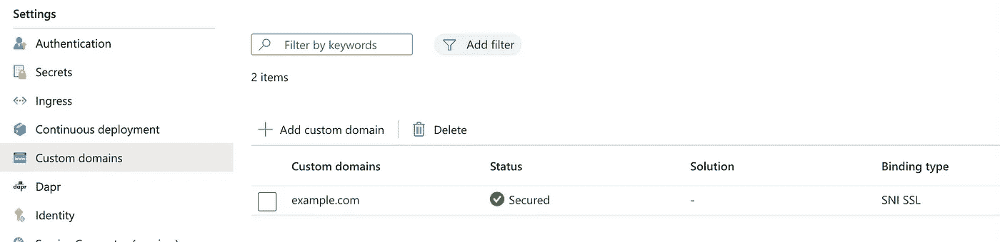

图 12:列出自定义域— ACA

至此，我们完成了。通过在浏览器中输入我们的域，可以访问我们的 web 应用程序。

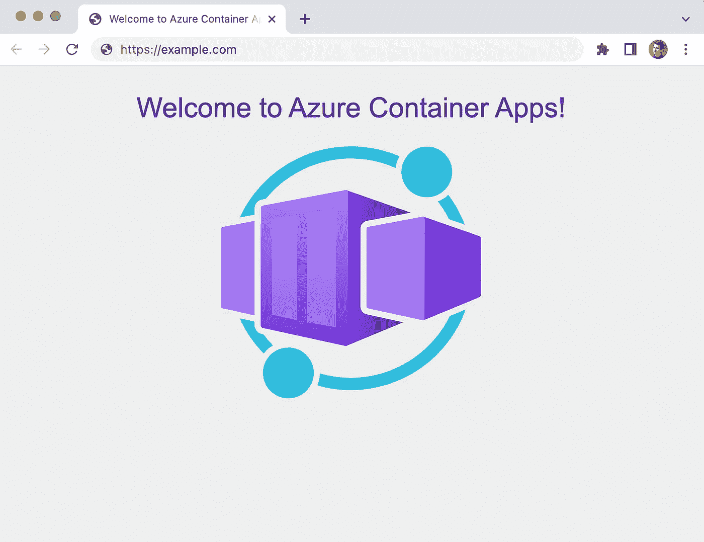

图 13:结束

如果您想使用任何其他子域，如 www，您可以使用相同的证书重复上述步骤。

# 原产地限制

上述场景中的 Azure 容器应用入口在公共 IP 地址上公开。这为绕过 Cloudflare 的流量打开了大门。目前，ACA 不提供可用于防止请求绕过 Cloudflare 的高级访问限制。
要解决这一问题，您需要修改应用程序代码，通过检查请求的来源，只允许来自 Cloudflare 的流量。

# 进一步阅读

*   [Azure 上基于容器的应用——Simple 和 KuberneteslessTo 要了解更多可用选项，请访问](/@gjoshevski/container-based-applications-on-azure-simple-and-kubernetesless-2d3cc17f6c8)
*   [Azure 容器应用中的自定义域名和证书](https://learn.microsoft.com/en-us/azure/container-apps/custom-domains-certificates)