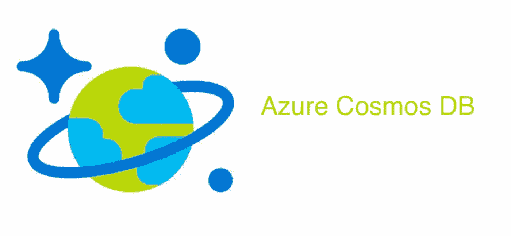
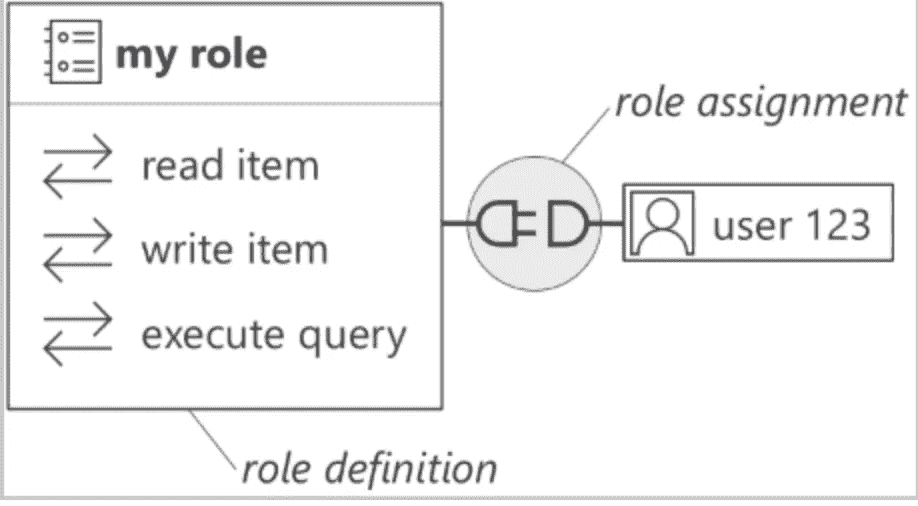
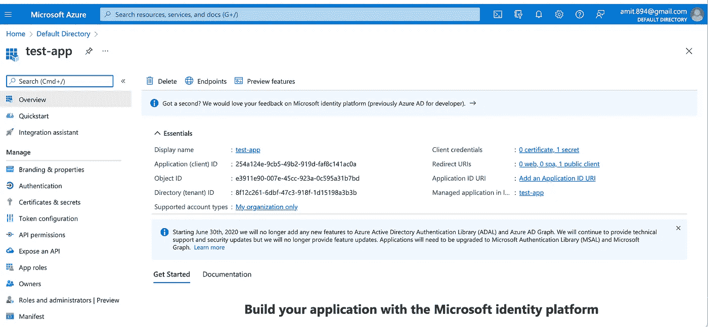

# Azure Cosmos DB—使用 Java 客户端的 RBAC 身份验证

> 原文：<https://blog.devgenius.io/azure-cosmos-db-rbac-authentication-using-a-java-client-720b20c637fe?source=collection_archive---------7----------------------->

这篇博客是我们从零开始讨论**云**概念的系列文章的一部分，面向的是入门知识有限的读者。这篇文章属于*中级*系列，因为它涉及到理解 Azure Cosmos **的 [**RBAC 认证的工作原理。**](https://docs.microsoft.com/en-us/azure/cosmos-db/role-based-access-control)**

云系列中的一些早期博客如下。

[**GCP 大查询第一 Python 连接器**](/gcp-big-query-writing-my-first-python-connector-1140b022b88a)[**Azure 造价自动化**](/automating-your-monthly-azure-cloud-cost-spends-a51257a6564f)[**自定义 Docker 桥接网络**](/custom-docker-bridge-networks-how-to-run-containers-b8d40c51bab2)



## azure Cosmos DB—概述

Cosmos DB 是一个完全托管的 Azure 本地非 SQL 数据库，它分布在全球各地，以满足最低**恢复时间目标(RTO)** 和**恢复点目标(RPO)** 的[**【HADR】**](https://docs.automationanywhere.com/bundle/enterprise-v11.3/page/enterprise/topics/control-room/ha-dr/ha-dr-overview.html)需求。作为一项完全托管的服务，Cosmos 通过内置功能自动满足开发运维/基础架构团队的大量数据管理和运营需求。Cosmos 使用各种认证机制提供了对 SQL、Mongo、Cassandra 和 Gremlin 的 API 支持。

Cosmos 中的认证方法有三种不同的类型-
i)使用永久的一级和二级密钥
ii)使用资源令牌
iii)使用基于角色的访问控制(RBAC)。

认证方法的详细说明可以在 [**这里**](https://docs.microsoft.com/en-us/azure/cosmos-db/secure-access-to-data?tabs=using-primary-key) 找到。出于这个博客的目的，我们将使用 RBAC 和短期令牌构建一个简单的 java 客户端。在进入代码之前，先看一下 Cosmos API 提供的许可模型。

## Azure Cosmos DB —权限模型

**控制平面**

控制平面权限用于对 Azure Cosmos 帐户执行管理操作，例如创建/替换/删除 DB 帐户/数据库/容器。本机数据平面 SDK 不能用于 [**托管身份**](https://docs.microsoft.com/en-us/azure/active-directory/managed-identities-azure-resources/overview) ，这些身份已被分配了仅具有控制平面权限的角色。这些可以直接从 Azure 门户分配。

**数据平面**

数据平面权限用于对这些容器中的数据存储执行数据库操作，例如读/写/附加操作。这些权限以 [**内置或自定义角色定义**](https://docs.microsoft.com/en-us/azure/cosmos-db/how-to-setup-rbac#role-definitions) **的形式提供。**这些定义只能通过 *Azure Cli/Power-Shell 或 ARM 模板*进行分配。



**角色定义和分配示例**

## 创建一个简单的 RBAC 身份验证模块。

**设置广告应用**

*   为了设置广告应用程序，请在 Azure 门户的搜索栏中进入 **Azure Active Directory** 。
*   在左侧选项卡中，点击**应用程序注册**并创建一个具有用户友好名称的新应用程序。
*   需要 ***租户 ID、应用 ID 和客户端凭证*** (仅一次查看)来验证客户端并生成临时令牌。



## **分配数据平面权限**

为了创建和分配角色定义，我们将使用 Azure Cli 来执行 API 操作。可以使用给定的[指南](https://docs.microsoft.com/en-us/cli/azure/install-azure-cli)中的步骤安装 Cli。

**登录 Azure**

```
az login
```

**创建角色定义**

```
az cosmosdb sql role definition create --account-name medium-blog --resource-group medium-blog  --body role.json
```

**角色。具有自定义权限的 JSON**

**分配角色定义**

```
az cosmosdb sql role assignment create --account-name  medium-blog --resource-group medium-blog  --role-definition-id a64316d1-4aaf-4c74-a5a6-5104f766cfc0--scope "/dbs/"  --principal-id 4d9da8da-823b-4dc2-b9d3-fd7603d634df
```

为了获得上面创建的应用程序的主体 id，可以使用下面的命令，其中命令结果中的 ***主体 id ==对象 id***

```
az ad sp list — display-name test-app
```

**Java 认证功能。**

身份验证功能包括对 Azure Java SDK 的两个主要同步调用，如下所示

*   调用 Azure AD 并获取 **TokenCredential** 对象。
*   在构建**CosmosClientBuilderObject**时，重用 **TokenCredential** 对象以及 Cosmos DB 帐户的其他元数据信息，如 ***端点、一致性级别*** 等。

为了获得其他 SDK 依赖项，pom.xml 和其他属性文件可以从 GitHub 位置的**附加资源中克隆。**

一旦客户端使用来自 Azure AD 的临时令牌成功通过身份验证，就可以使用文档和 **V4 SDK 来执行其他数据库操作。**SDK 支持同步和异步操作，具体取决于应用需求和流程。

## 额外资源

[](https://github.com/amit894/java-cosmos-client) [## GitHub-Amit 894/Java-Cosmos-Client:Java Cosmos 客户端

### 此时您不能执行该操作。您已使用另一个标签页或窗口登录。您已在另一个选项卡中注销，或者…

github.com](https://github.com/amit894/java-cosmos-client) 

*如需反馈，请留言至****Amit[dot]894[at]Gmail[dot]com****或联系 https://about.me/amit_raj*[*的任何一个链接。*](https://about.me/amit_raj)