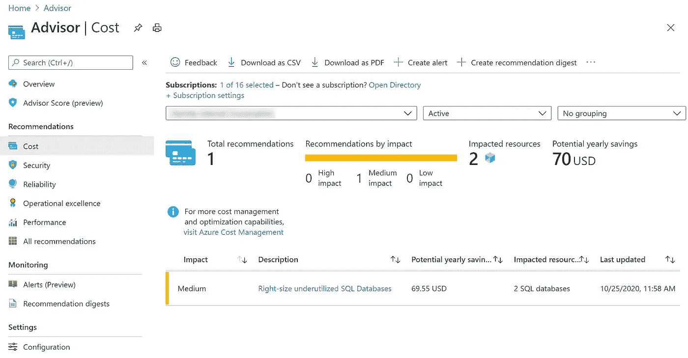
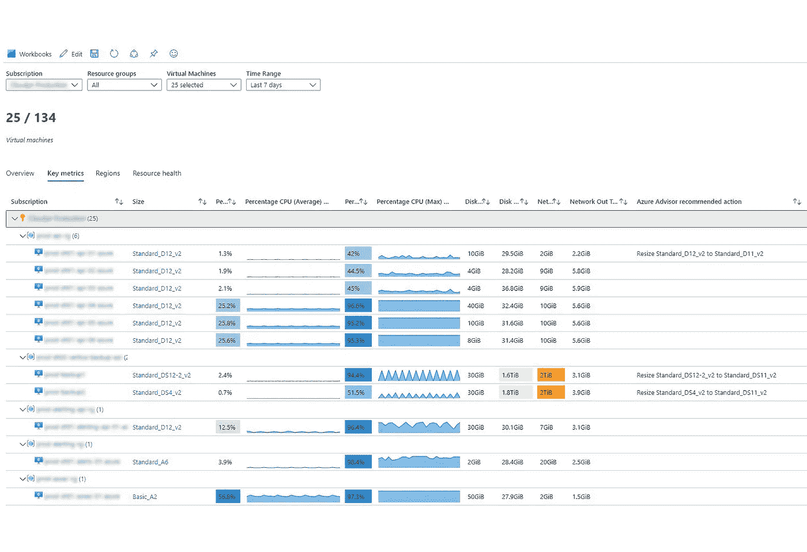
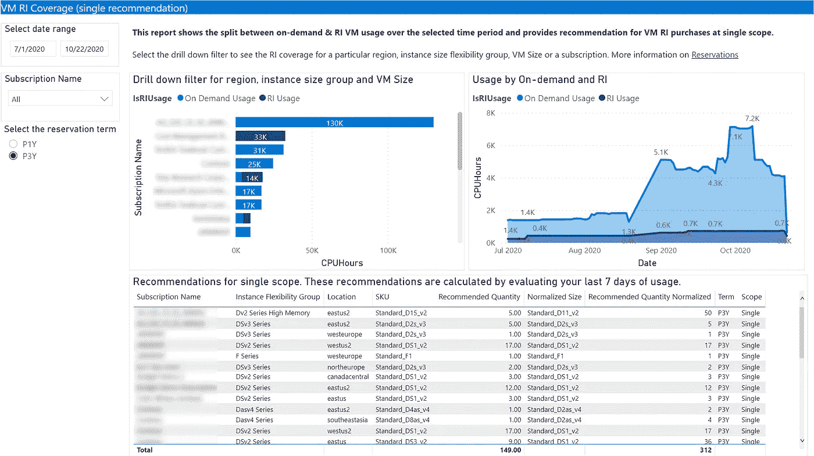
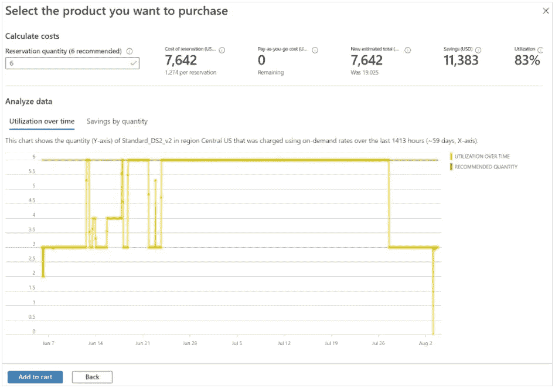

# Azure 成本优化

> 原文：<https://blog.devgenius.io/azure-cost-optimization-4c9dfa502275?source=collection_archive---------6----------------------->

大规模使用 Azure 的企业组织可能会在成本方面赢得很多。特别是在开发运维团队变得越来越独立并且能够以自助服务模式管理其资源的组织中，了解总成本保持在预算范围内非常重要。

一种方法是分析当前成本并优化它们。例如，当您只在工作时间使用昂贵的虚拟机时，您真的需要它们全天候运行吗？对于未来几年很有可能稳定运行的可预测工作负载，是否有必要支付现收现付的价格？虽然在你计划项目的时候问这些问题是最好的，但是在任何阶段批判性地审视你在 Azure 上花费的成本并寻找优化的机会都不会有什么坏处。

使用本文中描述的不同成本优化方法，您可以节省大量资金，同时获得相同的资源价值。本文将描述三种不同的 Azure 成本优化方法，这些方法不需要重新设计您的工作负载，以及微软提供的开箱即用的工具，以找出您可以节省资金的确切位置。

让我们更详细地了解一下成本优化选项。

# 1.调整规模或关闭未充分利用的资源

监控 Azure 环境中运行的服务的利用率，是找到省钱机会的重要一步。有时，资源可以缩减到更便宜的层级，或者在工作时间之外关闭。当你想开始提高 Azure 环境的整体利用率时，一个简单的起点就是虚拟机。在内部架构中，过度配置服务器可能是一种标准做法，以确保它们高性能且经得起未来考验。然而，在云世界中，这是不需要的。让我们来看看一些简单的步骤，你可以采取这些步骤，通过合理配置资源来开始省钱。

## 1a。Azure 顾问

Azure Advisor 是 Azure 中的一项免费服务，它提供如何优化 Azure 环境的建议。Azure Advisor 推荐的类别之一是*成本*。这些建议都可以从 Azure Advisor 服务本身查看，但具体的成本建议也集成在成本管理+计费服务的 Advisor 选项卡中。您可以从顾问那里获得的潜在建议是:调整规模或关闭未充分利用的虚拟机。您还可以看到它建议调整到哪种虚拟机类型，以及您将实现的节省。这是开始优化您的环境的一种非常简单易行的方法，并且适当调整虚拟机的规模可以带来显著的节约。

Azure Advisor 中规模合适的建议示例。

## 1b。Azure 监视器

Azure Advisor 不会详细显示这些建议所基于的数据或统计数据。当您单击建议的详细信息时，您将被重定向到该特定资源的详细信息页面。如果您想更进一步，您可以开始主动监控您的服务的利用率，以确定哪些服务可以优化。

监控指标可能有不同的方法，但一个简单的方法是从 Azure Monitor 工作簿模板开始，它在 Azure 中现成可用。如果我们特别关注我们已经确定为唾手可得的虚拟机示例，我们可以利用虚拟机关键指标模板。

您可以通过访问 Azure Monitor 的工作簿部分([单击此处](https://ms.portal.azure.com/#blade/Microsoft_Azure_Monitoring/AzureMonitoringBrowseBlade/workbooks))并单击虚拟机部分中的关键指标模板来访问它。您将自动看到您有权访问的订阅中的数据。使用“概述和关键指标”选项卡中的视觉效果，您可以查找平均 CPU 利用率较低的虚拟机，因此可以缩小规模。

工作簿可以很容易地进行调整，以添加您感兴趣的具体指标。例如，您可以在现有的“平均 CPU 使用率”列旁边添加“最大 CPU 使用率”列。另一个有趣的建议是将 Azure Advisor 信息添加到工作簿中。Azure Advisor 建议是 Azure 资源图数据的一部分。当您对您的工作簿感到满意时，您可以选择将它推广到您组织中的所有开发运维团队，让他们了解成本优化的机会。

这是虚拟机关键指标模板的一个例子，当你进入 Azure Monitor 的工作簿部分时，可以在 Azure 门户中找到它。这个特定的例子包含一些修改，比如包括 Azure Advisor 推荐的操作和对资源组的过滤。这个版本的源代码可以在[这里](https://github.com/harmke/AzureMonitorCommunity/blob/master/Azure%20Services/Virtual%20machines/Workbooks/Key%20metrics%20with%20Advisor%20recommendations.workbook)找到。

# 2.购买保留的实例

对于可预测的生产工作负载，您知道您将拥有全天候运行的虚拟机，购买 Azure Reserved Instance (RI)而不是按需付费是有意义的。当购买预订实例时，您承诺预先为特定服务付费，这可能会导致显著的折扣(比标准现收现付价格低 72%)。可以在 Azure 计算器中计算单个资源类型的节省。预约可以买 1 年或 3 年，那些费用可以提前支付，也可以按月支付。

购买保留的实例可能是一项相当大的投资，也可能是有风险的，因为它们是建立在“使用它或失去它”的基础上的。当您的 RI 范围内的某个服务正在运行时，您会自动利用预订。然而，当没有类似的服务运行时，你仍然提前为你的预订付费，而没有使用它。

预订可以在不同的范围内购买:共享范围、订阅范围(也称为单个范围)或资源组范围。即使您更喜欢基于对单个资源组或订阅的建议来购买预订，您也可以选择在共享范围内购买它们，以便以最佳方式利用它们。

为了帮助您发现购买预订的机会，Microsoft 提供了国际扶轮推荐。这些建议是基于某个家庭类型内 Azure 服务的平均使用情况，基于某个回顾期。让我们来看看您可以使用哪些不同的工具来找到购买哪些保留实例的建议。

## 2a。Azure 顾问

Azure Advisor 显示关于购买哪些保留实例的建议。它提供单一订阅范围的建议，回顾期为 30 天。在适用的情况下，节省额是根据 3 年预订计算的。目前，Azure Advisor 正在为越来越多类型的服务提供建议。

## 2b。预订建议 API

检索 RI 推荐的最灵活的方法是使用预订推荐 API。当向 API 提交请求时，您可以应用过滤器来检索您需要的建议。可以应用的筛选器有范围、资源类型和回顾期。点击[此处](https://docs.microsoft.com/en-us/rest/api/consumption/reservationrecommendations/list)获取该 API 的文档。

## 2c。[电力 BI App](https://appsource.microsoft.com/en-us/product/power-bi/costmanagement.azurecostmanagementapp) (或连接器)

Azure 成本管理 Power BI 应用程序(ACM Power BI 应用程序)帮助您在 Power BI 中分析和管理 Azure 成本。目前，它仅适用于拥有企业协议的客户。作为用户，您需要一个企业管理员帐户来访问数据。您还需要 Power BI Pro 许可证来安装和使用该应用程序。关于如何安装它的说明，可以在这里找到。

ACM Power BI 应用程序提供了一个包含国际扶轮建议的视图。目前，它支持共享或订阅范围内的虚拟机建议，回顾期为 7 天。对于每个虚拟机系列，它显示了建议的数量，包括与虚拟机在同一实例灵活性组中的数量，以及标准化大小。

ACM Power BI 应用程序还显示了一些有趣的虚拟机覆盖视图。这显示了您在按需使用和 RI 使用上花费了多少。

在该应用程序旁边，还有一个连接器，您可以在 Power BI Desktop 中使用它来创建自己的成本管理报告。连接器中的数据与应用程序中的数据相同。要使用连接器，您需要为企业协议使用企业管理员帐户，或者为 Microsoft 客户协议使用帐单帐户所有者。点击阅读更多关于连接器[的信息。](https://docs.microsoft.com/nl-nl/power-bi/connect-data/desktop-connect-azure-cost-management)

Azure Cost Management Power BI 应用程序提供的单一范围 RI 建议示例。

## 2d。Azure 门户中的预订和购买体验

购买体验中的 Azure 门户也显示了 RI 推荐。选择*查看详情*了解特定预订的推荐数量时，会显示大量有用信息。这种解决方案的一个主要优点是它保证是最新的。请注意，在门户的当前设置中，您需要购买 RIs 的访问权限才能看到这些统计数据。有关购买体验中显示的更多细节信息，请查看[此](https://docs.microsoft.com/nl-nl/azure/cost-management-billing/reservations/reserved-instance-purchase-recommendations?toc=/azure/cost-management-billing/reservations/toc.json)链接。

预订购买体验提供了一段时间内服务平均利用率的统计数据，以明确推荐的依据。图片来源是[这个](https://docs.microsoft.com/nl-nl/azure/cost-management-billing/reservations/reserved-instance-purchase-recommendations?toc=/azure/cost-management-billing/reservations/toc.json)页面。

# 3.Azure 混合优势

Azure 混合优势(AHB)意味着本地许可证可以在 Azure 中使用。这些好处存在于 Windows Server 许可证(用于 Azure Windows 虚拟机)和 SQL 许可证(用于 Azure SQL 数据库)中。AHB 折扣可以给 Azure 虚拟机带来 40%的折扣。这很难管理，因为必须一对一地选择资源来使用许可证。

为了最佳地利用 Azure 混合优势，您需要深入了解您的本地许可证。这是开始时的重要信息。当您知道您拥有多少个许可证时，您可以选择资源来使用它们。

在 Azure Cost Management Power BI 应用程序中，有一个 Azure 混合优势视图，您可以在其中监控 Windows Server AHB。在这个视图中，你可以看到你的 Azure 环境中使用了多少 Windows Server 许可证，以及哪些资源启用了它。

我希望你发现这个概述有助于你找到一些机会来优化你的 Azure 环境以节省成本。如果您对如何在 Azure 上进行成本管理以及哪些工具可以帮助您有任何其他问题，请告诉我。

*特别感谢我的同事* [*罗纳德·范·提夫伦*](https://www.linkedin.com/in/ronaldvanteeffelen/) *与我一起研究这个话题并评论这篇博文。*