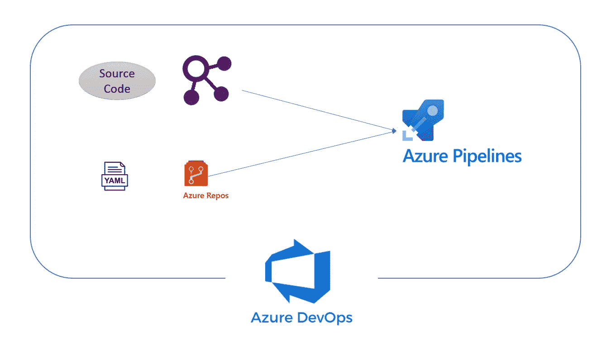
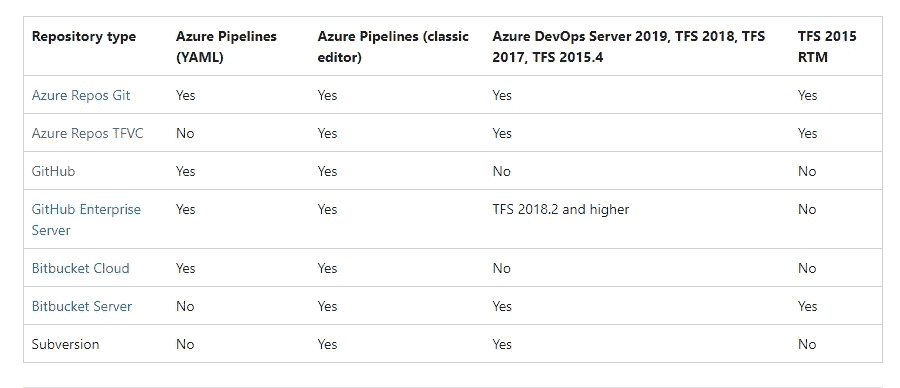
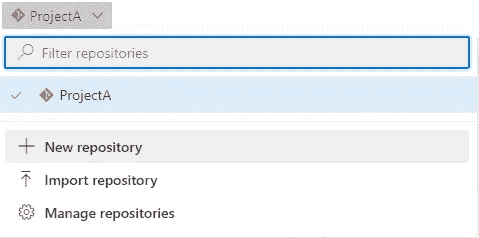
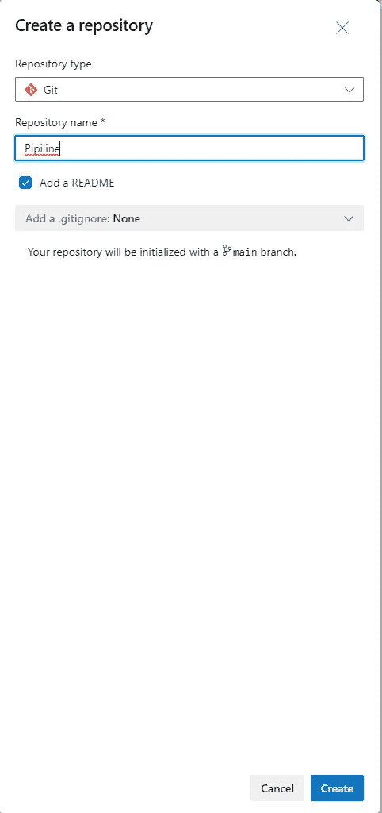
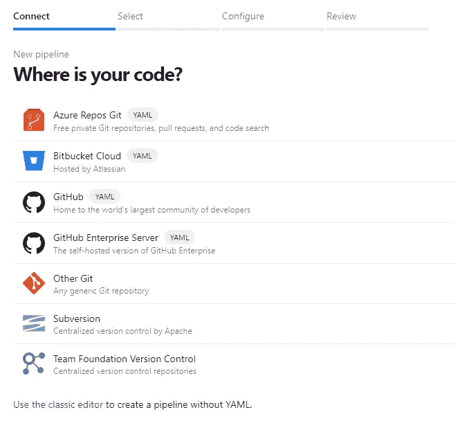
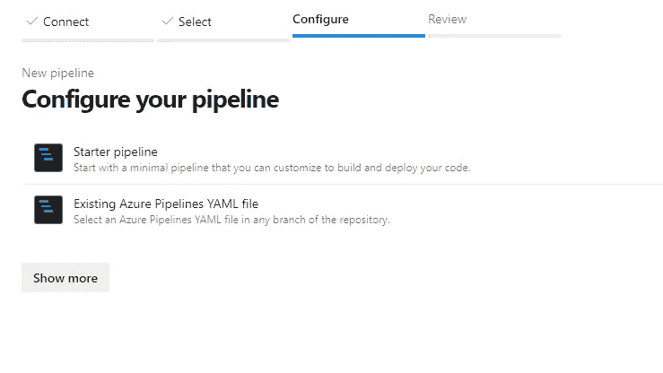
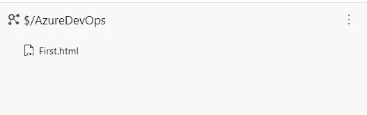
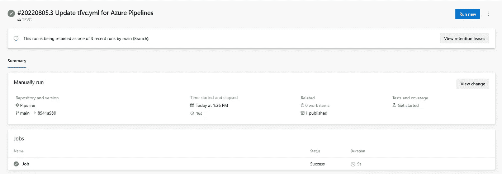
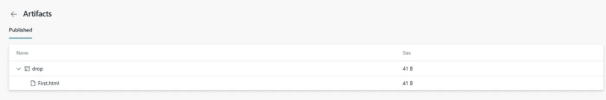

# 带有 TFVC 仓库的 Azure DevOps Yaml 管道

> 原文：<https://blog.devgenius.io/azure-devops-yaml-pipeline-with-tfvc-repository-d42f27b402a?source=collection_archive---------1----------------------->



流动

在这篇文章中，我将解释为源代码托管的 Azure Repo-TFVC 创建 Azure DevOps yaml 管道的过程。

**要求:**

在这一点上，Azure DevOps 不支持 TFVC 仓库中托管的代码的 yaml 管道。



为了使用 yaml 管道体验，需要将代码迁移到支持 yaml 体验的存储库中。

然而，由于各种原因，这可能并不适用于所有组织。

因此，本文将作为一种变通方法来减轻这一限制。

**先决条件:**

1.  您有一个带有 TFVC 存储库的活动 Azure DevOps 项目

**步骤:**

作为实施的一部分，我们将执行以下活动

*   创建一个 Git Repo 来托管我们的管道 yaml 配置
*   为实际管道创建管道 yaml 定义

1.  创建 Git Repo

登录到您的 Azure DevOps 项目

转到 Repo → File 并创建一个新的 Git 存储库



2.创建管道定义

转到管道→管道

创建新管道

选择“Azure Repos Git”



选择上面创建的存储库

选择起始管道



使用下面的 yaml 配置

```
trigger:
- nonepool:
  vmImage: windows-latestvariables:
  - name: scopePath
    value: '$/AzureDevOps'
steps:
  - task: PowerShell@2
    inputs:
      targetType: 'inline'
      script: |
        $url = "$(System.TeamFoundationCollectionUri)$(System.TeamProject)/_apis/tfvc/items?scopePath=$(scopePath)&download=true&recursionLevel=full&api-version=5.1"
         $PAT= "$(System.AccessToken)"
         $base64AuthInfo= [System.Convert]::ToBase64String([System.Text.Encoding]::ASCII.GetBytes(":$($PAT)"))
         $result = Invoke-RestMethod -Uri $url -Method Get -Header @{Authorization = "Basic $base64AuthInfo"} 

         $files= $result.value | where { !$_.isFolder} | select path, url

         foreach($file in $files){
            $path = "$(System.DefaultWorkingDirectory)\TFVC\" + $file.path.Substring(2)
            New-Item -Path  $path -ItemType File -Force
            Invoke-RestMethod -Uri $file.url -Method get -Header @{Authorization = "Bearer $PAT"} -OutFile $path
          }

  - task: PublishBuildArtifacts@1
    inputs:
      PathtoPublish: '$(System.DefaultWorkingDirectory)\TFVC\$(System.TeamProject)'
      ArtifactName: 'drop'
      publishLocation: 'Container'
```

**解释:**

我们使用 2 task 作为管道的一部分

**任务 1:从 TFVC 回购下载代码**

> 我们使用 Azure DevOps Rest Api 和 PowerShell 来下载代码
> 
> 使用带有预定义变量$(System)的令牌进行认证。AccessToken)
> 
> 代码将被下载到一个名为作用域路径的新文件夹中

```
- task: PowerShell@2
    displayName: Download Code
    inputs:
      targetType: 'inline'
      script: |
        $url = "$(System.TeamFoundationCollectionUri)$(System.TeamProject)/_apis/tfvc/items?scopePath=$(scopePath)&download=true&recursionLevel=full&api-version=5.1"
         $PAT= "$(System.AccessToken)"
         $base64AuthInfo= [System.Convert]::ToBase64String([System.Text.Encoding]::ASCII.GetBytes(":$($PAT)"))
         $result = Invoke-RestMethod -Uri $url -Method Get -Header @{Authorization = "Basic $base64AuthInfo"} 

         $files= $result.value | where { !$_.isFolder} | select path, url

         foreach($file in $files){
            $path = "$(System.DefaultWorkingDirectory)\TFVC\" + $file.path.Substring(2)
            New-Item -Path  $path -ItemType File -Force
            Invoke-RestMethod -Uri $file.url -Method get -Header @{Authorization = "Bearer $PAT"} -OutFile $path
          }
```

**任务 2:发布代码**

```
- task: PublishBuildArtifacts@1
    displayName: Publish Artifact
    inputs:
      PathtoPublish: '$(System.DefaultWorkingDirectory)\TFVC\$(System.TeamProject)'
      ArtifactName: 'drop'
      publishLocation: 'Container'
```

在本文中，我们简单地发布了下载的代码，然而在真实的场景中，可以使用额外的任务来用下载的代码创建构建/发布活动。

源代码



流水线执行



发布的工件



**对于跨项目回购，使用以下 yaml 文件**

> 对于不同的组织，请使用实际的 Azure DevOps 项目 URL
> 
> 为不同的组织创建一个具有代码读取权限的 PAT 令牌，用生成的令牌更新$PAT 变量的值。

```
trigger:
- nonepool:
  vmImage: windows-latestvariables:
  - name: scopePath
    value: '$/AzureDevOps'
  - name: token
    value: 'your PAT token'
# For Security purpose create a variable group and add the token as a secure variable and refer the variable group
  - name: ProjectName
    value: 'AzureDevOps'
steps:
  - task: PowerShell@2
    inputs:
      targetType: 'inline'
      script: |
        $url = "$(System.TeamFoundationCollectionUri)$(ProjectName)/_apis/tfvc/items?scopePath=$(scopePath)&download=true&recursionLevel=full&api-version=5.1"
         $PAT= "$(token)"
         Write-Host "Printing Token"
         Write-Host $PAT
         $base64AuthInfo= [System.Convert]::ToBase64String([System.Text.Encoding]::ASCII.GetBytes(":$($PAT)"))
         $result = Invoke-RestMethod -Uri $url -Method Get -Header @{Authorization = "Basic $base64AuthInfo"} 

         $files= $result.value | where { !$_.isFolder} | select path, url

         foreach($file in $files){
            $path = "$(System.DefaultWorkingDirectory)\TFVC\" + $file.path.Substring(2)
            New-Item -Path  $path -ItemType File -Force
            Invoke-RestMethod -Uri $file.url -Method get -Header @{Authorization = "Bearer $PAT"} -OutFile $path
          }

  - task: PublishBuildArtifacts@1
    inputs:
      PathtoPublish: '$(System.DefaultWorkingDirectory)\TFVC\$(ProjectName)'
      ArtifactName: 'drop'
      publishLocation: 'Container'
```

**其他资源:**

[](https://docs.microsoft.com/en-us/azure/devops/organizations/accounts/use-personal-access-tokens-to-authenticate?view=azure-devops&tabs=Windows) [## 使用个人访问令牌- Azure DevOps

### 您可以使用个人访问令牌(PAT)作为备用密码来验证 Azure DevOps。在本文中…

docs.microsoft.com](https://docs.microsoft.com/en-us/azure/devops/organizations/accounts/use-personal-access-tokens-to-authenticate?view=azure-devops&tabs=Windows) [](https://docs.microsoft.com/en-us/rest/api/azure/devops/tfvc/items/list?view=azure-devops-rest-6.0&tabs=HTTP) [## 项目-列表- REST API (Azure DevOps Tfvc)

### 了解有关 Tfvc 服务的更多信息-获取 Tfvc 项目列表

docs.microsoft.com](https://docs.microsoft.com/en-us/rest/api/azure/devops/tfvc/items/list?view=azure-devops-rest-6.0&tabs=HTTP) 

我希望你喜欢阅读这篇文章，随时添加你的评论、想法或反馈，不要忘记在 linkedin 上保持联系。