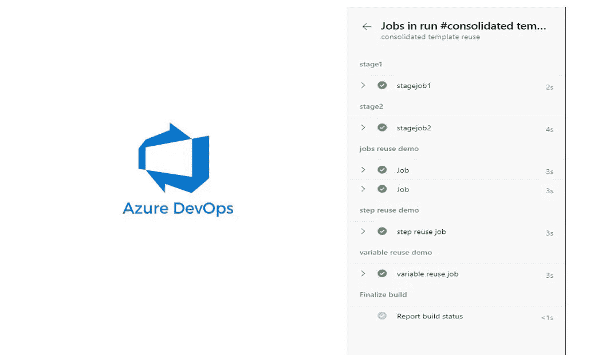

# 重用 Azure DevOps Yaml 模板

> 原文：<https://blog.devgenius.io/azure-devops-yaml-template-reuse-74a58c131e74?source=collection_archive---------9----------------------->



Yaml 模板

在本文中，我将解释如何重用不同类型的 azure devops 管道 yaml 模板。

1.  阶段复用
2.  作业重用
3.  分步重复使用
4.  可变重用

**先决条件:**

你有一个 Azure DevOps 项目

模板请参考 [GitHub](https://github.com/babula000/AzureDevOps/tree/main/templates) repo

# **舞台重用**

请为阶段重用活动创建以下 3 个 yaml 文件


阶段

stage1.yaml

```
stages:
  - stage: stage1
    jobs:
      - job: stagejob1
        steps:
          - bash: echo Stage Job 1
```

stage2.yaml

```
stages:
  - stage: stage2
    jobs:
      - job: stagejob2
        steps:
          - bash: echo Stage Job 2
```

stage-reuse.yaml

```
name: stage reuse
trigger: nonepool:
  vmImage: 'ubuntu-latest'stages:
  - template: stage1.yaml
  - template: stage2.yaml
```

请使用 stage-reuse.yaml 创建管道


阶段流水线

# **工作重用**

请为活动创建以下 3 个 yaml 文件


职位

job1.yaml

```
jobs:
  - job:
    steps:
    - script: echo Reuse Job 1
      displayName: 'Job 1'
```

job2.yaml

```
jobs:
 — job:
 steps:
 — script: echo Reuse Job 2
 displayName: ‘Job 2’
```

作业重用. yaml

```
name: job reuse
trigger: nonepool:
  vmImage: 'ubuntu-latest'stages:
  - stage: job
    displayName: jobs reuse demo
    jobs:
      - template: job1.yaml
      - template: job2.yaml
```

请使用 job-reuse.yaml 创建管道


职位

# 分步重复使用

请为活动创建以下 3 个 yaml 文件


步骤 1.yaml

```
steps:
- script: echo Step1/Script1
- script: echo Step1/Script2
```

步骤 2.yaml

```
steps:
- script: echo Step2/Script1
- script: echo Step2/Script2
```

step-reuse.yaml

```
name: step reuse
trigger: nonepool:
  vmImage: 'ubuntu-latest'stages:
  - stage: stepreuse
    displayName: step reuse demo
    jobs:
      - job: jobreusejob
        displayName: step reuse job
        steps:
          - template: step1.yaml
          - template: step2.yaml
```

请使用 step-reuse.yaml 创建管道


步骤

# 可变重用

请为活动创建以下 3 个 yaml 文件


variable1.yaml

```
variables:
  VariableOne: 'Variable One'
```

变量 2.yaml

```
variables:
  VariableTwo: 'Variable Two'
```

变量重用. yaml

```
name: variable reuse
trigger: nonepool:
  vmImage: 'ubuntu-latest'variables:
- template: variable1.yaml
- template: variable2.yamlstages:
  - stage: variablereuse
    displayName: variable reuse demo
    jobs:
      - job: variablereusejob
        displayName: variable reuse job
        steps:
          - script: echo Variable from Variable1.yaml is $(VariableOne).
          - script: echo Variable from Variable2.yaml is $(VariableTwo).
```

请使用 variable-reuse.yaml 创建管道


可变的

# **合并示例**

请为活动创建以下 yaml 文件


加固的

注意:请创建如上所示的文件夹结构，或者分别更新下面 yaml 文件中的路径。

consolidated-template-reuse . YAML

```
name: consolidated template reuse
trigger: nonepool:
  vmImage: 'ubuntu-latest'# Variable reuse variablesvariables:
- template: variable\variable1.yaml
- template: variable\variable2.yaml
stages:# Template reuse example
  - template: stage\stage1.yaml
  - template: stage\stage2.yaml
# Job reuse example
  - stage: jobreuse
    displayName: jobs reuse demo
    jobs:
      - template: job\job1.yaml
      - template: job\job2.yaml
# Step reuse example
  - stage: stepreuse
    displayName: step reuse demo
    jobs:
      - job: jobreusejob
        displayName: step reuse job
        steps:
          - template: step\step1.yaml
          - template: step\step2.yaml
# Variable reuse example
  - stage: variablereuse
    displayName: variable reuse demo
    jobs:
      - job: variablereusejob
        displayName: variable reuse job
        steps:
          - script: echo Variable from Variable1.yaml is $(VariableOne).
          - script: echo Variable from Variable2.yaml is $(VariableTwo).
```

请使用 consolidated-template-reuse . YAML 创建管道


加固的

**其他资源:**

[](https://docs.microsoft.com/en-us/azure/devops/pipelines/process/templates?view=azure-devops) [## 模板- Azure 管道

### 模板允许您定义可重用的内容、逻辑和参数。模板有两种作用。你可以插入…

docs.microsoft.com](https://docs.microsoft.com/en-us/azure/devops/pipelines/process/templates?view=azure-devops) 

我希望你喜欢阅读这篇文章，随时添加你的评论、想法或反馈，不要忘记在 [linkedin](https://www.linkedin.com/in/babulaparida/) 上联系。