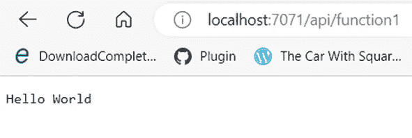

# 使用核心工具的 Azure 功能和依赖注入

> 原文：<https://blog.devgenius.io/azure-function-dependency-injection-using-core-tools-b84656825df2?source=collection_archive---------7----------------------->


昨天我[写了](/developing-azure-functions-with-net-6-0-7-0-and-core-tools-48875ef3b85?sk=484b77fee2529294d30cf8afea83f238)一篇关于使用核心工具编写功能 app 的文章。今天，我想扩展这个主题，在 Azure 函数中实现依赖注入。我将使用 Visual Studio 代码作为该项目的编辑器。

# Visual Studio 代码

[Visual Studio Code](https://code.visualstudio.com/) 是一款用于软件开发的开源轻量级 IDE(集成开发环境)。它支持 Azure 功能的端到端开发，但我们只会将它用作编辑器。学习一项技术的最好方法是用最简单的方法来做，这就是为什么我避免在我的开源工作中使用 ide。

打开 Visual Studio 代码，使用快捷键“ctrl+k+o”打开 azure function 应用所在的文件夹。


# 创建服务

我们将创建一个文件夹来保存我们的服务接口和实现。


我们的服务类别代码

使用“**功能启动”**命令测试应用程序。我们做这个测试是为了确保没有编译问题。

# 安装微软。Azure .函数.扩展

在 PowerShell 上运行以下 dotnet CLI 命令来安装 NuGet 软件包。。Net core SDK 安装提供了 CLI 工具集，所以我们不需要为 CLI 工具安装任何额外的东西。

```
dotnet add package Microsoft.Azure.Functions.Extensions --version 1.1.0
```

目前，最新版本是 1.1.0，但它可能会改变；因此，请留意最新版本，并相应地更改命令。还有[其他方式](https://www.nuget.org/packages/Microsoft.Azure.Functions.Extensions/)添加这个 NuGet 包。我会建议花些时间用不同的方式教育自己。

添加包后，我们可以在 SampleProject.csproj 文件中看到一个引用。


# 在 Startup.cs 中注册服务

我们将创建一个启动类，将 IService 接口及其实现注册到[依赖注入容器](https://learn.microsoft.com/en-us/dotnet/core/extensions/dependency-injection)中。该类应实现 nuget 包 Microsoft . azure . functions . extensions 中的抽象类 FunctionsStartup。

为了将我们的接口及其实现注册到 DI 容器中，我们将覆盖 Configure 方法并使用 IfunctionsHostBuilder 对象。

```
builder.Services.AddSingleton<IService,Service>();
```

您必须添加名称空间 Microsoft。Extensions.DependencyInjection 包能够在 IServiceCollection 类上使用 AddSignleton 方法。

最终的代码将如下所示:

# 在 Azure 函数中注入服务

我们将在 azure 函数中使用构造函数注入来调用 Service.cs 中的方法。

```
private readonly IService _service;
public function1 (IService service){
    _service = service;
}
```

函数类的最终版本将如下所示:

# 运行该功能

使用命令“func start”运行该函数，我们将看到服务类的运行情况:



页（page 的缩写）s-Medium 是一个阅读、写作和向其他作者学习的绝佳平台。如果你想加入我的旅程，今天就加入 [medium](https://tarunbhatt9784.medium.com/membership) 。