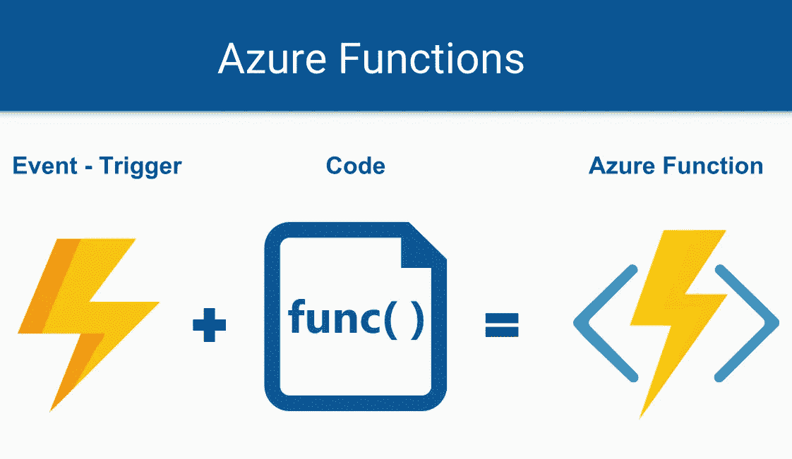
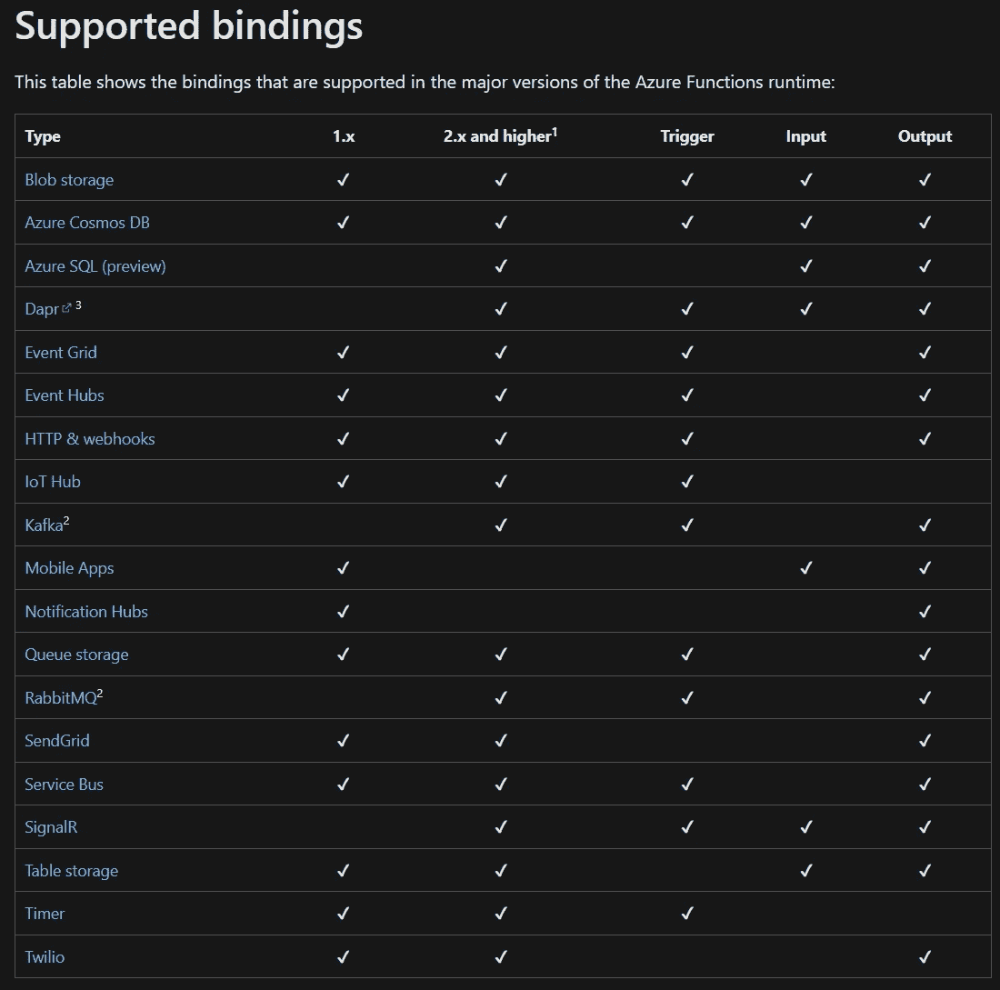
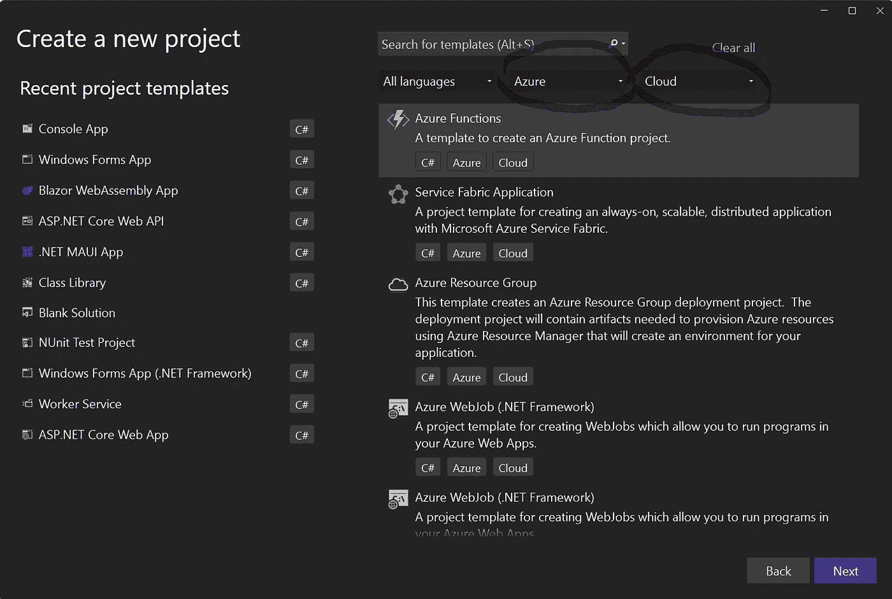
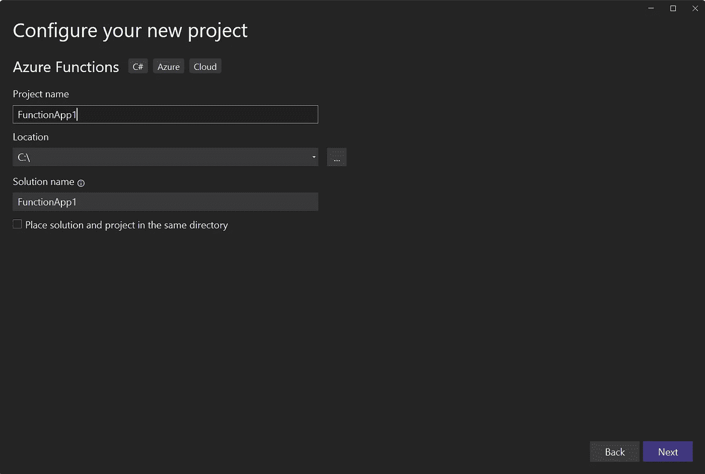
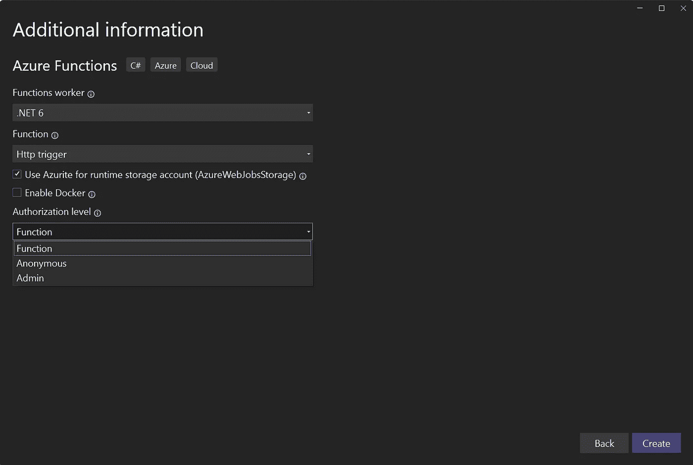
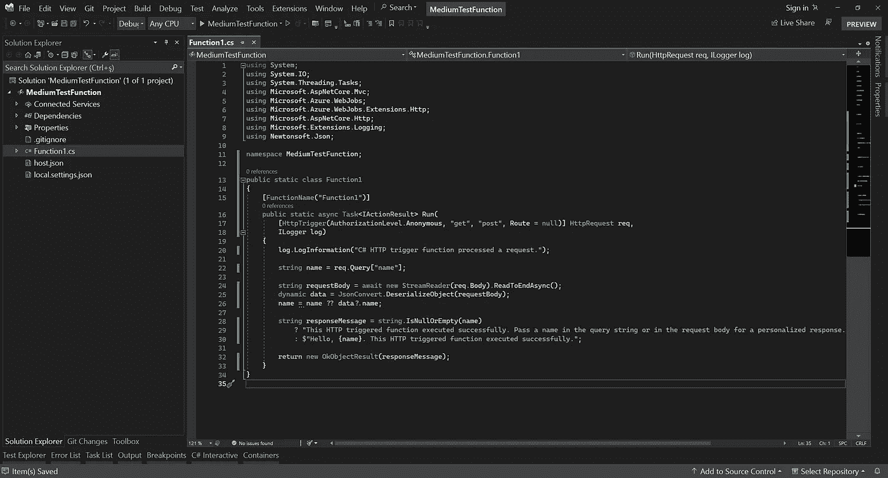
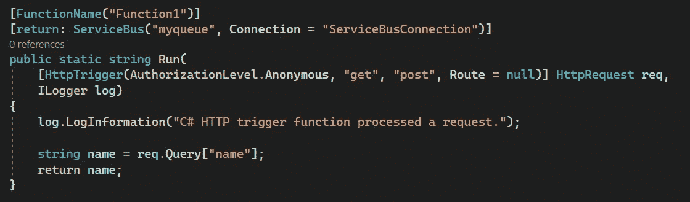
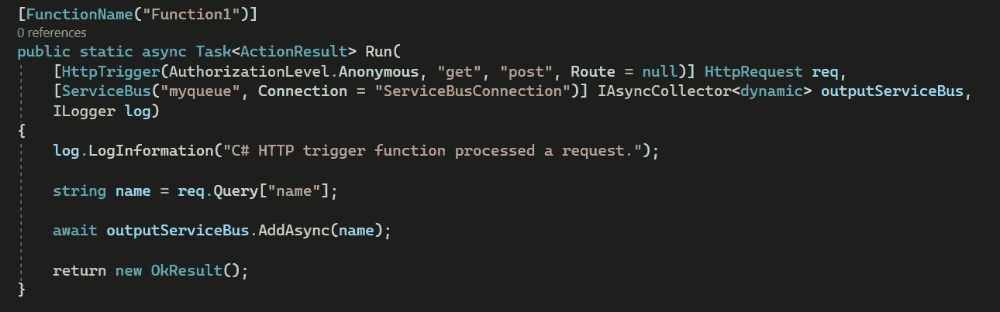
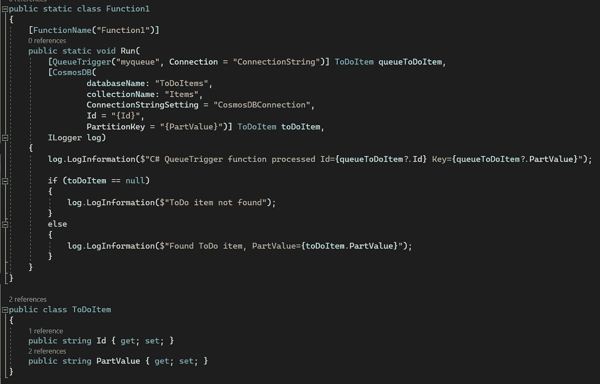

# Azure 函数讲解！

> 原文：<https://blog.devgenius.io/azure-functions-explained-c31f8c269b1c?source=collection_archive---------1----------------------->

如果你正在开发软件，你很可能听说过微服务。这里的主要目的是将我们的项目划分为微观项目，并确保所有项目协调工作。这样做的原因通常是为了通过分离每个服务的责任和对其他服务的依赖来促进扩展和降低维护和发布成本。我们希望在功能的基础上从微服务的特权中受益，将我们的工作设计为在服务中作为*单一责任*来完成，这是**坚实**原则的第一条。因此，我们可以说，将我们的工作分解成小功能在某种程度上是一件好事。

除此之外，我们需要将我们的代码发展成项目，并发布这些项目，以便使它们可供使用。我们可以发布许多工作环境，但是**云**系统也因为这个目的而迅速流行起来。在这里，即使在云系统中，我们也可以找到必要的基础设施来轻松发布和管理我们的项目以及我们将在项目中使用的功能。在今天的文章中，我们将考察*微软*的云服务 *Azure、*上的“ ***Azure 功能*** ”如何让我们的生活变得更加轻松。

# 术语；

在整篇文章中，你会经常听到下面列出的单词。为了使文章更容易理解，在开头解释这些词是有用的。

**天蓝色；**是微软在 2010 年发布的云服务。

**资源；**我们将在云系统中创建的每个项目都称为资源。例子:数据库、网络、Azure 函数、ServiceBus 等。

**天蓝色储物；**我们可以把它想象成一个虚拟硬盘，是为了方便在 *Azure* 端存储不同类型的数据而产生的。我们可以将数据保存为表、队列、Blob 或文件存储。在这种情况下， *Azure Storages* 不仅可以被我们使用，也可以被我们的资源使用(我们会看到例子)。

**无服务器；**很特别的一个词。因为如果你之前没有用过 Serverless，可能会有点难以消化。虽然顾名思义*无服务器*，但是视角在这里很重要。我们一般使用我们的服务器在上面发布我们的项目，在这种情况下，服务器和要发布的项目的所有维护、调整和备份都由用户完成，也就是由我们完成。在 *Azure* 中的*无服务器*场景中，当然，我们的项目需要一个服务器来工作，但作为用户，这不是我们所关心的。我们把自己的项目委托给 *Azure* ，如果有需要做/说的点，自己负责，把球扔给云系统，自己坐好。所有的过程，比如在任何服务器上运行这个应用程序(我们可以选择我们想要的)，保持它运行，以及服务器成本/维护都由 *Azure* 管理。 *Azure 函数*对我们来说就是这样用的:)

**FaaS；**是用来描述 Azure 向我们提供的服务类型的缩写之一。 *Azure 功能*也将包含在“**功能即服务**类别下。当然，功能并不是唯一的服务。

**天蓝色功能；**由于这个主题将是我们文章的主题，我们将很快进入细节。

**触发器；**执行 *Azure 函数的事件。*

**装订；在我们的系统中集成一个 Azure 函数来产生输入和输出。**

> 不是:像 Azure Portal 和 Azure DevOps 这样的概念将不在本文的范围内解释，因为这些主题太大了，无法在一篇文章中涵盖。

> 我知道介绍有点长，但是再坚持一会儿。有趣的部分现在开始。

关于 *Azure Functions* 我们需要了解的第一点是:使用 *Azure Functions* 的目的是创建服务于单一目的的函数。因此，就像*单一职责*一样，我们将一个职责分配给一个功能。但是，相互关联的功能集可以包含在单个 Azure Function 项目中。(尽管不推荐)

我们需要知道的另一点是。正如我们项目中的函数必须被调用才能工作一样，Azure 函数*也是如此。因此，我们创建一个函数，并指定它应该如何或何时运行。(我们将很快讨论这是如何发生的)*

现在我要告诉你一件事，当你听到的时候，你一定会失去理智。我们准备好了吗？ *Azure 功能*可以在 *Azure* 上与其他**资源**集成工作。我知道你在问这个人怎么了，但是这样想想。你在 *Azure* 上有一个数据库(资源)，你有一个 *ServiceBus* ，或者你有一个 *CosmosDb* 。通过编写任何 *Azure 函数*，使用和连接这些资源可以非常非常容易地实现，并且只需一行代码就能有效地实现。不是很好吗？

Azure 定价—主页

在解释 *Azure 功能*的类型以及何时触发之前，我先简单说一下它们的定价。关于定价，我们需要知道的第一件事是 *Azure Functions* 在**无服务器**结构中工作，所以我们不为整个服务器付费，我们只在我们的功能运行时为服务器的资源付费(*消费计划*)。

假设我们编写并发布了一个函数，但从未使用过它。在这种情况下，我们没有从口袋里掏出任何钱。然而，在谈论无服务器结构时，我说过我们能够选择我们的应用程序将在什么样的服务器上运行。关于这一点，基本上有两种不同的服务器计划。*消费*和*保费计划*。

当我们选择**消费计划**时，我们的功能运行在一个公共服务器上。空闲时间为 20 分钟，如果在此期间没有使用，它将进入睡眠状态，并在下一次触发时再次开始工作。当应用程序重新启动([冷启动](https://mikhail.io/serverless/coldstarts/azure/?WT.mc_id=other-azuredevtips-azureappsdev))时，可能需要几秒钟才能开始工作。

然而，在**高级计划**中，我们的应用程序将像 web 应用程序一样保持运行，因此不会出现像**冷启动**这样的问题。但是，它的定价不是用函数的资源消耗来计算的，而是在应用程序连续运行时按小时计算的。

正如我们所说的，我们需要一个函数被触发以某种方式工作。我们将这些*称为 Azure 函数触发器*。当我们说 *Azure Functions* 的时候，我们会在这里把主体一分为二。**触发**和**绑定**。

让我们从**触发器**开始。Azure 函数可以通过以下方法触发:

[**http trigger；**](https://learn.microsoft.com/en-us/azure/azure-functions/functions-bindings-http-webhook-trigger?tabs=in-process%2Cfunctionsv2&pivots=programming-language-csharp) 用于通过 *HTTP* 触发运行某个功能。你可以把它想象成你的 *WebApi* 项目中*控制器*下的*动作方法*。它可以通过 URL 上的 HTTP 方法运行。

[**定时器触发器**；](https://learn.microsoft.com/en-us/azure/azure-functions/functions-bindings-timer?tabs=in-process&pivots=programming-language-csharp)当我们需要在特定时期自动执行的功能时，我们可以使用这种类型的功能。根据此处的[信息，可以使用 **NCronTab 表达式**方法来调度 *TimerTrigger Azure 函数*。](https://learn.microsoft.com/en-us/azure/azure-functions/functions-bindings-timer?tabs=in-process&pivots=programming-language-csharp#ncrontab-expressions)

[**CosmosDbTrigger；**](https://learn.microsoft.com/en-us/azure/azure-functions/functions-bindings-cosmosdb-v2-trigger?tabs=in-process%2Cfunctionsv2&pivots=programming-language-csharp) 我们可以在 NoSql 产品 *Insert* 和 *Update* 操作后触发一个 *Azure 函数*。是不是很完美？

[**blob trigger；**](https://learn.microsoft.com/en-us/azure/azure-functions/functions-bindings-storage-blob-trigger?tabs=in-process%2Cextensionv5&pivots=programming-language-csharp) 我在 *Azure 存储*部分提到了 **Blob 存储**。我们可以写一个由这种结构的变化触发的函数。例如当上传文件时。例如，当图像文件通过您的网站上传时，您可以触发一个功能并调整该图像的大小。

[**ServiceBusTrigger；**](https://learn.microsoft.com/en-us/azure/azure-functions/functions-bindings-service-bus-trigger?tabs=in-process%2Cextensionv5&pivots=programming-language-csharp) 如果你正在使用*服务总线*，你可以写一个函数，当一个消息到达一个*队列*或者一个*主题*时触发这个函数。比如说；当一条消息被发送到队列 X 时，您可以编写一个函数来接收该消息并将其作为电子邮件发送。因此，您将邮件与队列结构集成在一起。此外，还可以使用 *Azure* 内的 [EventGridTrigger](https://learn.microsoft.com/en-us/azure/azure-functions/functions-bindings-service-bus-trigger?tabs=in-process%2Cextensionv5&pivots=programming-language-csharp) 和 [EventHubsTrigger](https://learn.microsoft.com/en-us/azure/azure-functions/functions-bindings-event-hubs-trigger?tabs=in-process%2Cfunctionsv2%2Cextensionv5&pivots=programming-language-csharp) 等触发方式。甚至[*rabbit MQ trigger*](https://learn.microsoft.com/en-us/azure/azure-functions/functions-bindings-event-hubs-trigger?tabs=in-process%2Cfunctionsv2%2Cextensionv5&pivots=programming-language-csharp)都可以用于你在 *Azure* 上运行过的 *RabbitMQ* 。

除此之外，还有[kafkat trigger](https://learn.microsoft.com/en-us/azure/azure-functions/functions-bindings-kafka-trigger?tabs=in-process%2Cconfluent&pivots=programming-language-csharp)、 [SignalRTrigger、](https://learn.microsoft.com/en-us/azure/azure-functions/functions-bindings-signalr-service-trigger?tabs=in-process&pivots=programming-language-csharp)和 [QueueStorageTrigger](https://learn.microsoft.com/en-us/azure/azure-functions/functions-bindings-signalr-service-trigger?tabs=in-process&pivots=programming-language-csharp) 等触发方法。

我提到了我们可以在函数中进行的集成，我说我们将称之为**绑定**。*绑定*与*触发*有所不同。**虽然一个 *Azure 函数*只能以一种方式触发，但它可以有多个*绑定*** 。我们将这些*绑定*分成两个**输入**和**输出**。这些可以被认为是获取或设置系统上的数据。现在让我们一起来看看这些绑定方法中的重要方法。

在下面的列表中，列出了哪些*绑定*可以与 *Azure Functions* 的版本一起使用。你可以在这里访问这个列表[。](https://learn.microsoft.com/en-us/azure/azure-functions/functions-triggers-bindings?tabs=csharp#supported-bindings)

Azure 绑定类型

如你所见，这个列表很长。不幸的是，我们无法在本文中详细讨论所有这些问题。我希望你在这里考虑一下*绑定*。假设我们将使用 [*RabbitMQ 输出绑定*](https://learn.microsoft.com/en-us/azure/azure-functions/functions-bindings-rabbitmq-output?tabs=in-process&pivots=programming-language-csharp) 。这意味着我们将 ***将*** 数据写入 *RabbitMQ* 。让这个函数成为*定时器触发器*。比如这个函数，每 2 小时运行一次，可以定时向 *RabbitMQ* 写数据。使用*绑定*有很多种方法。我们可以根据我们将如何使用它来选择我们想要的那个。我们甚至可以将我们的[自定义绑定](https://github.com/Azure/azure-webjobs-sdk/wiki/Creating-custom-input-and-output-bindings)添加到 *Azure 函数*中。现在让我们创建一个 *Azure 函数*，它将通过 Visual Studio 2022 在我们的计算机上运行。

选择创建项目后，让我们从类别中选择 *Azure Functions* 。

下一步是选择保存项目的文件夹，并为项目命名。

我们将为下一步创建的函数选择*触发器*，如果我们选择的触发器需要额外的信息，我们将在屏幕底部看到这些字段。例如，如果有一个*队列触发器*，它也会问我们它会是哪个*队列*。这里，我们说我们要写一个函数 *HttpTrigger* ，它要求我们选择一个类型来访问这个函数。我们将选择**匿名**，这样任何拥有 *URL* 的人都可以使用它，无需任何特殊授权。

点击“创建”按钮后，我们的项目就创建好了，并且在 Visual Studio 中创建了一个如下图所示的图像。由于我们的*绑定方法*没有指定，所以它没有包含在函数模板中，我们需要稍后添加它。

*FunctionName* 属性显示为函数名， *host.json* 文件，可以通过 *IConfiguration* 界面收集的设置，以及 *local.settings.json* 文件，作为我们可以添加在本地计算机上调试时可以使用的设置的文件。

Azure 函数

我们在这个函数中的目的是使用 *ServiceBusBindings* 将带有 *HttpTrigger* 的请求放到相关的队列中。因此，我们使我们的方法如下。

> 首先，让我们安装微软的**。azure . web jobs . extensions . service bus**"打包到我们的项目中。

这里，我们添加了 *ServiceBus* 属性，并在开头添加了 **return** 。我们还编辑我们的方法来返回一个**字符串**。这意味着该方法返回**字符串**值，并将其添加到 *ServiceBus* 中的“ **myqueue** ”队列中。然而，这不是唯一的方法，它可以作为参数添加到我们的 *ServiceBus* 函数中并使用。他的例子如下。

在这个函数中，我们为 *ServiceBus* 绑定添加了一个参数。我们定义为**IAsyncCollector<dynamic>**的参数对我们来说就是 *ServiceBus* 。这个值的意义是当我们调用 **AddAsync** 方法时，将变量名添加到 *ServiceBus* 中的 **myqueue** 队列中！是不是很轻松，印象很深刻？这是一个**输出绑定**的例子，但是我们也可以使用**输入绑定**来实现。例如，我们可以从使用 *QueueTrigger* 的函数中获取一个 JSON 值作为*模型*，并通过使用 *CosmosDb 输入绑定*根据我们从这个*队列*中获取的模型的属性从 **CosmosDB** 中调用相关数据。为此，你必须写一个这样的函数。

如您所见，我们可以直接接收 **myqueue** 队列中的数据作为 **ToDoItem** 类。同样，使用来自该模型的 **Id** 和 **PartValue** 值，我们可以使用 *CosmosDb 输入绑定*方法从数据库中获取数据。非常简单和好的方法:)

我们已经到了这篇文章的结尾。 *Azure Functions* 世界中*绑定*和*触发器*太多。很抱歉，我们不能在本文中深入讨论所有这些代码和细节，但我将开始在我的 [*Youtube 频道*](https://www.youtube.com/c/TechBuddyTR) 上制作关于 Azure 的视频。如果你想看视频，我欢迎大家来到[频道](https://www.youtube.com/c/TechBuddyTR)。(土耳其语)

希望能在其他文章中看到你。和 Azure 呆在一起……:)