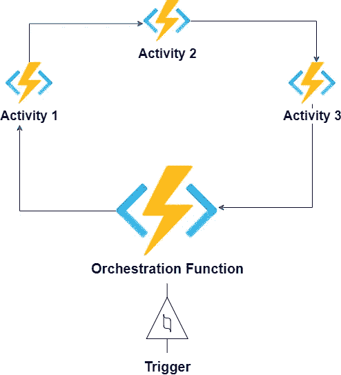
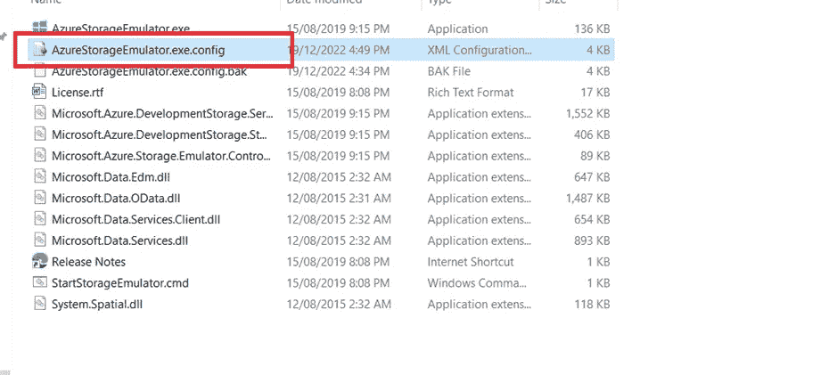
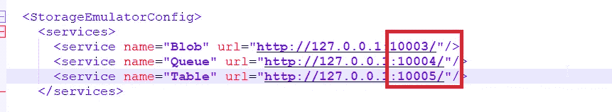
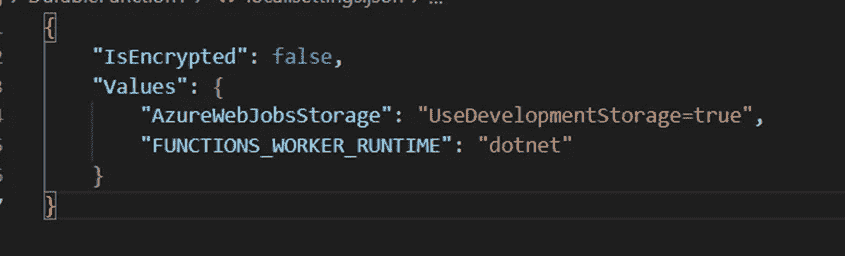
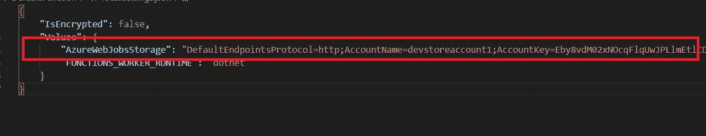
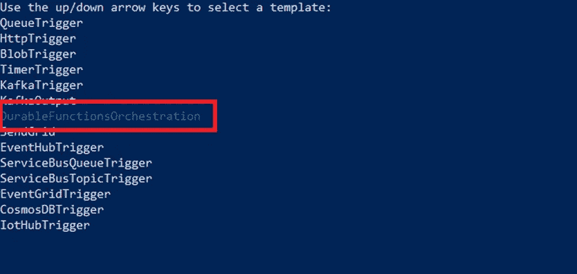
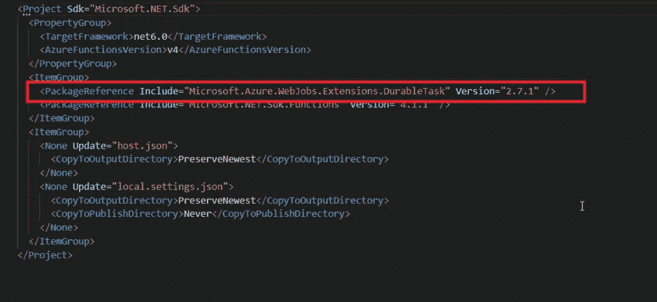
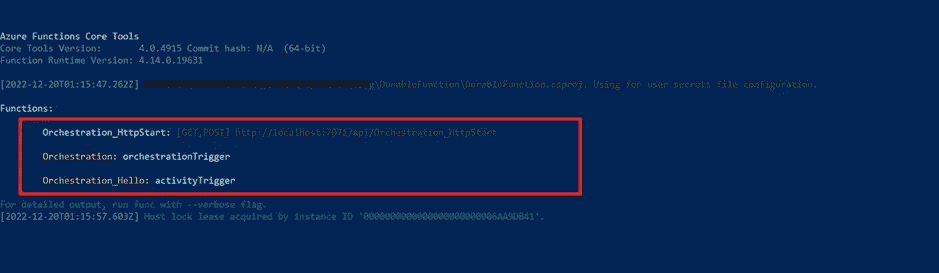

# Azure 持久功能。Net 6.0 和 Azure 功能核心工具

> 原文：<https://blog.devgenius.io/azure-functions-with-net-6-0-and-azure-functions-core-tools-865a7ff59e76?source=collection_archive---------11----------------------->

上周，我提供了一个关于 Azure 持久功能的[介绍。在本文中，我将使用核心工具、azure 存储模拟器和。Net 6.0。我不会使用](/what-and-why-of-azure-durable-function-27dd8f4ab7d6?sk=eb7c224573b147dd58c5195220d7ec6b) [Visual Studio 代码](https://code.visualstudio.com/)或 [Visual Studio](https://visualstudio.microsoft.com/) 进行开发。尽管这些工具有益于企业应用程序，但它们不允许我们学习技术基础。



## 先决条件

为了对 Azure 函数核心工具和 Azure 函数的目录结构有一个基本的了解，请在这里阅读我的介绍文章。

# 功能初始化

使用以下命令在您的本地计算机上创建一个 azure function 项目。

```
func init DurableFunction
```

出现提示时，选择以下配置:

*   运行时—点网
*   语言— C#

# Azure 存储模拟器

Azure 持久功能需要一个存储帐户来执行。如果你没有 azure 存储帐户，我们可以使用 Azure 存储帐户模拟器。[存储模拟器使用本地 Microsoft SQL Server 2012 Express local db 实例来模拟 Azure 存储服务。您可以选择配置存储模拟器来访问 SQL Server 的本地实例，而不是 LocalDB 实例](https://learn.microsoft.com/en-us/azure/storage/common/storage-use-emulator)。

如果您使用的是 Visual Studio 2022，我们不需要做任何事情。运行函数应用程序会启动存储帐户模拟器。[如果您在开发机器](https://stackoverflow.com/questions/74846785/azure-durable-function-change-the-port-for-azure-storage-emulator/74848305#74848305)上为另一个服务使用默认端口，就会出现问题。

存储帐户模拟器在 [http://127.0.0.1](http://127.0.0.1) 上托管 blob、队列和表。模拟器位于 SDK 下。模拟器的位置是**“C:\ Program Files(x86)\ Microsoft SDKs \ Azure \ Storage Emulator”**。

blob、队列和表服务端点位于 azurestorageemulator . exe . config 文件中。



默认的 blob、队列和表端口分别是 10000、10001 和 10002。在我的机器上，这些端口已经被使用。因此，我必须在“C:\ Program Files(x86)\ Microsoft SDKs \ Azure \ Storage Emulator \ azurestorageemulator . exe . config”中更新它们(10003、10004 和 10005)，如下所示:



更改端口后，我们可以通过运行 start 命令来启动模拟器:

```
.\AzureStorageEmulator.exe start
```

> [如果您想使用 SQL server 的不同实例而不是 LocalDB instaance 用于您的模拟器，请在启动模拟器之前使用 init 命令。](https://learn.microsoft.com/en-us/azure/storage/common/storage-use-emulator#initialize-the-storage-emulator-to-use-a-different-sql-database)

## 使用开发存储

持久函数应用程序将查看设置 AzureWebJobsStorage 来查找链接的存储帐户。值“UseDevelopmentStorage=true”表示使用了存储帐户模拟器，而不是实际的 azure 存储帐户。



由于我们对存储帐户模拟器使用不同的端口，因此我们必须用完整的连接字符串更新配置:

```
“AzureWebJobsStorage”: “DefaultEndpointsProtocol=http;AccountName=devstoreaccount1;AccountKey=Eby8vdM02xNOcqFlqUwJPLlmEtlCDXJ1OUzFT50uSRZ6IFsuFq2UVErCz4I6tq/K1SZFPTOtr/KBHBeksoGMGw==;BlobEndpoint=http://127.0.0.1:10003/devstoreaccount1;QueueEndpoint=http://127.0.0.1:10004/devstoreaccount1;TableEndpoint=http://127.0.0.1:10005/devstoreaccount1;",
```



# 新功能

使用 **func new** 命令在您的功能应用程序中创建新功能。



*   选择 DurableFunctionsOrchestration 模板以创建持久函数。让我们将该函数命名为 OrchestrationFunction。
*   该命令将向您的项目添加一个 NuGet 包，以支持持久函数。你可以在 csproj 文件中看到这个包的细节。



# 功能启动

运行命令**‘func start’**命令运行该功能。



我们可以在函数下看到三个条目。让我们逐一看一下:

*   **Orchestration _ HttpStart**—这是持久函数的入口点。它调用编排函数，并为每次执行生成一个惟一的 id。唯一 id 有助于查询持久函数的执行状态。
*   **编排:编排触发器** —这是调用活动的编排功能。默认实现支持[函数链设计模式](https://learn.microsoft.com/en-us/azure/azure-functions/durable/durable-functions-sequence?tabs=csharp)。
*   **Orchestration _ Hello:activity trigger**—一个活动函数，在字符串前面加上“Hello”

在下一篇文章中，我将借助另一个演示函数链设计模式的用例，深入研究不同的类。

页（page 的缩写）s-Medium 是一个阅读、写作和向其他作者学习的绝佳平台。如果你想加入我的旅程，今天就加入 [medium](https://tarunbhatt9784.medium.com/membership) 。