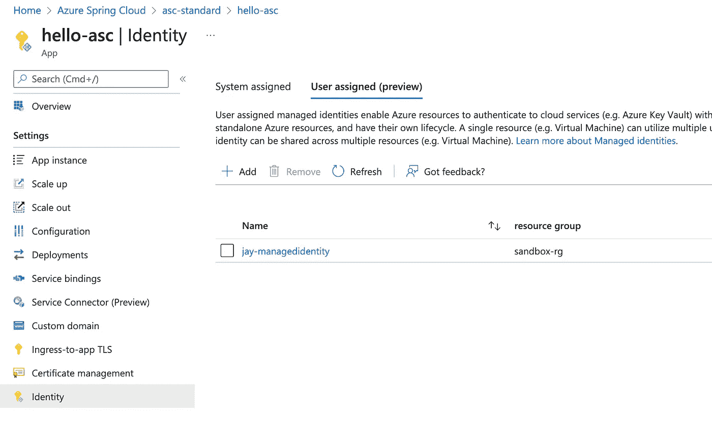

# 使用 Azure Key Vault 和托管身份在 Java 中使用机密的安全方式

> 原文：<https://blog.devgenius.io/azure-key-vault-and-managed-identity-for-java-on-azure-platforms-f4b1b791a214?source=collection_archive---------1----------------------->

现代分布式系统需要各种各样的秘密，如 API 密钥、SSH 证书、数据库密码等。这些秘密应该安全地保存在一个安全的仓库里，就像我们现实生活中的个人金库一样。不出所料，每个云服务提供商都提供自己版本的安全商店，如 Azure Key Vault、AWS KMS、谷歌云 KMS 等。


[https://makeameme.org/meme/someone-figured-out-c3fdc09613](https://makeameme.org/meme/someone-figured-out-c3fdc09613)

有了 Azure Key Vault，开发人员不必再将秘密存储在他们的应用程序中。这听起来可能令人兴奋，但这里有一个小警告。我们需要**的第一个凭证**来访问密钥库，以访问商店中的实际秘密。秘密被安全地保存在保险库中，但是使用第一凭证对密钥库的访问可能会无意中帮助黑客从单个地方窃取秘密，如果我们一开始不使用密钥库，这将会困难得多。您一定想知道是否有任何方法可以消除第一个凭证的使用，幸运的是，Azure 上有一个名为托管身份的解决方案。本文将探讨 Azure 托管身份如何工作，以及我们如何使用它来访问 Azure Key Vault 以安全地管理凭据。

# 托管身份

对于那些不熟悉托管身份的人来说，[微软文档](https://docs.microsoft.com/en-us/azure/active-directory/managed-identities-azure-resources/overview)有一个简单明了的解释如下。

*“开发人员面临的一个常见挑战是管理机密和凭证，这些机密和凭证用于保护组成解决方案的不同组件之间的通信。托管身份* ***消除了开发人员管理凭证*** *的需求。*

*托管身份为应用程序* *提供一个* ***身份，以便在连接到支持 Azure Active Directory (Azure AD)身份验证的资源时使用。应用程序可以使用托管身份来获取 Azure AD 令牌。* ***同*** [***天蓝色密钥库***](https://docs.microsoft.com/en-us/azure/key-vault/general/overview) ***，开发者可以使用托管身份访问资源。*** *密钥库以安全的方式存储凭证，并允许访问存储帐户。”***


[https://docs . Microsoft . com/en-us/azure/active-directory/managed-identities-azure-resources/how-managed-identities-work-VM # system-assigned-managed-identity](https://docs.microsoft.com/en-us/azure/active-directory/managed-identities-azure-resources/how-managed-identities-work-vm#system-assigned-managed-identity)

那么，它到底是如何消除开发人员的凭证管理的呢？让我们看看上面的图表。这看起来可能太复杂了，但它比最初想象的要简单。您的代码使用托管身份通过 Azure IMDS(可在 169.254.169.254 到达的实例元数据服务)获取访问令牌，并使用获取的令牌访问 Azure 服务，而不是直接使用凭据访问 Azure 资源(图中最右边)(**流程 4–6**)。

使用托管身份获取访问令牌是有意义的。但是 IMDS 怎么知道我的代码可以使用托管身份呢？如果恶意代码使用了不允许它们使用的 MI，该怎么办？受管身份绑定到虚拟机或虚拟机规模集。(**Flow 1–3**)，Azure 假设在特定 VM 上运行的一个或多个应用已经过验证，并被允许使用绑定的 MI。现在，应该很清楚，您需要将受管身份分配给虚拟机/VMSS，以便使用它。在 CaaS(Azure Kubernetes Service)和 PaaS(App Service，Spring Cloud)的情况下，平台可以为我们处理这些。

# 使用托管身份访问密钥库

我们简要介绍了托管身份的基础知识。让我们从这里用命令和代码做一些“边做边学”的工作。有两种类型的受管身份，[系统分配的受管身份和用户分配的受管身份。](https://docs.microsoft.com/en-us/azure/active-directory/managed-identities-azure-resources/overview#managed-identity-types)我将创建一个用户分配的托管身份，因为我想在不同的平台上重复使用它。

```
$ az identity create --resource-group sandbox-rg --name jay-managedidentity
{
  "clientId": "34dce330-*****",
  "id": "/subscriptions/*****/resourcegroups/sandbox-rg/providers/Microsoft.ManagedIdentity/userAssignedIdentities/jay-managedidentity",
  "location": "southeastasia",
  "name": "jay-managedidentity",
  "principalId": "deca1f30-04ed-*****",
  "resourceGroup": "sandbox-rg",
  "tags": {},
  "tenantId": "72f988bf-*****",
  "type": "Microsoft.ManagedIdentity/userAssignedIdentities"
}
```

我假设您已经准备好了 Azure Key Vault 实例。如果没有，请在继续下一步之前快速创建一个。我们需要向托管身份授予权限，以便它可以从密钥库中读取机密。进入 Azure Portal，选择 Azure Key Vault，点击左边的`Add access policy`。我允许秘密的所有权限。


Azure 密钥保管库访问策略

MI 准备好了，Key vault 权限也到位了，接下来看代码。两个必需的依赖项为 Azure 资源提供了所有的身份验证选项。

```
<dependency>
    <groupId>com.microsoft.azure</groupId>
    <artifactId>msal4j</artifactId>
    <version>1.11.2</version>
</dependency>
<dependency>
    <groupId>com.azure</groupId>
    <artifactId>azure-identity</artifactId>
    <version>1.5.0</version>
</dependency>
```

对于 Spring Boot 应用程序，`Azure Support` starter 默认包含这两个依赖项。

```
*<*dependency*>
   <*groupId*>*com.azure.spring*</*groupId*>
   <*artifactId*>*spring-cloud-azure-starter*</*artifactId*>
</*dependency*>*
```

需要使用应用程序属性进行配置。下面是示例代码中的`application.yml`。我想使用 Azure Key Vault 作为 PropertySource 之一，这样我就可以将值注入到我的变量中。(property-source-enabled 为 true)。然后我想使用用户分配的托管身份来连接 Azure Key Vault，所以我将 managed-identity-enabled 设置为 true，并提供托管身份的客户端 id。然后，当然，我们需要告诉他们哪个密钥库是我们想要使用的，所以我们放置了`property-sources`。

```
logging:
  level:
    com.azure: DEBUG
spring:
  cloud:
    azure:
      keyvault:
        secret:
 **property-source-enabled: true
          property-sources:
            - name: app-***
              endpoint: ${KEYVAULT_URI}
          credential:
            client-id: ${MANAGED_IDENTITY_CLIENT_ID}
            managed-identity-enabled: true**
```

有了这些属性，AzureKeyVaultSecretAutoConfiguration 将使用托管身份的客户端 id 从 IMDS 获取访问令牌，使用访问令牌从密钥库中读取机密，并在启动时将其注入属性源。从那里，我们可以使用`@Value`将秘密注入变量。

如代码所示，我将一个秘密`connectionString`注入到 String 中，这需要被创建。

```
$ az keyvault secret set --vault-name "app-***" \
    --name "connectionString" \
    --value "Java on Azure!"
```

整个源代码 [**都在 Github 上。**](https://github.com/eggboy/keyvault-mi)

# 在 Azure 平台上使用托管身份

此时，代码和环境已经准备好运行。让我们在 Azure 平台上运行示例应用程序。像 Azure App Service 和 Azure Spring Cloud 这样的 PaaS 平台在 Azure 门户上提供身份设置，以快速设置系统分配和用户分配的托管身份。

**Azure 应用服务**

对于部署，我将使用 maven 插件`azure-webapp-maven-plugin`快速创建一个应用服务，并在其上部署 Spring boot 应用。

```
$ **mvn com.microsoft.azure:azure-webapp-maven-plugin:2.5.0:config**
[INFO] Scanning for projects...
[INFO]
[INFO] -------------------< com.microsoft.gbb:keyvault-mi >--------------------
[INFO] Building keyvault-mi 0.0.1-SNAPSHOT
[INFO] --------------------------------[ jar ]---------------------------------
[INFO]
[INFO] --- azure-webapp-maven-plugin:2.5.0:config (default-cli) @ keyvault-mi ---
Auth type: AZURE_CLI
Default subscription: ***
Username: ***
[INFO] Subscription: ***
[INFO] It may take a few minutes to load all Java Web Apps, please be patient.
[INFO] Reflections took 192 ms to scan 6 urls, producing 24 keys and 484 values
[WARNING] There are no Java Web Apps in current subscription, please follow the following steps to create a new one.
Define value for OS [Linux]:
  1: Windows
* 2: Linux
  3: Docker
Enter your choice:
Define value for javaVersion [Java 8]:
* 1: Java 8
  2: Java 11
  3: Java 17
Enter your choice: 3
Define value for pricingTier [P1v2]:
   1: B1
   2: B2
   3: B3
   4: D1
   5: EP1
   6: EP2
   7: EP3
   8: F1
*  9: P1v2
  10: P1v3
  11: P2v2
  12: P2v3
  13: P3v2
  14: P3v3
  15: S1
  16: S2
  17: S3
  18: Y1
Enter your choice:
Please confirm webapp properties
Subscription Id : ***
AppName : keyvault-mi-1650465630677
ResourceGroup : keyvault-mi-1650465630677-rg
Region : centralus
PricingTier : P1v2
OS : Linux
Java : Java 17
Web server stack: Java SE
Deploy to slot : false
Confirm (Y/N) [Y]:
[INFO] Saving configuration to pom.
[INFO] ------------------------------------------------------------------------
[INFO] BUILD SUCCESS
[INFO] ------------------------------------------------------------------------
[INFO] Total time:  01:38 min
[INFO] Finished at: 2022-04-20T22:41:47+08:00
[INFO] ------------------------------------------------------------------------
$ **mvn clean package -Dmaven.test.skip=true**
...
$ **mvn azure-webapp:deploy**
```

应用程序应该无法启动，因为我们错过了一些东西。首先，我们需要向应用服务添加用户分配的托管身份。


具有托管身份的应用服务设置

然后，我们需要提供两个环境变量，MANAGED_IDENTITY_CLIENT_ID 和 KEYVAULT_URI。MANAGED_IDENTITY_CLIENT_ID 是托管身份的客户端 ID，KEYVAULT_URI 是金库 URI，[https://* * * . Vault . azure . net/](https://app-secrets-vault.vault.azure.net/)


配置会将设置注入环境变量

添加应用程序设置将重新启动应用程序。这一次，由于分配了 MI 并设置了环境变量，它应该能够顺利启动。除了执行器之外，示例应用程序没有端点，因此我们需要测试执行器端点，如[https://* * * . azure websites . net/actuator/env](https://***.azurewebsites.net/actuator/env)

**注意:由于我们使用 Key Vault 作为其中一个 PropertySource，如果示例应用程序由于某种原因无法连接到 Key Vault，它将不会启动。**


在应用服务上运行的示例应用

**Azure Kubernetes 服务**

与 App Service 不同，Azure Portal 上没有分配 MI 的方法。相反，AKS 提供了一个名为 AAD Pod Identity 的插件，应该使用 Azure CLI 启用它。AAD Pod 身份提供 Pod 级分配(还记得 MI 是在虚拟机/VMSS 级分配的吗？)以库伯内特人的方式。

**注意:AAD Pod Identity 目前在预览中，它不会使 GA 成为 Azure AD Workload Identity，因为它将在未来取代它。可以看我之前的文章—** [**Azure 工作负载身份预览关于 AKS 搭配 Spring Boot**](https://eggboy.medium.com/azure-workload-identity-preview-on-aks-with-spring-boot-46b245d7d127)

在 AKS 上启用 AAD Pod 身份的步骤是[这里是](https://docs.microsoft.com/en-us/azure/aks/use-azure-ad-pod-identity)。启用 AAD Pod 身份插件后，使用示例报告中的`deployment.yaml`在 AKS 上部署 Pod。这里最重要的是`aadpodidbinding`，它将受管身份与 pod 绑定在一起。

```
apiVersion: apps/v1
kind: Deployment
metadata:
  name: keyvault-mi
  labels:
    app: keyvault-mi
spec:
  replicas: 1
  template:
    metadata:
      name: keyvault-mi
      labels:
        **aadpodidbinding: jay-managedidentity**
        app: keyvault-mi
    spec:
      containers:
        - name: keyvault-mi
          image: eggboy/keyvault-mi:0.0.3
          imagePullPolicy: Always
          env:
            - name: MANAGED_IDENTITY_CLIENT_ID
              value:
            - name: KEYVAULT_URI
              value:
      restartPolicy: Always
  selector:
    matchLabels:
      app: keyvault-mi
```

通过查看两个 CRD，`azureidentity`和`azureidentitybinding`，您可以看到它们是如何绑定在一起的。(kubectl get azureidentity，azureidentitybinding)如果绑定设置正确，大多数情况下都可以正常工作。但是可能会有一些其他的问题，比如权限、错误的客户端 id 等等。一开始并不明显。在这种情况下，您应该看到在 kube-system 名称空间中运行的`nmi` Daemonset 的日志。

就像我在上面对 App Service 所做的那样，您应该能够访问 actuator 端点来查看它的运行。

**湛蓝的春云**

就像我们在 App Service 上做的一样，我们可以在 Azure Portal 上分配托管身份。



蔚蓝春云上的身份

# 在没有任何凭据的情况下连接 PostgresSQL

我们确实看到，使用托管身份消除了管理凭据以访问密钥库的需要。如果与 Spring Boot 自动配置相结合，这个强大的模式会引入一个引人注目的用例。Azure Key Vault 作为 PropertySource 可以触发数据库等数据服务的自动配置，而无需在应用程序中保留任何凭据。我们将看到一个示例，其中我们将使用 Azure Key Vault 和托管身份连接到 PostgreSQL，而无需在应用程序中持有任何凭据。对于前面的示例应用程序，我们只需要更改两件事情。在`pom.xml`中添加 JPA 依赖项来访问 PostgreSQL。

```
*<*dependency*>
   <*groupId*>*org.springframework.boot*</*groupId*>
   <*artifactId*>*spring-boot-starter-data-jpa*</*artifactId*>
</*dependency*>
<*dependency*>
   <*groupId*>*org.postgresql*</*groupId*>
   <*artifactId*>*postgresql*</*artifactId*>
   <*scope*>*runtime*</*scope*>
</*dependency*>*
```

依赖关系中有了 Spring Data JPA，[Data source auto configuration](https://github.com/spring-projects/spring-boot/blob/main/spring-boot-project/spring-boot-autoconfigure/src/main/java/org/springframework/boot/autoconfigure/jdbc/DataSourceAutoConfiguration.java)将尝试在启动时自动读取`spring.datasource.url`并构建数据源。数据源总共需要 3 个属性，`spring.datasource.url`、`spring.datasource.username`和`spring.datasource.password`，这些是我们需要存储在密钥库中的内容。不过有一个小问题，因为密钥库不允许“.”所以我们应该用'-'来代替它。

就是这样。现在在平台上运行它，并检查日志。使用 Azure Key Vault 提供的凭据成功创建 HikariPool。

```
2022-04-20 03:39:34.244  INFO 1 --- [           main] com.zaxxer.hikari.HikariDataSource       : HikariPool-1 - Starting...
2022-04-20 03:39:37.888  INFO 1 --- [           main] com.zaxxer.hikari.HikariDataSource       : HikariPool-1 - Start completed.
2022-04-20 03:39:37.953  INFO 1 --- [           main] o.hibernate.jpa.internal.util.LogHelper  : HHH000204: Processing PersistenceUnitInfo [name: default]
2022-04-20 03:39:38.000  INFO 1 --- [           main] org.hibernate.Version                    : HHH000412: Hibernate ORM core version 5.6.7.Final
2022-04-20 03:39:38.170  INFO 1 --- [           main] o.hibernate.annotations.common.Version   : HCANN000001: Hibernate Commons Annotations {5.1.2.Final}
2022-04-20 03:39:38.293  INFO 1 --- [           main] org.hibernate.dialect.Dialect            : HHH000400: Using dialect: org.hibernate.dialect.PostgreSQL10Dialect
2022-04-20 03:39:38.971  INFO 1 --- [           main] o.h.e.t.j.p.i.JtaPlatformInitiator       : HHH000490: Using JtaPlatform implementation: [org.hibernate.engine.transaction.jta.platform.internal.NoJtaPlatform]
2022-04-20 03:39:38.985  INFO 1 --- [           main] j.LocalContainerEntityManagerFactoryBean : Initialized JPA EntityManagerFactory for persistence unit 'default'
2022-04-20 03:39:39.063  WARN 1 --- [           main] JpaBaseConfiguration$JpaWebConfiguration : spring.jpa.open-in-view is enabled by default. Therefore, database queries may be performed during view rendering. Explicitly configure spring.jpa.open-in-view to disable this warning
```

如果你理解了这个基本概念，你就可以创造性地将它与其他服务结合起来。这种模式可以帮助在 Azure 上构建生产应用程序，在 [12 因素应用](https://12factor.net/)方法中有一个很好的参考。 [12 因素应用](https://12factor.net/)中的第四个因素是后台服务，被描述为“可以分离当前生产数据库，并附加新数据库—所有这些都无需任何代码更改。”更改密钥库中的凭据可以有效地分离/附加到新数据库，而无需任何代码更改。我相信，对于这种模式，在 Azure 上使用带有托管身份的密钥库是最优雅、最安全的方式。

# 包扎

使用 MI 访问资源是生产 Azure 客户最流行的模式。例如，如果您查看 Hashicorp Vault(Azure Key Vault 等价物)的[身份验证方法](https://www.vaultproject.io/docs/auth/azure)，您不会对它也使用托管身份感到惊讶。希望这篇文章能帮助 Java 开发者在 Azure 上写好生产代码。

如果你喜欢我的文章，请留下一些掌声，或者开始关注我。可以上[**Linkedin**](https://www.linkedin.com/in/cloudnativejay/)**找我。谢谢！**