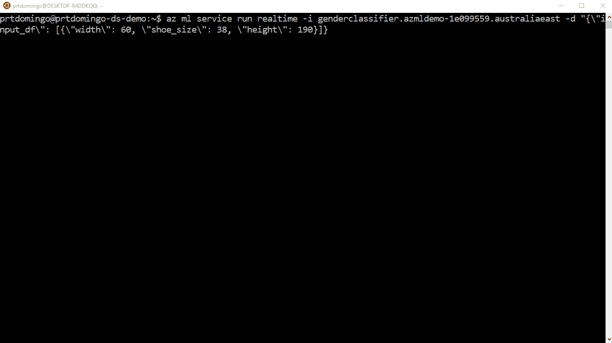
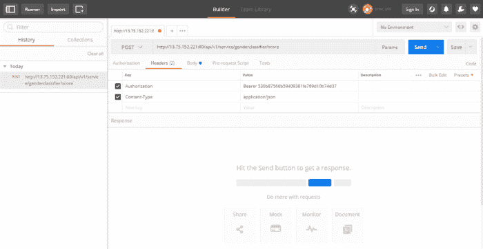

# 使用 Python 和 Azure DSVM 的 Azure 机器学习 Web 服务

> 原文：<https://blog.devgenius.io/azure-machine-learning-web-service-with-python-and-azure-dsvm-845b50966fca?source=collection_archive---------7----------------------->

> *Azure Machine Learning operational ization 是 Azure CLI 的一个组件，支持您通过 Vienna 使用 CNTK、SPARK 和 Python 机器学习平台创建的模型的可操作性。*

## 入门指南

要开始 Azure 机器学习操作化，您需要以下内容:

1.  Azure 账户(如果你没有，你可以在这里获得免费试用
2.  azure Data Science Virtual Machine(DSVM)——虽然这并不是必须的，但我认为这是最快最简单的入门方式。你可以在这里查看文档[来创建一个。](https://docs.microsoft.com/en-us/azure/machine-learning/machine-learning-data-science-provision-vm)

## 更新(实际上是重新安装)Azure CLI 包

一旦你创建了 Azure DSVM，我们要做的第一件事就是通过卸载和安装来更新我们的`azure-cli`、`azure-cli-ml`和`azure-ml-api-sdk`包。

```
$ pip uninstall azure-cli azure-cli-ml azure-ml-api-sdk
$ pip install azure-cli azure-cli-ml azure-ml-api-sdk
```

以前，我尝试用`pip install`中的`--upgrade`选项更新软件包，但我一直在升级软件包时出错。因此，卸载并安装它可以解决问题，因为稍后，我们将使用这些包来生成一个模式，并将我们训练好的模型部署到我们的 web 服务中。

## 构建性别分类器模型

接下来，我们将使用`scikit-learn`机器学习库创建一个模型，该模型将根据给定的身体指标(*身高、宽度和鞋码*)来预测这个人是男是女。创建一个名为`train.py`的文件，您可以复制下面的代码:

```
from sklearn.svm import SVC
import pickle# height, width, shoe size
X = [[181, 80, 44], [177, 70, 43], [160, 60, 38], [154, 54, 37],
     [166, 65, 40], [190, 90, 47], [175, 64, 39], [177, 70, 40], 
     [159, 55, 37], [171, 75, 42], [181, 85, 43]]Y = ['male', 'male', 'female', 'female', 'male', 'male', 'female',
     'female', 'female', 'male', 'male']clf = SVC()
clf = clf.fit(X, Y)print('Predicted value:', clf.predict([[190, 70, 43]]))
print('Accuracy', clf.score(X,Y))print('Export the model to model.pkl')
f = open('model.pkl', 'wb')
pickle.dump(clf, f)
f.close()print('Import the model from model.pkl')
f2 = open('model.pkl', 'rb')
clf2 = pickle.load(f2)X_new = [[154, 54, 35]]
print('New Sample:', X_new)
print('Predicted class:', clf2.predict(X_new))
```

运行代码，它应该会在您的项目文件夹中创建一个`model.pkl`。

## 创建 score.py

要将我们的模型部署为 web 服务，我们需要创建一个用于生成模式 JSON 文件的`score.py`。

```
def init():
    from sklearn.externals import joblib global model
    model = joblib.load('model.pkl')def run(input_df):
    import json
    pred = model.predict(input_df)
    return json.dumps(str(pred[0]))def main():
  from azureml.api.schema.dataTypes import DataTypes
  from azureml.api.schema.sampleDefinition import SampleDefinition
  from azureml.api.realtime.services import generate_schema
  import pandas df = pandas.DataFrame(data=[[190, 60, 38]], 
                      columns=['height', 'width', 'shoe_size']) # Test the functions' output
  init()
  input1 = pandas.DataFrame([[190, 60, 38]])
  print("Result: " + run(input1))

  inputs = {"input_df": SampleDefinition(DataTypes.PANDAS, df)} # Generate the service_schema.json
  generate_schema(run_func=run, inputs=inputs,
                  filepath='service_schema.json')
  print("Schema generated")if __name__ == "__main__":
    main()
```

运行`score.py`，您应该会看到`service_schema.json`已经创建。现在，我们的项目文件夹应该包含以下文件:

```
PROJECT_FOLDER
- train.py
- score.py
- model.pkl
- service_schema.json
```

## 使用 Azure CLI 创建和部署 Web 服务

现在我们已经设置好了一切，我们现在将通过执行以下操作来创建我们的 web 服务并部署模型:

## 在 Azure CLI 中验证您的帐户

为了能够使用`azure cli`创建我们的*环境*和*模型管理账户*，我们首先需要使用以下命令进行认证:

```
$ az login
```

这将显示一条信息，提示您需要打开网络浏览器，进入[https://aka.ms/devicelogin](https://aka.ms/devicelogin)并输入终端中提供的代码。

## 创造环境

一旦您能够使用`azure cli`验证您的帐户，请键入以下命令来创建我们的环境:

```
$  az ml env setup -c -n YOUR_CLUSTER_NAME -l YOUR_LOCATION
```

这是我在本教程中使用的:

```
$ az ml env setup -c -n azmldemo -l australiaeast
```

记住现在支持的位置是`westcentralus`、`eastus2`和`australiaeast`也很重要。

## 创建模型管理帐户

我们的环境至少需要 10-20 分钟才能完成配置，因此在等待的同时，我们现在可以创建我们的模型管理帐户，这是一个**一次性设置**的事情。

```
$ az ml account modelmanagement create -l YOUR_LOCATION -n YOUR_MODEL_MANAGEMENT_ACCOUNT_NAME -g YOUR_RESOURCE_GROUP
```

这是我在本教程中使用的:

```
$ az ml account modelmanagement create -l australiaeast -n azmldemoacc -g azmldemorg
```

如果您想知道，`azmldemorg`资源组是在我们之前创建环境时自动创建的，它基本上是在我们的集群名称`azmldemo`上添加了一个 **rg** 。

## 设置模型管理帐户和环境

一旦成功创建了模型管理帐户和您的环境，我们现在将使用以下命令设置模型管理帐户和环境:

```
$ az ml account modelmanagement set -n YOUR_MODEL_MANAGEMENT_ACCOUNT_NAME -g YOUR_RESOURCE_GROUP
$ az ml env set -n YOUR_CLUSTER_NAME -g YOUR_RESOURCE_GROUP
```

这是我在本教程中使用的:

```
$ az ml account modelmanagement set -n azmldemoacc -g azmldemorg
$ az ml env set -n azmldemo -g azmldemorg
```

同样重要的是要记住，您的环境*供应状态*应该显示*成功*，以便您能够成功设置它。您可以使用以下命令检查资源调配状态:

```
$ az ml env show -g YOUR_RESOURCE_GROUP -n YOUR_CLUSTER_NAME
```

## 创建 Web 服务

一旦您能够成功设置您的模型管理帐户和环境，我们现在将通过以下方式创建 web 服务:

1.  转到我们已经创建了性别分类器模型和 JSON 模式的项目文件夹
2.  键入以下命令创建 web 服务:

```
$ az ml service create realtime -f score.py --m model.pkl -s service_schema.json -n genderclassifier -r python
or you can also use --help or -h to know the other arguments available
$ az ml service create realtime -h
```

## 测试 Web 服务

一旦成功地创建了 web 服务，您就可以使用下面的命令来获取可以用来测试 web 服务的所有重要细节(例如示例 CLI 命令、Swagger URL、授权载体密钥等等):

```
$ az ml service usage realtime -i YOUR_SERVICE_ID
```

您可以使用以下命令获得您的*服务 Id* :

```
$ az ml service list realtime
```

## 运行示例 CLI 命令

```
$ az ml service run realtime -i YOUR_SERVICE_ID -d "{\"input_df\": [{\"width\": 60, \"shoe_size\": 38, \"height\": 190}]}"
```

当您在终端中运行时，应该是这样的:



## 通过邮递员测试

这里有一个关于如何通过`Scoring URL`测试 web 服务的例子



我们已经完成了，那么你对 Azure 机器学习的可操作性有什么看法？