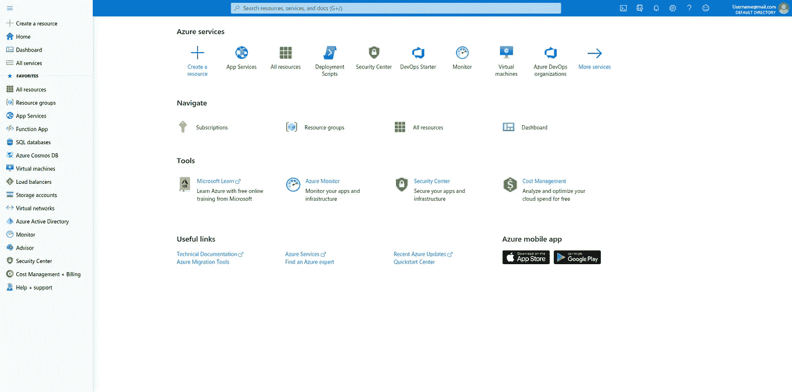

# Azure 管理工具

> 原文：<https://blog.devgenius.io/azure-management-tools-1ce9541dbbc9?source=collection_archive---------8----------------------->


你可以利用各种工具和平台来配置 Azure 资源。这些工具包括命令行、特定于语言的软件开发工具包(SDK)、用于迁移的开发人员工具等等。
这些工具包括:

*   **蔚蓝门户**
*   **Azure Powershell**
*   **Azure 命令行(CLI)**
*   **蔚蓝的云壳**
*   **Azure 资源管理器**
*   **Azure Advisor**

# **Azure 门户**

Azure portal 是可以通过 web 浏览器访问的用户界面。azure 内的用户将通过 Azure 门户管理服务和资源。如果您想要添加数据库或增加虚拟机的计算能力，并监控每月成本。



# **Azure PowerShell**

Azure PowerShell 使您能够连接到 Azure 订阅并管理资源和服务。您可以安装 Windows PowerShell 或 PowerShell core 的模块，它们是 PowerShell 的跨平台版本。 **New-AzVM** 创建一个虚拟机:

```
New-AzVM `-ResourceGroupName “MyResourceGroup” `-Name “TestVm” `-Image “UbuntuLTS” `
```

# Azure 命令行界面 **(CLI)**

这是一个连接到 Azure 的跨平台命令行程序。这意味着它可以在 Linux 或 macOS 上运行:我们可以使用命令行界面来自动化重复的任务。该命令如:

```
az vm create \— resource-group MyResourceGroup \— name TestVm \— image UbuntuLTS \— generate-ssh-keys \
```

# 天蓝色的云壳

这是一个基于浏览器的脚本环境:Bash 或 PowerShell。云壳从 Azure 门户启动。这需要一个存储帐户，启动后会为您创建一个。

# Azure 移动应用程序

Microsoft Azure mobile 应用程序允许您从 iOS 或 Android 手机或平板电脑访问、管理和监控您的所有 Azure 帐户和资源。安装后，你可以执行各种 azure 任务。

# **Azure 资源管理器(ARM)**

azure 资源管理器是 Azure 中的一个管理服务。它提供了一个管理层，使您能够在我们的 Azure 订阅中创建、更新和删除资源。

# **Azure Advisor**

提供优化的最佳实践。它将针对成本节约、性能增强、高可用性和安全选项提出建议。这个建议可以为我们节省一个. csv 或。pdf 文件。

*这是关于理解微软 Azure 的系列博客的一部分*

1.  [微软 Azure](https://medium.com/dev-genius/microsoft-azure-d6030e922abc)
2.  [Azure 管理工具](https://medium.com/@ianodad/azure-management-tools-1ce9541dbbc9) ***<你在这里***
3.  [Azure Compute](https://medium.com/dev-genius/azure-compute-182e263008f4)
4.  [蔚蓝网络](https://medium.com/@ianodad/azure-network-148f23813d3c)
5.  [蔚蓝储](https://medium.com/@ianodad/azure-storage-395d44e99787)
6.  [蔚蓝数据库](https://ianodad.medium.com/azure-database-2cb4a99bf8c2)
7.  [Azure 安全、隐私、合规和信任第 1 部分](https://ianodad.medium.com/azure-security-privacy-compliance-and-trust-part-1-60a5ad3d9576?source=your_stories_page-------------------------------------)
8.  [Azure 安全性、隐私、合规性和信任第 2 部分](https://ianodad.medium.com/azure-security-privacy-compliance-and-trust-part-2-e3c94d498a5c)