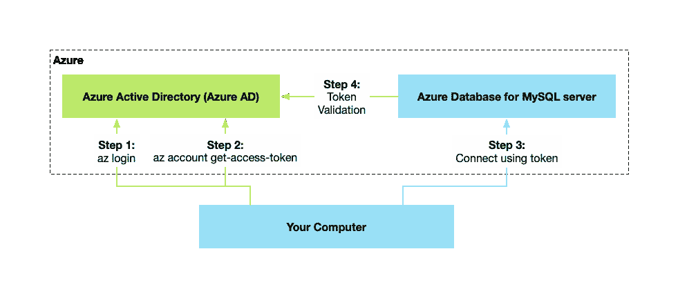
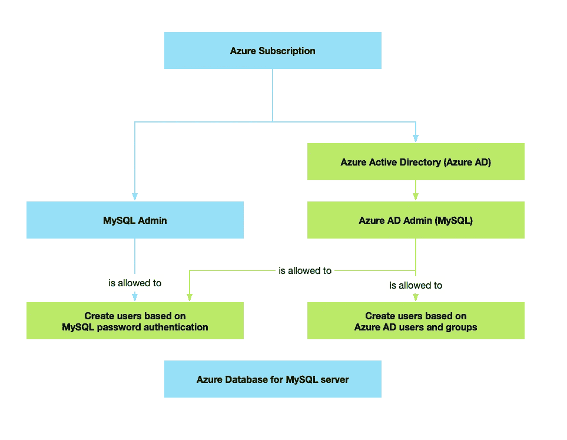

# 具有 AAD 和托管身份的 Azure MySQL

> 原文：<https://blog.devgenius.io/azure-mysql-with-aad-and-managed-identity-698128dc53fa?source=collection_archive---------5----------------------->

我不喜欢手动管理服务器。所以，PaaS 是我在公有云中重点关注的。说到数据库，微软 Azure 有各种各样的 PaaS 产品，包括 [MySQL](https://docs.microsoft.com/en-us/azure/mysql/) 。为了在 PaaS 上运行你的 web API 或者 web app，Azure 给你 [App 服务](https://docs.microsoft.com/en-us/azure/app-service/)。如果您想安全地连接两种服务而无需管理密码，[托管身份](https://docs.microsoft.com/en-us/azure/active-directory/managed-identities-azure-resources/overview)是您的好朋友。Azure docs 包含一篇文章，给出了一些关于使用托管身份和 MySQL 的指导，但它不是很详细，也没有涵盖应用服务。因此，我想在这篇文章中演示如何一起使用所有这些 PaaS 产品。

# 概念

不熟悉使用 MySQL 进行 Azure Active Directory (AAD)身份验证的基础知识的读者应该在深入下面的代码示例之前阅读[这篇文档文章](https://docs.microsoft.com/en-us/azure/mysql/concepts-azure-ad-authentication)以理解基本概念。



图片来源:[微软](https://docs.microsoft.com/en-us/azure/mysql/concepts-azure-ad-authentication#architecture)

# 手臂模板

首先，我们需要一个 ARM 模板来部署一些 Azure 资源。在本例中，我决定设置以下演示环境:

*   [*用户分配的*托管身份](https://docs.microsoft.com/en-us/azure/active-directory/managed-identities-azure-resources/overview#how-does-the-managed-identities-for-azure-resources-work)
*   具有网站的基于 Windows 的应用服务计划(将运行. NET 核心示例应用)
*   托管 MySQL 服务器

这是我为这个例子创建的 ARM 模板。没什么特别的。有趣的部分会在后面。

```
{
  "$schema": "[https://schema.management.azure.com/schemas/2019-04-01/deploymentTemplate.json#](https://schema.management.azure.com/schemas/2019-04-01/deploymentTemplate.json#)",
  "contentVersion": "1.0.0.0",
  "parameters": {
    "baseName": {
      "type": "string",
      "defaultValue": "mysql-msi-poc"
    },
    "appServiceSku": {
      "type": "string",
      "defaultValue": "P1"
    },
    "mySqlVersion": {
      "type": "string",
      "defaultValue": "5.7"
    },
    "mySqlAdminName": {
      "type": "securestring",
      "defaultValue": "mySqlAdmin"
    },
    "mySqlAdminPassword": {
      "type": "securestring"
    },
    "mySqlStorageAmountMB": {
      "type": "int",
      "defaultValue": 5120
    },
    "mySqlBackupRetentionDays": {
      "type": "int",
      "defaultValue": 7
    },
    "mySqlGeoRedundantBackups": {
      "type": "string",
      "defaultValue": "Disabled"
    },
    "mySqlSku": {
      "type": "string",
      "defaultValue": "GP_Gen5_8"
    },
    "identityName": {
      "type": "securestring",
      "defaultValue": "mySqlIdentity"
    },
    "mySqlDB": {
      "type": "string",
      "defaultValue": "mysql"
    },
    "mySqlMsiUser": {
      "type": "string",
      "defaultValue": "msiuser"
    }
  },
  "functions": [
  ],
  "variables": {
    "appServiceName": "[concat('asp-', parameters('baseName'))]",
    "webAppName": "[concat('webapp-', parameters('baseName'))]",
    "mySqlName": "[concat('mysql-', parameters('baseName'))]"
  },
  "resources": [
    {
      "type": "Microsoft.ManagedIdentity/userAssignedIdentities",
      "name": "[parameters('identityName')]",
      "apiVersion": "2018-11-30",
      "location": "[resourceGroup().location]"
    },
    {
      "name": "[variables('appServiceName')]",
      "type": "Microsoft.Web/serverfarms",
      "apiVersion": "2018-02-01",
      "location": "[resourceGroup().location]",
      "sku": {
        "name": "[parameters('appServiceSku')]",
        "capacity": 1
      },
      "tags": {
        "displayName": "[variables('appServiceName')]"
      },
      "properties": {
        "name": "[variables('appServiceName')]"
      }
    },
    {
      "name": "[variables('webAppName')]",
      "type": "Microsoft.Web/sites",
      "apiVersion": "2018-11-01",
      "location": "[resourceGroup().location]",
      "tags": {
        "[concat('hidden-related:', resourceGroup().id, '/providers/Microsoft.Web/serverfarms/', variables('appServiceName'))]": "Resource",
        "displayName": "[variables('webAppName')]"
      },
      "dependsOn": [
        "[resourceId('Microsoft.Web/serverfarms', variables('appServiceName'))]"
      ],
      "identity": {
        "type": "UserAssigned",
        "userAssignedIdentities": {
          "[resourceId('Microsoft.ManagedIdentity/userAssignedIdentities', parameters('identityName'))]": {
          }
        }
      },
      "properties": {
        "name": "[variables('webAppName')]",
        "serverFarmId": "[resourceId('Microsoft.Web/serverfarms', variables('appServiceName'))]",
        "siteConfig": {
          "appSettings": [
            {
              "name": "MySqlConnection",
              "value": "[concat('Server=', variables('mySqlName'), '.mysql.database.azure.com; Port=3306; Database=', parameters('mySqlDB'), '; Uid=', parameters('mySqlAdminName'), '@', variables('mySqlName'), '; Pwd=', parameters('mySqlAdminPassword'), '; SslMode=Preferred;persistsecurityinfo=True;')]"
            },
            {
              "name": "Host",
              "value": "[concat(variables('mySqlName'), '.mysql.database.azure.com')]"
            },
            {
              "name": "User",
              "value": "[concat(parameters('mySqlMsiUser'), '@', variables('mySqlName'))]"
            },
            {
              "name": "Database",
              "value": "[parameters('mySqlDB')]"
            }
          ]
        }
      }
    },
    {
      "apiVersion": "2017-12-01",
      "type": "Microsoft.DBforMySQL/servers",
      "name": "[variables('mySqlName')]",
      "location": "[resourceGroup().location]",
      "tags": {
        "displayName": "[variables('mySqlName')]"
      },
      "properties": {
        "createMode": "Default",
        "version": "[parameters('mySqlVersion')]",
        "sslEnforcement": "Enabled",
        "administratorLogin": "[parameters('mySqlAdminName')]",
        "administratorLoginPassword": "[parameters('mySqlAdminPassword')]",
        "storageProfile": {
          "storageMB": "[parameters('mySqlStorageAmountMB')]",
          "backupRetentionDays": "[parameters('mySqlBackupRetentionDays')]",
          "geoRedundantBackup": "[parameters('mySqlGeoRedundantBackups')]"
        }
      },
      "sku": {
        "name": "[parameters('mySqlSku')]"
      },
      "resources": [
        {
          "type": "firewallrules",
          "apiVersion": "2017-12-01",
          "dependsOn": [
            "[concat('Microsoft.DBforMySQL/servers/', variables('mySqlName'))]"
          ],
          "location": "[resourceGroup().location]",
          "name": "AllowAzureIPs",
          "properties": {
            "startIpAddress": "0.0.0.0",
            "endIpAddress": "255.255.255.255"
          }
        }
      ]
    }
  ],
  "outputs": {
  }
}
```

请注意，上面的模板向我们的 web 应用程序添加了一个常规的连接字符串。这仅用于演示目的。这个例子的要点是 ***而不是*** 有一个带有用户名和密码的连接字符串。因此，在您的实际代码中，删除连接字符串，直接使用托管身份！

您可以使用 Azure CLI 部署上面显示的模板，如下所示:

```
# Resoure Group Name
RG="MySql-with-MSI"# Base name; Azure ressource names will be derived from it
# (e.g. mysql-$BASE, webapp-$BASE, etc.)
BASE="mysql-msi-poc"# Login and set subscription
az login --use-device-code
az account set --subscription "..."# Deploy resource group
az deployment group create --resource-group $RG --template-file deploy.json --parameters mySqlAdminPassword=Sup3rSecuePazzw0rd identityName=mySqlIdentity baseName=mysql-msi-poc
```

# 托管身份

上面显示的 ARM 模板在 AAD 中创建了一个名为`mySqlIdentity`的用户分配的托管身份。web 应用程序需要托管身份的*客户端 ID* 又名*应用程序 ID* 。不幸的是，我还没有找到在 ARM 模板中直接获得这个 ID 的方法。如果你知道如何做到这一点，请与我联系。然而，在 ARM 模板已经部署之后，只需两行 Azure CLI 代码就可以轻松设置它:

```
CLIENT_ID=$(az identity list --resource-group $RG --query "[?name=='mySqlIdentity'].clientId" --output tsv)az functionapp config appsettings set --name webapp-$BASE --resource-group $RG --settings "ClientID=$CLIENT_ID"
```

# MySQL AAD 管理



图片来源:[微软](https://docs.microsoft.com/en-us/azure/mysql/concepts-azure-ad-authentication#administrator-structure)

现在我们需要在 MySQL 中创建一个用户来代表我们的托管身份。遗憾的是，普通 MySQL 管理员帐户无法做到这一点。我们需要一个具有 MySQL 管理权限的 AAD 帐户。该帐户可以为托管身份创建 MySQL 用户。

如果你已经有一个想要使用的 AAD 用户( *no* Microsoft Account 或类似的东西)，你就可以了。如果没有，您可以使用 Azure CLI 轻松创建一个:

```
AAD_DOMAIN="yourdomain.onmicrosoft.com"
AAD_USER="mysqladmin"
AAD_ADMIN=$AAD_USER@$AAD_DOMAINaz ad user create --display-name $AAD_USER --password Sup3rSecuePazzw0rd --user-principal-name $AAD_ADMIN
```

我们需要获得 AAD 用户的对象 ID:

```
# Get ID and Email of specified AAD Admin
AAD_ADMIN_ID=$(az ad user show --id $AAD_ADMIN --query "objectId" --output tsv)
AAD_ADMIN_EMAIL=$(az ad user show --id $AAD_ADMIN --query "userPrincipalName" --output tsv)
```

现在，我们可以将我们的 AAD 用户指定为 MySQL 数据库的 AAD 管理员:

```
az mysql server ad-admin create --server-name mysql-$BASE -g $RG --display-name $AAD_ADMIN_EMAIL --object-id $AAD_ADMIN_ID
```

如果这些步骤都能直接在 ARM 模板中完成就太好了。不幸的是，我还没有找到这样做的方法。如果你知道一个，请让我知道。

# 为托管身份创建 MySQL 用户

借助 AAD MySQL administrator，我们可以为 web 应用的托管身份创建一个 MySQL 用户。为此，我建议打开一个[云壳](https://docs.microsoft.com/en-us/azure/cloud-shell/overview)。请注意，您必须使用我们之前创建的 AAD MySQL 管理员进行**登录。**

让我们启动 MySQL CLI，并通过 AAD MySQL 管理员进行身份验证:

```
DB_ID=mysql-$BASE.mysql.database.azure.commysql -h $DB_ID --user $AAD_ADMIN@mysql-$BASE --enable-cleartext-plugin --password=`az account get-access-token --resource-type oss-rdbms --output tsv --query accessToken`
```

我推荐单独试试`az account get-access-token...`。复制令牌并使用例如[https://jwt.io/](https://jwt.io/)进行检查。您可能会对 MySQL 的 AAD 认证如何工作有更多的了解。

运行 MySQL CLI 后，创建 MySQL 用户并赋予其必要的权限(注意`$CLIENT_ID`必须替换为托管身份的客户端 ID；请参见上面所示的 Azure CLI 脚本中的相应变量):

```
SET aad_auth_validate_oids_in_tenant = OFF;
CREATE AADUSER 'msiuser' IDENTIFIED BY '$CLIENT_ID';
GRANT SELECT ON *.* TO 'msiuser';
```

# C#示例

Azure 配置部分到此为止。我们有:

*   托管身份。它也已经在 MySQL 中创建并被赋予适当的权限。
*   Web 应用程序的应用程序服务。我们为其分配了托管身份。

现在让我们创建一个简单的 C#客户端，我们可以用它来验证一切正常。注意，这个客户端使用了[*MySQL connector*](https://www.nuget.org/packages/MySqlConnector/)nu get 包。注意[不是所有的驱动都兼容【MySQL AAD 集成。](https://docs.microsoft.com/en-us/azure/mysql/howto-configure-sign-in-azure-ad-authentication#compatibility-with-application-drivers) [*MySqlConnector*](https://www.nuget.org/packages/MySqlConnector/) 是。

```
using System;
using System.Collections.Generic;
using System.IO;
using System.Linq;
using System.Net;
using System.Text.Json;
using System.Threading.Tasks;
using Microsoft.AspNetCore.Mvc;
using Microsoft.Extensions.Configuration;
using Microsoft.Extensions.Logging;
using MySql.Data.MySqlClient;namespace MySqlTest.Controllers
{
    [ApiController]
    [Route("[controller]")]
    public class MySqlController : ControllerBase
    {
        private readonly ILogger<MySqlController> _logger;
        private readonly IConfiguration _configuration;public MySqlController(ILogger<MySqlController> logger, IConfiguration configuration)
        {
            _logger = logger;
            _configuration = configuration;
        }[HttpGet]
        [Route("withAdmin")]
        public async Task<string> GetWithAdmin()
        {
            using var conn = new MySqlConnection(_configuration["MySqlConnection"]);
            await conn.OpenAsync();
            using var cmd = conn.CreateCommand();
            cmd.CommandText = "SELECT 1 AS X";
            return (await cmd.ExecuteScalarAsync()).ToString();
        }[HttpGet]
        [Route("withManagedIdentity")]
        public async Task<string> GetWithManagedIdentity()
        {
            var builder = new MySqlConnectionStringBuilder
            {
                Server = _configuration["Host"],
                Database = _configuration["Database"],
                UserID = _configuration["User"],
                Password = await GetAccessToken(),
                SslMode = MySqlSslMode.Required,
            };using var conn = new MySqlConnection(builder.ConnectionString);
            try
            {
                await conn.OpenAsync();using var cmd = conn.CreateCommand();
                cmd.CommandText = "SELECT 1 AS X";
                return (await cmd.ExecuteScalarAsync()).ToString();
            }
            catch (Exception ex)
            {
                return ex.Message;
            }
        }[HttpGet]
        [Route("token")]
        public async Task<string> GetToken()
        {
            return await GetAccessToken();
        }private async Task<string> GetAccessToken()
        {
            var clientID = _configuration["ClientID"];
            var request = (HttpWebRequest)WebRequest.Create($"{_configuration["MSI_ENDPOINT"]}?api-version=2019-08-01&resource=https%3A%2F%2Fossrdbms-aad.database.windows.net&client_id=" + clientID);
            request.Headers["Metadata"] = "true";
            request.Headers["X-IDENTITY-HEADER"] = _configuration["MSI_SECRET"];
            request.Method = "GET";// Call managed identities for Azure resources endpoint.
            var response = (HttpWebResponse)request.GetResponse();// Pipe response Stream to a StreamReader and extract access token.
            StreamReader streamResponse = new StreamReader(response.GetResponseStream());
            var stringResponse = await streamResponse.ReadToEndAsync();
            var list = JsonSerializer.Deserialize<Dictionary<string, string>>(stringResponse);
            return list["access_token"];
        }
    }
}
```

请注意，这是目前为止 ***而不是*** 生产就绪代码。这只是一个演示一般如何做的示例。这里有一些注意事项:

*   *getwithdmin()*演示使用用户名和密码访问 MySQL 的常用方法。
*   *getaccessstoken()*展示了如何使用托管身份获取访问令牌。注意，实际上你将 ***永远不会*** 暴露那个信息。然而，出于学习的目的，我创建了一个路由，通过它您可以通过浏览器获得访问令牌。再次，我建议分析它，以更深入地了解此事。
*   最后，*GetWithManagedIdentity()*演示了如何使用托管身份检索的访问令牌向 MySQL 进行身份验证。

构建它，部署到我们 ARM 模板创建的 App Service Web App，尝试*https://your site . azure websites . net/MySQL/withManagedIdentity*。它应该成功返回 *1* 。

# 结论

托管身份增强了系统的安全性，因为您不必手动设置和定期更改数据库密码。托管身份与 MySQL 的集成并不简单，但是一旦你搞清楚了上面提到的事情，它就能很好地工作。希望这篇文章对你有用。