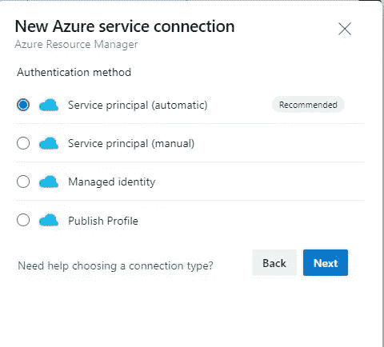

# 使用 Azure DevOps CLI 的 Azure 资源管理器服务连接

> 原文：<https://blog.devgenius.io/azure-resource-manager-service-connection-using-azure-devops-cli-ae6c6945f0b4?source=collection_archive---------4----------------------->



服务连接

在本文中，我将解释使用 azure devops cli 自动创建 azure devops 服务连接的过程。

Azure DevOps 提供了为多个外部提供者创建服务连接的选项。然而，本文将关注 Azure 资源管理器的服务连接

**先决条件:**

1.  你有一个 Azure DevOps 项目
2.  您已经在本地计算机中配置了 Azure CLI

**安装 Azure CLI:** 按照[安装 Azure CLI](https://docs.microsoft.com/en-us/cli/azure/install-azure-cli) 中提供的说明来设置您的 Azure CLI 环境。至少，您的 Azure CLI 版本必须是 2.10.1。

3.您拥有有效的 Azure 订阅

# 步伐

1.  使用以下命令创建服务主体并保存信息

```
az ad sp create-for-rbac --name myServicePrincipalName --role Contributor --scopes /subscriptions/mySubscriptionID
```

2.添加 Azure DevOps 扩展:

```
az extension add --name azure-devops
```

3.配置默认 Azure DevOps 项目

```
az devops configure --defaults organization=[https://dev.azure.com/contoso](https://dev.azure.com/contoso) project=ContosoWebApp
```

> 用您自己的价值观替换组织和项目的价值观

4.创建服务连接

```
az devops service-endpoint azurerm create --azure-rm-service-principal-id <value>--azure-rm-subscription-id <value> --azure-rm-subscription-name <value> --azure-rm-tenant-id <value> --name <value>
```

> 用之前创建的服务连接替换这些值
> 
> 注意:`az devops service-endpoint azurerm create`命令使用提示消息询问服务主体密码/秘密。
> 
> 出于自动化的目的，使用`AZURE_DEVOPS_EXT_AZURE_RM_SERVICE_PRINCIPAL_KEY`环境变量设置服务主体密码/秘密。

```
Bash:
export AZURE_DEVOPS_EXT_AZURE_RM_SERVICE_PRINCIPAL_KEY=<your_secret_here>PowerShell:
$env:AZURE_DEVOPS_EXT_AZURE_RM_SERVICE_PRINCIPAL_KEY=<your_secret_here>
```

# 更新服务连接权限

1.  使用以下命令获取服务连接的 id

```
az devops service-endpoint list --output table
```


关系


以前

2.更新所有管道的权限

```
az devops service-endpoint update --id ad3b65ba-dd6a-4b53-a907-fa88531a6d73 --enable-for-all
```


在...之后

**其他资源:**

[](https://docs.microsoft.com/en-us/azure/devops/cli/service-endpoint?view=azure-devops) [## 使用 Azure DevOps CLI 创建服务端点

### 使用 az devops service-endpoint 命令，您可以创建和管理不同类型的服务连接。一个…

docs.microsoft.com](https://docs.microsoft.com/en-us/azure/devops/cli/service-endpoint?view=azure-devops) 

我希望你喜欢阅读这篇文章，随时添加你的评论、想法或反馈，不要忘记在 linkedin 上联系。