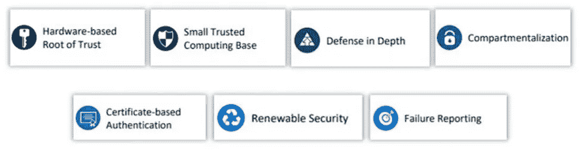
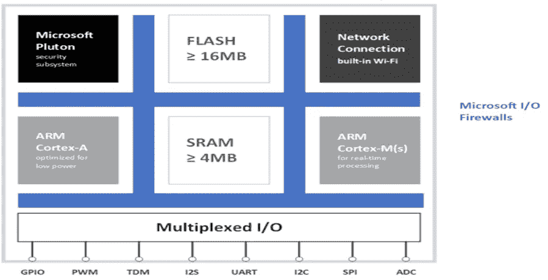
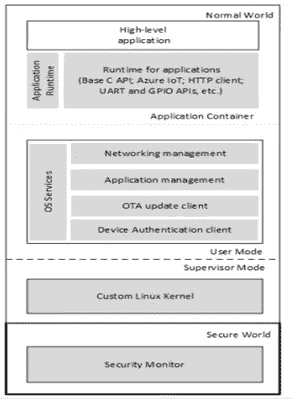

# 天蓝色球体

> 原文：<https://blog.devgenius.io/azure-sphere-8313c5ebe8f1?source=collection_archive---------9----------------------->

**Azure Sphere，物联网设备安全的革命性一步**

物联网是当今世界传播最广泛的技术之一。到 2025 年，全球将有 4160 万台联网设备。除了巨大的优势，物联网设备还面临诸多挑战；安全性是互联设备面临的主流挑战。这些连接的设备容易受到许多网络攻击，如 MIRAE 瓶颈、Xbash 和 Muhstik 攻击。

微软 Azure 通过其新的 Azure Sphere 技术在保护物联网设备免受上述攻击方面发挥了作用。微软 Azure 的构建模块是微控制器单元(MCU)、基于 Linux 的操作系统、基于云的安全系统。MCU 能够运行实时操作系统。Azure MCU 及其实时操作系统和连接的应用程序是一个组合，用于实现一个安全和连接的设备，该设备可以自我更新，并从远程源进行监控和维护。Azure Sphere 声称使用以下七个属性来保护连接的设备。

在本文的其余部分，我们将详细讨论所有这些属性，以及它们如何保护物联网设备免受潜在威胁。稍后，我们将详细讨论其软件和硬件架构。

**天蓝色球体的七大属性**

Azure Sphere 的本质动机是以最低的成本在物联网设备中提供最高级别的安全性。由于物联网设备是使用互联网连接的，因此一个设备的硬件中的任何漏洞都可能成为攻击者进入系统的漏洞。请记住上面提到的限制和微软在安全领域的丰富经验，Azure Spheres 开发人员根据上述七个属性进行设计，以实现高级别的安全性

**基于硬件的信任根:**

该属性确认设备及其身份不应被分离，这导致在该设备上的防止伪造/欺骗行为。Azure sphere 的每个 MCU 都有唯一的身份。密码 pluton 子系统，安全微处理器，产生身份密钥；因此，实现了从工厂到最终用户的信任根。

**基于小型可信计算:**

该属性确保只有可信软件才能在基于计算的硬件上运行。Azure Sphere 仅在其硬件上运行授权的基于微软的 pluton 系统、排级安全系统和安全监视器来实现这一属性，从而使基于计算的可信和安全。

**纵深防御:**

纵深防御属性提供多层次的安全性。每一层都可以验证上层是安全的，因此通过使用多层，Azure Sphere 可以实现高级别的保护

**划分:**

划分，也称为动态划分，确保 MCU 的每个组件都包含针对潜在威胁的对策。制造这些组件是为了使一个安全漏洞无法到达另一个部分。

**基于证书的认证:**

Azure Sphere 提供了使用安全证书而不是密码的无密码认证系统。这些证书对 Azure Sphere 的每个软件元素进行签名。此外，这些安全证书对设备到云的通信和云到设备的通信进行认证，以使通信更加安全。

**续保:**

其名称建议更新安全属性确保软件将自动更新。Azure 安全中心可以保护硬件免受这些更新的影响。

**故障报告:**

Azure Sphere 的 MCU 可以向其安全中心发送错误报告。大多数设备到云的攻击来自拒绝服务攻击。Azure Sphere 有一个针对潜在威胁的早期预警机制，以防止拒绝服务攻击。

**天蓝色球体架构:**

Azure Sphere 通过结合其硬件、软件和安全服务来提供牢不可破的安全性。本节将简要概述这些体系结构。

# 硬件架构:

Azure Sphere 的 MCU 由单个管芯上的多个内核组成，如下图所示。

每个核心都被分隔成多个隔间，以确保一个核心的安全漏洞不会影响其他物质。每个 MCU 属于一个单独的信任域。在本节中，我们将简要讨论 MCU 的每个内核。

**富豪安全系统:**

Pluton 安全子系统，顾名思义，是 MCU 内部管理可信和安全根的子系统。它由以下部件组成:

安全处理器内核。

密码引擎。

硬件随机数生成器。

对称和非对称加密。

椭圆曲线数字签名算法。

用于硬件验证的安全机器人。

篡改对策

熵检测单元

排级安全子系统也配备了许多软件组件和工具。这些软件组件是不同的运行时服务。

**高层应用核心:**

这个核心在不同的组件之间建立信任边界。它包括用于划分的存储器管理单元。单片机的操作系统也运行在这个内核中。它运行两个独立的操作环境，其中一个被称为正常世界(NW)。NW 以用户模式和管理员模式运行代码。另一个操作环境是 Secure World(SW)，负责运行安全监视器。

**实时内核:**

实时内核能够运行实时操作系统或裸机。它们不能直接与互联网通信，只能与内部组件通信。

**多路复用 IO:**

Azure Sphere 有许多 IO 功能。这些 IO 功能使用户能够根据自己的需求配置软件。IO 外设可以通过实时操作系统和更高层连接。

**微软防火墙:**

微软的防火墙是用来保证所有的 IO 外设都与其对应的操作系统进行映射。这种防火墙也被称为硅对策，作为沙箱。防火墙加强了划分，从而避免了安全威胁。
这些防火墙包含在应用核心中，影响实时核心对其相应外设的访问。

# 软件架构:

软件架构包括操作系统和高级应用程序。该应用软件可以与互联网和单片机内部操作系统进行通信。

上图显示了 Azure sphere 的软件架构。在这个架构中，微软提供的元素用灰色阴影表示。

**高层应用平台:**

高级应用是微软唯一不提供的软件组件。所有其他软件组件都是由 Microsoft 提供的，并签署了 Microsoft 安全证书。应用程序软件中的所有更新都通过 Microsft pipeline(一种受信任的流)进行传递。

在这篇文章中，我试图向用户提供一个关于微软 Azure Sphere 的深刻概述。Azure Sphere 是一种保护物联网设备的新方法。