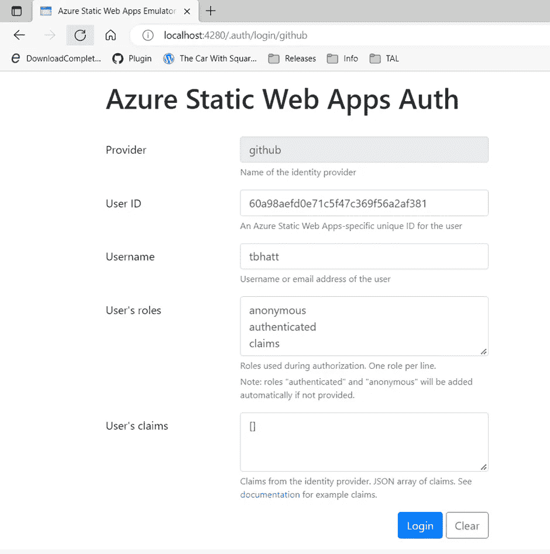
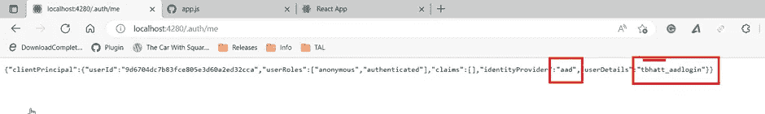

# Azure 静态 Web 应用:配置身份提供者(第 1 页，共 2 页)

> 原文：<https://blog.devgenius.io/azure-static-web-app-configuring-identity-providers-1-of-2-963acfdc8d10?source=collection_archive---------9----------------------->

过去几天，我一直在撰写大量关于 Azure 静态 web 应用的文章。我将在最后提供这些文章的列表。

在本文中，我将演示如何为身份认证配置身份提供者。这些身份提供者是 Twitter、GitHub 和 Azure active directory。我们将在这里重用[讨论的 react 应用程序框架。](https://github.com/staticwebdev/react-basic/generate)

在我们的[上一篇文章](/azure-static-web-app-local-setup-818b1c45fed?sk=70d83c70582608b9726d9be61c11c527)中，我们为 azure 静态 web 应用的开发准备了本地机器。我们将使用静态 web 应用模拟器来模拟使用不同身份提供者的身份验证。

# 更新 App.js

从源代码[模板](https://github.com/staticwebdev/react-basic/generate)中打开 App.js (sample-app/src/app.js)并添加链接以与不同的身份提供者进行认证。

我们添加了通过不同身份提供商登录的链接。我想单独访问他们中的每一个，但在此之前，让我们理解为什么我们不能使用 npm start 测试变化。

# NPM 问题开始。

因为我们只更改了一个 javascript 文件，所以我们也可以使用 npm start 来验证这些更改。

```
npm start
```


NPM 启动的问题是授权服务器不可用。因此，点击任何登录将改变网址，但不会执行认证逻辑。


# 启动静态 Web 应用程序模拟器

为了测试我们的代码，我们将启动静态 web 应用程序模拟器来模拟授权服务器。

以管理员身份打开新的 cmd 提示符/ PowerShell 窗口，并运行

```
swa start
```


我们可以在端口 4280 上访问应用程序。


## 开源代码库

点击“GitHub 登录”模拟器将打开一个模拟屏幕进行登录。



在 Azure 上部署应用程序后，行为将会有所不同。按登录。

现在，点击“查看声明”查看登录详情


## 推特

点击“Twitter 登录”。模拟器将打开一个模拟屏幕进行登录。


在 Azure 上部署应用程序后，行为将会有所不同。按登录。

现在，点击“查看声明”查看登录详情。


## Azure 活动目录

点击“AAD 登录”。模拟器将打开一个模拟屏幕进行登录。


在 Azure 上部署应用程序后，行为将会有所不同。按登录。

现在，点击“查看声明”查看登录详情



# 注销

单击注销链接以测试注销功能。


现在，点击“查看声明”查看登录详情


# 参考

正如承诺的那样，请查看其他 Azure Static web app 文章的链接。

*   [使用 Terraform-Azure RM _ Static _ site 创建 Azure 静态 Web App](https://tarunbhatt9784.medium.com/azure-static-web-app-azurerm-static-site-ac2b13369fbe?sk=d528089f68459a3626885795611e29fe)
*   [Azure 静态应用——使用 Azure DevOps 部署变更](https://tarunbhatt9784.medium.com/azure-static-app-deploy-changes-using-azure-devops-2f65840b956e?sk=3fc51453b74b6a5920dd0e5afff4bd07)
*   [Azure Static Web App——使用 Terraform 将部署令牌保存到 key vault](https://tarunbhatt9784.medium.com/azure-static-web-app-save-management-token-to-keyvault-using-terraform-ccf1a344e38e?sk=5aa3f1b3d1dea5fb71ad2a7241291cec)
*   [Azure 静态 Web 应用的 Azure DevOps 管道—从密钥库中获取部署令牌。](https://tarunbhatt9784.medium.com/azure-devops-pipeline-for-azure-static-web-app-fetch-deployment-token-from-key-vault-21aa75e3cb30?sk=473a4fb08fd965ce814fb166d7e46165)
*   [Azure 静态 Web 应用—开发者机器设置](/azure-static-web-app-local-setup-818b1c45fed?sk=70d83c70582608b9726d9be61c11c527)

页（page 的缩写）s-Medium 是一个阅读、写作和向其他作者学习的绝佳平台。如果你想加入我的旅程，今天就加入 [medium](https://tarunbhatt9784.medium.com/membership) 。