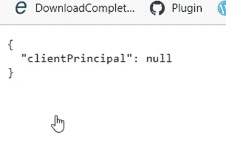
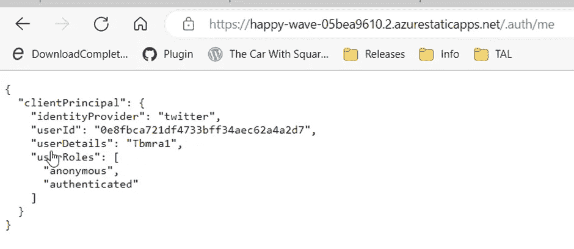

# Azure 静态 Web 应用:配置身份提供者(第 2 页，共 2 页)

> 原文：<https://blog.devgenius.io/azure-static-web-app-configuring-identity-providers-2-of-2-b2b8c7b6c060?source=collection_archive---------11----------------------->

过去几天，我一直在撰写大量关于 Azure 静态 web 应用的文章。我将在最后提供这些文章的列表。

在我之前的[文章](https://tarunbhatt9784.medium.com/azure-static-web-app-configuring-identity-providers-1-of-2-963acfdc8d10?sk=579315d6ea6aa9e6f24eb65963e0bd6f)中，我编写了一个基本的 react 应用程序来演示在本地机器上使用 Twitter、GitHub & Azure Active directory 进行身份验证。我们使用静态 web 应用模拟器来模拟认证服务器。在本文中，我们将部署对 Azure 的更改，以查看实际的认证服务器。

首先，我想使用路由技术来清理登录和注销 URL。

# 按指定路线发送

在前一篇文章中，登录和注销 URL 有。app.js 文件内的 auth。我想使用 staticwebapp.config.json 中的 routes config 来清理它。

有了这些路由配置，我们可以删除。从 app.js 上的 URL 进行验证。我们修改后的 app.js 将如下所示:

让我们使用这里的[构建的管道](https://tarunbhatt9784.medium.com/azure-devops-pipeline-for-azure-static-web-app-fetch-deployment-token-from-key-vault-21aa75e3cb30?sk=473a4fb08fd965ce814fb166d7e46165)来部署我们的更改。

# 验证认证

## 开源代码库

点击 GitHub 登录。

该行为与我们在本地开发人员机器上看到的不同。没有模拟认证屏幕。相反，页面保持原样，身份验证在后台进行。

与我们在开发机器上测试应用程序的方式相反，在能够使用不同的登录机制之前，我们需要注销。

再次核实索赔

## 推特

点击 Twitter 登录

该行为与我们在本地开发人员机器上看到的不同。没有模拟认证屏幕。相反，页面保持原样，身份验证在后台进行。

与我们在开发机器上测试应用程序的方式相反，在能够使用不同的登录机制之前，我们需要注销。

再次核实索赔

# Azure 活动目录登录

点击 AAD 登录

该行为与我们在本地开发人员机器上看到的不同。没有模拟认证屏幕。相反，页面保持原样，身份验证在后台进行。

与我们在开发机器上测试应用程序的方式相反，在能够使用不同的登录机制之前，我们需要注销。

再次核实索赔

# 参考

正如承诺的那样，请查看其他 Azure Static web app 文章的链接。

*   [使用 Terraform-Azure RM _ Static _ site 创建 Azure 静态 Web App](https://tarunbhatt9784.medium.com/azure-static-web-app-azurerm-static-site-ac2b13369fbe?sk=d528089f68459a3626885795611e29fe)
*   [Azure 静态应用——使用 Azure DevOps 部署变更](https://tarunbhatt9784.medium.com/azure-static-app-deploy-changes-using-azure-devops-2f65840b956e?sk=3fc51453b74b6a5920dd0e5afff4bd07)
*   [Azure Static Web App——使用 Terraform 将部署令牌保存到 key vault](https://tarunbhatt9784.medium.com/azure-static-web-app-save-management-token-to-keyvault-using-terraform-ccf1a344e38e?sk=5aa3f1b3d1dea5fb71ad2a7241291cec)
*   [Azure 静态 Web 应用的 Azure DevOps 管道—从密钥库中获取部署令牌。](https://tarunbhatt9784.medium.com/azure-devops-pipeline-for-azure-static-web-app-fetch-deployment-token-from-key-vault-21aa75e3cb30?sk=473a4fb08fd965ce814fb166d7e46165)
*   [Azure 静态 Web 应用—开发者机器设置](/azure-static-web-app-local-setup-818b1c45fed?sk=70d83c70582608b9726d9be61c11c527)

页（page 的缩写）s-Medium 是一个阅读、写作和向其他作者学习的绝佳平台。如果你想加入我的旅程，今天就加入 [medium](https://tarunbhatt9784.medium.com/membership) 。