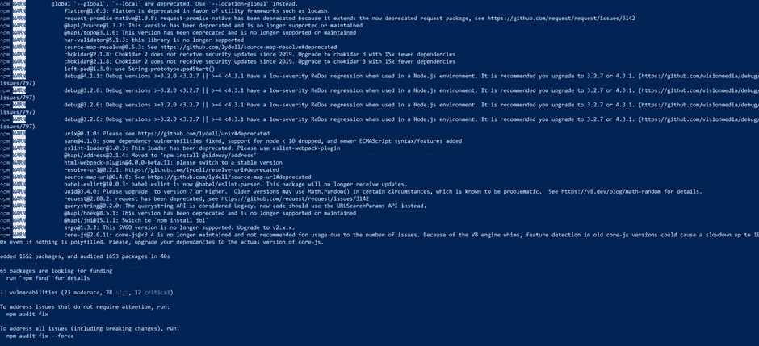
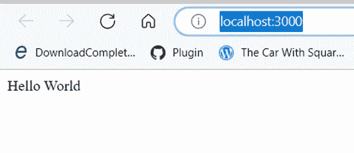
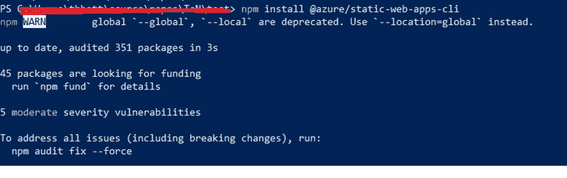
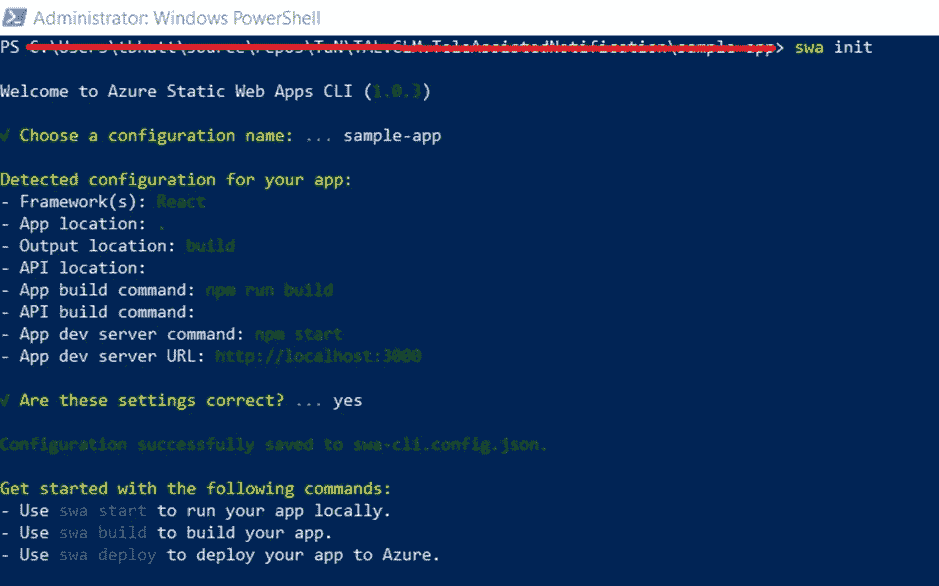
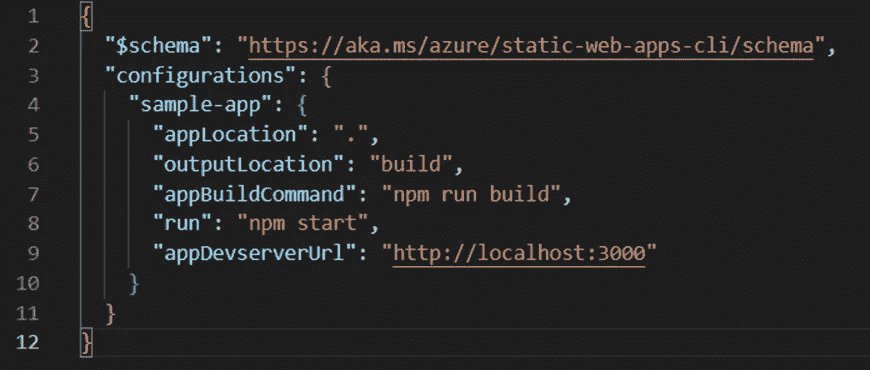
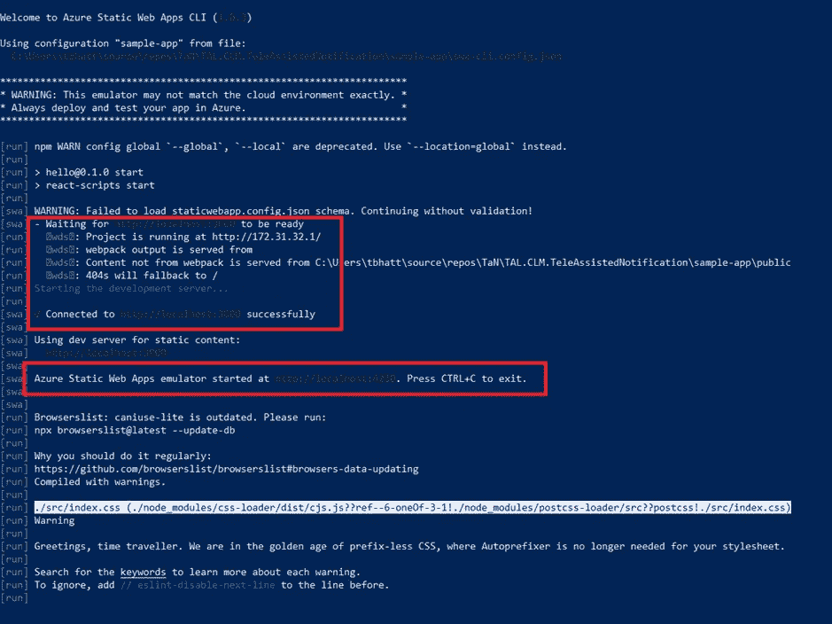

# Azure 静态 Web 应用程序—开发人员机器设置

> 原文：<https://blog.devgenius.io/azure-static-web-app-local-setup-818b1c45fed?source=collection_archive---------8----------------------->

过去几天，我一直在撰写大量关于 Azure 静态 web 应用的文章。在我以前的文章中，我写过以下主题:

*   [使用 Terraform-Azure RM _ Static _ site 创建 Azure 静态 Web 应用](https://tarunbhatt9784.medium.com/azure-static-web-app-azurerm-static-site-ac2b13369fbe?sk=d528089f68459a3626885795611e29fe)
*   [Azure Static App——使用 Azure DevOps 部署变更](https://tarunbhatt9784.medium.com/azure-static-app-deploy-changes-using-azure-devops-2f65840b956e?sk=3fc51453b74b6a5920dd0e5afff4bd07)
*   [Azure 静态 Web App——使用 Terraform 将部署令牌保存到 key vault](https://tarunbhatt9784.medium.com/azure-static-web-app-save-management-token-to-keyvault-using-terraform-ccf1a344e38e?sk=5aa3f1b3d1dea5fb71ad2a7241291cec)
*   [Azure 静态 Web 应用的 Azure DevOps 管道—从密钥库中获取部署令牌。](https://tarunbhatt9784.medium.com/azure-devops-pipeline-for-azure-static-web-app-fetch-deployment-token-from-key-vault-21aa75e3cb30?sk=473a4fb08fd965ce814fb166d7e46165)

本文将展示如何为调试和测试建立本地开发环境。我们将在这里重用[讨论的 react 应用程序框架。](https://github.com/staticwebdev/react-basic/generate)

# 安装软件包

首先，我们将安装 package.json 中列出的 NPM 软件包

```
npm install
```



# 测试静态页面

运行 npm start 命令来测试静态页面。应用程序将在 [http://localhost:3000/](http://localhost:3000/) 上打开。



即使页面显示正确，我们也无法使用 npm start 测试完整的静态 web 应用程序。一个生产就绪的应用程序将具有许多其他集成，如路由、身份验证和授权，而 npm start 在这些集成方面做得不够。

在接下来的文章中，您将看到更多这方面的证据，我将使用身份提供者配置身份验证和授权。

# Azure 静态 Web 应用模拟器

Azure 为成功运行应用程序提供了许多现成的集成。在本地工作站上编码时，这些集成是不存在的。 [Azure Static web app simulator 有助于模仿本地工作站上的那些集成](https://learn.microsoft.com/en-us/azure/static-web-apps/local-development#how-it-works)。这些集成包括:

*   静态 web 应用程序
*   Azure 函数 API
*   认证和授权服务
*   路由和配置服务

我们必须在 app 目录下安装 CLI 工具，才能使用静态 web app 模拟器。运行以下命令安装 CLI 工具:

```
npm install @azure/static-web-apps-cli
```



# 初始化静态 web 应用程序

安装 CLI 是不够的。下一步是使用 CLI 工具配置项目。初始化 CLI 工具的命令如下:

```
Swa init
```



该命令将询问配置名称，检测您的项目设置和使用的框架，并在当前目录下创建一个 swa-cli.config.json 文件。

Swa-cli.config.json 文件如下所示:



# 启动静态 web 应用程序

下一步也是最后一步是[使用 CLI 工具启动静态 web 应用程序，并将其绑定到开发服务器](https://azure.github.io/static-web-apps-cli/docs/cli/swa-start/)。

```
Swa start
```

我们可以通过点击 URL[http://localhost:4280](http://localhost:4280)来测试应用程序



我们可以点击 URL[http://localhost:4280](http://localhost:4280)来测试应用程序。在我的下一篇文章中，我将展示 swa CLI 工具在使用不同的自定义身份提供者开发身份验证和授权方面的强大功能。

页（page 的缩写）s-Medium 是一个阅读、写作和向其他作者学习的绝佳平台。如果你想加入我的旅程，今天就加入 [medium](https://tarunbhatt9784.medium.com/membership) 。