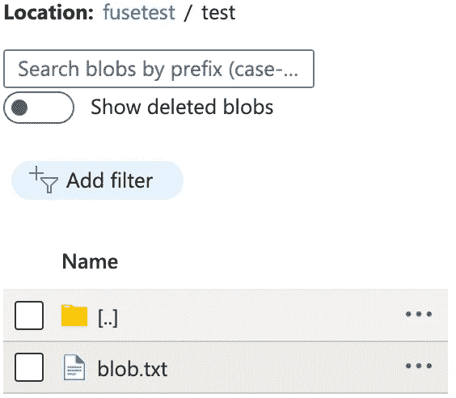
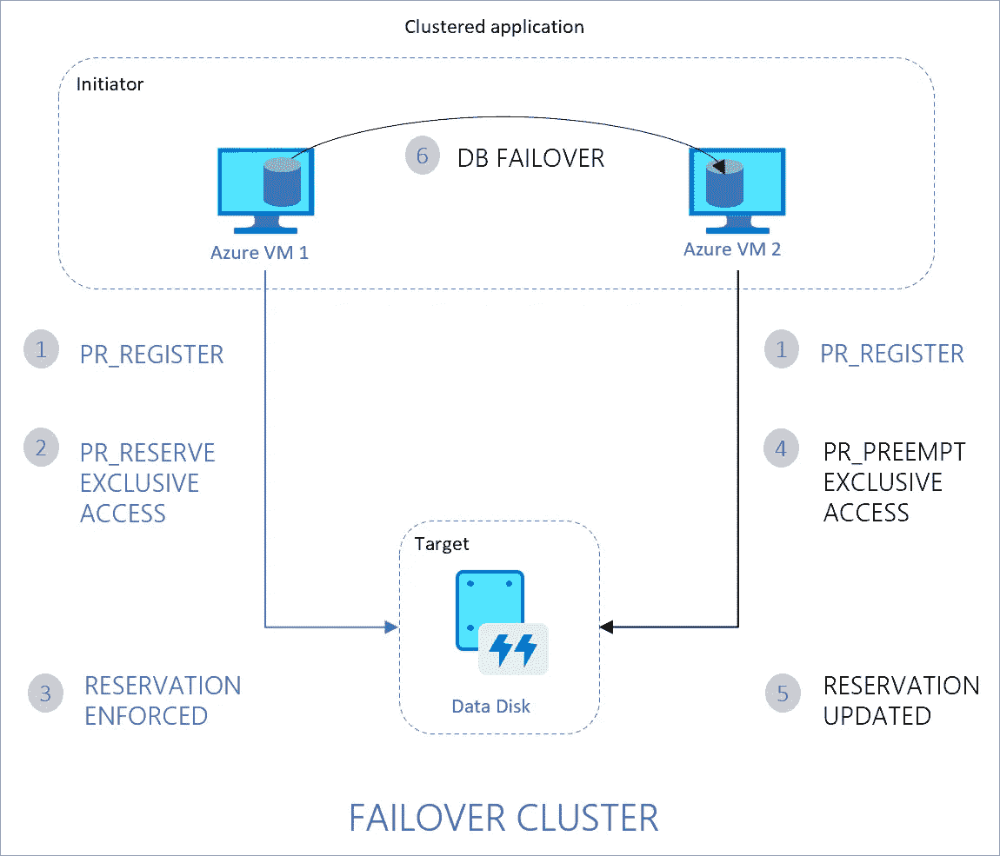
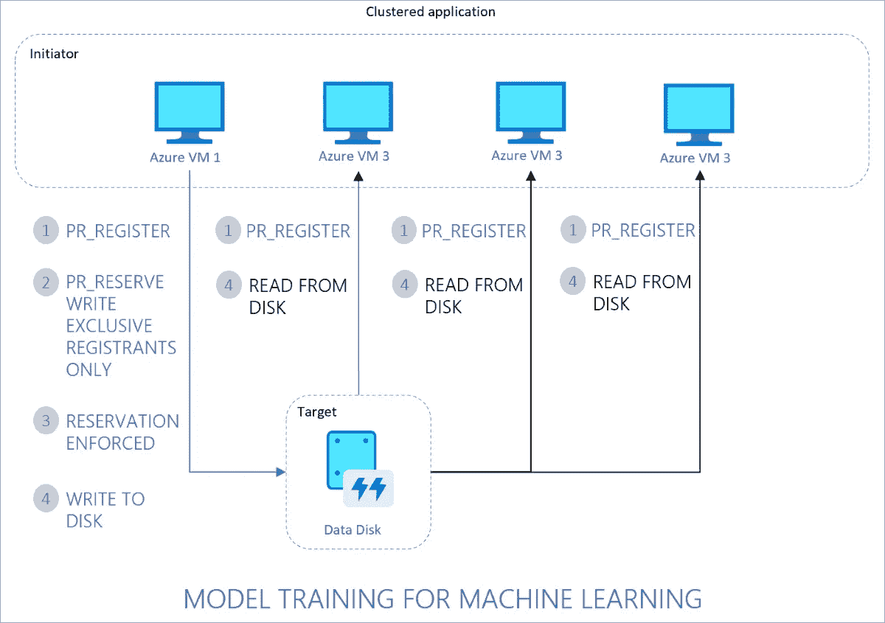
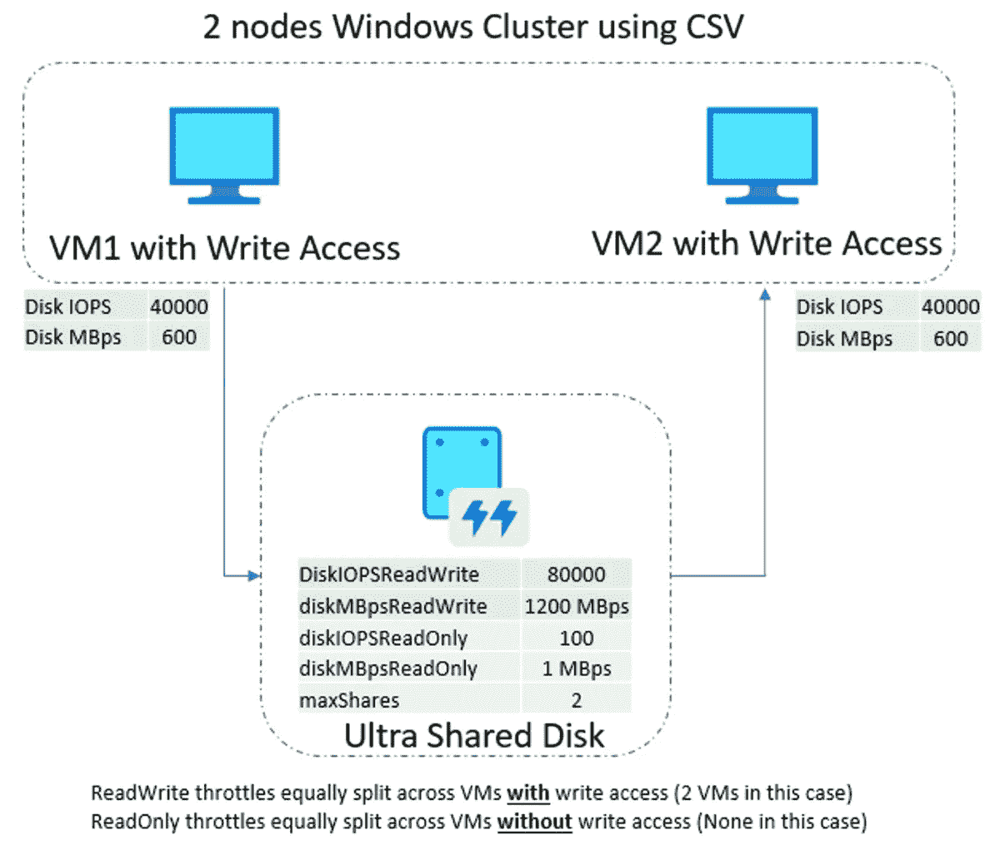

# Azure 存储

> 原文：<https://blog.devgenius.io/azure-storage-28840d735cdf?source=collection_archive---------4----------------------->

## 数据块存储、文件存储、对象存储、NFS/中小型企业、Linux 融合

本文作为主要云提供商提供的存储类型和我观察到的趋势的参考:使用 fuse 使“对象存储”成为“文件存储”

# 主要存储类型

## 块存储器

可启动和文件(需要操作系统来存储关于文件夹结构的元数据)、数据库、协议: [iSCSI 和光纤通道](https://www.educba.com/fc-vs-iscsi/)

## 文件存储器

分层文件夹中的唯一文件，用于多个设备/共享，协议:SMB，NFS

## 对象存储

扁平结构，丰富的元数据支持，协议:HTTP

直观地说，可以将“块存储”理解为“磁盘”，“文件存储”理解为文件共享，“对象存储”是基于云/HTTP 的存储

通常，所有主要的云提供商都支持这些类型的存储。这里有一篇好的[文章](https://www.isoftstoneinc.com/insights/articles/introduction-to-cloud-storage-azure-aws-and-gcp/)。以下是针对云的提及。

[](https://learn.microsoft.com/en-us/azure/architecture/aws-professional/storage) [## 比较 AWS 和 Azure 存储服务- Azure 架构中心

### 回顾 Azure 和 AWS 之间的存储技术差异。将 Azure Storage 与 S3、EBS、EFS 和 Glacier 进行比较。

learn.microsoft.com](https://learn.microsoft.com/en-us/azure/architecture/aws-professional/storage) [](https://learn.microsoft.com/en-us/azure/storage/common/storage-introduction) [## Azure Storage 简介-Azure 上的云存储

### Azure 存储平台是微软的云存储解决方案。Azure 存储提供高度可用、安全的…

learn.microsoft.com](https://learn.microsoft.com/en-us/azure/storage/common/storage-introduction) [](https://aws.amazon.com/blogs/storage/comparing-your-on-premises-storage-patterns-with-aws-storage-services/) [## 将您的内部存储模式与 AWS 存储服务进行比较| Amazon Web Services

### 许多公司希望迁移到云，对于大多数公司来说，迁移到云始于…

aws.amazon.com](https://aws.amazon.com/blogs/storage/comparing-your-on-premises-storage-patterns-with-aws-storage-services/) [](https://cloud.google.com/blog/topics/developers-practitioners/map-storage-options-google-cloud) [## 对象存储 vs 块存储 vs 文件存储:你应该选择哪个？|谷歌云博客

### 云存储是二进制和对象数据、blobs 和非结构化数据的对象存储。您通常会使用它…

cloud.google.com](https://cloud.google.com/blog/topics/developers-practitioners/map-storage-options-google-cloud) 

即使“对象存储”在云中非常流行，也有许多共享“文件存储”的用例(例如，多个计算实例需要访问同一个文件系统，例如加载机器学习模型、媒体文件等。).传统上，所有主要的云提供商都有类似文件共享的服务，例如 Azure files、AWS EFS、GCP 文件存储。然而，这通常意味着您需要将数据存储在不同的位置，例如对象存储和文件存储。您能否简化流程并维护一个数据存储库？你能把数据存储在“对象存储器”中，并把它们作为本地文件系统挂载吗？最近，我发现[保险丝](https://www.kernel.org/doc/html/latest/filesystems/fuse.html)来服务于这个目的。[蔚蓝](https://github.com/Azure/azure-storage-fuse)、 [AWS](https://cloud.netapp.com/blog/amazon-s3-as-a-file-system) 、 [GCP](https://www.cloudblogg.com/cloud/google-cloud-gcs-fuse-mounting-cloud-storage-buckets-as-filesystem-on-linux/) 都有类似的技术。还有，在 Azure 上，Azure 存储不断提高带宽，甚至比现在的 Azure 文件还要高。接下来我们将介绍 Azure blobfuse。

# Blobfuse

## 基本步骤

我们将使用 blobfuse v2，v1 信息是[这里是](https://learn.microsoft.com/en-us/azure/storage/blobs/storage-how-to-mount-container-linux)。

[](https://learn.microsoft.com/en-us/azure/storage/blobs/blobfuse2-how-to-deploy) [## 使用 BlobFuse 在 Linux 上挂载一个 Azure Blob 存储容器- BlobFuse2(预览)- Azure Blob…

### 本文向您展示了如何安装和配置 BlobFuse2，挂载 Azure blob 容器，以及访问

learn.microsoft.com](https://learn.microsoft.com/en-us/azure/storage/blobs/blobfuse2-how-to-deploy) 

安装 blobfuse v2

```
wget [https://github.com/Azure/azure-storage-fuse/releases/download/blobfuse2-2.0.0-preview.3/blobfuse2-2.0.0-preview.3-Ubuntu-22.04-x86-64.deb](https://github.com/Azure/azure-storage-fuse/releases/download/blobfuse2-2.0.0-preview.3/blobfuse2-2.0.0-preview.3-Ubuntu-22.04-x86-64.deb)
sudo apt-get install libfuse3-dev fuse3 -y
sudo dpkg -i blobfuse2-2.0.0-preview.3-Ubuntu-22.04-x86-64.deb
```

配置 blobfuse v2 缓存(blobfuse 使用缓存来加速重复的文件检索)

```
sudo mkdir /mnt/ramdisk
sudo mount -t tmpfs -o size=16g tmpfs /mnt/ramdisk
sudo mkdir /mnt/ramdisk/blobfuse2tmp
sudo chown <youruser> /mnt/ramdisk/blobfuse2tmp
```

创建装载文件夹

```
mkdir ~/mycontainer
```

使用 blobfuse repo 中的这个[配置文件](https://github.com/Azure/azure-storage-fuse/blob/main/sampleFileCacheConfig.yaml)来填充 config.yaml

```
# Refer ./setup/baseConfig.yaml for full set of config parametersallow-other: falselogging:
  type: syslog
  level: log_debugcomponents:
  - libfuse
  - file_cache
  - attr_cache
  - azstoragelibfuse:
  attribute-expiration-sec: 120
  entry-expiration-sec: 120
  negative-entry-expiration-sec: 240file_cache:
  path: /mnt/ramdisk/blobfuse2tmp
  timeout-sec: 120
  max-size-mb: 4096attr_cache:
  timeout-sec: 7200azstorage:
  type: block
  account-name: mystorageaccount
  account-key: mystoragekey
  endpoint: [https://mystorageaccount.blob.core.windows.net](https://mystorageaccount.blob.core.windows.net)
  mode: key
  container: mycontainer
```

使用 blobfuse 安装

```
blobfuse2 mount ~/mycontainer --config-file=./config.yaml
```

现在，您可以通过挂载的目录访问 Blob，并且可以在 Blob 中看到文件

```
cd ~/mycontainer
mkdir test
echo "hello world" > test/blob.txt
```



要卸载

```
blobfuse2 unmount ~/mycontainer
```

显示挂载

```
blobfuse2 mount list
```

在现代 Linux 中， [systemd](https://www.geeksforgeeks.org/linux-systemd-and-its-components/) 以一种健壮的方式管理服务，提供容错和正确的初始化。以下是 blobfuse 的 systemd 示例。

## 系统 d

[/etc/systemd/system/blob fuse 2 . service](https://github.com/Azure/azure-storage-fuse/blob/main/setup/blobfuse2.service)

```
Description=A virtual file system adapter for Azure Blob storage.
After=network.target[Service]# Configures the mount point.
Environment=BlobMountingPoint=<path/to/the/mounting/point>
# Config file path
Environment=BlobConfigFile=<path/to/the/config/file>
Type=forking
ExecStart=/usr/bin/blobfuse2 mount ${BlobMountingPoint} --config-file=${BlobConfigFile}
ExecStop=/usr/bin/blobfuse2 unmount ${BlobMountingPoint}[Install]
WantedBy=multi-user.target
```

启动系统 d 单元

```
sudo systemctl enable blobfuse2
sudo systemctl daemon-reload
sudo systemctl enable blobfuse2
sudo systemctl status blobfuse2
```

[](https://github.com/mikaelweave/blobfuse-automount/tree/master/etc) [## 主 mikaelweave/blobfuse-automount 上的 blobfuse-automount/etc

### 在 RHEL 系统启动时自动挂载 blobfuse 共享的方法

github.com](https://github.com/mikaelweave/blobfuse-automount/tree/master/etc) [](https://github.com/Azure/azure-storage-fuse/tree/c8fa8aab4936dcfc32254b8d4f1de818b45bb7ac/systemd/without-config-file) [## azure-storage-fuse/systemd/without-config-file at c 8 fa 8 aab 4936 dcfc 32254 b 8d 4 f1 de 818 b 45 bb 7 AC…

### 没有配置文件的 Azure 存储融合的 systemd 服务文件。下载 blobfuse.service 并放入…

github.com](https://github.com/Azure/azure-storage-fuse/tree/c8fa8aab4936dcfc32254b8d4f1de818b45bb7ac/systemd/without-config-file) 

如何让它更安全？您可以看到，我们的存储帐户密钥以纯文本形式存储在一个文件中。在文件中保密并不那么安全。虽然开发人员可以在 Azure Key Vault 中安全地存储秘密，但服务需要一种访问 Azure Key Vault 的方法。[托管身份](https://learn.microsoft.com/en-us/azure/active-directory/managed-identities-azure-resources/overview)在 Azure Active Directory 中为应用程序提供自动托管的身份，以便在连接到支持 Azure Active Directory (Azure AD)身份验证的资源时使用。应用程序可以使用托管身份来获取 Azure AD 令牌，而无需管理任何凭据。许多 [Azure 服务](https://learn.microsoft.com/en-us/azure/active-directory/managed-identities-azure-resources/managed-identities-status)支持托管身份，例如，你可以将托管身份分配给 Azure 虚拟机，然后虚拟机可以使用托管身份访问 Azure 资源(考虑不是虚拟机访问资源，而是一个特定的应用程序(因此多个虚拟机形成一个访问服务的应用程序))

## 使用托管身份

[](https://techcommunity.microsoft.com/t5/azure-paas-blog/mount-blob-storage-on-linux-vm-using-managed-identities-or/ba-p/1821744) [## 使用托管身份或带有 Blobfuse 的服务主体在 Linux VM 上装载 Blob 存储

### 场景:您希望在 Linux VM 上挂载 Azure Blob 存储容器，并使用托管的…

techcommunity.microsoft.com](https://techcommunity.microsoft.com/t5/azure-paas-blog/mount-blob-storage-on-linux-vm-using-managed-identities-or/ba-p/1821744) 

## 充当故障检修员

/var/log/blobfuse2.log

[](https://github.com/Azure/azure-storage-fuse/blob/main/TSG.md) [## azure-storage-fuse/TSG.md 位于主 Azure/azure-storage-fuse

### 尝试重现问题时，请确保在调试模式下打开日志记录。这在许多情况下有助于…

github.com](https://github.com/Azure/azure-storage-fuse/blob/main/TSG.md) 

## 其他 Azure 存储

[](https://www.nag.com/blog/optimizing-read-intensive-workloads-cost-azure-cloud) [## 优化 Azure 云上的读取密集型工作负载以降低成本

### 云存储服务格局很复杂，有各种各样的服务旨在优化以下方面的性能…

www.nag.com](https://www.nag.com/blog/optimizing-read-intensive-workloads-cost-azure-cloud) [](https://learn.microsoft.com/en-us/azure/storage/common/nfs-comparison) [## 比较 NFS 对 Azure 文件、Blob 存储和 Azure NetApp 文件的访问

### 比较 Azure 文件、Azure Blob 存储和 Azure NetApp 文件的 NFS 访问。

learn.microsoft.com](https://learn.microsoft.com/en-us/azure/storage/common/nfs-comparison) 

# 附录

块存储与文件存储

文件(NAS)与数据块(SAN)与对象云存储

[](https://www.datacore.com/blog/three-types-of-storage-block-file-object/) [## 文件存储与块存储和对象存储:3 种存储类型|数据核心

### “释放您的数据”或“数据的新愿景”听起来耳熟吗？这些来自存储领域的流行说法…

www.datacore.com](https://www.datacore.com/blog/three-types-of-storage-block-file-object/) [](https://www.redhat.com/en/topics/data-storage/file-block-object-storage) [## 文件存储、块存储还是对象存储？

### 文件、块和对象是以不同方式保存、组织和呈现数据的存储格式——每种格式都有自己的…

www.redhat.com](https://www.redhat.com/en/topics/data-storage/file-block-object-storage) [](https://qumulo.com/blog/block-storage-vs-object-storage-vs-file-storage/) [## 块存储、对象存储和文件存储:有什么区别？-库穆洛

### 在您能够有效地比较企业级存储解决方案之前，了解不同类型的…

qumulo.com](https://qumulo.com/blog/block-storage-vs-object-storage-vs-file-storage/) 

SAN 与 NAS

[](https://hypertecdirect.com/knowledge-base/nas-vs-san/) [## NAS 与 SAN

### NAS 与 SAN←所有主题在比较这两种流行的存储体系结构时，NAS 与 SAN 并不能说明全部情况…

hypertecdirect.com](https://hypertecdirect.com/knowledge-base/nas-vs-san/) [](https://azure.microsoft.com/en-us/products/storage/elastic-san) [## Azure 弹性 SAN(存储区域网络)|微软 Azure

### 利用相同的端到端体验和资源层次结构，在弹性 SAN 上轻松配置、管理和扩展工作负载…

azure.microsoft.com](https://azure.microsoft.com/en-us/products/storage/elastic-san) [](https://aws.amazon.com/blogs/storage/aws-san-in-the-cloud-millions-of-iops-and-tens-of-gb-s-to-any-amazon-ec2-instance/) [## 云中的 AWS SAN:到任何 Amazon EC2 实例的数百万 IOPs 和数十 GB/s | Amazon Web…

### 多年来，传统的内部部署应用程序一直依赖越来越强大(也越来越昂贵)的存储阵列…

aws.amazon.com](https://aws.amazon.com/blogs/storage/aws-san-in-the-cloud-millions-of-iops-and-tens-of-gb-s-to-any-amazon-ec2-instance/) [](https://learn.microsoft.com/en-us/azure/virtual-machines/disks-shared) [## 跨虚拟机共享 Azure 托管磁盘- Azure 虚拟机

### 适用于:✔️ Linux 虚拟机✔️ Windows 虚拟机✔️灵活规模集✔️统一规模集 Azure 共享磁盘是一项功能…

learn.microsoft.com](https://learn.microsoft.com/en-us/azure/virtual-machines/disks-shared) 

共享磁盘，用于 Windows/Linux 集群。共享托管磁盘本身不提供可以使用 SMB/NFS 访问的完全托管的文件系统。你需要使用一个集群管理器，比如 [Windows 服务器故障转移集群(WSFC)](https://learn.microsoft.com/en-us/azure/azure-sql/virtual-machines/windows/failover-cluster-instance-azure-shared-disks-manually-configure?view=azuresql) 或者 [Pacemaker](https://discourse.ubuntu.com/t/ubuntu-high-availability-corosync-pacemaker-shared-disk-environments/14874) ，来处理集群节点通信和写锁定。这些软件一般不支持 [NFS](https://kb.vmware.com/s/article/79616) 作为集群磁盘资源(因此，你必须让它表现为一个磁盘，多个虚拟机可以访问)。这是将本地集群应用程序提升和转移到云的一个好选择。

一次性写入(只有主虚拟机可以写入)



一次写入，多次读取(主虚拟机可以写入，辅助虚拟机只能读取)



主动-主动群集共享卷

