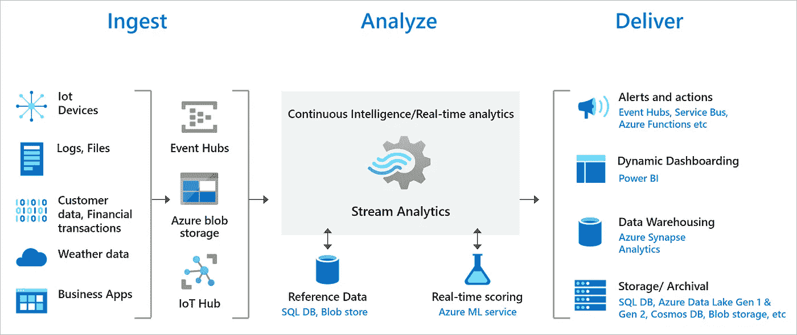
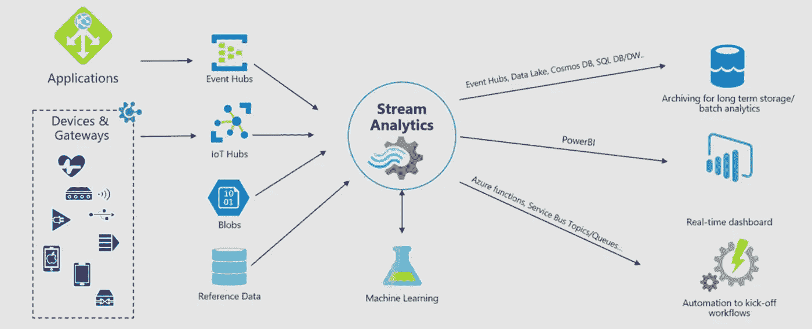

# Azure 流分析和异常检测

> 原文：<https://blog.devgenius.io/azure-streaming-analytics-and-anomaly-detection-3980d7bfbdf1?source=collection_archive---------4----------------------->

让我们来谈谈 Azure 的这个称为流分析的功能，以及如何在异常变成故障之前检测到它。

数据流是一组传入的非常短暂的数据，它不在传统的 SQL 数据库中。如果有，我们可以运行一个批处理作业，对该数据运行 SQL 查询，并从该数据中提取我们想要的任何信息。但是，如果我们的数据只是通过一个事件中心呢？
如果事情变得不寻常，我们如何运行查询、获取报告、发出警报？
所以我们有这个功能叫做**流分析。**

照片由[好的自由照片](https://unsplash.com/@goodfreephoto_com?utm_source=medium&utm_medium=referral)在 [Unsplash](https://unsplash.com?utm_source=medium&utm_medium=referral) 上拍摄

**流分析**是一个查询、警报和监控工具，它监控流而不是静态数据库。现在微软展示的用例是物联网解决方案。
比方说，如果我有一个手表或其他设备，我在世界上有数百万个这样的设备，它们反馈到 IOT 中心或常规活动中心。我们可能希望监控每秒数百万个事件，检测超出正常范围的事件，然后根据检测到的高于平均数量的数据发出警报或采取特定措施。

另一个例子，说有日志，因为人们访问我的网站，写日志与 200 个状态代码和他们正在查看什么资源。它只是状态代码和资源路径的连续数据流。那么，如果我可以像这样监控日志，并能够说如果在过去五分钟内发生了 20 个以上的 404/500 事件，我想通过发送 SMS 消息来发出警报。这是一个流的实时分析。

下图显示了如何将数据发送到流分析、分析以及发送用于存储或演示等其他操作:

来自微软的流分析

Azure stream analytics 是 Azure 上的一个完全托管的 pass 服务，它帮助我们使用非常简单的类似 SQL 的语言定义实时分析算法。它真的很便宜，我们可以从 0.11 美元/小时开始。

有两种不同的分析方法:
a .在事件发生时实时分析事件
b .批量分析

现在有了热路径分析，它将这些流作为事件截取，就像是在线路上一样，这样系统就可以在几秒钟内对周围环境中发生的事情做出反应和响应。

数据可以来自任何地方，如果我们正在管理数百个传感器和设备，并希望了解这些设备的状态，我们将数据发送到 IOT 中心。或者，如果我们想了解正在运行的应用程序的性质，我们会将数据发送到 Event Hub。流分析帮助我们从 IOT 中心或活动中心接收数据，然后对数据进行实时处理，并将其写入 SQL 数据库、数据湖、数据仓库等目标。用于更长时间的保留或稍后进行批量分析。
我们还可以使用 Push API 或 Power BI 创建实时仪表盘。如果检测到异常，它还有助于我们触发下游的行动。

## 基于内置机器学习的异常检测

流分析也有基于机器学习的异常检测模型，帮助我们检测异常，而无需真正编写机器学习算法。Azure stream analytics 的代码库中嵌入了内置模型，可以通过简单的函数调用来调用这些模型。

## 那么有什么优势呢？

使用流式分析有很多优势。
***低成本:*** 我们不必拥有异常检测机器学习编写这种算法的科学家不必为不同的机器学习服务付费。这些都嵌入到 Azure stream analytics 中，构建模型的整个复杂性，训练模型只是抽象出一个简单的函数调用。

和**明显性能更好**。

## **一个适用于各种数据的机器学习算法是怎样的？**

它是无监督学习模型，这意味着该模型不需要任何预先训练，它从开始读取的数据中学习。因此，我们可以告诉模型，在它真正开始评分之前，要从如此多的事件中学习。自然界中的每个系统都有不同的数据分布，因此非常重要的一点是，模型的出现不需要对数据的样子有任何先入为主的概念，它从数据中学习，然后开始对下一组数据点进行评分。

这是一个惊人的图表来形象化整个画面

来自微软的流分析