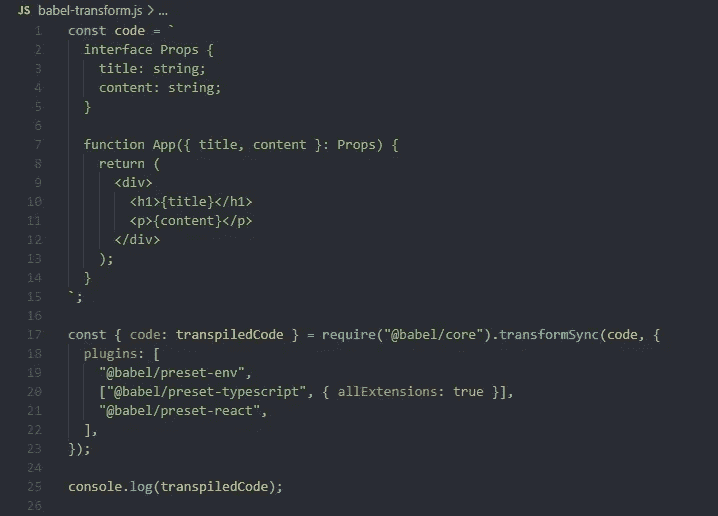

# Babel transpilation — React，TypeScript，ES5

> 原文：<https://blog.devgenius.io/babel-transpilation-react-typescript-es5-873bae456230?source=collection_archive---------8----------------------->

Babel 允许开发人员编写更容易阅读的代码，并将其传输给浏览器。在这篇文章中，我将通过使用三个预置来分享 transpilation 的输出。

*   env — *@babel/preset-env*
*   react — @babel/preset-react
*   typescript—*@ babel/preset-typescript*

带有预置的 babel 代码翻译:env，typescript，react

# @babel/preset-env

这个预置允许使用最新的 JavaScript 语法，代码是透明的，所以旧的浏览器可以理解它。

下面是编写和编译代码的例子。

书面代码:

如果没有@babel/preset-env，则传输到:

代码没有被编译，这是因为没有使用预置。

但是，如果使用此预设，输出如下:

# @babel/preset-typescript

此预设添加了对 TypeScript 的支持。下面是编写和编译代码的例子。

书面代码:

传输代码:

# @babel/preset-react

如果你已经用 react 工作了一段时间，你会不断听到

> 哦，这只是 JSX 语法，没什么特别的，但它不是 HTML，只是看起来像。

这是什么？

在浏览器中，我们可以包含 react cdn 构建。这是通过 html 脚本标签完成的。

通过 cdn 添加和使用 react 的示例:

如果你使用过“创建-反应-应用程序”,你会对下面的代码很熟悉。

但是，此预设会将其转换为以下内容:

Transpiled 代码看起来很熟悉，就像 cdn 示例中的代码。这是因为 react-jsx 被转换成浏览器可以理解的代码。

要进一步理解什么是 React.createElement，使用它是一个很好的起点。

# 结论

在我们的日常工作中，大多数情况下不需要这些知识，但是了解我们使用的工具会有很大帮助。

完整的可运行代码可以在这里找到[https://github . com/srele 96/sk-experiments/tree/develop/JavaScript/experiments/babel-trans pilation](https://github.com/srele96/sk-experiments/tree/develop/javascript/experiments/babel-transpilation)