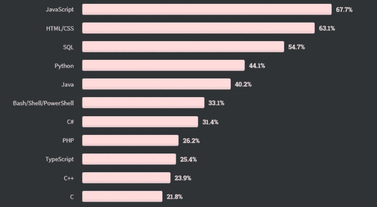
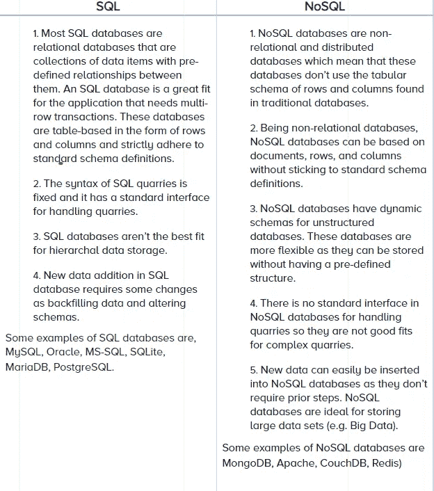

# 代码骑士的巴布肯·d·分享他作为 SQL 开发人员的故事

> 原文：<https://blog.devgenius.io/babken-d-of-coderiders-shares-his-story-as-sql-developer-fbcd2ac9b4ba?source=collection_archive---------5----------------------->

我们继续对代码骑士的软件开发人员进行一系列的采访。这一次，我们采访了我们的一位资深软件开发人员巴布肯·达尔宾扬。他会谈到:

*●* SQL 域特定语言

*●*SQL 的优缺点

*●*SQL 与 NoSQL 的差异

*●* 分享他的个人故事

巴布肯与 [CodeRiders](https://www.coderiders.am/) 一起走过了漫长的旅程。正如我们的许多追随者所知，我们的软件外包公司最初成立于 2013 年，是一所软件开发学校。仅在一年之内，该校就招收了 800 多名校友，巴布肯是 2014 年成立 CodeRiders 软件开发公司的 15 名校友之一。自从巴布肯成为 CodeRiders 的重要团队成员以来，他一直与我们一起迎接新的挑战，促进我们公司的卓越发展。

**-嗨，巴布肯。很高兴有机会和你交谈。首先，请告诉我们的读者 SQL 的主要用途，它的重要性，以及您作为 CodeRiders 软件开发公司的 SQL 开发人员的主要任务？**

-谢谢你的面试邀请。SQL(结构化查询语言)是一种特定于领域的编程语言，可用于数据库。无论您使用哪种类型的软件，无论是电子商务、多媒体、金融、房地产、人力资源、电子学习还是健康技术，您都需要使用、存储和管理数据，而这正是 SQL 能够提供帮助的地方。它就像数据库的通信器和关系数据库管理系统的标准语言。我们使用 SQL 语句来更新数据库中的数据或从数据库中检索数据。这一点至关重要，因为 SQL 无处不在。几乎所有的大型企业都使用 SQL，如网飞、优步、Instagram、Airbnb、Quora、推特。由于它对数据库系统的巨大影响，它将会一直存在，并且现在和将来都会被包含在顶级编程语言的图表中。

*除了巴布肯的答案之外，让我们声明根据* [*StackOverflow 调查*](https://insights.stackoverflow.com/survey/2019) *，SQL 是 IT 世界第三大流行语言。*

**-感谢您提供的详细信息。现在，请你谈谈 SQL 的优点和缺点好吗？**

- SQL 是一种用户友好的特定于域的语言。您使用 SQL 来访问、操作数据库以及与数据库通信。最重要的 SQL 函数包括:

*●* 从数据库中检索数据

*●* 创建新数据库

*●* 数据和数据库的操作(插入、删除、更新)

*●* 数据测试

SQL 有许多优点，这些优点使我使用这种语言的日常工作变得快速、方便和更实用，例如:

*●* 更快更高效的数据检索过程。像插入、删除和数据操作这样的功能几乎很快就能完成

*●* 大量的表格行

*●* 单个查询中的大量交易

*●* SQL 是可移植的，这意味着它可以用于 PC、服务器、笔记本电脑、各种操作系统中的程序，并且可以根据需要或要求嵌入其他应用程序

*●* SQL 是一种交互式语言，这意味着它易于学习和理解

像任何其他技术一样，SQL 也有一些缺点。积极的一面是，它们不会影响我的工作效率。为了公平起见，让我也向您介绍一下 SQL 的缺点

*●* 数据结构是预定义的，并且不太灵活，无法进一步更改

*●* 它是纵向可扩展的，这意味着没有机会向资源池添加更多的机器

*●* 有时由于隐藏的业务规则，我们对数据库有部分控制权

**-有 SQL 的替代品吗？如果有，是哪些？**

我认为最著名和最广泛使用的 SQL 替代品是 NoSQL。有时候，开发人员更喜欢 NoSQL 而不是 SQL，因为这两者相辅相成。我的意思是您可以使用 NoSQL 来消除 SQL 的上述缺点，反之亦然。更准确地说，我们可以通过表格展示 SQL 和 NoSQL 的主要区别和优缺点。

列举一些你最喜欢的 SQL 语言，以及促使你使用这种语言的东西。

-我最喜欢 SQL 的一点是，在 SQL 开发过程中，没有枯燥、机械的问题解决方案。每次，我都应该想出新的解决方案，这需要不断的思考和分析。我喜欢挑战。它们不仅提高了我的技能，还让我对我日常使用的应用程序有了更多的了解。开发 SQL 不是简单地处理关系数据库中的公司数据；而是从云存储到电子学习、电子商务应用和社交媒体账户的一切。

**-告诉我们您在使用 SQL 的过程中遇到的最大挑战是什么？**

-通常，在开发报表时，您已经有了需要在代码中实现的计算逻辑。在我以前的项目中，我面临的情况是，我们以前存储的不是逻辑描述，而是 MySQL 过程。我们必须进行调查，并用新的数据库和新的代码来匹配它。这对我来说是一个挑战，但正如我提到的，我喜欢挑战，并为成功克服挑战而自豪。

每个职业和工作都需要特定的技能。在你看来，一个完美的 SQL 开发者应该具备哪些特性？

-嗯，SQL 开发人员肯定需求量很大，因为公司对实施数字化转型战略和成为数据驱动型组织感兴趣。我认为，一个优秀的 SQL 开发人员首先应该能够自如地完成以下任务，其次应该享受完成这些任务的过程:

*●* 设计数据库表和结构

*●* 创建视图、函数和存储过程

*●* 为自动化创建数据库触发器

*●* 维护数据质量和安全

*●* 编写优化的采石场，用于与其他应用程序集成

SQL 开发人员当然应该掌握更多其他编程语言的技能。例如，如果你在用 C#或 C++编写的应用程序上工作，如果你也知道这些语言就更好了。另一方面，如果你使用 MySQL，你当然应该有 PHP 的经验和知识，或者至少对。NET 框架会有用的。

继续阅读 CodeRiders 博客上的文章。单击下面的链接

 [## CodeRiders 的 Babken D .分享了他作为 SQL 开发人员的故事

### 我们继续采访 CodeRiders 的软件开发人员。这次我们采访了我们的一位学长…

www.coderiders.am](https://www.coderiders.am/blog/babken-d-of-coderiders-shares-his-story-as-sql-developer)