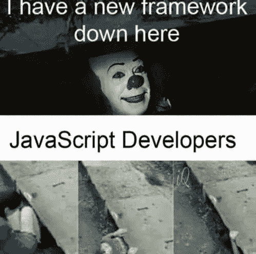

# Web 开发人员的小步骤

> 原文：<https://blog.devgenius.io/baby-steps-for-a-web-developer-bf549dedbce0?source=collection_archive---------0----------------------->

你在计算机科学的所有领域都是新手吗？你想通过更少的学习快速得到结果吗？几个月前我也是这样，老实说，web 开发的最初成果令人震惊。我痛苦地意识到开发不仅仅局限于在浏览器上展示漂亮的东西。它还包括编写链接无数页面和样式的代码的艰苦过程，大多数时候，这些代码都不能一起工作。这是关于挫折的部分开始，这个博客是关于对抗这一点，这样你的学习过程就不会受到阻碍。我们会陪你走到最后。

首先，web 开发基本上就是将事物联系在一起。如果你学会了如何将页面相互链接，将样式链接到页面，将数据库链接到代码，你就对事物有了相当的了解。因此，试着理解 HTML 页面如何链接到 JavaScript 或 Python 或 PHP 中的代码。然后，你必须理解 CSS 或者引导样式到 HTML 页面的链接。最后，尝试弄清楚所有这些最终是如何连接到数据库的。它类似于我们下面看到的:

**前端(HTML/CSS)——>客户端代码(用 React/Angular/jQuery 做的很酷的东西)——>服务器端代码(PHP/Node/Django/Ruby)——>数据库(MySQL/MongoDB/PostgreSQL)**

以上给了你制作一个 web 应用程序的完整堆栈。问题是有数百万家公司使用不同的堆栈，一般来说，开发者必须习惯所使用的技术。堆栈的一个例子是**均值堆栈:MongoDB、Express、Angular 和 Node.js.**

附注:括号中的技术绝不是所有可用的技术。

每个人都从前端的 HTML、CSS 开始，然后进入后端的 PHP、MySQL 和其他形式的脚本语言。这听起来一定很容易，但问题是，没有人知道先学习哪种技术。JavaScript 是一种通常在 web 开发中使用的语言，用于创建具有很酷功能的动态网页。有一个陷阱！只有当你对这门语言有了一定的了解之后，酷的东西才开始出现。一旦这样做了，你就可以开始学习无数的用特定语言构建的框架，在这里是 JavaScript。Angular 和 React 是一些值得学习的前端框架。我建议使用 React，因为它在最近几年的流行程度已经超过了所有其他前端框架。趋势表明，它将更加了解市场，使用它的公司数量每天都在增加。

说到后端，这也给了开发者无数的选择。有很多像 **ruby on rails 这样的新技术，都是用 ruby 写的；用 python 写的 django 和用 JavaScript 写的 node。一些人仍然喜欢用古老的 PHP 编写服务器端代码，用 MySQL** 编写数据库。我用 MEN(MongoDB，Express，Node)开发了我的第一个应用程序，并且理解了 JavaScript 的回调语法的错误，这首先是不可能的，然后是一种乐趣。你只需要读这么多。就像难懂的英语单词，一开始就没有意义。一旦你打开字典几次或者谷歌一下，你会在第十次、第二十次或者第一百次的时候找到它。在人类的知识中，没有任何发明是人类无法理解的。

**不看文档**！每种功能、框架或语言都有 1000 页的文档来帮助开发者正确开发。虽然这是一个很好的练习，但对于像我这样的新手来说，感觉是白费力气。我从 YouTube 上收集了所有我需要的知识和动力，然后一头扎进去。你可以试着做同样的事情，但是如果你想阅读文档，请继续。(那让你在我眼里好不酷。抱歉不抱歉。:))

当你决定使用哪种技术时，我建议你搜索一个合适的免费课程或项目，使用所有这些技术，并尝试用分号和括号复制它们的代码。听起来毫无创意？所有的学习都是这样开始的。有人曾经告诉我，“**在开始学习一件事的时候作弊不是作弊**”。一旦你完成了一个项目，继续想出你想做的东西。它可能是一个投资组合网站(同样，每个人都这样做)，一些具有通用功能的应用程序或一个可爱的游戏。去做吧。不要放弃！你得做些你想做的东西。

我相信你现在已经得到了所有你需要的初学者信息。现在就开始制作你的第一个丑陋的网站或应用程序吧(试试看！).当你编写并实现了你理解的代码，并且可以通过搜索来修复 bug 时，你就可以称自己为 web 开发者了。呜哇！现在没那么难了，是吗？