# 后台:开发者门户概述

> 原文：<https://blog.devgenius.io/backstage-a-developer-portal-overview-99dc1fed27d6?source=collection_archive---------1----------------------->

## 一个强大的开源开发者门户平台

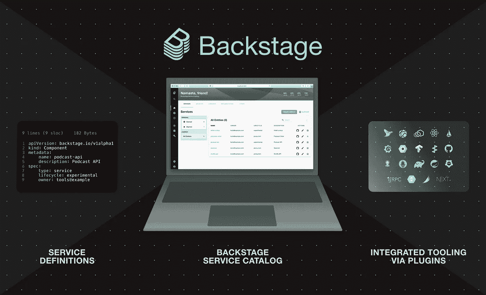

后台

# 1.什么是开发者门户？

开发者门户是一个内部网站，帮助开发者了解和使用他们的服务、工具和文档。它包含了开发人员可能需要的所有信息和工具，并使其易于搜索和访问。**开发者门户帮助开发者快速、高效、愉快地工作。**

## 1.1 为什么我们需要开发人员门户？

随着团队的成长，**更多的服务、工具和文档被创建**。搜索、发现和使用我们已经建立的一切是一个巨大的挑战。开发人员经常四处打听信息。一切都慢了下来。

开发人员门户的出现是为了**通过帮助开发人员发现、访问和使用服务、工具和文档来解决复杂性并增加开发人员的幸福感**。

# 2.后台是什么？

[后台](https://backstage.io/)是一个强大的开源开发者门户平台。[后台](https://www.getport.io/blog/backstage-all-you-need-to-know-about-this-developer-portal)为**提供了一个单一的 UX 层**并且**统一了你所有的服务、文档、API 和工具**来帮助工程师**发现和理解**公司所有的软件**所有权**，部署，以及**依赖性**。


## 2.1 核心功能

开箱即用，后台包括:

*   [后台软件目录](https://backstage.io/docs/features/software-catalog/software-catalog-overview)用于管理您的所有软件(服务、库、网站等)。)
*   [Backstage TechDocs](https://backstage.io/docs/features/techdocs/techdocs-overview) 使用“像代码一样的文档”方法，使创建、维护、查找和使用技术文档变得容易
*   [后台软件模板](https://backstage.io/docs/features/software-templates/software-templates-index)用于快速启动新项目，并根据组织的最佳实践标准化您的工具
*   此外，[开源插件](https://github.com/backstage/backstage/tree/master/plugins)的生态系统不断发展，进一步扩展了 Backstage 的可定制性和功能

## 2.2 好处

*   对每个人来说，这是一种单一、一致的体验，将您所有的服务、工具、资源、文档和所有者集中在一个地方。
*   对于平台工程师来说，它通过让你轻松集成新的工具和服务(通过插件)来实现**可扩展性和可伸缩性**。
*   对于工程经理来说，它允许您维护整个组织的标准和最佳实践，并可以帮助您管理整个技术生态系统。

# 3.后台主要功能

# 3.1 后台软件目录

后台软件目录是一个**集中式**系统，**跟踪你的生态系统中所有软件(服务、网站、库、数据管道等)的所有权和元数据。**目录是围绕元数据 **YAML 文件**构建的，这些文件与应用程序代码存储在一起。这些都是在后台收获和可视化的。

软件目录支持两种主要使用情形:

1.  **帮助团队管理和维护他们自己的软件。团队得到所有软件的统一视图；**服务、图书馆和网站——凡是你能想到的，后台都知道。
2.  **使您公司中的所有软件及其所有者都可以被发现。**

## 目录实体的屏幕截图

## [不同的实体](https://demo.backstage.io/catalog?filters%5Bkind%5D=component&filters%5Buser%5D=owned)

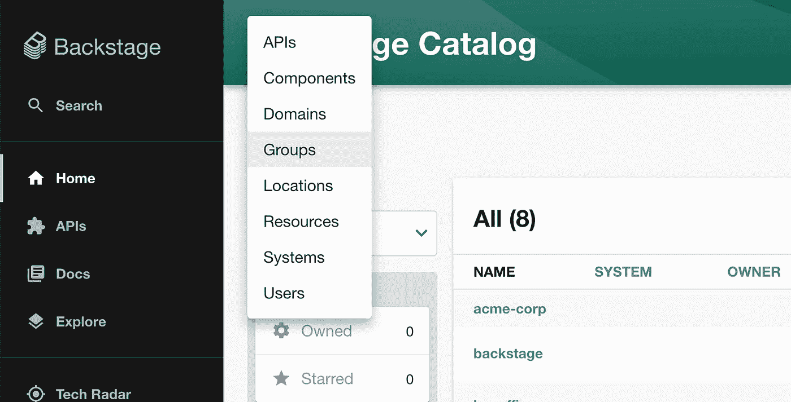

## [系统型号](https://backstage.io/docs/features/software-catalog/system-model)

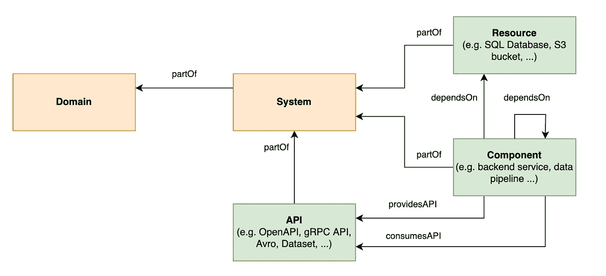

*   资源是运行系统所需的物理或虚拟基础设施
*   组件是软件的一部分
*   API 是不同组件和系统之间的界限
*   系统封装了 API 的实现
*   **域**是系统的高级分组

## [**组**](https://demo.backstage.io/catalog?filters%5Bkind%5D=group&filters%5Buser%5D=all)

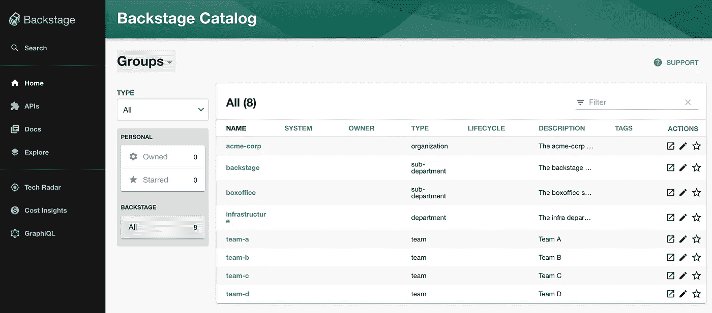

## [a 组/团队](https://demo.backstage.io/catalog/default/group/team-a)

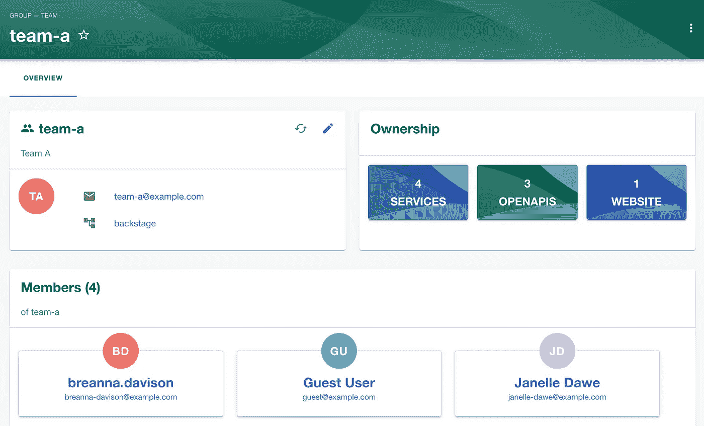

## [服务/艺术家-查找](https://demo.backstage.io/catalog/default/component/artist-lookup)

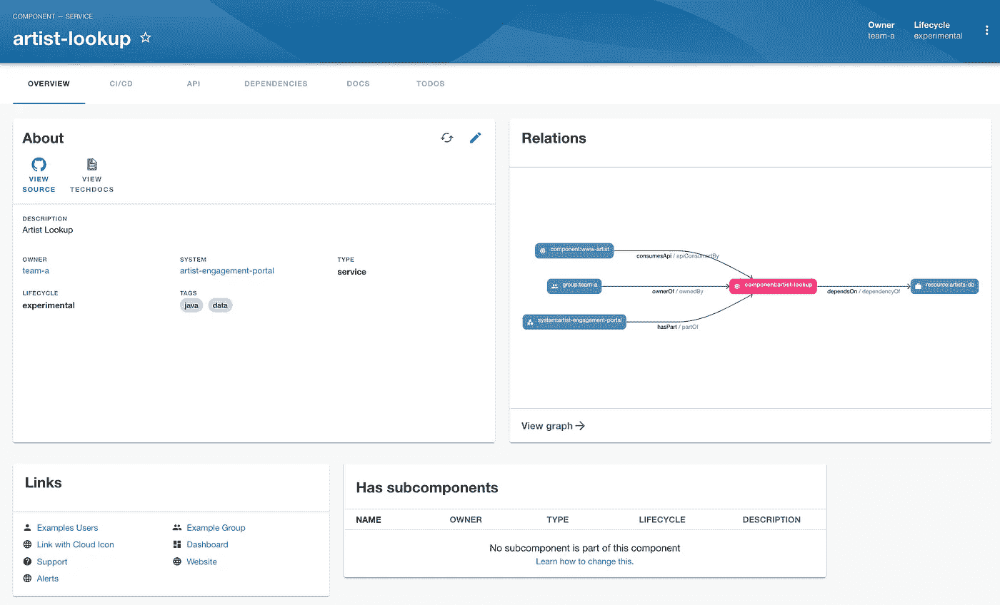

# 3.2 后台技术文档文档

TechDocs 是一个直接内置于后台的类似 T4 文档的解决方案。工程师将他们的文档**写在 Markdown 文件中，这些文件与他们的代码**放在一起——只需很少的配置就可以在后台得到一个好看的文档站点。

TechDocs 的真正优势在于文档与代码一起保存在文件中。每个变更都通过**Git 流程**进行管理和记录——最后更新、贡献者、代码评审、自动化测试、所有者、Github 问题等。文档然后以 HTML 格式显示，以便通过 Backstage 的 Markdown 文件进行搜索和编辑。

## 特征

*   从 Backstage Catalog 中的服务页面查找您的服务的技术文档。
*   通过编写 Markdown 创建文档和网站。
*   搜索和查找文档。
*   探索并利用 [MkDocs 插件](https://www.mkdocs.org/user-guide/plugins/)的大生态系统，创造丰富的阅读体验。

## 截图

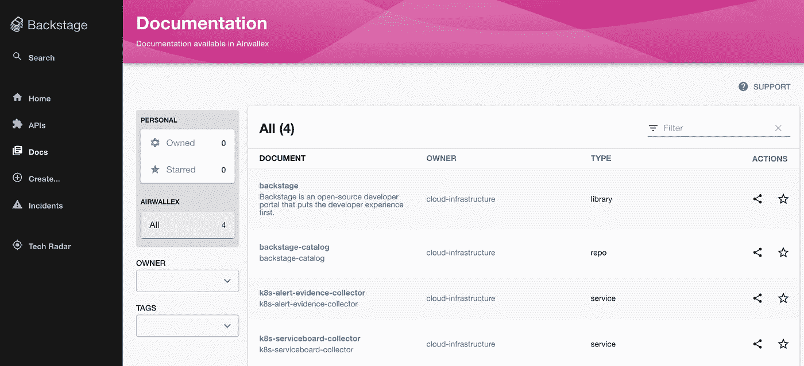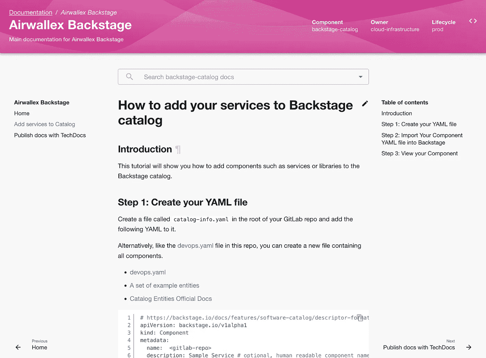

## 3.2.3 如何使用 TechDocs 发布您的文档

*   在你的库的根目录下创建一个`**mkdocs.yml**`文件
*   **创建一个`**docs/**`文件夹和一个`**index.md**`文件**
*   **更新组件的实体`**annotations**`**

```
annotations:
    **backstage.io/techdocs-ref**: **url**:[https://gitlab.com/](https://gitlab.awx.im/common/backstage-catalog)xxxx
```

# **3.3 API 文件**

**[API Docs](https://github.com/backstage/backstage/blob/master/plugins/api-docs/README.md) 是 catalog 插件的扩展，为**发现和显示 API 实体提供组件。**API 以机器可读的格式定义，并提供人类可读的文档。**

**该插件提供了一个独立的 API 列表，并集成到一个目录实体的 API 选项卡中。**

**目前，支持以下 API 格式:**

*   **OpenAPI 2 & 3**
*   **[AsyncAPI](https://www.asyncapi.com/docs/specifications/latest/)**
*   **[图表 QL](https://graphql.org/learn/schema/)**

**其他格式显示为纯文本，但这很容易扩展。**

## **截图**

**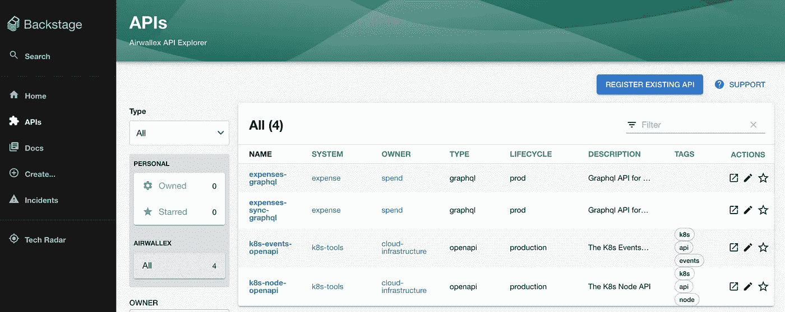****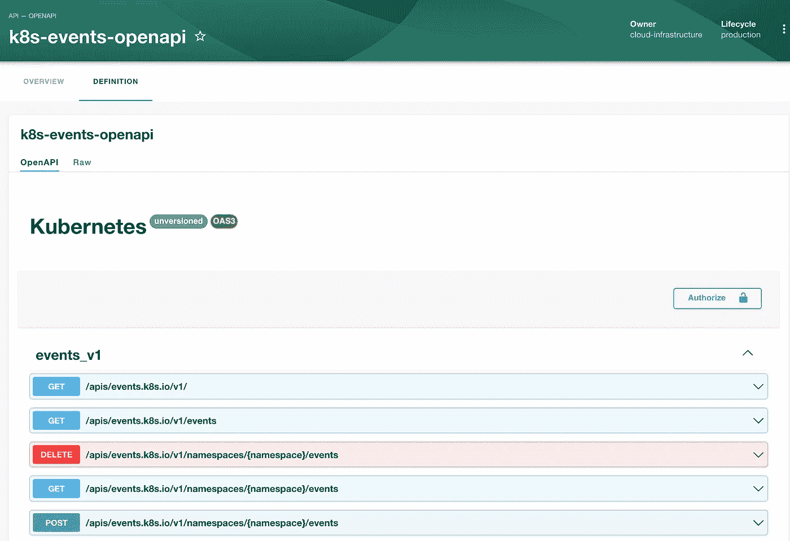****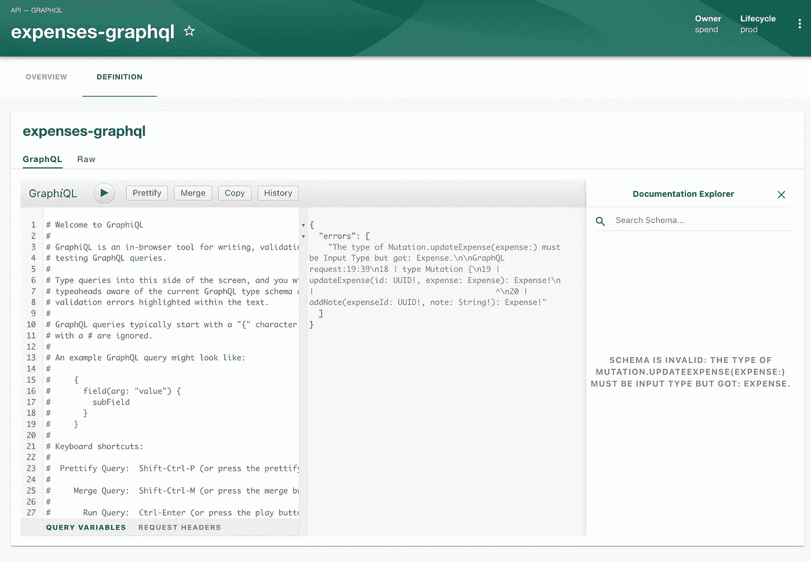**

## **3.3.2 API YAML 文件和定义**

**使用以下 YAML 文件创建 API 实体。**

```
**apiVersion**: backstage.io/v1alpha1
**kind**: API
**metadata**:
  name: k8s-events-openapi
  description: The K8s Events API
  links:
    - url: [https://github.com/kubernetes/kubernetes/tree/master/api/openapi-spec/v3](https://github.com/kubernetes/kubernetes/tree/master/api/openapi-spec/v3)
      title: Kubernetes's OpenAPI Specification
      icon: GitHub
**spec**:
  type: openapi
  lifecycle: production
  owner: cloud-infrastructure
  system: k8s-tools
  **definition**:
    $**text**: [**https://raw.githubusercontent.com/kubernetes/kubernetes/master/api/openapi-spec/v3/apis__events.k8s.io__v1_openapi.json**](https://raw.githubusercontent.com/kubernetes/kubernetes/master/api/openapi-spec/v3/apis__events.k8s.io__v1_openapi.json)
```

# **3.4 后台软件模板**

**[软件模板](https://backstage.io/docs/features/software-templates/software-templates-index)是一个允许你定义软件模板来创建新软件项目的工具。默认情况下，它能够加载代码框架，在一些变量中模板，然后将模板发布到一些位置，如 GitHub 或 GitLab。**

**模板定义 YAML 见[此处](https://backstage.io/docs/features/software-catalog/descriptor-format#kind-template)。**

**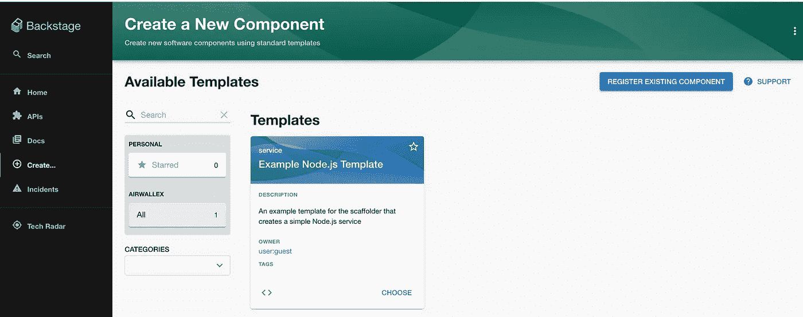****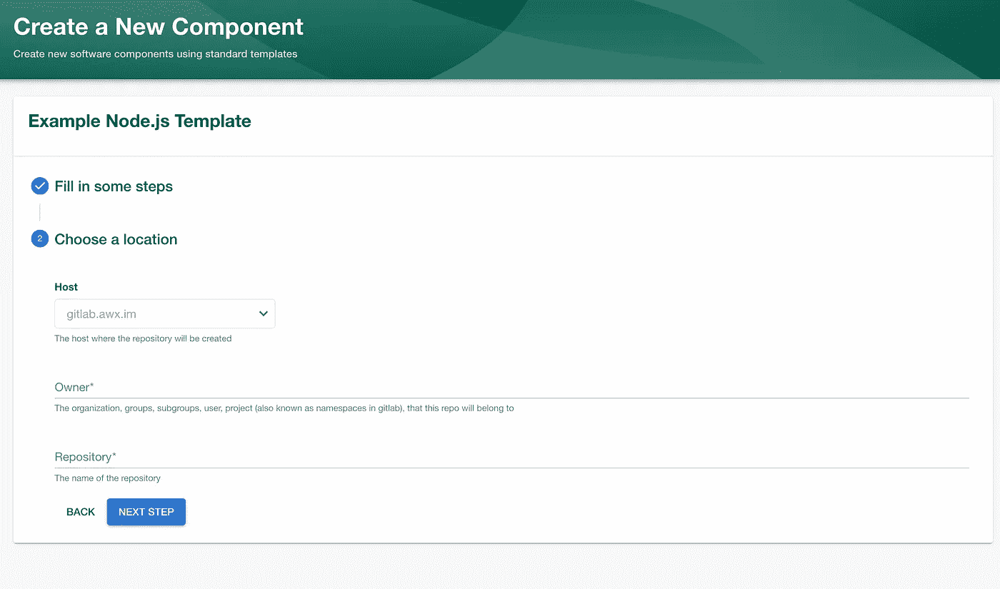**

# **4.后台插件**

**后台是**一个由**一组插件组成的单页应用**。****

**插件是 React 组件和可选的 Node.js 微服务。也有可能构建我们自己的插件。**

# **4.1 插件市场**

**开源插件可以在:[https://backstage.io/plugins](https://backstage.io/plugins)找到。
现在大概有 80 个插件。**

**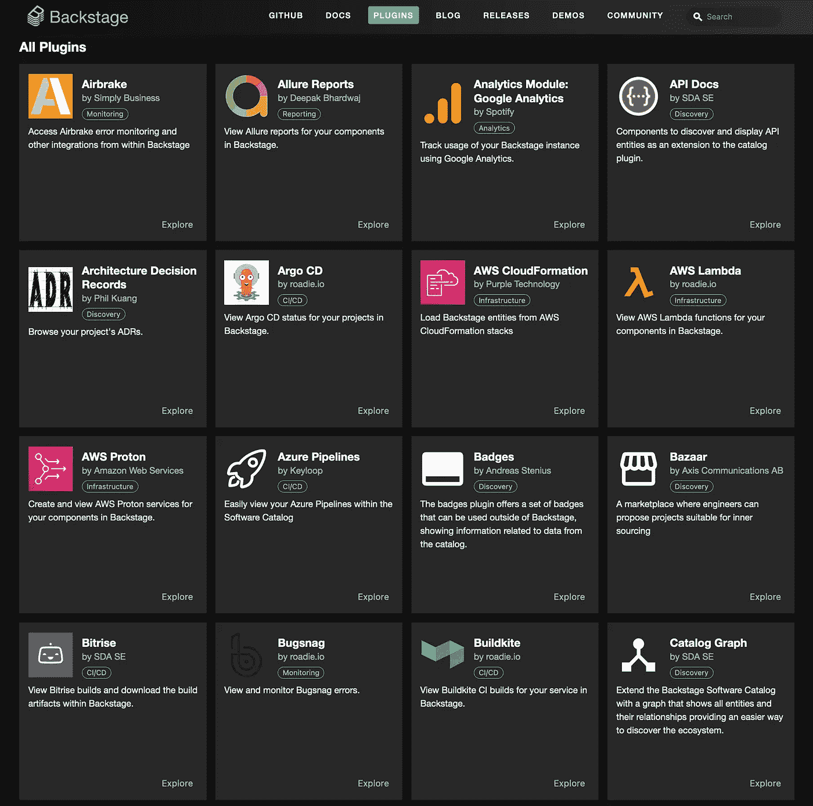**

# **4.2 技术雷达的后台插件。**

**可视化公司软件开发不同领域的官方指南，如语言、框架、基础设施和过程。**

**[技术雷达](https://github.com/backstage/backstage/tree/master/plugins/tech-radar)让我们能够想象我们使用的技术的广度，并对我们应该收敛或远离的技术发表意见。**

**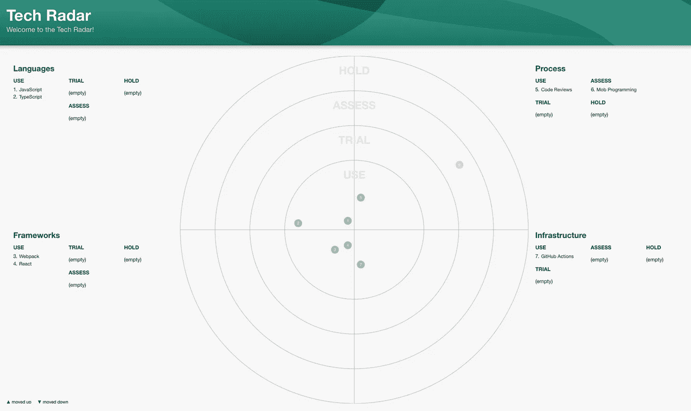**

# **4.3 git lab 的后台插件**

**通过 [Gitlab 插件查看 GitLab 管道、合并请求、语言和贡献者。](https://github.com/loblaw-sre/backstage-plugin-gitlab)**

**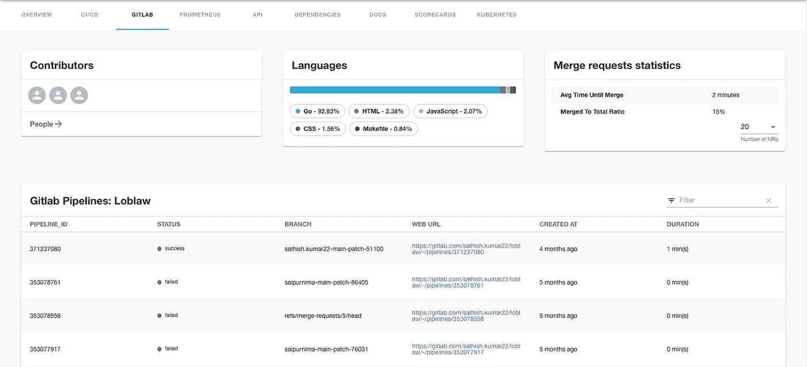****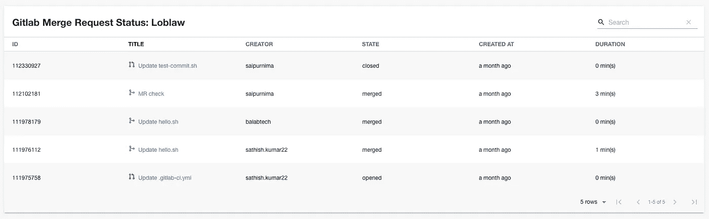**

## **特征**

*   **列出项目的前 20 个版本**
*   **列出项目的前 20 个合并请求**
*   **查看项目的参与者**
*   **查看项目使用的语言**
*   **查看项目的管道状态**
*   **合并请求统计信息**

# **4.4 ops genie 的后台插件**

**[Opsgenie 插件](https://github.com/K-Phoen/backstage-plugin-opsgenie)提供了一种将警报与组件相关联并可视化事件的简单方法。**

## **特征**

*   **查看当前正在通话的人员的摘要**
*   **查看和搜索活动警报列表，并选择直接从 Backstage 确认或关闭警报**
*   **查看和搜索事件列表**
*   **查看事件相关分析**

## **截图**

*   ****谁在通话页面****

**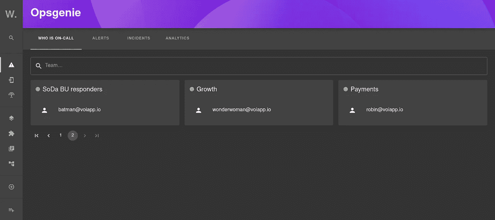**

*   ****警报页面****

**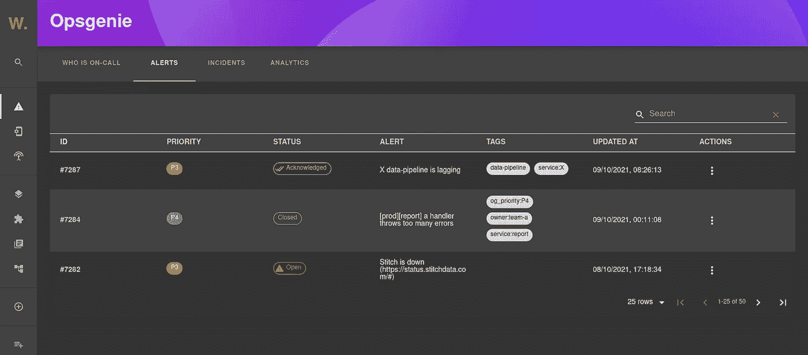**

# **5.结论**

**Backstage 是一个很棒的开发者门户。它将允许我们通过一组易于使用的插件有效地实现可视化层和自助服务层。**

**然而，为了让开发者门户满足所有开发者的特定需求，我们将不得不**编写大量的类型脚本和反应代码**来开发 **UI 组件。****

# **6.参考**

*   **【https://backstage.io/ **
*   **[后台现场演示现场](https://demo.backstage.io/catalog?filters%5Bkind%5D=group&filters%5Buser%5D=all)**
*   **后台插件:[https://backstage.io/plugins](https://backstage.io/plugins)**
*   **[https://front side . com/blog/2022-05-16-what-is-Spotify-backstage/](https://frontside.com/blog/2022-05-16-what-is-spotify-backstage/)**
*   **[https://www . get port . io/blog/back stage-all-you-need-to-know-on-this-developer-portal](https://www.getport.io/blog/backstage-all-you-need-to-know-about-this-developer-portal)**