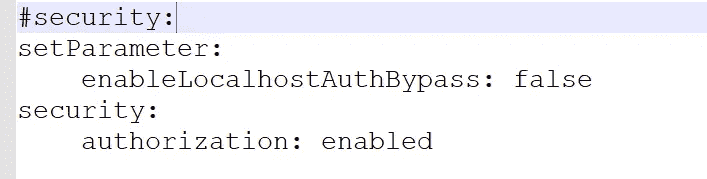

# 备份和恢复 MongoDB 数据库(。gz)使用 C#进行用户名/密码验证和不验证。网

> 原文：<https://blog.devgenius.io/backup-and-restore-mongodb-database-gz-d4871b8f5059?source=collection_archive---------3----------------------->

# 介绍

我们将使用。NET 6 和 MongoDB 5.0.5。请参见下面的 GitHub 资源库，了解最新的评论和更多内容。

# 支持

为了备份 MongoDB 数据库，我们需要使用 [mongodump](https://docs.mongodb.com/database-tools/mongodump/#:~:text=mongodump%20is%20a%20utility%20for,line%2C%20not%20the%20mongo%20shell.) ，这是一个用于备份 MongoDB 数据库的命令行实用程序。我们可以使用下面的 C#。NET 方法和 appsettings.json 来完成。

使用身份验证时，我们需要设置 appsettings.json 中的三个属性

```
"MongoDBUser": "user","MongoDBPassword": "password","MongoDBAuthenticationDatabase": "admin"
```

方法签名本身看起来像这样

```
public void BackupDatabase(string databaseName, string localDatabasePath, bool withAuthentication = false)
```

它接受一个数据库名和保存该数据库的路径，您还可以选择使用身份验证。

# 未经认证

如果没有使用 mongodump 进行身份验证，最终的命令将如下所示。-d 指定备份哪个数据库，— gzip 告诉 mongodump 使用 gzip，而— archive 指定保存备份的位置。

```
mongodump -d database --gzip --archive=backup.gz
```

# 带身份验证

在 mongodump 中使用身份验证时，最后的命令将如下所示。这个与上面的非常相似，增加了—用户名和—认证数据库。

```
mongodump -d database --gzip --archive=backup.gz --username user --authenticationDatabase admin
```

使用身份验证时，请确保您的 mongod.cfg 文件在#security: set 下具有以下值。



mongod.cfg 在 Windows 上的默认位置如下(用您的版本替换 5.0)。

```
C:\Program Files\MongoDB\Server\5.0\bin
```

在这种情况下，我们使用“admin”作为身份验证数据库。确保使用以下命令添加一个与上述 appsettings.json 文件中的值相匹配的用户，从命令行上的 mongo 开始。

首先，使用 mongo 进行连接(首先通过省略或注释掉#security:下的值来禁用身份验证)

```
mongo
```

通过以下命令使用管理数据库。

```
use admin
```

然后，使用下面的命令添加一个用户，指定您的用户名、密码和角色。完成后重新启动服务。

```
db.createUser(
 {
  user: "admin", 
  pwd: "password", 
  roles: [
   {
    role: "userAdminAnyDatabase", 
    db: "admin" 
   }, 
   "readWriteAnyDatabase"
  ]
 }
)
```

mongodump 在运行 mongodb-backup-with-auth.bat 文件时会询问密码，所以我们确保用下面的 C#代码处理它。

```
if (withAuthentication){ arguments += $" {options.Value.MongoDBUser} {options.Value.MongoDBAuthenticationDatabase}"; startInfo.RedirectStandardInput = true;}// ... 
// Execute the command and when it asks, if we're using authentication, give it the passwordif (withAuthentication){ process.StandardInput.WriteLine(options.Value.MongoDBPassword);
}
```

# 恢复

为了恢复 MongoDB 数据库，我们需要使用 [mongorestore](https://docs.mongodb.com/database-tools/mongorestore/) ，这是一个用于恢复 MongoDB 数据库的命令行实用程序。我们可以使用下面的 C#。NET 方法和 appsettings.json 文件来完成它。

方法签名如下所示

```
public void RestoreDatabase(string localDatabasePath, bool withAuthentication = false)
```

它接受到。我们正在恢复的 gz 备份文件，并且可以选择使用上述相同的方法进行身份验证。

# 未经认证

如果没有使用 mongorestore 进行身份验证，最终的命令将如下所示。— drop 告诉 mongorestore 在恢复之前删除数据库，— gzip 告诉 mongorestore 使用 gzip，而— archive 指定本地。要恢复的 gz 数据库文件。我们正在恢复的数据库的名称(因此将被删除)是从。gz 文件。

```
mongorestore --drop --gzip --archive=backup.gz
```

# 带身份验证

使用 mongorestore 进行身份验证后，最终的命令将如下所示。这个命令与上面的命令非常相似，只是增加了— username 指定哪个用户，以及— authenticationDatabase 告诉 mongorestore 使用哪个身份验证数据库。确保这些值与上面备份下的身份验证说明相匹配。

```
mongorestore --drop --gzip --archive=backup.gz --username user --authenticationDatabase admin
```

# GitHub 知识库

要查看整个项目、使用方法和示例，请点击下面的链接查看 GitHub 资源库。

[https://github.com/joemoceri/database-toolkit](https://github.com/joemoceri/database-toolkit)