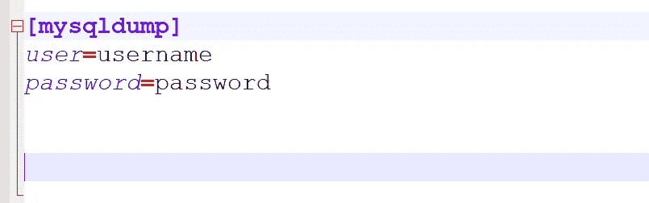
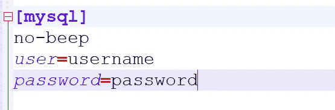

# 备份和恢复 MySQL 数据库(。sql)使用 C#。网

> 原文：<https://blog.devgenius.io/backup-and-restore-mysql-database-sql-using-c-net-203c28abcda4?source=collection_archive---------3----------------------->

# 支持

为了备份一个 MySQL 数据库，我们首先需要知道服务器上数据库的名称以及本地保存它的路径。考虑下面的方法和 appsettings.json。

我们需要使用 mysqldump 的命令行工具来创建数据库备份。为了使用 C#实现这一点。NET 中，我们需要使用[进程](https://docs.microsoft.com/en-us/dotnet/api/system.diagnostics.process?view=net-6.0)类，并将[文件名](https://docs.microsoft.com/en-us/dotnet/api/system.diagnostics.processstartinfo.filename?view=net-6.0)设置为 appsettings.json 中设置的 MySqlDumpPath 属性

```
startInfo.FileName = options.Value.MySqlDumpPath;
```

我们传递默认文件，所以不需要使用-u 或-p 开关作为用户名和密码。当使用 Process 类运行进程时，不能使用< and >，幸运的是 [mysqldump 支持-r 开关，我们可以使用它来代替>](https://dev.mysql.com/doc/refman/5.7/en/mysqldump.html) 。

```
startInfo.Arguments = $@"--defaults-file=""{options.Value.MySqlDefaultsFilePath}"" {databaseName} -r {localDatabasePath}";
```

为了实现这一点，您需要确保更新您的缺省文件。在 Windows 上，my.ini 的路径如下。

```
C:\ProgramData\MySQL\MySQL Server 8.0\my.ini
```

打开该文件，确保在[mysqldump]下放置用户名和密码以及连接时要使用的凭证。



最终的 mysqldump 命令将如下所示。

```
C:\Program Files\MySQL\MySQL Server 8.0\bin\mysqldump.exe --defaults-file="C:\ProgramData\MySQL\MySQL Server 8.0\my.ini" sakila -r C:\backups\sakila.sql
```

之后，我们指定了一些关于进程的标志，这样它就不会创建命令窗口，也不会使用 shell execute。我们首先调用 [Start](https://docs.microsoft.com/en-us/dotnet/api/system.diagnostics.process.start?view=net-6.0) ，然后调用 [WaitForExit](https://docs.microsoft.com/en-us/dotnet/api/system.diagnostics.process.waitforexit?view=net-6.0) ，这样我们就不会提前终止进程，然后[关闭](https://docs.microsoft.com/en-us/dotnet/api/system.diagnostics.process.close?view=net-6.0)进程。

```
startInfo.CreateNoWindow = true;startInfo.UseShellExecute = false;process.StartInfo = startInfo;process.Start();process.WaitForExit();process.Close();
```

它将在 localDatabasePath 中指定的位置创建一个. sql 文件。

# 恢复

为了恢复一个 MySQL 数据库，我们需要服务器上数据库的名称和我们要恢复的数据库的本地路径。考虑下面的方法，使用与上面相同的 appsettings.json。

这个方法遇到了上面关于在流程参数中使用

首先，我们将进程的文件名设置为。bat 文件' mysql-restore.bat '。

在文件内部，我们需要使用变量，所以我们的命令看起来像这样。

出于上述同样的原因，这里我们可以省略-u 和-p 标志。确保用您的用户和密码更新您的默认文件[【MySQL】组](https://dev.mysql.com/doc/refman/8.0/en/option-files.html)。



第一个和第三个参数应该加引号来处理包含空格的路径，第二个参数是数据库的名称，不应该加引号。

```
startInfo.Arguments = $@"""{options.Value.MySqlDefaultsFilePath}"" {databaseName} ""{localDatabasePath}""";
```

最终的恢复命令如下所示。

```
mysql --defaults-file="C:\ProgramData\MySQL\MySQL Server 8.0\my.ini" sakila < "C:\backups\sakila.sql"
```

之后，我们运行与上面相同的方法来启动并等待进程退出。

```
startInfo.CreateNoWindow = true;startInfo.UseShellExecute = false;process.StartInfo = startInfo;process.Start();process.WaitForExit();process.Close();
```

一旦命令运行完毕，数据库将在服务器上恢复。

# GitHub 知识库

要查看整个项目，请查看 GitHub 资源库。

https://github.com/joemoceri/database-toolkit