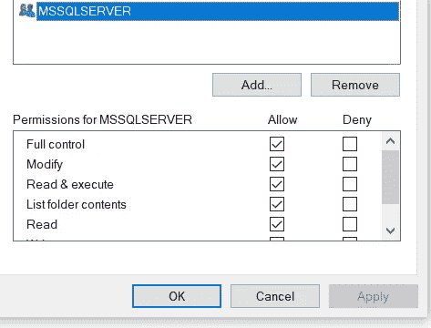

# 备份和还原 SQL Server 数据库(。bak)使用 C#。网

> 原文：<https://blog.devgenius.io/backup-and-restore-sql-server-database-bak-using-c-net-4f3a848d15d?source=collection_archive---------1----------------------->

# 支持

要备份 SQL Server 数据库，我们需要知道数据库的名称以及我们要在本地保存它的路径。

考虑下面的方法和 appsettings.json

这里发生了一些事情。该方法有两个参数:databaseName(服务器上要备份的数据库的名称)和 localDatabasePath(可选，默认为 null)。如果 localDatabasePath 为空，将使用 appsettings.json 文件中指定的 SQL Server 的 basePath(SqlServerBasePath)。注意这是 MSSQL 的基本目录。localDatabasePath 将如下所示(其中“Database”是指定的数据库名称):

```
C:\Program Files\Microsoft SQL Server\MSSQL15.MSSQLSERVER\MSSQL\Backup\Database.bak
```

localDatabasePath 必须以. bak 结尾，如果指定 localDatabasePath，请确保 NT Service\MSSQLSERVER 帐户有权保存备份。



被执行的 T-SQL

```
BACKUP DATABASE @databaseNameTO DISK = @localDatabasePathWITH FORMAT,MEDIANAME = @formatMediaName,NAME = @formatName
```

接受四个参数:databaseName，数据库的名称；localDatabasePath，保存备份的位置，包括名称。formatMediaName 和 formatName，它们是从 databaseName 自动生成的。我们在这里使用 WITH FORMAT，这样它将覆盖所有数据。这样做时要小心。请参见 Microsoft 文档中的以下内容:

[“使用](https://docs.microsoft.com/en-us/sql/relational-databases/backup-restore/create-a-full-database-backup-sql-server?view=sql-server-ver15#TsqlProcedure) `[BACKUP](https://docs.microsoft.com/en-us/sql/relational-databases/backup-restore/create-a-full-database-backup-sql-server?view=sql-server-ver15#TsqlProcedure)` [语句的格式子句时要格外小心，因为这会破坏先前存储在备份介质上的任何备份。”](https://docs.microsoft.com/en-us/sql/relational-databases/backup-restore/create-a-full-database-backup-sql-server?view=sql-server-ver15#TsqlProcedure)

# 恢复

要恢复 SQL Server 数据库，我们需要数据库名称和数据库路径。我们要还原的 bak 文件。

考虑下面的方法(使用与上面相同的 appsettings.json)

当恢复数据库时，我们将指定。mdf 和。除了。bak 位置。在 appsettings.json 内部有一个指向 SQL Server 本地安装的 SQLServerBasePath。

```
C:\Program Files\Microsoft SQL Server\MSSQL15.MSSQLSERVER\MSSQL
```

从这里我们可以构建路径/数据/。mdf|。使用 SQLServerBasePath 的 ldf。使用 localDatabasePath 和下面的查询，我们可以从。bak 文件。这给了我们在构建到。mdf 和。ldf 文件。

```
RESTORE FILELISTONLY FROM DISK = @localDatabasePath
```

当从查询中读取结果时，为了获得正确的值，您必须检查“类型”。

```
var type = reader["Type"].ToString();
```

如果类型是“D ”,则逻辑名称是。mdf，如果是“L”型，那就是。ldf，此处指定为。

现在我们可以恢复数据库了。要无缝地做到这一点，我们首先需要将数据库设置为 SINGLE_USER，并终止任何可能导致恢复失败的活动连接。传入 databaseName 参数，我们必须使用动态 SQL 来运行该语句，因为在 ALTER DATABASE 中指定数据库名称时，SQL Server 不允许使用变量名。

```
declare @database varchar(max) = quotename(@databaseName)EXEC('ALTER DATABASE ' + @database + ' SET SINGLE_USER WITH ROLLBACK IMMEDIATE')
```

在运行 restore 命令之前，我们需要一些变量。

```
// start with the base path and add DATA
var dataPath = Path.Combine(options.Value.SqlServerBasePath, "DATA");// Use the dataName for the mdf
var fileListDataPath = Path.Combine(dataPath, $"{fileListDataName}.mdf");// Use the logName for the ldf
var fileListLogPath = Path.Combine(dataPath, $"{fileListLogName}.ldf");
```

接下来，我们需要运行实际的恢复命令。

```
RESTORE DATABASE @databaseNameFROM DISK = @localDatabasePathWITH REPLACE,MOVE @fileListDataName to @fileListDataPath,MOVE @fileListLogName to @fileListLogPath
```

给定数据库名称、本地数据库路径、文件列表数据名称、文件列表日志名称以及它们的路径，使用路径{本地数据库路径}替换(WITH REPLACE 表示它将覆盖现有的数据库，[来恢复数据库{databaseName}，在使用此处说明的内容时要小心，因为它将覆盖适当的检查以防止数据丢失](https://docs.microsoft.com/en-us/sql/t-sql/statements/restore-statements-transact-sql?view=sql-server-ver15#REPLACEoption))，同时指定移动的位置。mdf 和。ldf 文件。

这样做之后，我们需要将数据库设置回 MULTI_USER，所以让我们运行以下命令

```
declare @database varchar(max) = quotename(@databaseName)EXEC('ALTER DATABASE ' + @database + ' SET MULTI_USER')
```

# GitHub 存储库

要查看整个项目，请查看 GitHub 存储库。

[https://github.com/joemoceri/database-toolkit](https://github.com/joemoceri/database-toolkit)