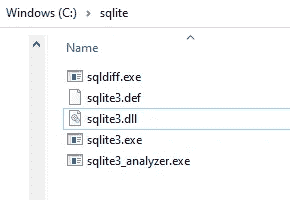
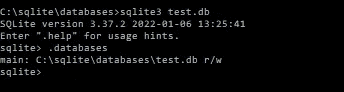

# 备份和恢复 SQLite 数据库(。db)使用 C#。网

> 原文：<https://blog.devgenius.io/backup-and-restore-sqlite-database-db-using-c-net-bbe25a428cdf?source=collection_archive---------6----------------------->

# 介绍

我们将使用 SQLite 版本 3.37.2 和。NET 6+。请参见下面的 GitHub 资源库，了解最新的评论和更多内容。

确保[下载](https://www.sqlite.org/download.html) SQLite 和命令行工具包。将这些文件存储在计算机上的某个位置，并将它们添加到您的路径中。我把我的放在 C:\sqlite，你的应该看起来像下面的截图。



我们将使用 [sqlite3](https://sqlite.org/cli.html) 命令行实用程序来备份和恢复。

# 支持

让我们从 C#开始。网络方法

当使用 localDatabasePath 时，我们需要确保使用 double \而不是 one，并在传递给 sqlite-backup.bat 文件时用双引号将它们括起来。我们用的是。NET 的[进程](https://docs.microsoft.com/en-us/dotnet/api/system.diagnostics.process?view=net-6.0)类来执行。bat 档。

最终的备份命令将如下所示(注意参数上的双斜线。备份命令)。这两个参数都是该方法的输入，只做了一些调整，处理 sqlite3 中的\ when，并用双引号将这两个参数括起来以处理路径。

```
sqlite3 "C:\path\to\your\database\database.db" ".backup \"C:\\database.backup.db\""
```

我们正在使用[点命令。sqlite3](https://sqlite.org/cli.html) 附带的备份。我们在这里所做的是连接到位于 database.db 的数据库，然后发出. backup 命令，告诉它将备份存储在 database.backup.db。默认情况下，在选择要备份的数据库时使用 main，因此由于我们连接到 database.db，所以这就是 main。一旦使用 dot 命令，如果打开命令提示符并输入 sqlite3，以 database.db 作为参数，就可以看到这一点。数据库列出所有数据库，您连接的数据库将被列为“主数据库”。

在下面的目录中给定一个名为 test.db 的数据库文件，您会看到 test.db 作为 main 列出。



之后，您将看到备份保存在 localDatabasePath 中指定的路径下。接下来，我们可以使用这个备份来恢复我们的数据库。

# 恢复

为了恢复数据库，我们可以从下面的 C#开始。网络方法

这种方法与备份非常相似，只是我们使用了不同的方法。bat 文件，并处理相同的问题。

最终的恢复命令将如下所示

```
sqlite3 "C:\path\to\your\database\database.db" ".restore \"C:\\database.backup.db\""
```

该命令与 backup 非常相似，只是这次我们使用的是 dot 命令。restore 而不是. backup。使用与上述相同的逻辑，这将连接到 database.db，然后它会将 database.db 列为主数据库，当我们恢复时，我们默认使用 main，它将使用 database.backup.db 文件并覆盖它。一个简单的方法是创建一个备份，用原始数据修改一些数据，然后恢复备份。

之后，您会看到修改的更改消失了，原始数据恢复了。

# GitHub 知识库

要查看整个项目、如何使用它以及示例，请点击下面的链接查看 GitHub 资源库。

[https://github.com/joemoceri/database-toolkit](https://github.com/joemoceri/database-toolkit)