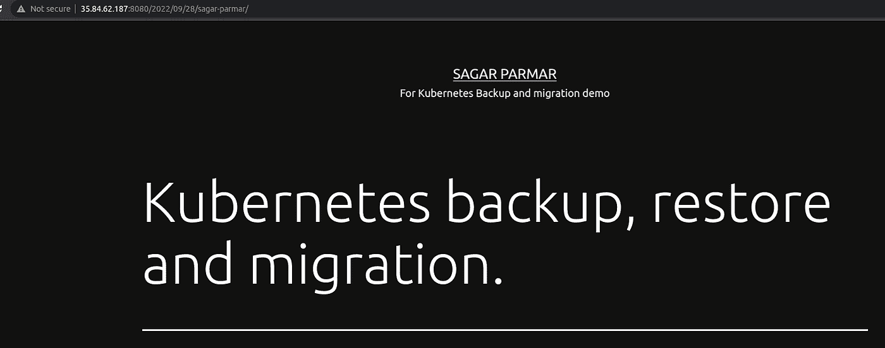

# 使用 Velero 备份、恢复和迁移 Kubernetes 集群资源。

> 原文：<https://blog.devgenius.io/backup-restore-and-migrate-kubernetes-cluster-resources-using-velero-a9b6997e4b54?source=collection_archive---------4----------------------->

# 介绍

Kubernetes 已经成为每个组织处理微服务的事实上的选择。组织将它用于任务关键型应用程序，并且迫切需要备份应用程序及其相关数据。

数据的备份和恢复是非常重要的一部分。如果有备份，您可以从任何灾难中快速恢复。在这篇博文中，我们将讨论使用 Velero 备份和恢复 Kubernetes 资源。

Velero 是一个开源工具，用于备份和恢复 Kubernetes 集群中运行的资源。Velero 使用 Kubernetes API 发现功能来收集要备份的数据。Velero 可以执行手动备份和自动备份、恢复、灾难恢复，将资源和 PV 从一个集群迁移到另一个 Kubernetes 集群。

在本教程中，我们将指导您备份在源 Kubernetes 集群中运行的资源，还将指导您将该备份迁移到目标集群。

# 先决条件

*   2 个版本相同的 Kubernetes 集群已经启动并运行，我们在本教程中也会解释迁移。
*   您可以对这两个 Kubernetes 集群运行 kubectl 命令。
*   一个 AWS IAM 用户，拥有访问密钥和秘密密钥，并拥有在 AWS S3 存储桶中放置和获取对象的权限。
*   在 AWS S3 上创建一个存储桶来存储备份。
*   迁移前，清除源集群中的异常 pod 资源。如果 pod 处于异常状态，并且安装了 PVC，则在群集迁移后，PVC 将保持挂起状态。

对于本教程，我们已经创建了两个 Kubernetes 集群(源和目标)。在源集群上，我们的 WordPress 应用程序正在运行，在目标集群上，我们将移动并恢复 WordPress 应用程序的备份。

# 韦莱罗建筑


韦莱罗的建筑表现。

在上面的架构图中，有两个 Kubernetes 集群源和目标。velero 控制器部署在两个集群上。Velero CLI 安装在可以访问源和目标 Kubernetes 集群的本地机器上。因此，我们可以从本地机器访问 velero 控制器。AWS S3 是存储位置，用于存储从源 Kubernetes 集群获取的备份。备份以 tar 格式存储在 S3 上。

## **Velero 安装:**

Velero 使用备份位置来执行备份和恢复集群。备份位置可以是 AWS S3、Azure Blob 存储或任何 S3 兼容存储。在本教程中，我们将使用 **AWS S3** 来备份和恢复集群数据。

在您当前的工作目录中创建一个名为“*凭证*的文件，并将 AWS 访问密钥和密码粘贴到该文件中。确保使用先决条件中提到的可以访问 AWS S3 的凭据。

```
[default]
aws_access_key_id = AKXXXXXXXXXXXXXXXT
aws_secret_access_key = bXXXXXXXXXXXXXXXXXXXXz
```

现在我们的凭证文件已经创建，让我们在本地机器上安装 Velero CLI。首先，我们需要下载 Velero 的 tar 文件。

```
wget [https://github.com/vmware-tanzu/velero/releases/download/v1.9.2/velero-v1.9.2-linux-amd64.tar.gz](https://github.com/vmware-tanzu/velero/releases/download/v1.9.2/velero-v1.9.2-linux-amd64.tar.gz)
```

成功运行上述命令后，Velero 将下载到您当前的目录中。正如您所看到的，下载的文件是 tar 格式的，让我们来解压缩 tar 文件。

```
tar -xvf velero-v1.9.2-linux-amd64.tar.gz
```

一旦您的文件被解压缩，将 Velero 移动到“/usr/local/bin/”目录。

```
sudo mv velero-v1.9.2-linux-amd64/velero /usr/local/bin/
```

要检查 velero 版本，请运行以下命令。

```
velero version client-only
```

您将得到这样的输出。

```
Client:
 Version: v1.9.2
 Git commit: 82a100981cc66d119cf9b1d121f45c5c9dcf99e1
```

现在，velero 安装在我们的本地机器上。让我们在 Kubernetes 集群中部署 velero，为此运行以下命令。

```
velero install \
 — provider aws \
 — plugins velero/velero-plugin-for-aws:v1.4.1 \
 — bucket sagar-backup-pv \
 — secret-file ./credentials \
 — use-volume-snapshots=false \
 — use-restic \
 — backup-location-config region=us-west-2
```

在上面的命令中，“**Sagar-backup-PV**”**是我们为本教程创建的 AWS S3 存储桶的名称，“**凭证**”是我们存储 AWS 凭证以访问 AWS S3 存储桶的文件的名称，“ **us-west-2** ”是 AWS 存储桶的位置。该命令将在 Kubernetes 集群上安装所有 velero 组件。**

*****#确保针对两个集群运行该命令。*****

## **注释:**

**如果您需要备份 pod 中存储卷的数据，请向 pod 添加注释。注释模板如下所示:**

```
kubectl annotate <pod/pod_name> backup.velero.io/backup-volumes=<volume_name>  -n <namespace>
```

**如果有多个卷连接到 pod，您可以像这样添加注释，并且只有在命令中指定的卷名将被用于备份。**

```
kubectl -n <namespace> annotate <pod/pod_name> backup.velero.io/backup-volumes=<volume_name_1>,<volume_name_2>,…
```

*   ****<名称空间>**:pod 所在的名称空间。**
*   ****<pod _ name>**:pod 名称。**
*   ****<卷名>** :挂载到 pod 的永久卷的名称。**

**您可以运行 describe 语句来查询 pod 信息。卷字段指示附加到 pod 的所有永久卷的名称。**

**您可以通过运行 pod describe 命令来检查卷名。**

```
kubectl  describe <pod/pod_name> -n <namespace>
```

## **备份源群集中的应用程序:**

**我们已经在我们的源 Kubernetes 集群上部署了 WordPress 作为演示应用程序。我们在这次部署中使用了 bitnami 掌舵图。**

****

**在源 Kubernetes 集群上运行的应用程序的屏幕截图。**

**正如您在屏幕截图中看到的，我们在源群集上使用 longhorn 存储。**

****

**源 Kubernetes 集群中使用的存储类的屏幕截图。**

**我们将把 PVC 从 **longhorn** 仓库转移到 **Rook CEPH** 仓库。**

**我们对 WordPress 网站做了一些改动，如截图所示。**

****

**源 Kubernetes 集群上应用程序的屏幕截图。**

## **更改 PVC 存储类别:**

*****#注意:-如果在源和目标 Kubernetes 集群上使用相同的存储解决方案，可以忽略此步骤。*****

**在我们的例子中，我们使用源集群上的存储类 longhorn 将带有 PVC 的应用程序迁移到安装了 rook-cephfs 的目标集群。**

**有两种方法可以做到这一点**

1.  ***通过更改存储类的名称。***
2.  ***通过在恢复期间更改 PV 中存储类的名称。***

**这两种方法解释如下，你可以选择其中任何一种。**

1.  ****更改存储类的名称。****

**在这种方法中，我们需要使用源集群中可用的存储解决方案的名称来创建存储类。**

**在下面的例子中，我们为 **Rook-ceph** 创建了一个存储类清单，在元数据部分，我们将其命名为 **longhorn** 。**

```
apiVersion: storage.k8s.io/v1
kind: StorageClass
metadata:
  name: longhorn
# Change "rook-ceph" provisioner prefix to match the operator namespace if needed
provisioner: rook-ceph.cephfs.csi.ceph.com # driver:namespace:operator
parameters:
  # clusterID is the namespace where the rook cluster is running
  # If you change this namespace, also change the namespace below where the secret namespaces are defined
  clusterID: rook-ceph # namespace:cluster

  # CephFS filesystem name into which the volume shall be created
  fsName: k8sfs

  # Ceph pool into which the volume shall be created
  # Required for provisionVolume: "true"
  pool: k8sfs-replicated

  # The secrets contain Ceph admin credentials. These are generated automatically by the operator
  # in the same namespace as the cluster.
  csi.storage.k8s.io/provisioner-secret-name: rook-csi-cephfs-provisioner
  csi.storage.k8s.io/provisioner-secret-namespace: rook-ceph # namespace:cluster
  csi.storage.k8s.io/controller-expand-secret-name: rook-csi-cephfs-provisioner
  csi.storage.k8s.io/controller-expand-secret-namespace: rook-ceph # namespace:cluster
  csi.storage.k8s.io/node-stage-secret-name: rook-csi-cephfs-node
  csi.storage.k8s.io/node-stage-secret-namespace: rook-ceph # namespace:cluster

  # (optional) The driver can use either ceph-fuse (fuse) or ceph kernel client (kernel)
  # If omitted, default volume mounter will be used - this is determined by probing for ceph-fuse
  # or by setting the default mounter explicitly via --volumemounter command-line argument.
  # mounter: kernel
reclaimPolicy: Delete
allowVolumeExpansion: true
mountOptions:
  # uncomment the following line for debugging
  #- debug
```

*****#请注意，我们只更改了存储类的名称。*****

**创建存储类清单，并将该清单应用于目标群集。完成后，您可以通过运行以下命令来验证是否创建了存储类。**

```
kubectl get storageclass
```

**它会给出这样的输出。在下面的屏幕截图中，您可以看到我们已经创建了名为 longhorn 的存储类。**

****

**目标 Kubernetes 集群上存储类的屏幕截图。**

****2。通过在恢复期间更改 PV 中存储类的名称。****

**更改存储类的另一种方法是，在 Velero 名称空间下的目标集群上创建 configmap。然后 velero 将在迁移过程中更改 PVC 的存储类别。下面是可用于在迁移期间更改存储类名称的配置映射清单。**

```
apiVersion: v1
kind: ConfigMap
metadata:
  # any name can be used; Velero uses the labels (below)
  # to identify it rather than the name
  name: change-storage-class-config
  # must be in the velero namespace
  namespace: velero
  # the below labels should be used verbatim in your
  # ConfigMap.
  labels:
    # this value-less label identifies the ConfigMap as
    # config for a plugin (i.e. the built-in restore item action plugin)
    velero.io/plugin-config: ""
    # this label identifies the name and kind of plugin
    # that this ConfigMap is for.
    velero.io/change-storage-class: RestoreItemAction
data:
  # add 1+ key-value pairs here, where the key is the old
  # storage class name and the value is the new storage
  # class name.
  # <old-storage-class>: <new-storage-class>
  **longhorn: rook-cephfs**
```

**在上面的代码中，我们提到了旧的存储类名 **longhorn** 和新的存储类名 **rook-cephfs** 。**

**您可以使用下面提到的命令创建配置映射:-**

```
kubectl apply -f <name-of-configmap>
```

**在目标 Kubernetes 集群上创建配置映射。部署完成后，我们将进入下一步。**

> ****在本教程中，我们使用了第二种方法，即在目标 kubernetes 集群上的 velero 名称空间中创建 configmap。****

****

**velero 命名空间中部署的 configmap 的屏幕截图。**

## **备份:**

**假设您已经完成了本文档中提到的所有必要步骤，并准备好进行备份和迁移应用程序。**

**现在，让我们备份这个部署。使用下面提到的命令进行备份。**

*****#对源 Kubernetes 集群运行这些备份命令。*****

```
velero backup create <backup-name> --include-namespaces <namespace>
```

**您可以通过运行以下命令来检查备份的状态。**

```
velero backup describe <backup-name>
```

**假设您的备份现在已完成，让我们转到目标群集。**

## **恢复**

**在恢复备份之前，请验证您可以访问存储在 S3 上的备份。使用以下命令进行检查。**

*****#在目标 Kubernetes 集群上运行这些备份命令。*****

```
velero backup get
```

**上述命令的输出将是:-**

****

**velero backup 命令的屏幕截图。**

**备份是我们备份的名字。您还可以在您创建的 S3 存储桶上检查备份。**

**要在目标 Kubernetes 集群上恢复备份，请在目标集群上运行下面提到的命令。**

```
velero restore create --from-backup <backup-name> --include-namespaces <namespace-name>
```

**您可以通过运行命令来检查备份的状态。**

```
velero restore describe <backup-name>
```

**恢复完成后，您可以检查目标 Kubernetes 集群上的部署。**

****

**目标 Kubernetes 集群上恢复的应用程序的屏幕截图。**

**正如您在上面的屏幕截图中看到的，PVC 是使用存储类“rook-cephfs”创建的。**

**下面是目标类中使用的存储类的屏幕截图。**

****

**目标 Kubernetes 集群中使用的存储类的屏幕截图。**

**让我们在浏览器上检查一下 WordPress 站点。**

****

**在目标 Kubernetes 集群上运行的应用程序的屏幕截图。**

**正如您在上面的截图中看到的，我们的应用程序随着 PVC 中的数据一起迁移。**

## ****自动化备份****

**我们还可以自动备份我们的群集资源。这样我们就可以在发生灾难时恢复数据。**

**对于自动化备份作业，我们使用 corn expression。这个计划操作允许我们在 cron 表达式中提到的时间创建数据的备份。**

```
velero schedule create NAME --schedule=”* * * * *” [flags]
```

**Cron 计划使用下面提到的格式:**

```
# ┌───────────── minute (0 - 59)
# │ ┌───────────── hour (0 - 23)
# │ │ ┌───────────── day of the month (1 - 31)
# │ │ │ ┌───────────── month (1 - 12)
# │ │ │ │ ┌───────────── day of the week (0 - 6) (Sunday to Saturday;
# │ │ │ │ │                                   7 is also Sunday on some systems)
# │ │ │ │ │
# │ │ │ │ │
# * * * * *
```

**例如:**

```
velero schedule create demo-schedule --schedule=”0 9* * *”
```

**该命令将在 Velero 中创建备份 demo-schedule，但是该备份直到下一个预定时间上午 9 点才会执行。由计划创建的备份以名称 **<计划名称> - <时间戳>，**保存，其中 **<计划名称>** 是我们在命令中提到的名称，而 **<时间戳>** 的格式为 YYYYMMDDhhmmss。**

**要检查可用配置的完整列表，flags 使用 Velero CLI help 命令。**

```
velero schedule create --help
```