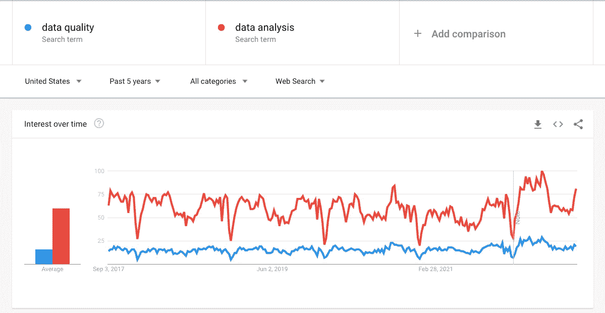
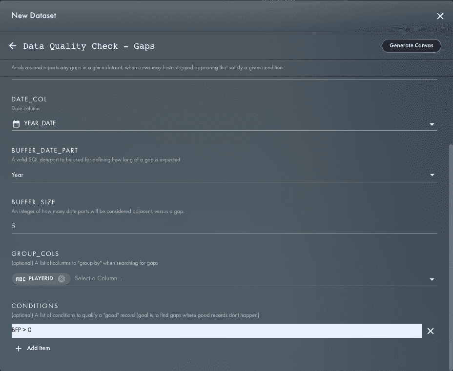
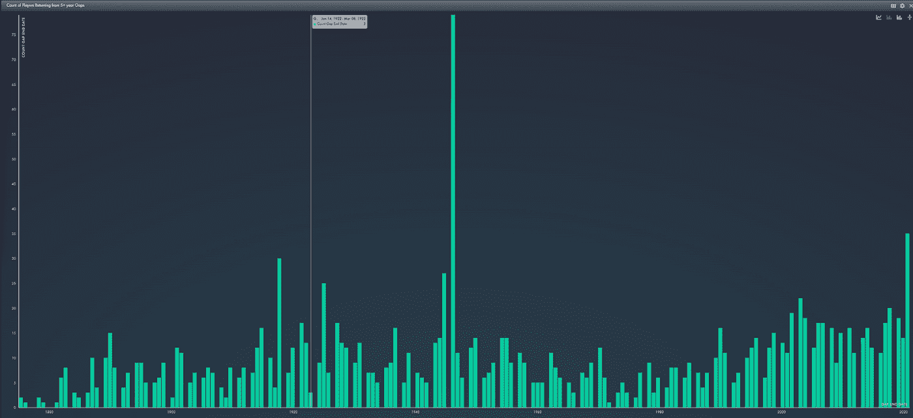

# 糟糕的数据，还是有趣的事实？

> 原文：<https://blog.devgenius.io/bad-data-or-interesting-fact-55215b127847?source=collection_archive---------2----------------------->

## 有什么区别？

Siavash Ghanbari 在 [Unsplash](https://unsplash.com?utm_source=medium&utm_medium=referral) 上拍摄的照片

# 数据质量无聊吗？

很久以前，我发表了一篇关于[用 SQL](https://medium.com/@jberry_33001/finding-gaps-with-sql-4f62982f797d) 寻找漏洞的非常技术性的博客，其中痛苦地分享了整个 SQL 语句以及我如何编写它的细节。不出所料，大多数读者认为这篇文章枯燥乏味。我想这是因为主要的用例是识别您的数据何时有数据质量问题。

让我们面对现实吧——数据质量很无聊(无意冒犯所有数据质量专家)。就我个人而言，我发现数据质量领域特别具有挑战性和令人兴奋，但是多年来我观察到了足够的证据，可以自信地说数据质量客观上是乏味的。

# 证据

数据质量令人厌烦，我是这样知道的:

## 亲身经历

我为许多类型的公司做过咨询，数据质量总是比分析更少受到关注。没有例外。

## 互联网搜索

谷歌趋势显示，“数据分析”一词的搜索频率是“数据质量”的 3 倍。

来源:[https://trends.google.com/trends/?geo=US](https://trends.google.com/trends/?geo=US)

## 研究生项目

研究生课程甚至没有提到或提供一门关于数据质量的课程。我查看了一些与数据科学或分析相关的最受欢迎的研究生课程大纲，没有一个提到数据质量。

先挑哈佛吧。在他们为[数据科学硕士](https://www.seas.harvard.edu/applied-computation/graduate-programs/masters-data-science)编写的程序文献中，它写道:

> 数据科学位于统计方法、计算科学和广泛应用领域的交叉点。该计划在统计建模、机器学习、优化、管理和分析海量数据集以及数据采集方面提供了强大的准备。该计划侧重于可再现的数据分析，协作解决问题，可视化和沟通，以及数据科学中出现的安全和道德问题等主题。
> 
> [https://www . seas . Harvard . edu/applied-computing/graduate-programs/masters-data-science](https://www.seas.harvard.edu/applied-computation/graduate-programs/masters-data-science)

这是对数据职业有趣方面的一个很好的总结。你想让我考虑一份涉及数据分析、问题解决、海量数据集和数据采集的工作？帮我报名！但是可以肯定的是，数据质量这个主题至少值得一提，或者甚至值得一提。

不仅仅是哈佛。我看了近十几个收视率最高的节目，试图找到任何数据质量的参考。我找不到任何东西！这包括我在[俄克拉荷马州立大学](https://business.okstate.edu/analytics/plan_of_study.html)最喜欢的分析项目。)，还有我*最不喜欢的，*圣约瑟夫大学(说来话长)。

## 在线培训课程

接下来，我去了 Coursera 看看有什么可用的。虽然我终于能够找到一些与数据质量相关的内容，但搜索结果的数量很能说明问题:

*   搜索“数据科学”——2，858 个结果
*   搜索“数据分析”——2，507 个结果
*   搜索“数据工程”——1043 个结果
*   搜索“数据建模”——472 个结果
*   搜索“数据质量”——308 个结果

## 职位发布

最后，我开始在 indeed.com 网上寻找工作。结果是相似的:

*   搜索关键词“数据分析”——101，045 个结果
*   搜索关键词“数据质量”——24，225 个结果

## 人们觉得什么有趣？

我的理由是:数据质量令人厌烦。至少写职位描述和课程的人是这样认为的，因为他们从使用人们觉得有吸引力的关键词中受益。

但是，首先进入分析领域有什么吸引力呢？在网上看了几篇文章，也咨询了世界上最权威的来源 reddit (\s)，归结为*解决问题*。

## 有什么不同

似乎人们喜欢解决问题。然而，如果这就是全部情况，那么为什么数据质量没有更受欢迎呢？数据质量似乎比普通的市场分析更适合解决问题。

依我拙见，也一定是关于题材的。就个人而言，解决问题很有趣，但更多的是从数据中提取有趣的见解，让工作变得有趣和令人兴奋。我最美好的回忆包括坐在城市街道上方 40 层的一个会议室里，争论养猫的人比不养猫的人看电视的时间长这一事实是否是一种合理的见解(其中一种理论是养猫的人可能更孤独)。

因此，我关于为什么数据质量令人厌烦的理论是因为它缺乏有趣的洞察力。

## 证明这一点

归根结底，发现数据质量问题与提取有趣见解的技术方法是相同的。例如，考虑我上一篇关于寻找数据缺口的文章。解决问题很有趣——至少我是这么认为的。然而，如果我们只是为了找差距而找差距，那会被认为是无聊的。

为了测试这个理论，我决定在一些公共数据上运行*相同的代码*，以寻找一个有趣的见解。我最终得到了肖恩·莱曼斯棒球数据档案库。

我已经在前一篇文章中解释了这种技术，所以我不再赘述，但基本上我所做的是:

*   按季节选择有投球统计的表格
*   按玩家分组
*   增加一个 5 年的缓冲期
*   条件是面对至少一个击球手

这使用了 [SQL 生成器](https://app.rasgoml.com/sql?transformName=%22summarize_islands%22&tableState=%7B%22tables%22%3A%5B%7B%22name%22%3A%22My_First_Table%22%2C%22columns%22%3A%5B%7B%22name%22%3A%22MACHINEID%22%2C%22dataType%22%3A%22string%22%7D%2C%7B%22name%22%3A%22OBS_DATETIME%22%2C%22dataType%22%3A%22date%22%7D%2C%7B%22name%22%3A%22TEMPERATURE%22%2C%22dataType%22%3A%22number%22%7D%2C%7B%22name%22%3A%22VOLTAGE%22%2C%22dataType%22%3A%22number%22%7D%5D%7D%5D%2C%22baseTableName%22%3A%22My_First_Table%22%2C%22ddl%22%3A%22%22%7D&formState=%7B%22arguments%22%3A%7B%22group_cols%22%3A%7B%22argType%22%3A%22column_list%22%2C%22cols%22%3A%5B%7B%22id%22%3A0%2C%22columnName%22%3A%22MACHINEID%22%2C%22displayName%22%3A%22MACHINEID%22%2C%22dataType%22%3A%22string%22%2C%22dwColumnId%22%3A0%7D%5D%7D%2C%22conditions%22%3A%7B%22argType%22%3A%22math_list%22%2C%22values%22%3A%5B%22TEMPERATURE%20BETWEEN%200%20AND%20250%22%5D%7D%2C%22date_col%22%3A%7B%22argType%22%3A%22column%22%2C%22col%22%3A%7B%22id%22%3A1%2C%22columnName%22%3A%22OBS_DATETIME%22%2C%22displayName%22%3A%22OBS_DATETIME%22%2C%22dataType%22%3A%22date%22%2C%22dwColumnId%22%3A1%7D%7D%2C%22buffer_date_part%22%3A%7B%22argType%22%3A%22date_part%22%2C%22value%22%3A%22day%22%7D%2C%22buffer_size%22%3A%7B%22argType%22%3A%22int%22%2C%22value%22%3A7%7D%7D%2C%22transformName%22%3A%22summarize_islands%22%7D)中的函数`summarize_islands`，帮助您编写这个 SQL。

“寻找差距”模板的可配置输入

SQL 逻辑的可视化表示

当我查看结果时，我发现一个叫保罗·施雷伯的球员在 1923 年到 1945 年间的投球统计中有一个缺口，跨度达 22 年！

事实证明，这个缺口有一个有趣的故事。根据维基百科，施雷伯在 1922 年和 1923 年棒球赛季期间为布鲁克林知更鸟队投了 10 场比赛。他以纽约扬基队击球练习投手和教练的身份重返大联盟。

1945 年，当他还在为扬基队当教练的时候，由于第二次世界大战的原因，他短暂地从退休状态中出来，又投了两场比赛。他连续出现在大联盟的时间跨度为 22 年零 2 天，这仍然是美国职棒大联盟的记录。

保罗·施雷伯(图片来源:维基百科)

事实证明，这并不是战争期间退役球员顶替的唯一情况。

当我建立了一个图表，向我展示了在 5 年多的间隔后回归的玩家数量时，你可以看到战争期间出现的峰值。

[玩家从 5 年的空白中回归]二战期间的峰值

# 结论

你怎么想呢?这难道不比发现上游数据源问题导致的数据缺口更有趣吗？

我的结论是:

1.  数据质量绝对无聊
2.  让事情变得有趣的是问题解决和有趣事实的结合
3.  数据质量技术可以用来发现有趣的见解

让我们来测试一下。原文章产生了 3.75%的鼓掌率。如果这个观点比那个更有趣，请点击掌声按钮！如果我是对的，我保证我会努力用更多有趣的例子来解释技术要点。