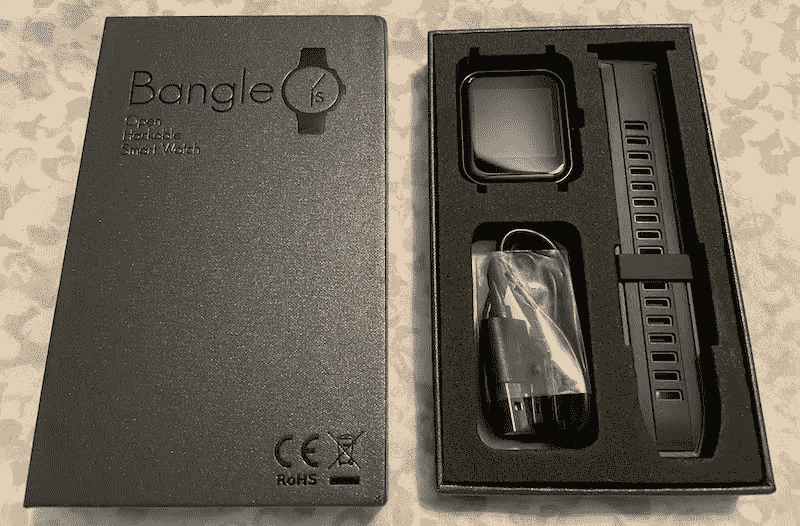
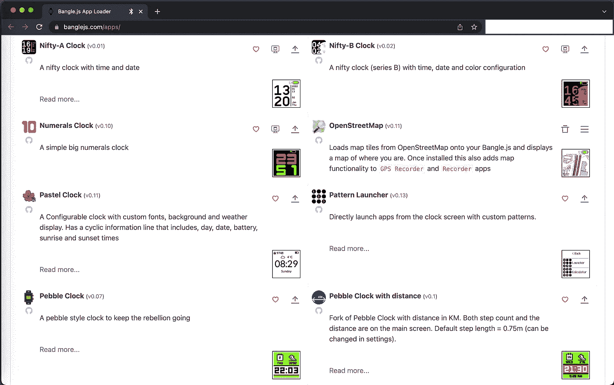
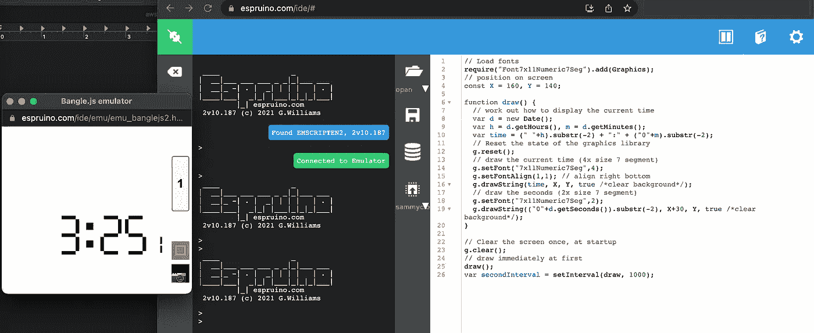
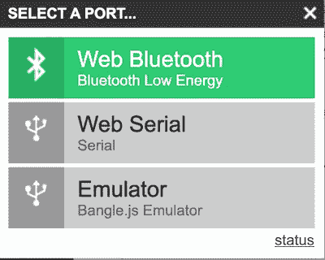
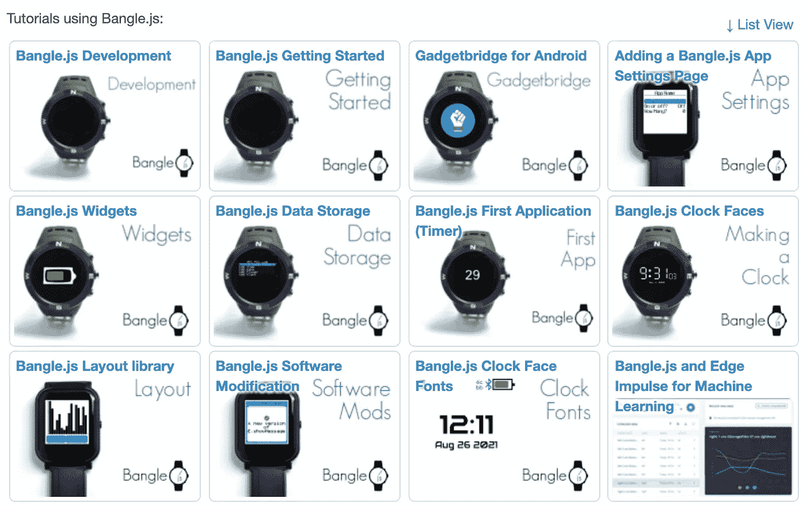
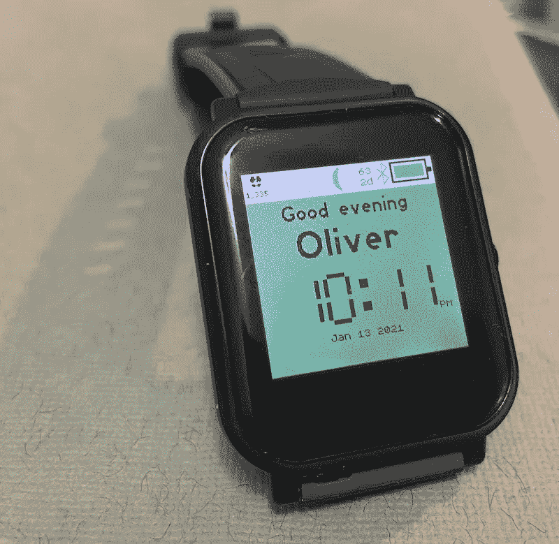
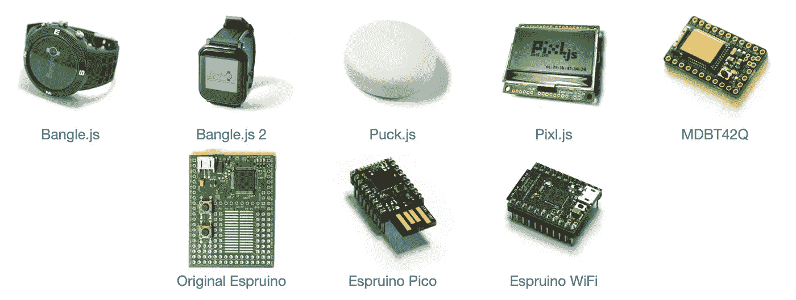

# Bangle.js 2:开源 Javascript 智能手表

> 原文：<https://blog.devgenius.io/bangle-js-2-open-source-javascript-smart-watch-d65cd649f8b7?source=collection_archive---------6----------------------->

我在 Kickstarter 上看到了 [Bangle.js 2 项目，并认为它看起来是一个向我的孩子介绍编程的很好的入门项目。](https://www.kickstarter.com/projects/gfw/banglejs-2-the-open-smart-watch)

# 特征

它有一个 1.3 英寸的 3 位彩色液晶触摸屏，GPS，蓝牙低能量(BLE)，心率监视器，加速度计(可用于步跟踪)，磁力计(作为指南针)，气压和温度传感器，可以作为触觉反馈振动，IP67 防水(长达 1 米，持续 30 分钟)。

我订购它作为给我孩子的圣诞礼物，并对拆箱体验感到满意。:-)

你可以使用[https://banglejs.com/apps/](https://banglejs.com/apps/)在手表上安装、定制和更新应用程序。

有很多实用工具(指南针，水平仪，开放街道地图，温度计)，和一些简单的游戏(一条[蛇](https://en.wikipedia.org/wiki/Snake_(video_game_genre)#Nokia_phones)克隆，Flappy 鸟等)。

# 手表编程

开始开发手表非常简单。你只需打开[https://www.espruino.com/ide](https://www.espruino.com/ide/#)，从那里你可以启动一个仿真器，并开始向它推送代码。

您还可以轻松选择通过网络蓝牙低能耗(BLE)连接到 Bangle.js，它会自动发现您的设备。

有很多记录良好的教程。

我首先对表盘进行了简单的定制，添加了一个“圣诞快乐”的钟面，为我的孩子个性化手表(现在也有一个“定制的欢迎”应用程序，实现了类似的目标)。我按照[钟面教程](https://www.espruino.com/Bangle.js+Clock)，加了一些额外的文字。

有几个问题，比如使用实际上包含字母而不仅仅是数字的字体(文本不会出现在我使用的第一种字体中)，以及在 176 x 176 的屏幕上正确定位，但总的来说这很容易。

把手表给我的孩子后，我们坐下来，我问他们想换什么。他们要求:

*   改变背景颜色，所以我们选择十六进制的颜色，并尝试使用这些颜色。由于屏幕是 3 位的，我们使用非常简单的颜色得到了最好的结果(更复杂的颜色最终看起来像素化了)。
*   改变信息，在一天的不同时间说不同的事情。这迫使他们想出如何正确排序`if`条件。:-)
*   从 24 小时制改为 12 小时制(我们只是手工做的，我们没有尝试使用任何库，因为我不知道有什么可用的)。这很棒，因为这个变化打破了早期的逻辑。:-)

下面是可怕的代码，完全没有自动化测试:

总的来说，孩子们似乎真的很喜欢通过编码来个性化他们的手表，他们学到了很多介绍性的编程概念(比如在行尾需要分号)。

# 建在埃斯普罗伊诺

Espruino 是一个用于微控制器的完全开源的 Javascript 解释器，它提供了一种非常容易的方式来开始硬件编程，只使用像 Chrome 这样的 web 浏览器。

 [## Espruino -用于微控制器的 JavaScript

### “网络语言”无处不在——你的笔记本电脑、电话、电视和为互联网供电的服务器。与……

www.espruino.com](https://www.espruino.com/) 

您可以订购一系列预装 Espruino 的[兼容硬件](https://www.espruino.com/Reference)。

微控制器包括蓝牙低能耗(BLE)硬件，这意味着它们可以通过蓝牙与其他传感器通信，而不需要安装任何驱动程序。

GitHub 上什么都有！

 [## Espruino JavaScript

### Espruino 是微控制器的 JavaScript 解释器。它可以安装到只有 128kB 闪存的设备中，并且…

github.com](https://github.com/espruino)