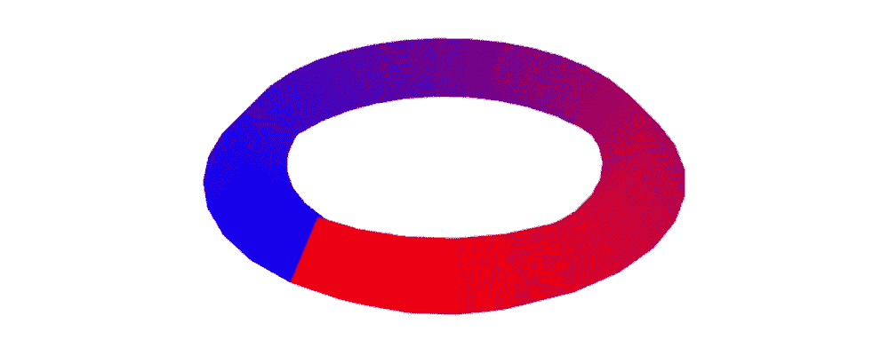
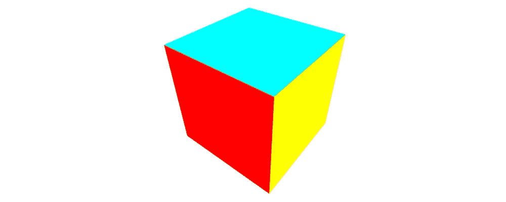
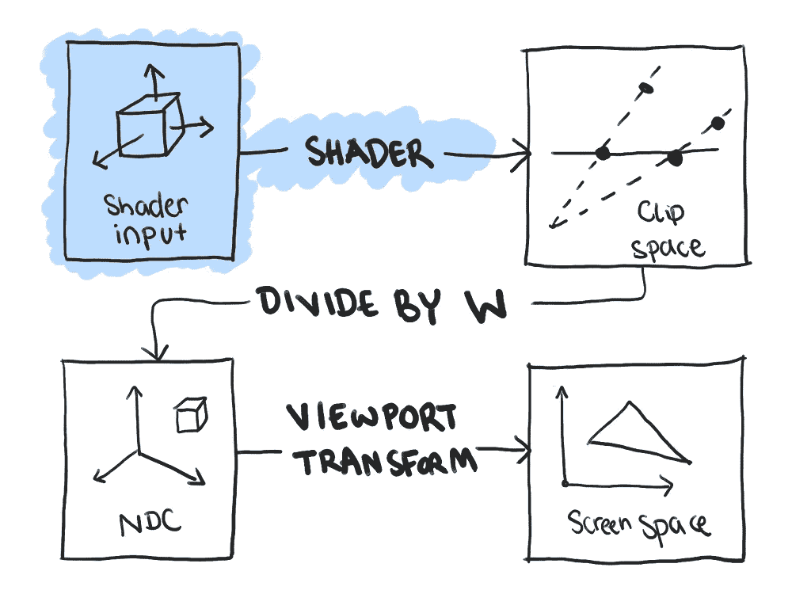

# 基于 WebGL 的准系统 3D 渲染

> 原文：<https://blog.devgenius.io/barebones-3d-rendering-with-webgl-eef2055b219f?source=collection_archive---------6----------------------->



我做的一个程序生成的圆环。因为我了解进入 GPU 的数据格式，所以我知道我的过程生成逻辑必须输出什么。

*(* [*本帖最初发表于我的个人网站。*](https://avikdas.com/2020/07/21/barebones-3d-rendering-with-webgl.html) *你会在那里找到一个现场演示，我无法在一篇中型文章中包括它。)*

在我最近关于[开始使用 WebGL](https://medium.com/dev-genius/barebones-webgl-in-75-lines-of-code-b43db282771d) 的帖子之后，是时候转向 3D 渲染了。事实证明，我已经有了大部分的 OpenGL 概念。但是，我需要了解的是 OpenGL 需要什么格式的数据才能得到我想要的结果。

在这篇文章中，我将实现实现有用的 3D 渲染所需的最少改动。这需要:

*   指定网格的 3D 位置，以及不同面的颜色。颜色让我们看到不同的面孔，而不需要使用阴影。
*   透视投影。
*   旋转和动画。虽然不是绝对必要的，但一些旋转是查看模型不同侧面的唯一方式。而且，理解旋转是如何工作的，对于未来实现相机是至关重要的。

这是我们要做的:



一个简单的旋转立方体。我个人网站上的现场演示。

我想明确一下这个帖子的受众。**这篇文章面向像我这样理解 3D 渲染概念(齐次坐标、矩阵变换等)的人。)但是需要将这些概念与 OpenGL/WebGL API 联系起来。**

# 剔除和深度测试

尽管 OpenGL 让开发人员来实现渲染是如何完成的，但渲染的某些部分是一成不变的。应用程序代码可以指定渲染哪些顶点，以及像素在屏幕上的外观，但 OpenGL 会根据一些固定的代码(称为光栅化)自动决定绘制哪些像素。

因为我们实际上将创建一个更复杂的模型，所以我们希望启用两个有用的特性:

*   深度测试。这确保了离观察者较近的三角形挡住了较远的三角形。
*   背面剔除。这并不是绝对必要的，但作为一种优化来避免绘制背向观察者的三角形是很好的。对于不栅格化在完全封闭的模型上永远看不到的三角形非常有用。注意:你*不希望这种情况出现在开放网格或者透明网格上。*

这两个特性可以随时启用，但是因为我们总是希望我们的渲染器使用它们，所以我们可以在获得 GL 渲染上下文后立即启用它们:

```
 const gl = canvas.getContext('webgl');

+gl.enable(gl.DEPTH_TEST);
+gl.enable(gl.CULL_FACE);
```

([这里的页面为](https://www.khronos.org/registry/OpenGL-Refpages/es3.0/html/glEnable.xhtml) `[glEnable](https://www.khronos.org/registry/OpenGL-Refpages/es3.0/html/glEnable.xhtml)` [的调用，专门针对基于 WebGL 2.0 的 OpenGL 版本。](https://www.khronos.org/registry/OpenGL-Refpages/es3.0/html/glEnable.xhtml))

启用深度测试后，我们还需要在渲染前清除深度缓冲区。否则，深度缓冲区中的旧值可能会延续到新的渲染中。在打`glDrawArrays`电话之前做这件事。

```
+gl.clear(gl.COLOR_BUFFER_BIT | gl.DEPTH_BUFFER_BIT);
 gl.drawArrays(gl.TRIANGLES, 0, 3 * 2 * 6);
```

如果不启用这些功能，您的模型可能如下所示:


随着剔除和深度测试的关闭，立方体的远端开始出现

# 定义网格

顶点着色器实际上生成 3D 点(实际上是齐次坐标中的 4D)进行栅格化。这意味着您对顶点着色器的输入可以是任何可以转换为 3D 点的内容，只要您将生成的每个点都有一组输入。

## 更新着色器以处理逐顶点颜色

对于一个基本的网格，我们需要一个 3D 位置(实际上是 3D，不是 4D，因为 w 坐标总是 1)和一个颜色。后者只是很好地为各种三角形赋予了它们自己的颜色，它很好地演示了我们如何将两条独立的信息输入到着色器中。让我们更新顶点着色器以包含输入颜色，然后将该输入颜色传递给片段着色器:

```
 attribute vec3 position;
+attribute vec3 inputColor;
 varying vec4 color;

 void main() {
   gl_Position = vec4(position, 1);
-  color = gl_Position * 0.5 + 0.5;
+  color = vec4(inputColor, 1);
 }
```

## 定义网格数据

为了馈入两个输入，我们有两个选项:

*   为每个输入创建单独的顶点缓冲对象(vbo)。请记住，VBO 本质上是一个字节序列。如果在程序执行期间输入以不同的频率变化，这是有用的，例如一个是静态的，另一个每帧都变化。
*   创建一个两种信息交错的 VBO。

我们很快就会看到，我们将在整个程序中保持基本位置和颜色不变，因此第二个选项是有意义的。所以现在，我们可以在一个`Float32Array`中指定这两段数据。

```
const vertexData = new Float32Array([
  // Six faces for a cube. Each face is made of two triangles,
  // with three points in each triangle. Each pair of triangles
  // has the same color.

  // FRONT
  /* pos = */ -1, -1,  1, /* color = */ 1, 0, 0,
  /* pos = */  1, -1,  1, /* color = */ 1, 0, 0,
  /* pos = */  1,  1,  1, /* color = */ 1, 0, 0,

  /* pos = */ -1, -1,  1, /* color = */ 1, 0, 0,
  /* pos = */  1,  1,  1, /* color = */ 1, 0, 0,
  /* pos = */ -1,  1,  1, /* color = */ 1, 0, 0,

  // And so on for the other five faces...
  // See the source code on my website to see the full mesh
  // ...
]);
```

问题是:我们应该把这些点放在哪里？毕竟相机在哪里？诀窍是 OpenGL 需要特定坐标系中的点，我将在下面讨论。但是，我们的顶点着色器是一个生成点。这意味着我们可以将输入点放置在对建模有用的位置(例如，像我所做的那样围绕原点)，顶点着色器可以将它们移动到 OpenGL 光栅化器实际识别的位置。

另外，你需要注意为每个三角形指定点的顺序。因为我们打开了背面剔除，所以当从正面看时，您希望[以逆时针顺序](https://www.khronos.org/opengl/wiki/Face_Culling)指定点。

# 将数据连接到着色器输入

最后，我们现在可以将交织在单个字节序列中的两条数据连接到它们对应的着色器输入:

1.  仍然只在 GPU 上创建一个缓冲区。继续将其绑定到`GL_ARRAY_BUFFER`以向缓冲区发送数据。
2.  在顶点着色器中抓取`position`变量的句柄。将句柄指向缓冲区，步幅为 24，偏移量为 0。这意味着从第一个字节开始，每隔 24 个字节(浮点为 4 个字节)就有相关数据可用。
3.  用`inputColor`变量重复上述步骤。这一次，使用相同的步幅，但是偏移 12。

代码如下所示:

```
const vertexBuffer = gl.createBuffer();
gl.bindBuffer(gl.ARRAY_BUFFER, vertexBuffer);
gl.bufferData(gl.ARRAY_BUFFER, vertexData, gl.STATIC_DRAW);

const positionAttribute = gl.getAttribLocation(program, 'position');
gl.enableVertexAttribArray(positionAttribute);
gl.vertexAttribPointer(positionAttribute, 3, gl.FLOAT, false, 24, 0);

const colorAttribute = gl.getAttribLocation(program, 'inputColor');
gl.enableVertexAttribArray(colorAttribute);
gl.vertexAttribPointer(colorAttribute, 3, gl.FLOAT, false, 24, 12);
```

我们还需要告诉`glDrawArrays`调用来实际呈现正确数量的三角形:

```
-gl.drawArrays(gl.TRIANGLES, 0, 3);
+gl.drawArrays(gl.TRIANGLES, 0, 3 * 2 * 6);
```

在这一点上，你的程序不会显示任何东西，因为我们将 3D 输入点转换成 4D `gl_Position`的方式意味着我们本质上是在立方体内部向外看。背面剔除意味着立方体面的内侧不可见。如果你关闭剔除，你会看到一个蓝色方块。

(注意:我故意不引入另一个概念，称为元素缓冲对象或 EBO。虽然这个概念对于跨多个顶点共享点很有用，但是我现在只想介绍必要的概念。)

# 为动画设置

在修复着色器以在可见位置放置点之前，我想绕道并开始每帧重新渲染模型。原因是，为了查看立方体的每个部分，我们希望随着时间的推移旋转它。这意味着我们不能再在一个固定的方向上渲染它，让它那样。

这一部分非常简单:只需将`glClear`和`glDrawArrays`调用(这两个部分实际上是在绘图)封装在一个由`requestAnimationFrame`调用的函数中。

```
requestAnimationFrame(t => loop(gl, t));function loop(gl, t) {
  gl.clear(gl.COLOR_BUFFER_BIT | gl.DEPTH_BUFFER_BIT);
  gl.drawArrays(gl.TRIANGLES, 0, 3 * 2 * 6); requestAnimationFrame(t => loop(gl, t));
}
```

注意`t`参数在将来自动旋转立方体时会很有用。

这一变化与 WebGL 或 OpenGL 无关。在网页动画代码中这样做很常见。

# 转换

最后一步是获取输入位置，以方便建模的方式指定，输出位置 OpenGL 实际上可以正确光栅化。这意味着生成剪辑空间中的最终位置，剪辑空间基本上是一个 3D 立方体，每个方向的范围从-1 到 1。此立方体内的任何点都将被栅格化。

然而，实际上有几个相关的概念在起作用:

1.  顶点着色器输入数据。这里的数据可以是任何形式，甚至不一定是坐标。然而，在实践中，输入数据通常由一些易于建模的坐标中的 3D 点组成，在这种情况下，这些点被认为是在*模型空间*中。
2.  剪辑空间。这是顶点着色器的输出，*在同质坐标*。
3.  标准化设备坐标。剪辑空间中的相同点，但是通过 w-divide 从齐次坐标转换到 3D 笛卡尔坐标。只有以原点为中心的 2×2×2 立方体内的点(在所有轴上介于-1 和 1 之间)才会被渲染。
4.  屏幕空间。这些是 2D 点，原点以前在空间的中心，现在在画布的左下方。z 坐标仅用于深度排序。这些是最终用于光栅化的坐标。



上面的四个空格。突出显示的部分在我们的控制之下。

我崩溃的原因是许多教程谈论模型、世界、视图空间以及剪辑空间、NDC 和屏幕空间。但是重要的是要认识到剪辑空间之前的一切都是由你决定的*。您决定输入数据的外观以及如何将其转换为剪辑空间。这可能意味着在模型空间中指定输入，然后依次应用局部和相机变换。但是如果你想理解 OpenGL APIs，重要的是首先理解什么在你的控制之下，OpenGL 为你提供了什么。*

这是最酷的部分:**如果你愿意，你可以直接在剪辑空间预先计算坐标，你的顶点着色器会将输入位置传递给 OpenGL** 。这正是我们的第一个演示所做的！但是，这样做每帧是昂贵的，因为我们通常想要做的变换(矩阵乘法)在 GPU 上要快得多。

## 更新着色器以接受变换

要从 VBO 中指定的模型空间坐标转换到裁剪空间，让我们将转换分成两部分:

1.  世界空间转换模型。
2.  透视投影变换。

这种分解符合我们的目的，因为我们将随着时间的推移旋转立方体，使透视投影保持不变。在现实世界的应用程序中，您可以在这两个步骤之间插入一个相机(或视图)变换，以允许移动相机，而不必修改整个世界。

首先向着色器添加两个`uniform`变量。请记住，制服是为整个绘制调用指定的一段输入数据，并在该绘制调用中的所有顶点上保持不变。在我们的例子中，在任何给定的时刻，构成立方体的三角形的所有顶点的变换都是相同的。

这两个变量代表两种变换，因此是 4×4 矩阵。我们可以通过将输入位置转换成齐次坐标，然后乘以变换矩阵来使用变换。

```
 attribute vec3 position;
 attribute vec3 inputColor;
+uniform mat4 transformation;
+uniform mat4 projection;
 varying vec4 color;

 void main() {
-  gl_Position = vec4(position, 1);
+  gl_Position = projection * transformation * vec4(position, 1);
   color = vec4(inputColor, 1);
 }
```

## 指定透视投影矩阵

让我们填充上面两个矩阵中的一个，即投影矩阵。请记住，由于我们的顶点着色器的设置方式，投影矩阵将获取世界空间中的点(模型转换后输入点的最终位置)并将它们放入剪辑空间。这意味着预测矩阵有两个责任:

*   确保我们想要渲染的任何东西都被放入以原点为中心的 2×2×2 的立方体中。这意味着我们想要渲染的每个顶点的坐标应该在-1 到 1 的范围内。
*   如果我们需要透视，设置 w 坐标，使除以它执行透视分割。

我不会深入透视投影矩阵的数学，因为[在其他地方](https://www.scratchapixel.com/lessons/3d-basic-rendering/perspective-and-orthographic-projection-matrix/opengl-perspective-projection-matrix)已经涉及到了。重要的是，我们将根据一些参数来定义矩阵，比如到远近裁剪窗格的距离，以及视角。让我们看一些代码:

```
const f = 100;
const n = 0.1;
const t = n * Math.tan(Math.PI / 8);
const b = -t;
const r = t * gl.canvas.clientWidth / gl.canvas.clientHeight;
const l = -r;

const projection = new Float32Array([
    2 * n / (r - l),                 0,                    0,  0,
                  0,   2 * n / (t - b),                    0,  0,
  (r + l) / (r - l), (t + b) / (t - b),   -(f + n) / (f - n), -1,
                  0,                 0, -2 * f * n / (f - n),  0,
]);
```

要理解这个矩阵，请注意以下几点:

*   最重要的是，OpenGL 中的矩阵是按列主顺序定义的。这意味着上面的前四个值实际上是第一个*列*。类似地，每第四个值构成一个单独的*行*，这意味着最底部的行实际上是上面的`(0, 0, -1, 0)`。
*   前三行使用定义透视变换的边界将 x、y 和 z 坐标引入正确的范围。
*   最后一行将 z 坐标乘以-1，并将其放入输出 w 坐标中。这就是最终“除以 w”缩小具有更负 z 坐标的对象的原因(记住负 z 值指向远离我们的方向)。如果我们正在进行正交投影，我们会将输出 w 坐标保留为 1。

现在，我们有了一个正确格式的矩阵，我们可以将它与着色器中的变量相关联。这有点类似于数组如何与一个`attribute`变量相关联。然而，因为一个制服本质上包含一个由所有顶点共享的数据(与每个顶点一个数据*相反)，所以没有中间缓冲。只需抓住变量的句柄并向其发送数据。*

```
const uniformP = gl.getUniformLocation(program, 'projection');
gl.uniformMatrix4fv(uniformP, false, projection);
```

确保在`loop`功能的之外进行*操作。我们不会在整个程序执行过程中改变投影，所以我们只需要发送这个矩阵一次！*

传统的投影矩阵假设“视图空间”中的点，即在摄像机的视图中。为了简单起见，我们假设相机在原点，并且看着负的`z`方向(这就是视图空间的本质)。因此，现在的目标是将着色器输入位置转换为由透视投影的视野和裁剪平面定义的可视区域内的点。

我按照以下顺序选择了以下转换:

1.  按系数 2 缩放。
2.  围绕 Y 轴旋转一定角度。
3.  绕 X 轴旋转相同的角度。
4.  沿 Z 轴平移-9 个单位。

这个选择是相当随意的，但这产生了一个立方体，它的大部分面都是可见的(背面永远不会出现)，填满了大部分画布，并且相对容易用手计算。

我取了这些转换常用的转换矩阵(你可以在网上找到)，按逆序相乘，最后转置得到列主顺序。我用一些变量定义了矩阵，这样我可以很容易地改变旋转的角度:

```
const uniformT = gl.getUniformLocation(program, 'transformation');function loop(gl, t) {
  const a = t * Math.PI / 4000;
  const c = Math.cos(a);
  const s = Math.sin(a);
  const x = 2;
  const tz = -9;

  const transformation = new Float32Array([
     c * x,  s * s * x, -c * s * x, 0,
         0,      c * x,      s * x, 0,
     s * x, -c * s * x,  c * c * x, 0,
         0,          0,         tz, 1,
  ]);

  gl.uniformMatrix4fv(uniformT, false, transformation);

  gl.clear(gl.COLOR_BUFFER_BIT | gl.DEPTH_BUFFER_BIT);
  gl.drawArrays(gl.TRIANGLES, 0, 3 * 2 * 6);
}
```

注意，模型变换矩阵是在`loop`函数中定义的，允许使用时间参数来定义旋转角度。否则，将结果矩阵与着色器变量相关联与之前完全相同。

# 演示

有了这些，我们就有了旋转立方体！你可以在我的个人网站上找到它。整个代码都嵌入在那个帖子中。你会发现大部分代码都在定义顶点着色器的输入数据。

# 下一步是什么？

现在我已经在 OpenGL 中建立了一个基本的 3D 渲染管道，我可以开始在它的基础上进行构建了。下面是我接下来要去的一些地方。

## 索引图

我计划做一个索引绘图的后续工作，其中我们可以在同一个网格中多次引用同一个顶点。这在定义网格时节省了空间和计算，并提高了模型内的一致性。

## 阴影在哪里？

在传统的 OpenGL 中，你被迫使用 OpenGL 提供的着色模型。在现代 OpenGL 中，*你*决定如何在片段着色器代码中给你的模型着色。我不会在这篇文章中深入讨论这个话题，但基本上，你从你的顶点着色器输出法向量，这些法向量被插入片段并传递给片段着色器。然后，在片段着色器中，使用法线中传递的来实现着色模型，如 Phong 着色。

## 现在我可以使用图书馆了吗？

诚然，手工生成各种转换矩阵是相当痛苦的。然而，理解这个理论(我已经理解了)如何映射到 OpenGL 期望的数据格式对我来说很重要。既然我理解了其中的联系，我肯定会继续使用 [glMatrix](http://glmatrix.net/) 。

手动方法对于网格定义尤其重要，在这种情况下，我可以使用对象加载器库。我个人对程序化地生成网格感兴趣，所以了解我需要生成什么样的数据是很重要的。