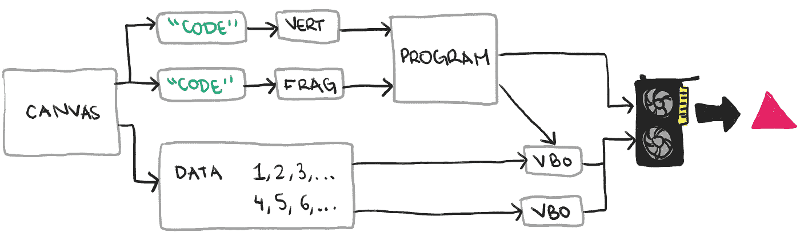

# 75 行代码的准系统 WebGL

> 原文：<https://blog.devgenius.io/barebones-webgl-in-75-lines-of-code-b43db282771d?source=collection_archive---------36----------------------->

*(本帖原载于* [*我的个人网站*](https://avikdas.com/2020/07/08/barebones-webgl-in-75-lines-of-code.html) *)。)*

现代的 OpenGL，以及扩展而来的 WebGL，与我过去所学的传统 OpenGL 有很大的不同。我知道光栅化是如何工作的，所以我对这些概念很熟悉。然而，我读过的每一篇教程都引入了抽象和辅助函数，这让我更难理解哪些部分是 OpenGL APIs 的核心。

明确地说，像将位置数据和呈现功能分离到单独的类中这样的抽象在现实世界的应用程序中很重要。但是，这些抽象将代码分散在多个领域，并且由于样板文件和在逻辑单元之间传递数据而引入了开销。我最擅长的学习方法是线性的代码流，其中每一行都是主题的核心。

首先，功劳归于[我用的教程](https://www.toptal.com/javascript/3d-graphics-a-webgl-tutorial)。从这个基础开始，我剥离了所有的抽象，直到我有了一个“最小可行的程序”。希望这将有助于您使用现代 OpenGL。这是我们正在做的:


更加丰富多彩的版本[黑三角](https://rampantgames.com/blog/?p=7745)

# 初始化

使用 WebGL，我们需要一个`canvas`来绘制。您肯定希望包含所有常见的 HTML 样板文件、一些样式等。，但画布是最关键的。一旦加载了 DOM，我们将能够使用 Javascript 访问画布。

```
<canvas id="container" width="500" height="500"></canvas><script>
  document.addEventListener('DOMContentLoaded', () => {
    // All the Javascript code below goes here
  });
</script>
```

通过访问画布，我们可以获得 WebGL 渲染上下文，并初始化它的透明颜色。OpenGL 世界中的颜色是 RGBA，每个组件都在`0`和`1`之间。透明色是用于在任何重绘场景的帧的开始处绘制画布的颜色。

```
const canvas = document.getElementById('container');
const gl = canvas.getContext('webgl');gl.clearColor(1, 1, 1, 1);
```

在真正的程序中，有更多的初始化工作可以做，也应该做。特别值得注意的是启用*深度缓冲*，这将允许基于 Z 坐标排序几何图形。对于这个只包含一个三角形的基本程序，我们将避免这种情况。

# 编译着色器

OpenGL 的核心是一个光栅化框架，在这里我们可以决定如何实现除光栅化之外的所有东西。这需要在 GPU 上运行至少两段代码:

1.  为每个输入运行的顶点着色器，为每个输入输出一个 3D(实际上，4D 在[齐次坐标](https://en.wikipedia.org/wiki/Homogeneous_coordinates))位置。
2.  为屏幕上的每个像素运行的片段着色器，输出该像素应该是什么颜色。

在这两个步骤之间，OpenGL 从顶点着色器获取几何图形，并确定屏幕上的哪些像素实际上被该几何图形覆盖。这是栅格化部分。

这两种着色器通常都是用 GLSL (OpenGL 着色语言)编写的，然后被编译成 GPU 的机器代码。机器代码然后被发送到 GPU，因此它可以在渲染过程中运行。我不会在 GLSL 上花太多时间，因为我只是想展示一些基础知识，但是这种语言非常接近 C，大多数程序员都很熟悉。

首先，我们编译并发送一个顶点着色器到 GPU。这里，着色器的源代码存储在一个字符串中，但它可以从其他地方加载。最终，字符串被发送到 WebGL APIs。

```
const sourceV = `
  attribute vec3 position;
  varying vec4 color; void main() {
    gl_Position = vec4(position, 1);
    color = gl_Position * 0.5 + 0.5;
  }
`;const shaderV = gl.createShader(gl.VERTEX_SHADER);
gl.shaderSource(shaderV, sourceV);
gl.compileShader(shaderV);if (!gl.getShaderParameter(shaderV, gl.COMPILE_STATUS)) {
  console.error(gl.getShaderInfoLog(shaderV));
  throw new Error('Failed to compile vertex shader');
}
```

这里，GLSL 代码中有几个变量值得一提:

1.  一个叫做`position`的*属性*。属性本质上是一个输入，并且为每个这样的输入调用着色器。
2.  一个*变*称为`color`。这是顶点着色器的输出(每个输入一个)，也是片段着色器的输入。当该值被传递到片段着色器时，该值将根据光栅化的属性进行插值。
3.  `gl_Position`值。本质上是顶点着色器的输出，就像任何变化的值一样。这一个是特殊的，因为它被用来决定哪些像素需要被绘制。

还有一种称为 *uniform* 的变量类型，它在多次调用顶点着色器时保持不变。这些一致性用于像变换矩阵这样的属性，它对于单个几何体上的所有顶点都是不变的。

接下来，我们对片段着色器做同样的事情，编译并将其发送到 GPU。请注意，来自顶点着色器的`color`变量现在由片段着色器读取。

```
const sourceF = `
  precision mediump float;
  varying vec4 color; void main() {
    gl_FragColor = color;
  }
`;const shaderF = gl.createShader(gl.FRAGMENT_SHADER);
gl.shaderSource(shaderF, sourceF);
gl.compileShader(shaderF);if (!gl.getShaderParameter(shaderF, gl.COMPILE_STATUS)) {
  console.error(gl.getShaderInfoLog(shaderF));
  throw new Error('Failed to compile fragment shader');
}
```

最后，顶点和片段着色器都链接到一个 OpenGL 程序中。

```
const program = gl.createProgram();
gl.attachShader(program, shaderV);
gl.attachShader(program, shaderF);
gl.linkProgram(program);if (!gl.getProgramParameter(program, gl.LINK_STATUS)) {
  console.error(gl.getProgramInfoLog(program));
  throw new Error('Failed to link program');
}gl.useProgram(program);
```

我们告诉 GPU 我们上面定义的着色器是我们想要运行的。因此，现在剩下的就是创建输入，并让 GPU 处理这些输入。

# 将输入数据发送到 GPU

输入数据将存储在 GPU 的内存中，并在那里进行处理。不是对每一部分输入进行单独的绘制调用，每次传输一部分相关数据，而是将整个输入传输到 GPU 并从那里读取。(传统的 OpenGL 一次传输一个数据，导致性能下降。)

OpenGL 提供了一种称为顶点缓冲对象(VBO)的抽象。我仍在弄清楚所有这些是如何工作的，但最终，我们将使用抽象来完成以下工作:

1.  在 CPU 的内存中存储一个字节序列。
2.  使用使用`gl.createBuffer()`和`gl.ARRAY_BUFFER`的*绑定点*创建的唯一缓冲区将字节传输到 GPU 的内存。

我们将在顶点着色器中为每个输入变量(属性)设置一个 VBO，尽管也可以为多个输入设置一个 VBO。

```
const positionsData = new Float32Array([
  -0.75, -0.65, -1,
   0.75, -0.65, -1,
   0   ,  0.65, -1,
]);const buffer = gl.createBuffer();
gl.bindBuffer(gl.ARRAY_BUFFER, buffer);
gl.bufferData(gl.ARRAY_BUFFER, positionsData, gl.STATIC_DRAW);
```

通常，您将使用对您的应用程序有意义的任何坐标来指定您的几何图形，然后使用顶点着色器中的一系列转换来将它们放入 OpenGL 的*剪辑空间*。我不会深入到剪辑空间的细节(它们与齐次坐标有关)，但是现在，X 和 Y 在-1 到+1 之间变化。因为我们的顶点着色器只是传递输入数据，所以我们可以直接在剪辑空间中指定坐标。

接下来，我们还会将缓冲区与顶点着色器中的一个变量相关联。在此，我们:

1.  从我们上面创建的程序中获得一个`position`变量的句柄。
2.  告诉 OpenGL 从`gl.ARRAY_BUFFER`绑定点读取数据，每批 3 个，使用特定的参数，比如偏移量和跨度为零。

```
const attribute = gl.getAttribLocation(program, 'position');
gl.enableVertexAttribArray(attribute);
gl.vertexAttribPointer(attribute, 3, gl.FLOAT, false, 0, 0);
```

请注意，我们可以创建 VBO，并以这种方式将其与顶点着色器属性相关联，因为我们一个接一个地进行这两项操作。如果我们将这两个功能分开(例如一次创建所有的 VBO，然后将它们关联到单独的属性)，我们需要在将每个 VBO 与其对应的属性关联之前调用`gl.bindBuffer(...)`。

# 画吧！

最后，GPU 内存中的所有数据都按照我们想要的方式设置好了，我们可以告诉 OpenGL 清除屏幕，并在我们设置的阵列上运行程序。作为栅格化的一部分(确定顶点覆盖哪些像素)，我们告诉 OpenGL 将 3 个一组的顶点视为三角形。

```
gl.clear(gl.COLOR_BUFFER_BIT);
gl.drawArrays(gl.TRIANGLES, 0, 3);
```

我们以线性方式设置它的方式意味着程序一次性运行。在任何实际应用中，我们会以结构化的方式存储数据，每当数据发生变化时就将其发送到 GPU，并在每一帧进行绘制。

把所有东西放在一起，下图显示了在屏幕上显示第一个三角形的最小概念集。即使这样，图表还是被大大简化了，所以你最好把本文中的 75 行代码放在一起研究。



最终，尽管被大大简化，显示梦寐以求的三角形所需的一系列步骤

对我来说，学习 OpenGL 最困难的部分是在屏幕上获得最基本的图像所需的大量样板文件。因为光栅化框架要求我们提供 3D 渲染功能，并且与 GPU 的通信是冗长的，所以有许多概念需要提前学习。我希望这篇文章显示的基础比其他教程显示的要简单！