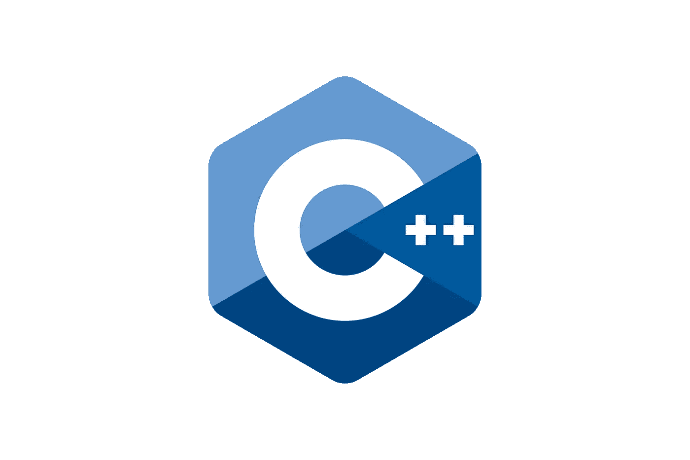

# 基本 C++。第一部分

> 原文：<https://blog.devgenius.io/basic-c-part-1-7b639828c72b?source=collection_archive---------11----------------------->



本教程是为想了解 C++的人准备的。我们将**通过各种例子来看看 C** ++的基础知识。

让我们看看基本的 C++ hello world 程序，试着理解一下。您可以使用任何面向 C++的 IDE，如 Visual Studio (Windows)、XCode (MacOS)、CLion (Windows、Linux、MacOS)或带有 [**C++扩展**](https://code.visualstudio.com/docs/languages/cpp) 、等的 Visual Studio 代码(Windows、MacOS、CLion)。

```
// main.cpp
#include <iostream>int main() {
  std::cout << "Hello world"; return 0;
}
```

如果你使用任何 IDE 而不是代码编辑器，你可以很容易地通过按运行按钮运行，否则使用命令行。对于命令行，我们可以使用`g++ main.cpp` 或`g++ -o hello main.cpp`。

*   `g++ -o main main.cpp` *—* 编译链接`main.cpp`，与`-o main`一起执行。例如，编译后我们可以运行`./main`
*   `g++ main.cpp` —编译链接`main.cpp`，生成默认的可执行文件`./a.out`

此外，还可以使用-std 标志选择 C++的版本。比如`g++ -std=c++17 yourFile.cpp -o output_executable_name`。

现在让我们试着去理解上面 Hello World 程序中所有关键词的含义。

1.  评论。在 C++中有两种类型:单行注释和多行注释。
    `//one line
    /* multi
    line comment */`
2.  导入库。在 C++中有两种方法可以导入(包含)库。第一个是`#include <name>`，第二个是`#include "name"`。不同之处在于，我们使用`< >`作为标准库，如 iostream(用于输出)、vector(动态数组)或 string(表示字符串)。这种类型我们使用`" "`作为我们创建的标题(关于标题我将在下一部分解释)。
3.  main()。Main —是一个函数，**的入口点**。大多数现代语言中都存在入口点，例如 Java、C#、Golang 等。在 main 之前我们可以看到 **int** ，int —是一个类型，整数类型并且**函数必须返回一个值(如果我们指明一个类型)**。代替 int，它也可以是空的。 **void** —表示函数**不返回值**。
    此外，在主函数中我们可以定义一些参数。例如:`int main(int argc, char *argv[])` argc —参数计数，argv 为参数值。
    当遇到 int main(void)时会发生这种情况，这种条目来自 C 语言，意味着不会传递任何参数。
4.  回归是一个关键词。你可以返回一个值或者一个函数。

**注意:**从 **C++23** 开始，标准库[**<print>**](https://en.cppreference.com/w/cpp/header/print)**中新增了一个输出值的函数`print()`或`println()`函数。**举例:`std::print("Hello");`。

# 数据类型

现在让我们继续看另一个数据类型为的例子。

```
int main() {
  const double e = 2.71828;
  int num1 = 13;
  double num2 = 3.14;
  float num3 = 14.5;
  unsigned int num4 = 100;
  long long int num5 = 57686493933;
  uint8_t num6 = 1;
  char symb1 = 'a';
  char symb2 = 54;
  bool isTrue = true;
}
```

C++中的所有变量都可以包含字母、下划线和数字(但它们**不得**以数字开头)。变量**不能以** [**开头，保留关键字**](https://en.cppreference.com/w/cpp/keyword) 如 return、int 等。现在让我们看看上面的例子。

*   const double —使常量变量成为 double 类型(这意味着它是一个十进制数，可以存储比 float 更多的数)。从 **C++11** 和 **C++20** 开始有了新的关键词`constexpr`、`constinit`和`consteval`。
    * **constexpr** —编译时常量变量/函数。 **Const** 类型只能用于**非静态成员函数**，不能用于一般函数和 **constexpr 两者**。
    * **consteval** — [来自文档](https://en.cppreference.com/w/cpp/language/consteval)即时函数。对即时函数的每次调用都会创建一个编译时常数。简单地说，consteval 函数在编译时执行。
    * constit init 说明符可以应用于具有静态或线程生存期的变量(静态变量或静态成员在程序启动时创建，在程序结束时释放；thread_local 具有线程生存期)。
*   int —用于整数，需要 4 字节的内存空间。范围从-2147483648 到 2147483647。
*   double —存储双精度浮点值或十进制值。8 字节的存储空间。
*   float 存储单精度浮点值或十进制值。4 字节的存储空间。
*   无符号整数—表示非负整数(可以是无符号短整型或无符号长整型等。).但是有 n **o 个无符号浮点数据类型**。在所有机器上，float、double 和 long double 数据类型的变量可以**存储正数或负数**。
*   long long int — **至少 32 位的有符号整数类型**，而 long long 或 long long int 是至少 64 位的有符号整数类型。范围从-9，223，372，036，854，775，807 到 9，223，372，036，854，775，807。
*   uint8_t — [uint8_t](https://learn.microsoft.com/en-us/cpp/c-runtime-library/standard-types?view=msvc-170) 以及 uint16_t、uint32_t、uint64_t、int8_t、int16_t、int32_t 和 int64_t [从 **C++11** 开始出现](https://en.cppreference.com/w/cpp/types/integer)并表示位，例如 uint8_t 是一个范围从 0 到 255 的 8 位无符号 int(uint 8 _ t 类似于 char 类型)。当我们需要固定尺寸时，这种字体很好。
*   char 用于存储单个字符。char 数据类型的变量一次可以保存一个字符。存储 1 字节的内存。范围从-128 到 127 或 0 到 255(无符号字符)。当我们设置一个数字时，意味着我们从 ASCII 表中表示某个字符。例如，65 是一个大写字母。

```
 Dec   Hex   Binary     HTML     Char    Description                
 ----- ----- ---------- -------- ------- --------------------------- 
  0     00    00000000   &#0;     NUL     Null                       
  1     01    00000001   &#1;     SOH     Start of Header            
  2     02    00000010   &#2;     STX     Start of Text              
  3     03    00000011   &#3;     ETX     End of Text                
  4     04    00000100   &#4;     EOT     End of Transmission        
  5     05    00000101   &#5;     ENQ     Enquiry                    
  6     06    00000110   &#6;     ACK     Acknowledge                
  7     07    00000111   &#7;     BEL     Bell                       
  8     08    00001000   &#8;     BS      Backspace                  
  9     09    00001001   &#9;     HT      Horizontal Tab             
  10    0A    00001010   &#10;    LF      Line Feed                  
  11    0B    00001011   &#11;    VT      Vertical Tab               
  12    0C    00001100   &#12;    FF      Form Feed                  
  13    0D    00001101   &#13;    CR      Carriage Return            
  14    0E    00001110   &#14;    SO      Shift Out                  
  15    0F    00001111   &#15;    SI      Shift In                   
  16    10    00010000   &#16;    DLE     Data Link Escape           
  17    11    00010001   &#17;    DC1     Device Control 1           
  18    12    00010010   &#18;    DC2     Device Control 2           
  19    13    00010011   &#19;    DC3     Device Control 3           
  20    14    00010100   &#20;    DC4     Device Control 4           
  21    15    00010101   &#21;    NAK     Negative Acknowledge       
  22    16    00010110   &#22;    SYN     Synchronize                
  23    17    00010111   &#23;    ETB     End of Transmission Block  
  24    18    00011000   &#24;    CAN     Cancel                     
  25    19    00011001   &#25;    EM      End of Medium              
  26    1A    00011010   &#26;    SUB     Substitute                 
  27    1B    00011011   &#27;    ESC     Escape                     
  28    1C    00011100   &#28;    FS      File Separator             
  29    1D    00011101   &#29;    GS      Group Separator            
  30    1E    00011110   &#30;    RS      Record Separator           
  31    1F    00011111   &#31;    US      Unit Separator             
  32    20    00100000   &#32;    space   Space                      
  33    21    00100001   &#33;    !       Exclamation mark           
  34    22    00100010   &#34;    "       Double quote               
  35    23    00100011   &#35;    #       Number                     
  36    24    00100100   &#36;    $       Dollar sign                
  37    25    00100101   &#37;    %       Percent                    
  38    26    00100110   &#38;    &       Ampersand                  
  39    27    00100111   &#39;    '       Single quote               
  40    28    00101000   &#40;    (       Left parenthesis           
  41    29    00101001   &#41;    )       Right parenthesis          
  42    2A    00101010   &#42;    *       Asterisk                   
  43    2B    00101011   &#43;    +       Plus                       
  44    2C    00101100   &#44;    ,       Comma                      
  45    2D    00101101   &#45;    -       Minus                      
  46    2E    00101110   &#46;    .       Period                     
  47    2F    00101111   &#47;    /       Slash                      
  48    30    00110000   &#48;    0       Zero                       
  49    31    00110001   &#49;    1       One                        
  50    32    00110010   &#50;    2       Two                        
  51    33    00110011   &#51;    3       Three                      
  52    34    00110100   &#52;    4       Four                       
  53    35    00110101   &#53;    5       Five                       
  54    36    00110110   &#54;    6       Six                        
  55    37    00110111   &#55;    7       Seven                      
  56    38    00111000   &#56;    8       Eight                      
  57    39    00111001   &#57;    9       Nine                       
  58    3A    00111010   &#58;    :       Colon                      
  59    3B    00111011   &#59;    ;       Semicolon                  
  60    3C    00111100   &#60;    <       Less than                  
  61    3D    00111101   &#61;    =       Equality sign              
  62    3E    00111110   &#62;    >       Greater than               
  63    3F    00111111   &#63;    ?       Question mark              
  64    40    01000000   &#64;    @       At sign                    
  65    41    01000001   &#65;    A       Capital A                  
  66    42    01000010   &#66;    B       Capital B                  
  67    43    01000011   &#67;    C       Capital C                  
  68    44    01000100   &#68;    D       Capital D                  
  69    45    01000101   &#69;    E       Capital E                  
  70    46    01000110   &#70;    F       Capital F                  
  71    47    01000111   &#71;    G       Capital G                  
  72    48    01001000   &#72;    H       Capital H                  
  73    49    01001001   &#73;    I       Capital I                  
  74    4A    01001010   &#74;    J       Capital J                  
  75    4B    01001011   &#75;    K       Capital K                  
  76    4C    01001100   &#76;    L       Capital L                  
  77    4D    01001101   &#77;    M       Capital M                  
  78    4E    01001110   &#78;    N       Capital N                  
  79    4F    01001111   &#79;    O       Capital O                  
  80    50    01010000   &#80;    P       Capital P                  
  81    51    01010001   &#81;    Q       Capital Q                  
  82    52    01010010   &#82;    R       Capital R                  
  83    53    01010011   &#83;    S       Capital S                  
  84    54    01010100   &#84;    T       Capital T                  
  85    55    01010101   &#85;    U       Capital U                  
  86    56    01010110   &#86;    V       Capital V                  
  87    57    01010111   &#87;    W       Capital W                  
  88    58    01011000   &#88;    X       Capital X                  
  89    59    01011001   &#89;    Y       Capital Y                  
  90    5A    01011010   &#90;    Z       Capital Z                  
  91    5B    01011011   &#91;    [       Left square bracket        
  92    5C    01011100   &#92;    \       Backslash                  
  93    5D    01011101   &#93;    ]       Right square bracket       
  94    5E    01011110   &#94;    ^       Caret / circumflex         
  95    5F    01011111   &#95;    _       Underscore                 
  96    60    01100000   &#96;    `       Grave / accent             
  97    61    01100001   &#97;    a       Small a                    
  98    62    01100010   &#98;    b       Small b                    
  99    63    01100011   &#99;    c       Small c                    
  100   64    01100100   &#100;   d       Small d                    
  101   65    01100101   &#101;   e       Small e                    
  102   66    01100110   &#102;   f       Small f                    
  103   67    01100111   &#103;   g       Small g                    
  104   68    01101000   &#104;   h       Small h                    
  105   69    01101001   &#105;   i       Small i                    
  106   6A    01101010   &#106;   j       Small j                    
  107   6B    01101011   &#107;   k       Small k                    
  108   6C    01101100   &#108;   l       Small l                    
  109   6D    01101101   &#109;   m       Small m                    
  110   6E    01101110   &#110;   n       Small n                    
  111   6F    01101111   &#111;   o       Small o                    
  112   70    01110000   &#112;   p       Small p                    
  113   71    01110001   &#113;   q       Small q                    
  114   72    01110010   &#114;   r       Small r                    
  115   73    01110011   &#115;   s       Small s                    
  116   74    01110100   &#116;   t       Small t                    
  117   75    01110101   &#117;   u       Small u                    
  118   76    01110110   &#118;   v       Small v                    
  119   77    01110111   &#119;   w       Small w                    
  120   78    01111000   &#120;   x       Small x                    
  121   79    01111001   &#121;   y       Small y                    
  122   7A    01111010   &#122;   z       Small z                    
  123   7B    01111011   &#123;   {       Left curly bracket         
  124   7C    01111100   &#124;   |       Vertical bar               
  125   7D    01111101   &#125;   }       Right curly bracket        
  126   7E    01111110   &#126;   ~       Tilde                      
  127   7F    01111111   &#127;   DEL     Delete
```

*   bool —具有**真**或**假**值；或者 1 和 0。

除了 char 类型，还有另一种类型的字符，`std::string`可以在 C++标准库中找到。字符串是字符的集合，有两种类型——C 风格的字符串和 C++。

拳法大概是这样的:`char str[] = "String";`或者`char* str = "String";`。c-string 是类型为`char`的数组，以空字符结束，即`\0`。

第二种风格是 C++风格，它是如何编写的，取自标准库，这意味着我们需要包含`#include <string>`。在这种情况下，我们创建一个字符串对象来保存字符串，这样的字符串没有固定的长度。C++风格字符串示例:`std::string str = "Hello, world";`

在 C++中，我们可以在同一行初始化多个相同类型的变量。比如`int x = 6, y = 7`。

**注意:**从 **C++11** 开始如果不确定是什么类型我们也可以用`auto`关键字。

# 初始化方式

在 C++中，有三种方法可以初始化变量。

1.  大括号初始化自 **C++11** 开始。例子:`int num {4};`或`int num{};` 或者如果是**数组**或`int x[] = {1,2,3};`
2.  直接初始化。示例:`int num(123);`或`std::string("hello");`
3.  复制初始化。示例:`int num = 12;`或 s `td::string = “hello”;`

# 自定义类型

除了 C++语言中现有的数据类型，还可以创建自己的数据类型。例如:

```
typedef cont int* con_int_ptr;
int a = 5;
con_int_ptr num = &a;
```

[typedef](https://en.cppreference.com/w/cpp/language/typedef) —用于为另一种数据类型创建附加名称(别名)。

# 数组

数组用于在单个变量中存储多个值，而不是为每个值声明单独的变量。

要声明一个数组，先写数组的类型，名字和方括号，里面写大小。例如:`int arr[4] = {1, 2, 3, 4};`通过引用方括号`[]`内的索引号来访问数组元素，例如`arr[0] // first element`。数组索引从 0 开始。

初始化器甚至可以没有值，只有括号:`int arr[5] = { };`

要初始化数组可以不用等号:`int arr[] {1, 2, 3, 4, 5};`

**注意:**在 C++中，还有一个使用指针创建数组的选项，这样的数组就是动态数组。动态数组不同于常规数组，只是因为它的大小是可修改的。`int *array = new int[size];`当我们使用 **new** 关键字时，有必要在过程结束后使用 **delete** 。

```
int main() {
  int size = 5;
  int* arr = new int[size];
  delete[] arr; // always delete array
}
```

# 两颗北极指极星

指针是一个变量，它的值是内存位置的地址。指针的声明方式与普通变量相同，只是在数据类型和标识符之间有一个星号。

```
int* intPtr;
double* dPtr;
char* cPtr;
```

**注意:**这个星号不是解引用操作符。这只是指针声明语法的一部分。

由于指针只包含地址，当给指针赋值时，这个值必须是地址。要获取变量的地址，请使用地址运算符:

```
int val = 5;
int* ptr = &val;
```

**注意**:一种类型的指针不能指向另一种类型的变量地址。

以下内容无效:

```
int* ptr = 7;
```

这是因为指针只能保存地址，而整数文字 7 没有内存地址。

一旦我们有了一个指向某个东西的指针，我们就可以取消对它的引用来获得它所指向的值。解引用指针是它所指向的内存位置的内容。

```
int val = 5;
int* ptr = &val;
std::cout << *ptr << "\n";
```

# 参考

引用是 C++中的一种变量，充当另一个对象或值的别名。C++语言支持 3 种类型的链接:

*   对非常数值的引用。
*   对常数值的引用。
*   **C++11** 增加了 r 值引用。

(对非常数值的)引用是在数据类型和引用名称之间使用&符号声明的。

```
int value = 7;
int& ref = value;
```

引用的行为通常与它们所引用的值相同。

r 值是没有特定存储器地址并且具有表达式范围的临时值(即，存储在单个表达式中)。r 值可以是表达式(例如，2 + 3)的结果，也可以是文字。

创建引用时必须初始化:

```
int value = 7;
int& ref = value;
int& new_ref; // <- error
```

**注意:**不像指针可以为空，引用不能为空。对非常数值的引用只能用非常数值来初始化。

希望你喜欢这篇文章，尤其是 C++编程的新手可以从这篇文章中受益。在下一篇文章中，我将解释条件和操作。