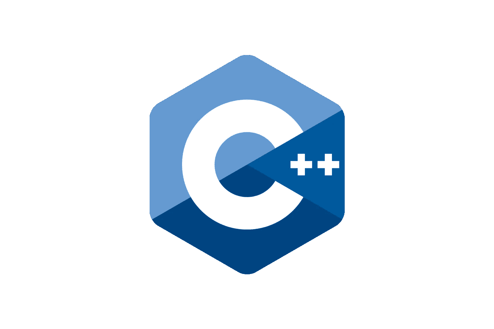

# 基本 C++。第二部分

> 原文：<https://blog.devgenius.io/basic-c-part-2-ce60f7b89216?source=collection_archive---------18----------------------->



在第 1 部分中，我们讨论了数据类型、初始化变量的方法、数组、指针和引用。由于从版本 17 开始增加了编写程序的新特性，一些例子也在 C++17 和更高版本中展示和给出。

这一次，我们将学习如何在 C++中建立条件和循环。将提供一些新版本的例子。

# 情况

**If 语句**

C++支持数学中常见的逻辑条件:

*   小于:`num1 < num2`
*   小于或等于:`num1 <= num2`
*   大于:`num1 >num2`
*   大于或等于:`num1 >=num2`
*   等于:`num1 == num2`
*   不等于:`num1 != num2`

if 语句根据给定的条件选择并执行语句。如果条件评估为**真**，则执行给定的一组语句。示例:

```
if(condition) {
  action1;
  action2;
  .....
}
```

另一方面，如果在该示例中条件为假，则跳过该条件并执行另一动作。示例:

```
if(condition) {  // this one is false
  action1;
  ....
}
action3; // this line will be runned
```

**If-else 语句**

除了 C++中的 if 语句，还可以添加`else`子句。示例:

```
if(condition) {
  action1;
  ...
} else {
  action3;
  ...
}
```

这种语句的工作方式是，如果条件为真，那么 if 中的操作将被执行，否则将被跳过，反之亦然。

**如果-否则如果-否则**

`if...else`语句用于在两个选项中执行一个代码块。然而，如果我们需要在两个以上的选项中做出选择，我们使用`if...else if...else`语句。示例:

```
if(condition1) {
  action1;
  ...
} else if(condition2) {
  action2;
  ...
} else {
  action3;
  ...
}
```

在本例中，将执行条件为真的操作。

在 C++中，可以使用嵌套条件。例如:

```
// example1
if(condition1) {
  ....
  if(condition2) {
    ....
  }
}
// example2
if(condition1) {
  if(condition2) {
    action1;
    ...
  } else {
    action2;
    ...
  }
}
```

**如果带初始化**

**注:**从 C++版本 17 开始，我们可以创建带有初始化的 if 语句。语法如下所示:

```
if(initialiation; condition) {
  action1;
} else {
  action2;
}
```

示例:

```
if(auto rnd = rand(); rnd % 2 == 0) {
  std::cout << "Even\n";
} else {
  std::cout << "Odd\n";
}
```

**Constexpr if**

从 C++17 开始，您可以在函数模板中使用`if constexpr`语句来进行编译时分支决策，而不必求助于微软文档中的多个函数重载[。](https://learn.microsoft.com/en-us/cpp/cpp/if-else-statement-cpp?view=msvc-170)

语法:

```
if constexpr(condition) {
  ...
}
```

示例:

```
constexpr auto num = 10;
if constexpr(num == 10) {
  std::cout << "true";
} else {
  std::cout << "false";
}
```

**Consteval if (C++23)**

根据 [C++文档](https://en.cppreference.com/w/cpp/language/if)的记载:

> *在 consteval if 语句中，* *c* 复合语句*和*语句*(如果有)* *都必须是复合语句。*
> 
> *如果* *语句*不是复合语句，*它仍将被视为 consteval if 语句的一部分(从而导致编译错误)*

这样的条目会出现在 [C++23](https://en.cppreference.com/w/cpp/23) 中。在 C++23 之前，有一个函数`std::is_constant_evaluated()`作为编译器内嵌的，结果是[错误](https://www.open-std.org/jtc1/sc22/wg21/docs/papers/2021/p1938r3.html)。正如在提案的文章中所写的，这个函数有两个问题:

1.  [constexpr 和 consteval](https://www.open-std.org/jtc1/sc22/wg21/docs/papers/2021/p1938r3.html#interaction-between-constexpr-and-consteval) 之间的交互；
2.  与写表达式直接相关的一个问题[。](https://www.open-std.org/jtc1/sc22/wg21/docs/papers/2021/p1938r3.html#the-if-constexpr-stdis_constant_evaluated-problem)

# 环

循环用于根据特定条件多次执行特定操作。C++语言有以下类型的循环:

*   for 循环
*   在…期间
*   做一会儿

**While 循环**

while 循环在其条件为真时执行一些代码，即返回 true。它有以下正式定义:

```
while(condition) {
  some_action;
}
```

在 while 关键字之后，括号中是一个条件表达式，表示**返回 true** 或 **false** 。然后，在花括号中，有一组**语句**组成了循环体。并且**当条件返回真**时，循环**的主体**中的**语句将被执行**。

例如:

```
int i = 1;
while(i < 10) {
  std::cout << i * i << "\n";
  i++;
}
```

而条件 i < 10 is true, the while loop will be executed, in which the square of the number is calculated and the variable i is incremented. At some point, the variable i will increase to 10, the condition i < 10 will return false, and the loop will end.

**为循环**

for 循环有以下正式定义:

```
for(expression_1; expression_2; expression_3) {
  some_action;
}
```

expression_1 在循环执行开始时执行一次，表示初始条件的设置，通常，这是计数器的初始化—用于控制循环的特殊变量。

expression_2 表示执行循环的条件。作为一个规则，比较操作被用作一个条件，如果它返回一个非零值(即条件为真)，则执行循环体，然后计算 expression_3。

expression_3 指定了循环参数的变化，通常这里循环计数器增加 1。

例如:

```
for(int i = 0; i < 10; i++) {
  std::cout << i * i << "\n";
}
```

**循环的范围(自 C++11 开始)**

从关于[基于范围的环路](https://en.cppreference.com/w/cpp/language/range-for)的文档中:

> 在一定范围内执行 for 循环。
> 
> 作为传统的[的等效物，用于循环](https://en.cppreference.com/w/cpp/language/for)在一个值范围内的操作，比如一个容器中的所有元素。

正式定义:

```
for(value : expression) {
    loop_statement;
}
```

例如:

```
int a[] = {1, 2, 3, 4, 5};
for(auto& i : a) {
  std::cout << i << " ";
}
```

从 C++17 开始，可以为地图编写范围循环(关于地图和 STL 库，我们将在另一个话题中讨论)。

例如:

```
for (auto&& [first, second] : some_map) {
  some_action;
}
```

**For each (STL <算法>库)**

STL 库和与之相关的一切，我们稍后会考虑，因为这是一个非常大而复杂的主题，涉及很多东西。

**注:**这个话题和下面将要讨论的一切，我以后会告诉你，但我决定写一下，让你对使用现代 C++编写复杂的东西有一个大致的了解。

C++中的 [for_each](https://en.cppreference.com/w/cpp/algorithm/for_each) 是一种遍历数组和类数组结构的算法。

for_each 有三个参数:要遍历的数据集的开始和结束，以及执行被遍历元素的主要处理的函数指针或 lambda 表达式或仿函数**(关于这一点我们将在稍后详细讨论)**。

你可以设置数组的边界，要么使用普通的指针，使用指针算法，要么使用迭代器，如果在被绕过的结构中有迭代器的话。例如，常规数组[]不假设迭代器，所以你需要为它们使用指针，而来自 std 名称空间的数组数组(可插拔的[包括<数组>](https://en.cppreference.com/w/cpp/container/array) )存储迭代器，因此迭代器对它们更好。关于迭代器我们下次会讨论。

例如:

```
#include <algorithm>
#include <iostream>

void show(int element) { // <- this function
  std::cout << element << " ";
}

int main() {
  int array[] = {1, 2, 3, 4, 5}; // <- regular array
  int length_array = sizeof(array) / sizeof(array[0]); // getting size of array
  std::for_each(array, array + length_array, show); // algorithm
}
```

**注意:**在这个例子中，数组中元素的数量没有被显式地设置，但是 C++数组，根据定义，总是有固定的容量，所以在初始化期间，一定数量的单元被分配给数组，由于我没有显式地指定单元的数量，所以我使用一个公式来计算它们的数量。

下一个例子展示了如何使用迭代器

```
#include <algorithm>
#include <iostream>
#include <vector>

void show(int element) { // <- this function
  std::cout << element << " ";
}

int main() {
  std::vector<int> array = {1, 2, 3, 4, 5};
  std::for_each(array.begin(), array.end(), show); // algorithm, specifying boundaries through iterators
}
```

**注意:**虽然数组[]不假设迭代器的存在，但是它们的迭代器可以使用 std::begin 和 std::end 函数。这比使用 length 要好，但是这只对数组有效，对作为数组的指针无效。

例如

```
#include <algorithm>
#include <iostream>

void show(int element) { // <- this function
  std::cout << element << " ";
}

int main() {
  int array[] = {1, 2, 3, 4, 5}; // <- regular array
  std::for_each(std::begin(array), std::end(array), show); // algorithm
}
```

算法很方便，因为您可以将不同的函数代入其中，绕过相同的数据集，同时保持代码外观的优雅。for_each 不仅允许您绕过，还允许您执行任何元素处理。如果我们写一个改变数据的函数，那么数组中的值也会改变。

**边做边**

在 do 循环中，首先执行循环代码，然后检查 while 语句中的条件。并且当该条件为真时，即不等于 0，则循环重复。循环的正式定义:

```
do {
  some_action;
} while(condition);
```

例如:

```
int i = 0;
do {
  std::cout << i * i << "\n";
  i++;
} while (i < 10);
```

**注意:**你会经常看到处理循环计数器的不同方式:递减或递增。对于初学编程的人来说，i++和++ I(I--和--I)之间的区别问题总是会出现。

摘自[斯蒂芬·普拉塔著](https://zhjwpku.com/assets/pdf/books/C++.Primer.Plus.6th.Edition.Oct.2011.pdf):

> 前缀版本在操作数之前，如`++x`。后缀版本在操作数之后，如在`x++`中。这两个版本对操作数有相同的影响，但它们发生的时间不同。
> 
> 符号`a++`表示“在计算表达式时使用 a 的当前值，然后增加 a 的值。”类似地，符号`++b`表示“首先增加 b 的值，然后在计算表达式时使用新值。”
> 
> 对于内置类型，使用哪种形式几乎没有区别。对于具有用户定义的递增和递减运算符的用户定义类型，前缀形式更有效。

**继续并中断循环**

有时有必要在循环完成前退出。在这种情况下，可以使用 break 语句。例如:

```
for(int i = 0; i < 8; i++) {
  if(i == 5) {
    break;
  }
}
```

当`i`等于 5 时，这个例子跳出循环。

与 break 语句不同，continue 语句跳转到下一个迭代。例如，我们只需要计算某个范围内奇数的和:

```
int result = 0;
for (int i=0; i<10; i++) {
    if (i % 2 == 0) continue;
    result +=i;
}
```

为了确定数字是否是偶数，我们得到整数除以 2 的余数，如果是 0，那么使用 continue 语句进入循环的下一次迭代。如果这个数是奇数，那么把它加到其余的奇数上。

希望你喜欢这篇文章，尤其是 C++编程的新手可以从这篇文章中受益。在下一篇文章中，我将解释函数。