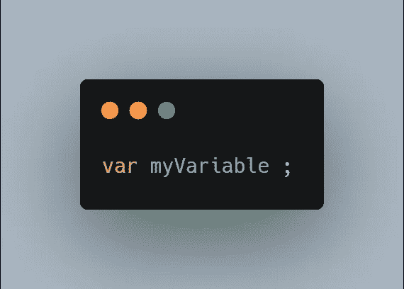
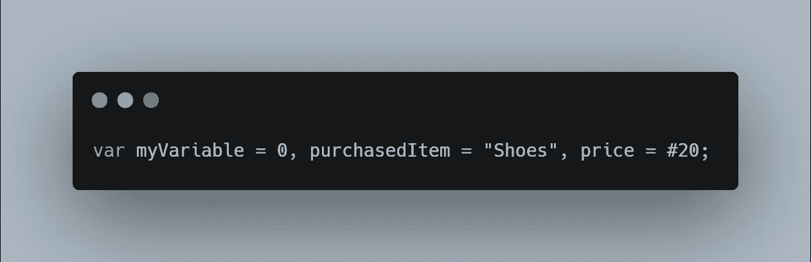
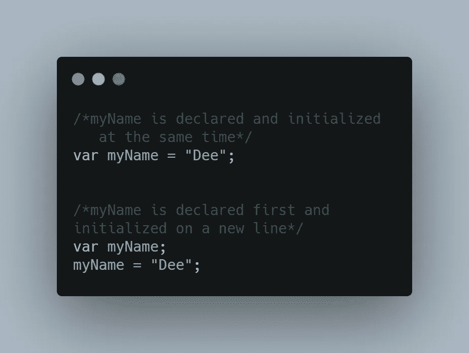
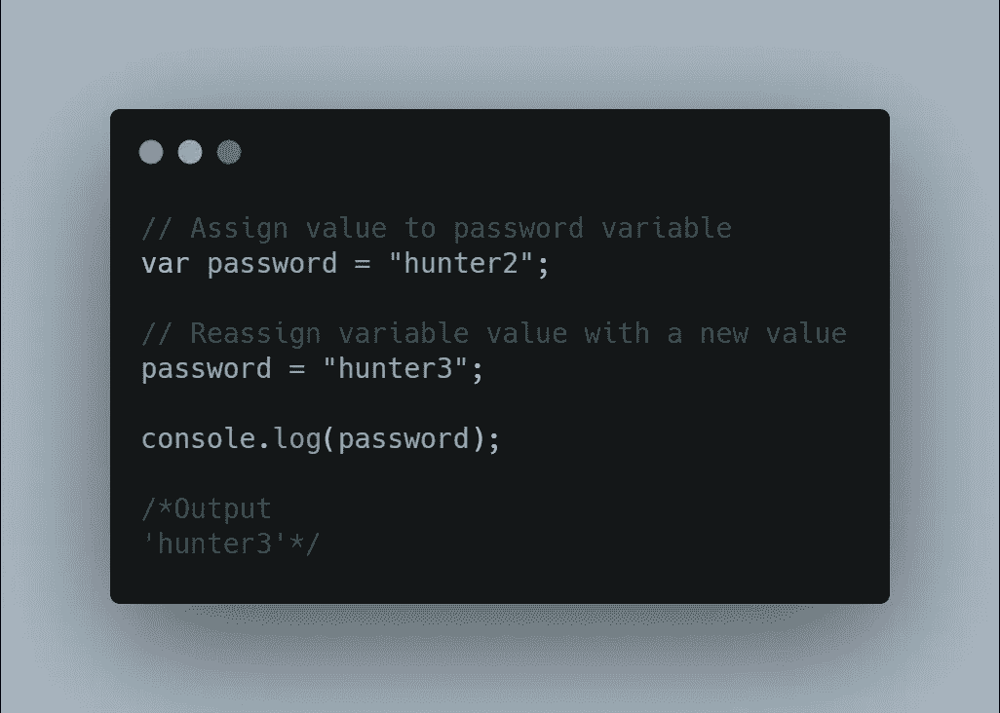
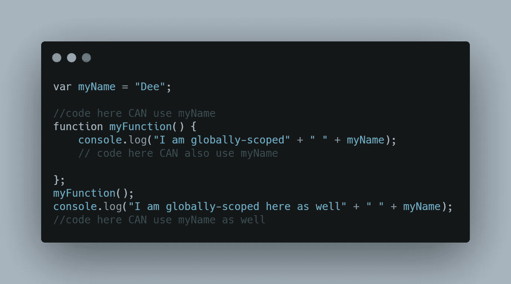
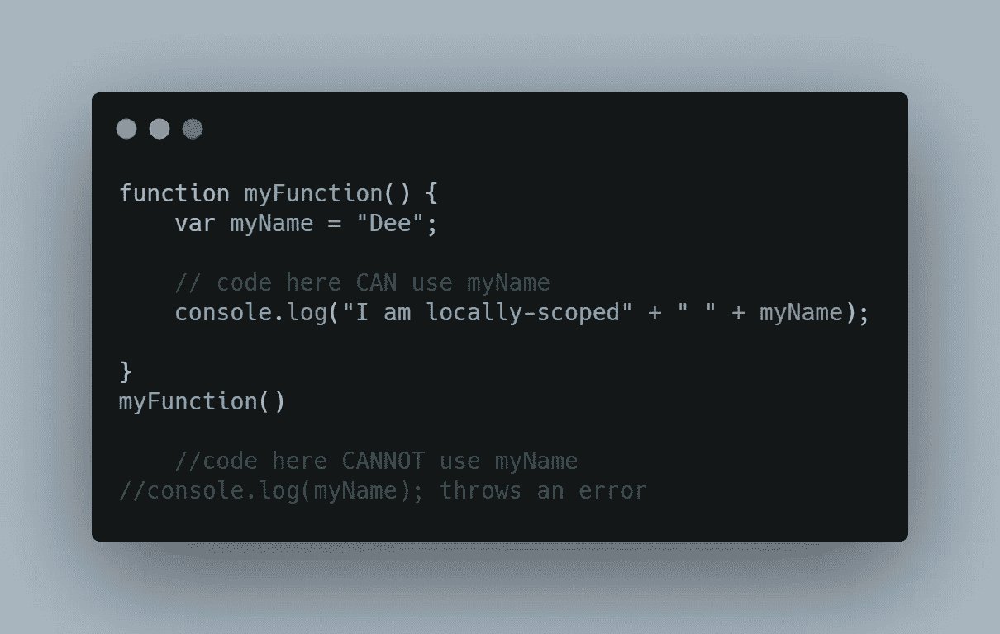

# JAVASCRIPT 变量和范围的基本概念

> 原文：<https://blog.devgenius.io/basic-concept-of-javascript-variables-and-scope-9e3567665c74?source=collection_archive---------13----------------------->

每一个构建都需要一个坚实的基础，理解 JavaScript 中变量和变量作用域的基本概念是构建代码变得更加容易的基础。JavaScript 中变量有许多不同的属性，在命名变量时也必须遵循一些规则。本文介绍了 JavaScript 变量的概念和范围。

**内容**

1.  理解 JavaScript 变量
2.  声明和初始化变量
3.  命名变量的技巧
4.  变量作用域
5.  摘要

> **理解 JAVASCRIPT 变量**

变量可以被认为是命名容器。您可以将数据放入这些容器中，然后简单地通过将容器命名为
来引用数据，而不必在每个实例中一个接一个地命名值。
变量是计算机程序中存储数值的计算机内存位置的名称。在 JavaScript 程序中使用变量之前，必须声明它。在 JavaScript 中创建变量的概念被称为**变量声明**。
使用 ***var*** 关键字声明变量，如下所示:

var<variable-name></variable-name>

变量声明

通常，计算机编程是存储和部署指令序列以由计算机执行特定任务的过程。在 JavaScript 中，这些指令和值的序列存储在变量中。变量可以保存或存储任何数据类型的值，因此您不必在变量声明期间指定值的类型。因此，变量的值类型可以在程序执行过程中改变，JavaScript 会自动处理。从技术上讲，在声明变量之后，直到在变量中存储值之前，该值是未定义的。存储数据或给变量赋值的概念被称为**变量初始化**。变量可以用来表示任何 JavaScript 数据类型，如字符串、数字、对象、布尔值和空值，并且可以使用相同的 var 关键字同时声明多个变量，如下所示:

多变量声明

> **声明并初始化变量**

声明和初始化变量有两种方式:
可以同时声明变量并赋值，也可以先初始化变量，然后再存储值，例如；

变量声明和初始化

可变数据可以在它的内存中被访问和修改，从而可以给它重新赋值。下面的简化示例演示了如何将密码存储到变量中，然后进行更新。

更新变量

> **变量命名技巧**

命名变量时；

*   对于文档中的任何变量名，只需声明或初始化一次。您不应该两次重新声明同一个变量。
*   您不应该使用任何 JavaScript 保留关键字作为变量名。例如，中断、继续等。
*   变量名不应以数字(0–9)开头。它们必须以字母或下划线(_)字符开头。
*   变量名不能包含任何空白字符(制表符或空格)

变量名区分大小写。比如 name 和 Name 是两个不同的变量。命名变量最常用的方法是使用 **camelCase** 。当使用 camelCase 时，多单词变量名的第一个单词是小写的，每个后续单词的第一个字母是大写的(例如上面的 var **myName** )。

> **可变范围**

在 JavaScript 中，理解变量的范围对于解决技术问题很重要。变量的作用域是程序中定义它的区域。作用域规则因语言而异，在 JavaScript 中我们有两个作用域，即:全球和本地。

*   全局变量范围

全局变量具有全局范围，这意味着它可以在 JavaScript 代码中的任何地方定义。全局变量是在函数外部声明的，因此可以从代码中的任何地方访问它。

比如说；

全局变量范围

*   局部变量范围

局部变量只在定义它的函数中可见。函数参数始终是该函数的局部参数，这意味着在该函数中声明的任何变量都只能从该函数以及该函数中的任何其他函数中访问。

比如说；

局部变量范围

变量的作用域决定了代码不同部分的变量、对象和函数的可访问性。例如，嵌套函数可以访问在其外部作用域中声明的变量。不管函数是从哪里调用的，甚至是如何调用的，它的作用域只取决于函数是在哪里声明的。通常建议您声明块范围的变量，因为它们生成的代码不太可能无意中重写变量值。

> **总结**

JavaScript 中的变量是动态类型的，它可以在整个生命周期中存储任何数据类型的值，并且以后可以更改。可以使用 *var* 关键字定义它们，并且在使用它们之前必须对它们进行初始化。
变量的范围由它在代码中的位置决定，这反过来决定了代码中变量和函数的可访问性。
理解变量的基础知识和变量的作用域，使得代码的阅读和解释变得容易。

> 本文旨在帮助初学者理解变量和作用域的基础知识，从而使高效地解释和编写代码变得容易。我希望这是理解 JavaScript 变量概念的一个很好的介绍。

> 为了进一步研究:

*   [MDN 网络文档](https://developer.mozilla.org/en-US/docs/Web/JavaScript/Reference/Statements/var#:~:text=The%20scope%20of%20a%20variable,declared%20outside%20any%20function%2C%20global.)
*   [Stackoverflow](https://stackoverflow.com/questions/762011/whats-the-difference-between-using-let-and-var#:~:text=The%20main%20difference%20is%20the,outside%20the%20loop%20for%20example.&text=This%20is%20unlike%20the%20var,function%20regardless%20of%20block%20scope.)
*   [W3schools](https://www.w3schools.com/js/js_scope.asp)

