# 熊猫的基础数据探索和操作

> 原文：<https://blog.devgenius.io/basic-data-explorand-manipulation-in-pandas-4b35d976acab?source=collection_archive---------4----------------------->

## 熊猫的基本数据操作技术列表。

照片由 [pixel2013](https://pixabay.com/users/pixel2013-2364555/) 发自 [pixabay](https://pixabay.com/)

一旦您将数据加载到 pandas 数据框架中，就该熟悉使用它的基本知识了。下面是我认为你应该首先学习的一些基础知识。我将使用与上一篇文章相同的数据集— [**用熊猫**](https://medium.com/@zoltan.guba/reading-excel-files-with-pandas-the-basics-6a6be9cc8763) 读取 Excel 文件。

 [## 用熊猫阅读 Excel 文件-基础

### 读写文件通常是你需要在编码中能够执行的基本过程之一。正在阅读…

medium.com](https://medium.com/@zoltan.guba/reading-excel-files-with-pandas-the-basics-6a6be9cc8763) 

## **DataFrame.head()**

返回数据帧中第一个选定的行数和所有列数。默认情况下，它返回前 5 行，但是您可以给定任何整数作为参数。这种方法的主要用例是在加载后查看您的数据，看是否一切都在适当的位置——比如您的头名称、数据类型。

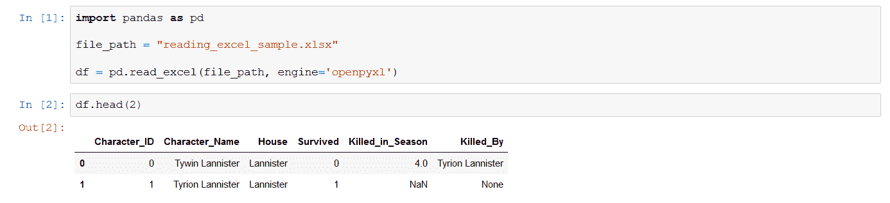

作者截图

## **DataFrame.tail()**

就像 head()一样，该方法返回行的样本，但是，这是从数据帧的最后一行开始，并根据您的选择选择最后 n 行。

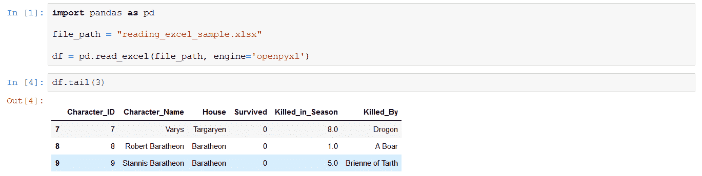

作者截图

## **Series.unique()**

以数组形式返回序列中的唯一值。

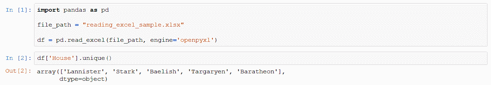

作者截图

## **Series.value_counts()**

对序列调用的 value_counts 方法返回序列中每个唯一值的出现次数。非常有用，因为它不仅给出了一列中的唯一值，还给出这些值的总数。

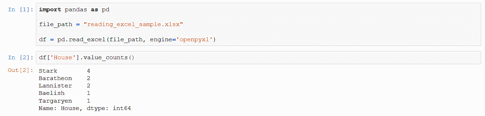

作者截图

## **Dataframe.shape**

以元组的形式返回数据帧中的行数和列数。

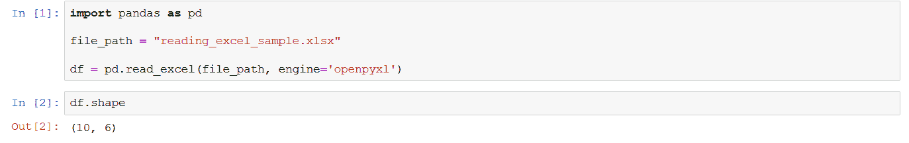

作者截图

> 如果你想让我保持咖啡因创造更多这样的内容，请考虑支持我，只要一杯咖啡。

## **DataFrame.dtypes**

返回数据框架中系列(列)的数据类型。

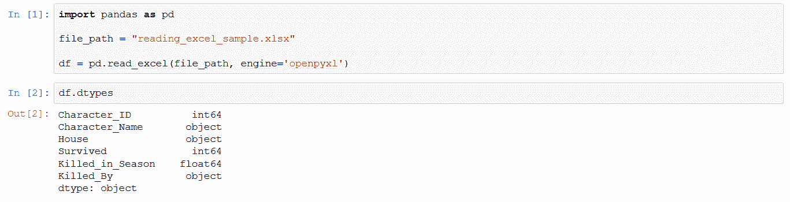

作者截图

## **过滤行**

假设您只想选择数据中的特定行。最基本的方法是根据列值给出一个标准。想象一下，你想列出这个系列中以这样或那样的方式死去的所有角色:

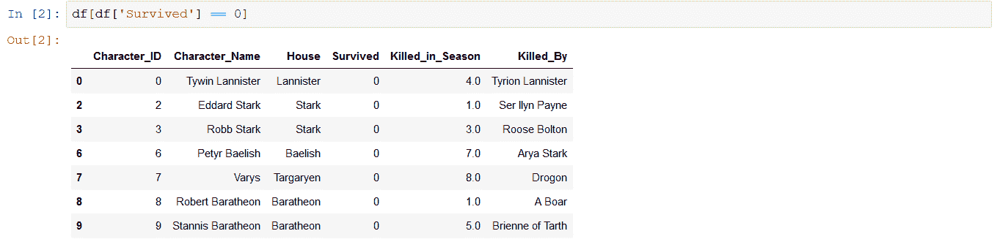

作者截图

这里的语法可能有点混乱，但是不用担心，它非常简单。

每当逻辑语句返回 True 时，返回的数据帧将包含该行，从而进行过滤。如果您想在将来使用这个过滤的 DF，不要忘记将这个视图分配给一个新的变量。

## **选择列**

将数据框架缩小到列的子集非常容易。想象一下，你只想知道一个角色是否幸存，没有额外的数据:

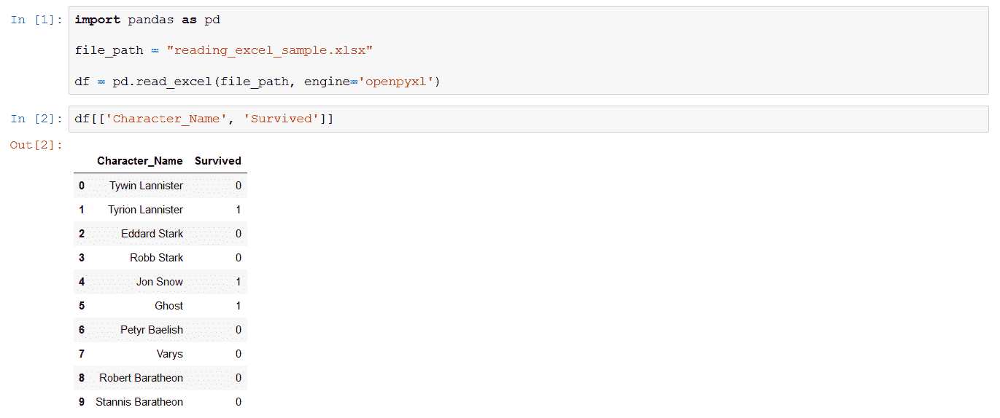

作者截图

我们只需要提供列名列表(字符串列表)，用括号括起来。这就是你告诉 Pandas 你希望数据以数据帧的形式返回的方式——你没有其他选择..如果省略额外的大括号，可以将一列恢复为一个系列，但这只适用于一列:

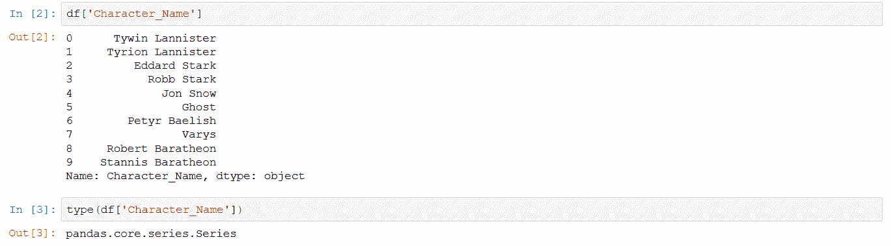

作者截图

## **DataFrame.drop()**

这是一种从数据帧中删除列或行的方法。您可以执行以下任一操作:

1.  在要删除的“labels”关键字之后提供单个标签或标签列表，然后提供“axis”关键字，以指定是要删除行(axis=0，所提供的标签是索引标签)还是列(axis=1，所提供的标签是列标签)。
2.  对单个标签或要删除的标签列表使用“index”或“columns”关键字。使用这些关键字使得“轴”的使用变得不必要。

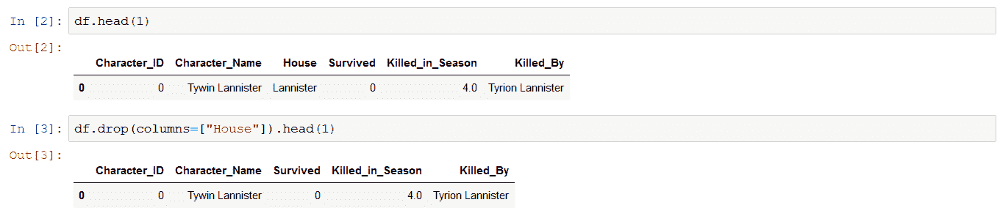

作者截图

## **增加一列**

添加新列时，只需指定列名和要分配给该列的值:

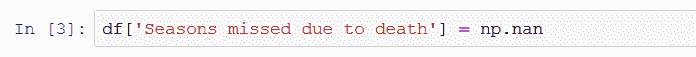

作者截图

在本例中，我选择用 NaN 值填充该列——如果您不想马上编写逻辑，这是一个好的开始。

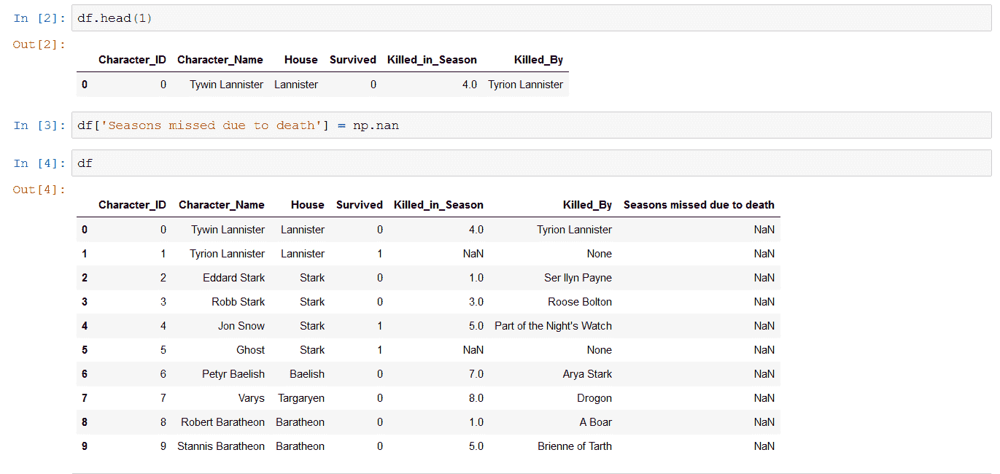

作者截图

正如您所看到的，一个新的列被附加到我们的 DF 的末尾，具有指定的 NaN 值。

## **Dataframe.rename()**

在与您的新鲜和清晰的数据框架玩了一会儿之后，您可能会发现一些最初的列名或您选择的列名不再有用。您可以在 DataFrame 上应用 rename 方法来解决这个问题:只需提供一个字典作为输入，键将是原始的列名，值是新的列名。

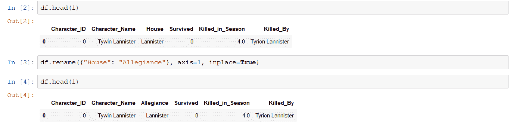

作者截图

注意“inplace”关键字:True 值意味着原始数据帧将被修改，该方法返回 None —缺省值为 inplace=False，这样，如果要继续使用修改后的数据帧，就必须将其赋给一个变量。

## **Dataframe.sort_values()**

尽管 sort_values 可以做更多的事情，但是现在对您来说最基本和最有可能的用例是按照特定的列或列集合对数据帧进行排序。为此，您只需提供列名(作为字符串)或列名列表(作为字符串列表)来对数据进行排序。

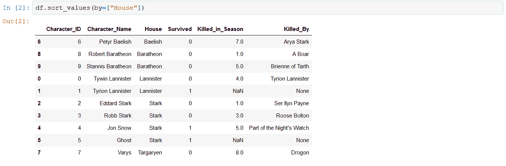

作者截图

您也可以通过索引对数据帧进行排序，甚至可以选择要使用的排序算法，但目前这些都无关紧要。唯一可以派上用场的参数是“ascending ”,它定义了排序是升序还是降序——默认情况下，该参数的值为 True，如果您希望数据以降序排序，请将其值设置为 ascending=False。

## **处理缺失值**

有时需要处理缺失值(准确地说，NaN 代表非数字，Numpy 常数代表缺失值，如果您来自更多的 SQL 词汇表，则为 NULL ),以便继续处理数据集。 **fillna()** 方法既可以应用于序列，也可以应用于数据帧。

您可以执行以下任一操作:

1.  提供一个值来替换整个系列/数据框架中的 NaN 值
2.  提供一个字典来指定使用什么值作为替换，其中键指定索引(对于序列)或列(对于数据帧)。

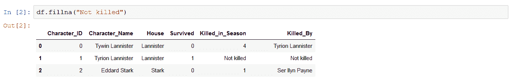

作者截图

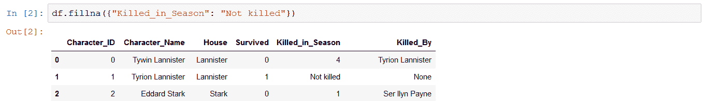

作者截图

## **data frame . drop _ duplicates()**

使用 drop_duplicates 方法，重复处理非常简单:

1.  如果希望将它应用于所有列，只需在整个数据帧上调用该方法:这将比较每一行中的所有值，并删除重复的条目。
2.  如果您的 duplicate 定义稍微复杂一点，并且您只想检查一个或两个列值的重复值，则使用 subset 参数为筛选提供一个或多个列名(字符串或字符串列表)。

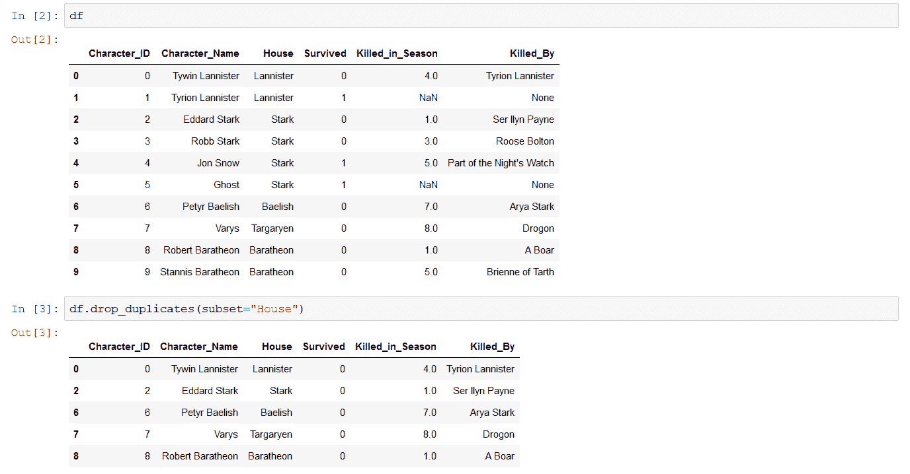

作者截图

## 摘要

当然，在数据探索和操作中什么是最基本的取决于手头的具体任务，但是上面的列表(远非完整)可以为您可能遇到的几乎任何情况提供一套很好的工具。一旦您熟悉了基础知识，开始使用更高级的功能就容易多了。