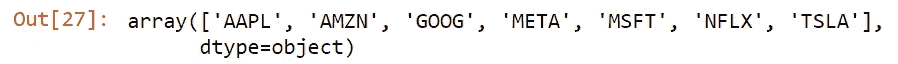

# Python 基础数据准备(股票价格数据)

> 原文：<https://blog.devgenius.io/basic-data-preparation-with-python-stock-price-data-1c3984ccb375?source=collection_archive---------9----------------------->

Python 股票价格分析 03:学习股票价格数据的典型数据准备过程

# Python 股票价格数据分析系列

1.  [用 Python 提取股票价格](https://medium.com/dev-genius/extract-stock-price-data-with-python-fa53300120e0)
2.  [用 Python 提取股票价格列表](https://medium.com/dev-genius/extract-stock-prices-with-python-multiple-stocks-fe2209261cfd)


Canva 提供的模板——Tetiana SHYSHKINA 在 [Unsplash](https://unsplash.com/photos/trv87p_LMUw?utm_source=unsplash&utm_medium=referral&utm_content=creditCopyText) 上拍摄的照片

# 目录

> [简介](#7ae2)
> [数据&资源](#3486)
> [读取文件](#a985)
> [转换成熊猫数据帧](#547a)
> [标注上各自的跑马灯符号](#8e64)
> [追加多个表格](#59d8)
> [输出数据](#346a)
> [视频教程](#66be)
> [结论](#142a)
> [关于我](#fed3)

# 介绍

在我之前的[文章](https://medium.com/dev-genius/extract-stock-prices-with-python-multiple-stocks-fe2209261cfd)中，我谈到了使用 Python 在线提取股票价格列表。在本教程的最后，我将数据存储在多个 JSON 文件中。

作为一名数据科学家或数据工程师，您可能会被要求在将文件推入数据库之前，将数百个(如果不是数千个)文件转换到一个表中。这些文件可以是 CSV、JSON、.xlsb 等。

在本教程中，我们将把在前面的教程中得到的这些 JSON 文件合并成一个文件。

# 数据和资源

数据:[g 驱动链接](https://drive.google.com/drive/folders/179VLS1bWyAmXZJMBy2rMd1OegtNEXGUC?usp=share_link)

中等:[medium.com/@foocheechuan](https://medium.com/@foocheechuan)

Youtube: [车志川](https://www.youtube.com/channel/UC73tyElpkCE_6cbZxMLKnkw)

如果您没有遵循我上一篇文章中的教程，请下载上面的数据。

# 阅读文件

我使用相对路径导航到我上一篇文章中使用的文件夹。在您的情况下，您可以只使用 path = '您的文件夹路径'。

然后我们使用 os.listdir 列出该文件夹中的所有文件。

```
import os
path = os.path.abspath(f"../04 Extract Stock Prices in Bulk/JSON")
json_folder = os.listdir(path)
json_folder
```


json_folder 中的文件列表

由于文件夹中有多个文件，我们需要遍历这些文件并逐个读取。

```
import json

for files in json_folder:
    # Reading from json file
    with open(f'{path}\\{files}', 'r') as openfile:
        json_object = json.load(openfile)
```

如果我们只是在每次读取文件时不断替换数据，那也没什么。因此，在继续下一个元素之前，让我们将 json_object 转换成 pandas 数据帧。

# 转换成熊猫数据框

在每个循环中将 json_object 转换为 pandas 数据框。我将复制我在[上一篇关于在线提取股票价格的文章](https://medium.com/dev-genius/extract-stock-price-data-with-python-fa53300120e0)中使用的代码。

```
import pandas as pd
import json

for files in json_folder:
    # Reading from json file
    with open(f'{path}\\{files}', 'r') as openfile:
        json_object = json.load(openfile)
    data = json_object['Time Series (Daily)']

    # Convert into data frame
    df = pd.DataFrame.from_dict({(i): data[i] 
                           for i in data.keys()},
                       orient='index')
    df_date = df.rename_axis('Date').reset_index()
```

这将有助于将我们的每个 JSON 文件转换成以下格式。


熊猫数据框

# 标有各自的股票代号

数据框有一个问题。当我们遍历所有股票数据时，在将它们追加到一个表中后，我们不知道这些数据属于哪只股票。也就是说，我们需要在数据帧中创建一个列来标记其各自的股票代码。

在 python 中，一个字符串变量可以被视为一个可迭代的数组，因此我们可以使用 substring 方法来检索文件名的前 4 个字母

```
# Extract first 4 letters of the file names
for files in json_folder:
    print(files[:4])
```


文件名的前 4 个字母


原始文件名

将代码添加到循环中。

```
import pandas as pd
import json

for files in json_folder:
    # Reading from json file
    with open(f'{path}\\{files}', 'r') as openfile:
        json_object = json.load(openfile)
    data = json_object['Time Series (Daily)']

    # Convert into data frame
    df = pd.DataFrame.from_dict({(i): data[i] 
                           for i in data.keys()},
                       orient='index')
    df_date = df.rename_axis('Date').reset_index()

    # Add a column for the stock's ticker
    df_date['Ticker'] = files[:4]
```

现在，我们可以将数据表追加到一个表中。

# 追加多个表格

我们需要首先创建一个名为 df_all 的空数据框，然后才能将所有股票价格表追加到这个空表中。注意，这个声明是在 for 循环之前完成的。

这样，我们将在每个循环中替换 df 和 df_date，但是 df_all 不会被替换，它将存储前一个循环中的所有表。

```
import pandas as pd
import json

df_all = pd.DataFrame()

for files in json_folder:
    # Reading from json file
    with open(f'{path}\\{files}', 'r') as openfile:
        json_object = json.load(openfile)
    data = json_object['Time Series (Daily)']

    # Convert into data frame
    df = pd.DataFrame.from_dict({(i): data[i] 
                           for i in data.keys()},
                       orient='index')
    df_date = df.rename_axis('Date').reset_index()

    # Add a column for the stock's ticker
    df_date['Ticker'] = files[:4]
    df_all = pd.concat([df_all,df_date])
else:
    display(df_all)
```


组合数据表

检查 df_all 是否有我们需要的所有库存。

```
df_all['Ticker'].unique()
```



**复位指数**

请注意，有 30653 行数据，但最后一个索引是 3142。发生这种情况是因为当我们将表追加到一起时，每个表的索引没有被重置，并且该索引仍然作为它在原始表中的索引。所以我们需要重置组合表中的索引。

```
df_out = df_all.reset_index(drop=True)
```

# 输出数据

将数据输出到同一个文件夹(创建了一个名为 Output 的文件夹来存储最终数据)

```
output_path = os.path.abspath(f".\\Output")
df_out.to_csv(f'{output_path}\\FAANG-MT Combined Data.csv',index=False)
```

# 视频教程

# 结论

今天的文章到此为止。感谢您阅读今天的文章。下一篇文章再见。


照片由 [Jexo](https://unsplash.com/@jexo?utm_source=unsplash&utm_medium=referral&utm_content=creditCopyText) 在 [Unsplash](https://unsplash.com/s/photos/preparation?utm_source=unsplash&utm_medium=referral&utm_content=creditCopyText) 上拍摄

# 关于我

目前担任数据科学家。我为世界各地的客户提供数据分析问题的咨询、培训和专业服务。我很乐意分享我作为顾问的经验，这样每个人都可以从中学到一些东西。

领英:[https://www.linkedin.com/in/foocheechuan/](https://www.linkedin.com/in/foocheechuan/?source=about_page-------------------------------------)

中:【medium.com/@foocheechuan】T2

Youtube: [车志川](https://www.youtube.com/channel/UC73tyElpkCE_6cbZxMLKnkw)