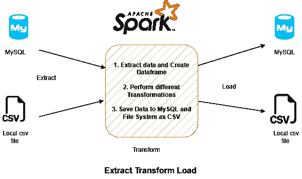

# 使用 Pyspark 的基本 ETL

> 原文：<https://blog.devgenius.io/basic-etl-using-pyspark-ed08b7e53cf4?source=collection_archive---------1----------------------->

在本文中，我们将使用 PySpark 执行 ETL 操作。



我们使用两种类型的源代码，MySQL 作为数据库，CSV 文件作为文件系统。摘录 2。变形 3。加载。

> 我们总共有 3 个数据源——两个表 CITY、COUNTRY 和一个 csv 文件 COUNTRY_LANGUAGE.csv

我们将创建 4 个 python 文件。

***job.py*** —逐步执行 ETL 操作(提取转换和加载)
***constant . py***—存储所有常量细节，如列、spark 实例和与连接相关的列。
***Extract . py***—通过创建 dataframe 提取源数据。
***transform . py***—所有的转换逻辑都在这里。我们将使用提取的数据帧来完成所有的转换。
***load . py***—将清理后的数据存储到数据库或文件系统中。

首先，我们将提取所有数据并创建一个 spark 数据帧，然后我们将对这些数据帧进行转换。

我们先在 ***constant.py*** 下创建函数 ***spark_inst()*** 来发起 SparkSession。每当我们需要一个 Spark 实例时，我们可以调用 ***spark_inst()*** 函数。

```
from pyspark.sql import SparkSession

#  Using this function as spark instance
def spark_inst():
    return SparkSession.builder.master("local[*]")\
           .appName('Spark')\
           .getOrCreate()
```

现在，我们将使用 extract.py 文件提取源数据，在该文件中我们创建了 extract 函数。在此之下，我们将为不同的数据源创建数据框架。

我们正在从不同的源读取数据，以确定我们正在使用哪个源，我们必须创建一个 ***类型*** 参数来标识源，即数据库或文件系统，并基于此创建数据帧。MySQL 的“JDBC”和文件系统的“CSV”。

```
#extract.py

from pyspark.sql import SparkSession

def extract(spark: SparkSession, type: str, source: str):

    # Read data from mysql database
    if type=="JDBC":
       output_df =     spark.read.format("JDBC").options(url='jdbc:mysql://localhost/world',dbtable=source,driver='com.mysql.cj.jdbc.Driver',user='root',password='root').load()
       return output_df

    if type=="CSV":
    # read data from filesystem
       output_df = spark.read.format("CSV").options(header=True,inferSchema=True).load(source)
       return output_df
```

下面是创建的数据框架的模式和列。

CITY
|—ID:integer(nullable = true)
|—Name:string(nullable = true)
|—country code:string(nullable = true)
|—District:string(nullable = true)
|—Population:integer(nullable = true)

国家
| —代码:string (nullable = true)
| —名称:string (nullable = true)
| —洲:string (nullable = true)
| —地区:string (nullable = true)
| —表面积:decimal(10，2)(nullable = true)
|—indepiear:integer(nullable = true)
|—人口:integer (nullable = true)
| —寿命:decimate(3
|—local name:string(nullable = true)
|—government form:string(nullable = true)
|—head of state:string(nullable = true)
|—Capital:integer(nullable = true)
|—code 2:string(nullable = true)

COUNTRY _ LANGUAGE
|—COUNTRY code:string(nullable = true)
|—LANGUAGE:string(nullable = true)
|—iso official:string(nullable = true)
|—Percentage:double(nullable = true)

现在我们必须转换这些数据，在此之前我们需要列细节，来声明那些我们使用的 ***constant.py*** 文件。

在转换中，我们将重命名列，我们必须映射旧列名和新列名，为此，我们将使用字典，因为它具有键-值对，我们将使用键作为旧列名，使用值作为新列名。下面我们已经声明了基于所有三个来源的所有新旧列。

```
# constant.py

CITY_COL_DICT={
     "ID": "city_id",
     "Name": "city_name",
     "CountryCode": "country_code",
     "District": "city_district",
     "Population": "city_population"
}
COUNTRY_COL_DICT={
     "Code": "country_code",
     "Name": "country_name",
     "Continent": "continent",
     "Region": "region",
     "SurfaceArea": "surface_area",
     "IndepYear": "independence_year",
     "Population": "country_population",
     "LifeExpectancy": "life_expectancy",
     "GNP": "gross_national_product",
     "GNPOld": "old_gross_national_product",
     "LocalName": "local_name",
     "GovernmentForm": "government_form",
     "HeadOfState": "head_of_state",
     "Capital": "capital",
     "Code2": "country_code_2"
}
COUNTRY_LANGUAGE_COL_DICT={
     "CountryCode": "country_code",
     "Language": "language",
     "IsOfficial": "is_official_language",
     "Percentage": "language_percentage"
}
```

正如我们所看到的,“country_code”在所有数据帧中都很常见，我们将使用该列进行连接操作，之后，我们将只选择必需的列，而不是所有列。所以我们也声明一下。

```
# constant.py

JOIN_ON_COLUMNS=['country_code']
JOIN_TYPE="left"
SPEC_COLS=[
     "country_code",
     "country_name",
     "region",
     "surface_area",
     "independence_year",
     "country_population",
     "life_expectancy",
     "local_name",
     "head_of_state",
     "capital",
     "country_code_2",
     "city_id",
     "city_name",
     "city_district",
     "city_population",
     "language",
     "is_official_language",
     "language_percentage"
]
```

下面我们在 transform.py 中添加转换逻辑，如下图。

1.  rename _ cols 重命名所有列。
2.  specific_cols —仅提取所需的列。
3.  join _ df 基于“国家代码”连接数据框架

```
# transform.py

from pyspark.sql import DataFrame

def rename_cols(df: DataFrame, mapping_dict: dict) ->DataFrame:
    # Rename all the columns
    '''
    :param df: input dataframe
    :param mapping_dict: dict of columns names
    :return: ouput dataframe
    '''
    for key in mapping_dict.keys():
        df=df.withColumnRenamed(key,mapping_dict.get(key))
    return df

def specific_cols(df: DataFrame, specific_cols: list):
    # get specific cols df
    '''
    :param df: input dataframe 
    :param specific_cols: list of columns names
    :return: ouput dataframe
    '''
    return df.select(specific_cols)

def join_df(left_df: DataFrame, right_df: DataFrame, ON_COLUMNS:list, JOIN_TYPE: str)->DataFrame:
    # Join two dataframes
    '''
    :param left_df: input dataframe
    :param right_df: input dataframe
    :param ON_COLUMNS: list of columns to perform join
    :param JOIN_TYPE: Join type
    :return: ouput dataframe
    '''
    output_df=left_df.alias("left_df").join(right_df.alias\("right_df"), ON_COLUMNS, JOIN_TYPE)
    return output_df
```

现在让我们创建 load.py 文件，并编写代码将清理后的数据存储到 MySQL 和文件系统中。

```
# load.py

from pyspark.sql import DataFrame

def load(type: str, df: DataFrame, target: str):
    # Load the data based on type
    '''
    :param type: Input Storage type (JDBC|CSV) Based on type data stored in MySQL or FileSystem
    :param df: Input Dataframe
    :param target: Input target 
             -For filesystem - Location where to store the data
             -For MySQL - table name
    '''

    # Write data on mysql database with table name
    if type=="JDBC":
       df.write.format("JDBC").mode("overwrite")\
.options(url='jdbc:mysql://localhost/world',dbtable=target,driver='com.mysql.cj.jdbc.Driver',user='root',password='root').save()
       print(f"Data succesfully loaded to MySQL Database !!")

    if type=="CSV":
    # Write data on filesystem
       df.write.format("CSV").mode("overwrite").options(header=True).save(target)
       print(f"Data succesfully loaded to filesystem !!")
```

为了在 ETL 步骤中执行代码，我们将使用 ***job.py*** 文件执行所有函数。我们将把所有的模块(extract.py，transform.py，load.py)和常量变量(constant.py)导入到 job.py 中

```
# job.py

# Imported required libraries and modules
from pyspark.sql import SparkSession
from metadata.constant import CITY_COL_DICT, COUNTRY_LANGUAGE_COL_DICT, COUNTRY_COL_DICT, \
JOIN_TYPE,JOIN_ON_COLUMNS, SPEC_COLS, spark_inst
from extract import extract
from transform import rename_cols, join_df, specific_cols
from load import load

# Initiating and Calling SparkSession
SPARK=spark_inst()

#### Extract ####

# Extracting CITY and COUNTRY data from MYSQL
city_df = extract(SPARK,"JDBC","city")
country_df = extract(SPARK,"JDBC","country")

# Extracting COUNTRYLANGUAGE data from FileSystem
country_language_df = extract(SPARK,"CSV","filesystem/countrylanguage.csv")

#### Transformation ####

# 1\. Rename Columns
city_df = rename_cols(city_df, CITY_COL_DICT)
country_df = rename_cols(country_df, COUNTRY_COL_DICT)
country_language_df = rename_cols(country_language_df, COUNTRY_LANGUAGE_COL_DICT)

# 2\. Join DF with common column "country_code"
country_city_df=join_df(country_df, city_df, JOIN_ON_COLUMNS, JOIN_TYPE)
country_city_language_df= join_df(country_city_df, country_language_df, JOIN_ON_COLUMNS, JOIN_TYPE)

# 3\. Get specific cols
country_city_language_df = specific_cols(country_city_language_df, SPEC_COLS)

#### Load Data ####

# MySQL
load("JDBC",country_city_language_df, "CountryCityLanguage")

# FileSystem
load("CSV",country_city_language_df, "output/countrycitylanguage.csv")
```

现在，您的数据将作为 CSV 文件存储在 MySQL 数据库和文件系统中。

代码库:-[https://github.com/rohitrsp898/Basic_ETL_PySpark](https://github.com/rohitrsp898/Basic_ETL_PySpark)

您还可以使用 Pandas 来了解基本的 ETL。

编码快乐！！