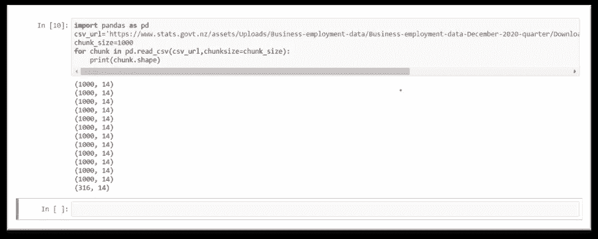
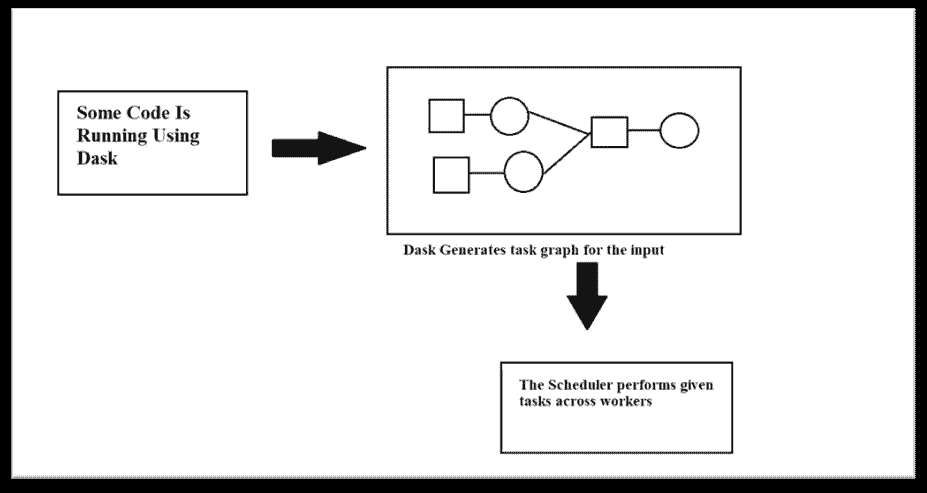
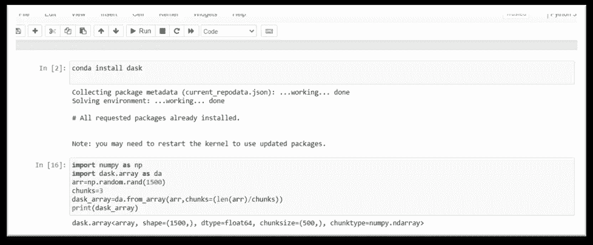
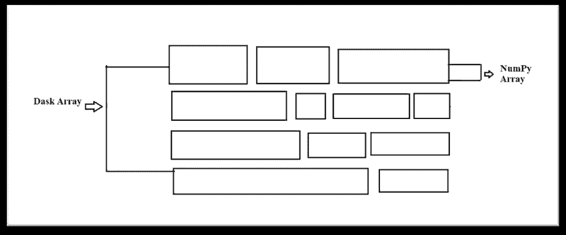
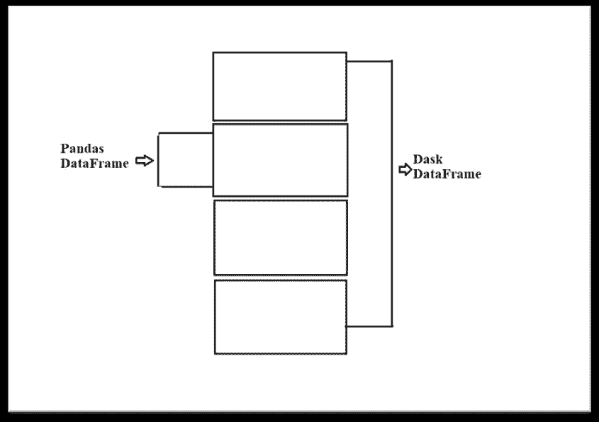

# DASK 的基本介绍

> 原文：<https://blog.devgenius.io/basic-introduction-to-dask-4ce201f1829d?source=collection_archive---------16----------------------->

当我们处理数据科学时，Pandas 是 python 的一个有用的库。熊猫允许你处理更多的数据集。熊猫主要处理表格数据。Pandas 是一个非常流行的用于数据操作和分析的 python 库。Pandas 可以轻松处理 1 到 30GB 的数据文件，块大小几乎超过数据文件，块可以帮助 pandas 加载较小块大小的大数据文件。

**我们用例子来理解:**

这里你可以看到，除了最后一行，所有块的大小都是 1000，熊猫将加载剩余的行，在上面的例子中是 316。

但是当处理大型数据集时，熊猫的性能变得非常慢。它没有多处理环境。如果我们想要处理更大的数据集呢？有什么办法吗？

答案是肯定的。我们可以在时间限制内对较大的数据文件执行操作。在‘Dask’的帮助下是有可能的。

# **Dask 是什么？**

Dask 是一个提供并行处理环境的备选库。它可以轻松地在多台机器上运行。它帮助你用不同的库运行你的文件，如 numpy，pandas，scikit-learn 等。与 dask 合作非常灵活。

它还支持 numpy 数组和 pandas 数据帧。它用更少的时间提供快速反馈。为了避免大量使用内存，dask 有助于在低内存中执行操作。

# 为什么是达斯克？

现在你悄悄地熟悉了一个 dask。所以知道 dask 为什么真的有用很重要？

1.Dask 在多核系统上工作，在分布式集群上运行。

2.Dask 衡量熊猫，numpy 和 sci kit-学习更有效。它是与这些库共同开发的

3.Dask 可以轻松处理更复杂的应用程序。

4.Dask 几乎类似于阿帕奇火花。Dask 在功能上比 spark 简单多了。

# **Dask 型号**

在上图中，用户使用 dask 编写了一些代码。dask 为输入创建一个任务图。调度器将简单地执行任务图。Scheduler 在单机和分布式计算的帮助下执行图形。

调度程序跟踪多个工作进程，同时响应多个用户。

**Dask 支持数组、数据帧、包、未来、延迟等多种用户界面。现在让我们来看一些使用这些接口的例子。**

# 数组

如果您熟悉 NumPy 数组，那么 Dask 数组将扩展排列成块的 NumPy 数组。

首先安装 dask 的帮助下，显示命令与 conda。导入 Numpy 和 dask，因为我们正在处理数组。使用 dask 的“from_array()”方法将 numpy 数组转换为 dask 数组。以及每个片段块大小。

上图是 Dask 阵列的精确可视化。Dask 数组是较小的 numpy 数组的集合。

# 数据帧

Dask DataFrames 与 pandas dataframes 共同开发。我们可以很容易地将 CSV(逗号分隔值)文件转换成表格格式，称为“数据帧”。但是熊猫不支持更大的文件。熊猫不可能处理超出其能力的更大的数据集。这就是 Dask 的数据框架出现的原因。使用 dask，我们可以轻松处理更大的数据文件。下面是数据帧的实现。

现在你必须明白数据帧是如何导入到块中的。这是因为 dask 数据帧。当我们处理较大的数据文件时，这真的很方便。

查看我们文件中的记录。tail()，。head()函数分别查看最后一条和第一条记录。

下面是 dask 数据帧的可视化表示。此图像显示 dask 数据帧由多个较小的熊猫数据帧状阵列组成。

# **熊猫 VS 达斯克**

在数据集相对较小之前，熊猫仍然被广泛使用。Dask 可以轻松地处理任何数据集，它将更大的数据加载到更容易理解的块中。我们也可以使用 dask 来处理 NumPy 数组和 Pandas 数据帧。因此，dask 继续为该技术做出贡献，并在贡献方面保持高度的一致性。

# 包

Dask 包是一个 dask 集合，它是列表的一个替代品。Dask bags 执行不同的操作，如映射、过滤、分组、折叠等。这都是熊猫的功能。它主要处理非结构化和半结构化数据。它类似于 PySpark RDDs。Dask bags 还可以轻松扩展到机器集群。我们可以将 Dask 包转换成 Dask 数据帧和 Dask 数组。

**让我们一起来理解 Dask 包的实现。**

在这里，我们可以如何从列表中创建一个包，为了可见性，我们可以使用 visualize()函数返回一个图形。为了可视化，你必须有一个名为“graphviz”的包，如下所示。

# **达斯克包袋作战**

**1。map()**—map 函数作用于单个列。它通过映射一列中的值来转换另一列中的值。语法是:包。Map( func，*args，**kwargs)。

**2。filter()** —这是 dask bag 中的另一个有用的函数，它基于预测函数简单地过滤元素。语法是:Bag，filter(预测)。

**3。groupby()** —该函数首先根据某些条件划分数据，然后将该函数分别应用于每个组，最后将它们组合在一起。语法为— groupby(grouper，method=None，npartitions=None，blocksize=1048576，max_branch=None，shuffle=None)。

还有很多其他的功能。使用 dask bag 时，您可以使用。下面是其他人的直接链接:h[ttps://docs . dask . org/en/latest/bag-API . html # bag-metho](https://docs.dask.org/en/latest/bag-api.html#bag-metho)

现在您已经了解了 dask 的不同数据结构及其功能。而且你观察到 dask 与 numpy 和 pandas 紧密结合。

# **Dask-ML**

Dask ML 提供了类似于 scikit-learn 的 API。Dask 使用内部 dask 集合来并行化 ML 算法。Scikit-learn 提供了并行性。Dask 并行仅仅意味着将较大的数据集分成较小部分的能力。Scikit-learn 只是一个 python 库，它可以在 dask 中用于单机并行。在这些的帮助下，用户可以在一台机器上执行不同的操作。在 Scikit-learn 中，joblib 是一个可用于实现 par 并行性的库。它在一个内核上分配任务。Dask 有任务调度器和工人。现在 dask 调度程序将任务分配给工人，它可以在内核上执行分配的任务。

现在，您已经非常熟悉 dask 库，以及当我们处理较大的数据时它是如何有用的。在这篇文章中，我们简要讨论了 dask 的介绍，为什么 dask 是最好的选择，它的数据结构以及一些例子。