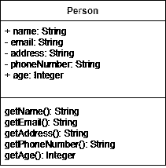

# UML 类图介绍

> 原文：<https://blog.devgenius.io/basic-introduction-to-uml-class-diagrams-5b085fd2ca2b?source=collection_archive---------5----------------------->

这篇文章将简要介绍 **UML 类图**，它们的目的和重要概念。

重要的是要理解，当要构建一个产品时，不管它是什么，它可以是一个系统、一个移动应用程序、web 应用程序或一个游戏，在使用各种或所需的编程语言开始实际实现该产品之前，我们必须经历某些阶段。这些阶段很重要，也很关键，以便对正在构建的产品有一个概念性的理解。

这些阶段包括——收集关于产品的**功能性**和**非功能性** **需求**,其中功能性需求决定产品**必须做什么**,非功能性需求决定产品**必须是什么**,创建**用例**和**用户故事**,并使用 **CRC 卡**或**构建**概念模型****

所有这些之前的工作都是为了识别我们的第一组类。因此，在这些过程之后，我们必须**通过类图**直观地表示这些类。此外，这也是**面向对象设计原则**发挥作用的地方，比如**继承**和**多态**。最常用的特性是 **UML 类图**。这可能是一个相当高级的话题，但对于这篇文章，我将坚持基本概念。

**用途:**

类图是唯一可以用面向对象语言映射的图，因此在开发应用程序时被广泛使用。类图的用途:

*   要有一个清晰的图像，比如要构建的应用程序、系统或简单产品的蓝图。
*   识别和描述系统的职责。
*   以确定最终产品各组成部分之间的关系。
*   向开发人员和其他团队成员提供关于将要构建或开发的应用程序或系统的必要知识是非常有帮助的。

# UML 类图

UML 类图是一种图形符号，用于构建和可视化面向对象的系统。统一建模语言(UML)中的类图是一种静态结构图，它通过显示系统的以下内容来描述系统的结构:

*   班级，
*   他们的属性，
*   操作(或方法)，
*   以及对象之间的关系

现在我们先来讨论一下**类**:

一个类是一个对象的**蓝图**。因此，对象和类是携手并进的。**面向对象设计**的整个概念不仅仅是关于对象，它实际上是关于类。这是因为我们使用类来创建对象。类充当描述对象的蓝图，另一边的对象是类的可用实例。因此，一个对象是一个可识别的实体，它有自己的一组**特征**(也称为**属性**)和**行为**。

考虑下面的例子:

这里我们可以看到，类只是一个蓝图，对象是类的一个实例。

类和对象示例

**UML 类图——符号和其他概念**

一个类代表一个概念，它封装了被称为**属性**的**状态**和被称为**操作**的**行为**。一个类的每个属性都有一个**数据类型**，每个**操作**都有自己的**签名**。

类图

类图由三个分区组成:

1.  **类名**:类名出现在第一个分区中。
2.  **类属性**:显示在第二个分区中。它们的类型在冒号后定义。
3.  **类操作:**它们显示在第三个分区中。它们的返回类型也显示在方法签名后面的冒号后面。

在类图中，每个类都应该有一个用单数形式写的名字，应该是**而不是** **的复数形式**，标准是使用大写字母的第一个字母**。比如像**人物**、**地址**、**学生**等词语。就属性而言，您不会知道所有的属性，因为到目前为止，在前面的阶段中，您将关注于**确定对象**、**类责任和行为**之间的关系，但是尝试编写明显的或基本的属性。使用**命名约定**，这是在**实施** **阶段**中使用的编程语言的典型命名约定。我将使用**骆驼案例** **格式**来表示属性。在 camel case 格式中，第一个单词的第一个字母是小写的，然后所有其他单词的第一个字母都是大写的。**

人员类别的属性

虽然编写属性名很常见，但是最好也编写属性的数据类型。这可以通过在属性名后使用冒号，后跟数据类型来实现。考虑一个类 Person，它具有姓名、电子邮件、地址、电话号码和年龄等属性。我们可以将它们的数据类型定义为字符串、整数等，如下所示。

属性-数据类型

如果需要，我们还可以在需要的地方给属性一个默认值，方法是在数据类型后使用等号，后跟默认值。我们不必对所有属性都使用它，而是只对那些需要它并且与它相关的属性使用它。因为我们关注的是最初创建类图的**，所以不要把所有的注意力都放在知道将要使用的确切数据类型上。不要在这个阶段花时间去确定某个属性必须是 32 位整数还是 64 位。知道它必须是整数就足够了。可能有一些属性可以用几种不同的方式实现。它可以通过将它分成两个独立的属性来实现，或者我们可以使用一个复杂的数据类型，或者我们可以为一个特定的类型创建我们自己的类。然而，这些都是我们在后面阶段要处理的细节。**

在我们继续之前，让我们讨论一下**类的可见性**

在 UML 图中，为了表示属性和方法的可见性，在它们之前使用加号、减号和散列符号。

能见度

*   +表示公共属性或操作
*   -表示私有属性或操作
*   #表示受保护的属性或操作

现在问题来了，一个对象的哪些操作是其他对象需要知道的？这符合**封装**的原理。也就是说，**尽可能多地隐藏**实现** **细节**，并且只共享那些绝对有必要向其他类公开的内容。因此在 UML 类图中，加号和减号被加在属性和方法之前。前者表示这些属性和方法是公共的，可以由其他方法直接访问，而后者表示该成员是私有的，不能由其他对象直接访问。例如，如果我们不希望 Person 类的 email、address 和 phoneNumber 属性具有公共可见性，那么下面的类图显示了如何表示它们。**

能见度

请记住，如果您正在定义奇怪地缺乏行为的类，您可能想要重温为类建立的职责。再次检查已收集的**需求**、**书面描述和概念对象模型或 CRC 卡**。重点应该是**对象必须做什么**，而不是**将对象仅仅视为数据结构**。例如，考虑一个扩展了 Person 类的学生类。我们不应该首先关注它会有什么属性，比如编号、个人注册号、学院名称、分校名称、课程列表等等，而是应该首先确定**对象与**有什么关系。其中一个操作就是**上课。**

简而言之，我们应该首先确定对象的用途，它应该做什么，它必须执行什么操作，它的职责，而不是关注它将在属性中存储什么数据。

**类图—透视图**

让我们来讨论一个类图的不同视角。类图可以从不同的角度进行解释。

1.  **概念性**表示领域中的概念
2.  **规格**是指关注产品中 ADT 的接口。
3.  **实现**定义了类如何实现定义的接口。

因此，视角会影响要给出的细节数量以及实体之间必须定义的关系级别。

概念、规范和实现视角(按顺序)

正如我们之前所讨论的，在领域建模阶段，我们确定对象、类之间的关系以及类的职责。让我们来看看这些类之间可能存在的关系类型。

**关系**

关系可以是以下类型:

关系

**一般化**

这是一种存在于更一般的实体和更具体的实体之间的**关系。因此，更具体实体的每个实例也是更一般实体的间接实例。因此，它将获得更一般的实体的属性和行为。**

概括表示一种**“是”**关系。这是一种自下而上的方法，而另一边的**专业化**是一种自上而下的相反方法。

让我们看一个例子，在下图中，学生类和教授类是 Person 类的子类。这显示了继承层次结构。

遗产

## **关联**

关联是一种**结构关系**，存在于一个系统内链接的不同对象之间。它用于显示类之间存在的二元关系。因此，简而言之，它描述了他们之间的关系，例如一个教师可能与许多学生相关联。关联是一个广义的术语，几乎包含了类之间存在的任何关系。关联有不同的类型。

**有向关联**:指类别之间存在的有向关系，用带箭头的实线连接类别来表示。箭头描述了容器，并包含了类之间的方向流。

定向联想

**双向关联**:当箭头在两端时，称为**双向关联。**

反身关联:当一个类有多种功能或职责时，就会出现这种情况。例如，商店的职员可能是经理、接待员等。

自反联想

**基数**

基数用以下术语表示:

*   一对一
*   一对多
*   多对多

基数

**聚合**

它指的是一个特定类的形成是其他类聚合或集合的结果。它也是一种关联。考虑一个图书馆类的例子，它由许多书和所有其他资料组成。聚合类的包含类并不强烈依赖于容器，这意味着如果容器被解散，也就是说，如果图书馆被解散，那么书籍将仍然存在。

我们可以通过连接一条从子类到父类的线来显示子类和父类之间的聚合，在连接父类的线的末端有一个菱形。为了更好地理解，下面给出了一个例子。

聚合

**构图**

组合与聚合非常相似，但是这里的主要区别是所包含的类对容器类的生命周期的依赖性。这基本上意味着，与聚合不同，如果容器类被分解，那么包含的类也会被分解或删除。

如果聚合中提到的同一个示例必须表示为一个组合。会是这样的:

作文

请注意，上图中的菱形是实心的，这与聚合的情况不同。

**属地**

当一个类的对象可能需要另一个类的对象在它的一个方法中来执行一个操作。这种关系被称为依赖关系。

例如，Person 类中有一个阅读书籍的方法。为此，它需要来自 Book 类的一些数据来获取细节，以便检查这个人是否读过这本书。这可以表示如下:

属国

**实现**

它表示一个类中定义的功能被另一个类实现。考虑以下示例，使用打印机设置界面设置的打印首选项由打印机实施。

实现

**将类图转换成代码**

在所有的设计工作完成后，最后是使用适当的编程语言将设计转换成代码的时候了。这是因为每种编程语言都有自己独特的实现方式。然而**面向对象的设计概念**跨许多编程语言工作，即使**实现细节**，像**语法**将**不同**。

我希望这是有帮助的，并提供了关于 UML 类图的基本而重要的信息。谢谢你。

看看我其他的帖子。喜欢就分享。:)

 [## 使用 ADB 和 Android Studio 在移动设备上模拟您的 web 应用程序。

### 有很多方法可以模拟你的应用。其中一个是使用 Android Studio，另一个是使用自己的手机…

medium.com](https://medium.com/@suyash2810/simulate-your-web-app-on-a-mobile-device-using-adb-and-android-studio-68b4b2e500e6)