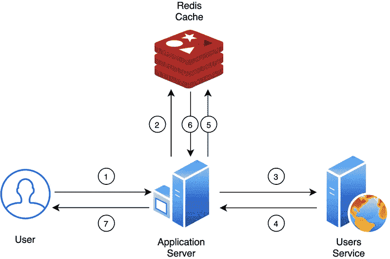

# 关于 Redis 的基本知识

> 原文：<https://blog.devgenius.io/basic-knowledge-about-redis-26d002a7ee4a?source=collection_archive---------5----------------------->



雷迪斯

# 简介&什么是 Redis？

**一个由键值存储的内存数据库**，通常作为一个数据库来缓存，访问速度非常快。

对视频的评论:

> ***Redis 是一个内存中但持久存在于磁盘上的数据库*** *，因此它代表了一种不同的权衡，即在数据集不能大于内存的限制下实现非常高的读写速度。*
> 
> 这意味着它不像只存储在内存中，也不是持久的。它将所有内容存储在内存中，写入磁盘是可选的，但仍可供使用

下面是我从上面的视频中学到的笔记内容。因此，请随意快速浏览并跟着视频练习。

# Redis 安装

在 Mac 上:

自制安装:`**brew install redis**`

运行服务器 Redis: `**redis-server**`

通过`**redis-cli**`打开一个新的选项卡/窗口访问 Redis CLI，键入`**quit**`退出。

# 基本命令

**设定** : `**SET** key value`键的值，该值将存储为`string`

**获取键的值** : `**GET** key`

**检查钥匙是否存在** : `**EXISTS** key`

**检查钥匙是否匹配一个图案**:所有带有`**KEY** *`的钥匙

**清除所有缓存** : `**FLUSHALL**`

**清除端子** : `**CLEAR**`上的所有输入

**注意:**请注意，您可以同时使用`set`或`SET`

```
127.0.0.1:6379> **SET** age 16
OK
127.0.0.1:6379> **GET** age
"16"
127.0.0.1:6379> **EXISTS** age
(integer) 1
127.0.0.1:6379> **EXISTS** name
(integer) 0
127.0.0.1:6379> **KEYS** *
1) "age"
127.0.0.1:6379> **flushall**
OK
127.0.0.1:6379> KEYS *
(empty list or set)
```

# 处理过期

如果没有过期，键值将永远存在。

**10 秒后**`**age**`**:**`**EXPIRE** key timevalue`

例:`expire age 10`

**检查时间键 live(生存时间—** `**TTL**` **):** `**TTL** key`

超时后，密钥将被删除，值为`nil`

**同时设置过期键值:** `**SETEX age 10 16**`

这意味着我们设定的年龄在 10 秒内有一个值是 16

示例代码:

```
127.0.0.1:6379> **SET** age 16
OK

127.0.0.1:6379> **EXPIRE** age 10
(integer) 1
127.0.0.1:6379> **TTL** age
(integer) 4
127.0.0.1:6379> **TTL** age
(integer) 1
127.0.0.1:6379> **TTL** age
(integer) -2
127.0.0.1:6379> **GET** age
(nil)

127.0.0.1:6379> **SETEX** age 10 16
OK
127.0.0.1:6379> **GET** age
"16"
127.0.0.1:6379> **TTL** age
(integer) -2
127.0.0.1:6379> **GET** age
(nil)
```

# 列表

**添加项是值:** `**LPUSH key value**`

**获取一个键的列表值:**

由`**GET** key`将不会工作，因为这只是为字符串工作，这是一个列表

**将数值推到列表左侧:** `**LPUSH key value**`

**将数值推到列表右侧:** `**RPUSHKEY value**`

**从左边弹出一个项目:** `**LPOP key**`，类似的有`**RPOP key**`

示例代码:

```
127.0.0.1:6379> **KEYS** *
1) "friends"

127.0.0.1:6379> **LRANGE** friends 0 -1
1) "thanh"

127.0.0.1:6379> **LPUSH** friends nga
(integer) 2

127.0.0.1:6379> **LRANGE** friends 0 -1
1) "nga"
2) "thanh"

127.0.0.1:6379> **RPUSH** friends xuan
(integer) 3

127.0.0.1:6379> **LRANGE** friends 0 -1
1) "nga"
2) "thanh"
3) "xuan"

127.0.0.1:6379> **LPOP** friends
"nga"
127.0.0.1:6379> **LRANGE** friends 0 -1
1) "thanh"
2) "xuan"
```

# 设置

**给集合添加一个带值的键:** `**SADD key value**`

**获取集合中的所有成员:** `**SMEMBERS key**`

**从集合中删除一个值:** `**SREM key value**`

示例代码:

```
// Add "running" to set
127.0.0.1:6379> **SADD** hobbies running
(integer) 1
127.0.0.1:6379> **SMEMBERS** hobbies
1) "running"

// Add again, will not duplicate value
127.0.0.1:6379> **SADD** hobbies running
(integer) 0

// Check all members in a set
127.0.0.1:6379> **SMEMBERS** hobbies
1) "running"
127.0.0.1:6379> **SADD** hobbies tennis
(integer) 1
127.0.0.1:6379> **SMEMBERS** hobbies
1) "tennis"
2) "running"
127.0.0.1:6379> **SMEMBERS** hobbies
1) "tennis"
2) "running"

// Remove a member in a set
127.0.0.1:6379> srem hobbies tennis
(integer) 1
127.0.0.1:6379> **SMEMBERS** hobbies
1) "running"
```

# 混杂

`key-value`对中的`key-value`对

**设置为哈希一键及其字段的值:** `**HSET** key field value`

**获取一个字段的值:** `**HGET** key field`

**获取一个字段的所有值:** `**HGETALL** key field`

**删除一个键中的字段:**

**检查一个字段中的键是否存在:** `**HEXISTS** key field`

```
127.0.0.1:6379> **HSET** person name thanh 
(integer) 1 
127.0.0.1:6379> **HGET** person name 
"thanh" 

127.0.0.1:6379> **HGETALL** person 
1) "name" 
2) "thanh"
127.0.0.1:6379> **HSET** person age 30 
(integer) 1
127.0.0.1:6379> **HGETALL** person 
1) "name" 
2) "thanh" 
3) "age" 
4) "30"

127.0.0.1:6379> **HDEL** person age 
(integer) 1 
127.0.0.1:6379> **HGETALL** person 
1) "name" 
2) "thanh"
```

# 节点示例

[链接演示](https://www.youtube.com/watch?v=jgpVdJB2sKQ&t=796s)，我的简短总结:

**第一步:安装并创建 Redis 实例，运行 Redis 服务器**

将 Redis 安装到项目:`npm i redis`

在代码中，通过以下方式获取 Redis:`const Redis = require("redis")`

创建 Redis 的实例:`const redisClient = Redis.createClient()`

**第二步:设置一个过期的键值**

使用 redisClient 作为普通 Redis(作为练习)。例如:

为缓存的数据响应设置一个带有过期时间的键值:

`redisClient.setex(photos, 3600, JSON.stringify(data))`

**步骤 3:在 Redis CLI 中检查密钥及其值**

再次运行应用程序后，我们可以使用`key *`访问 Redis CLI 来检查缓存中是否有重要照片

**步骤 4:使用响应数据关键字的缓存值**

然后我们检查 Redis 中的缓存，并使用它来替换数据响应:

(如果要清除所有缓存，使用 **flushall** )

```
api.get("/photos", async(req, res) => {
  **const** albumId = req.query.albumId

  redisClient.get(`photos/?ablumId=${albumId}`, async(errors, photos) => {  
    **if** (errors) console.**log**(errors)
    **if** (photos !== null) {
      **return** res.json(JSON.**parse**(photos))
    } **else** {
      **const** { data } = await axios.get(url)
      res.json(data)
    }
  })
})
```

**步骤 5:为获取或设置缓存的重用逻辑创建函数**

函数`getOrSetCache`将接受一个键和一个回调

```
**function** getOrSetCache(key, callback) {
  **return** **new** Promise(resolve, reject) {
    redisClient.get(key, async (error, data) => {
      **if** (error) **return** reject(error)
      **if** (data !== null) **return** resolve(JSON.**parse**(data))

      **const** freshData = await callback()
      redisClient.setex(key, 3600, JSON.**stringify**(freshData))
      resolve(freshData)
    })
  }
}
```

然后我们将在 get 中使用这个函数，如果想要缓存，对其他请求使用类似的函数:

```
api.get("/photos", async(req, res) => {
  **const** albumId = req.query.albumId
  **const** photos = await getOrSetCache(`photos/?ablumId=${albumId}`, async () => {
    **const** { data } = await axios.get(url)
    **return** data
  })   res.json(photos)
})
```

以上是关于 Redis 的一些基础知识，感谢阅读。

[原帖](https://beautyoncode.com/basic-knowledges-about-redis/)在我的博客上，欢迎你来访问。

BeautyOnCode。