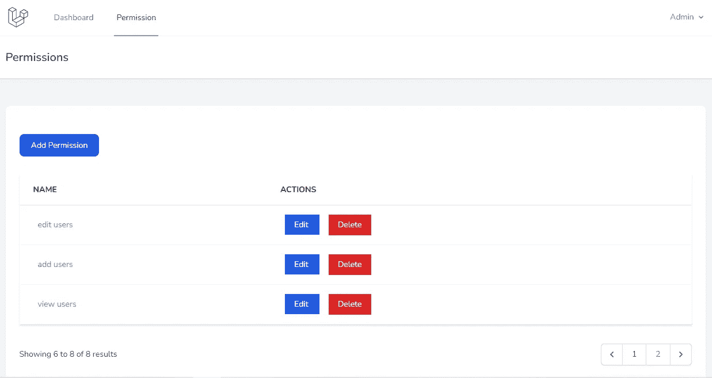
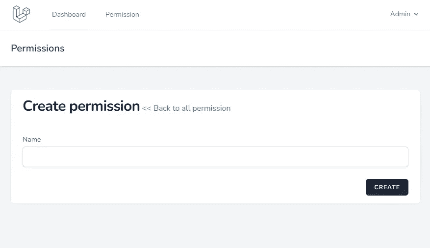
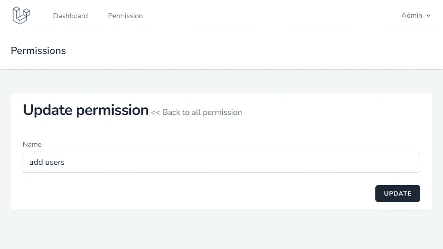
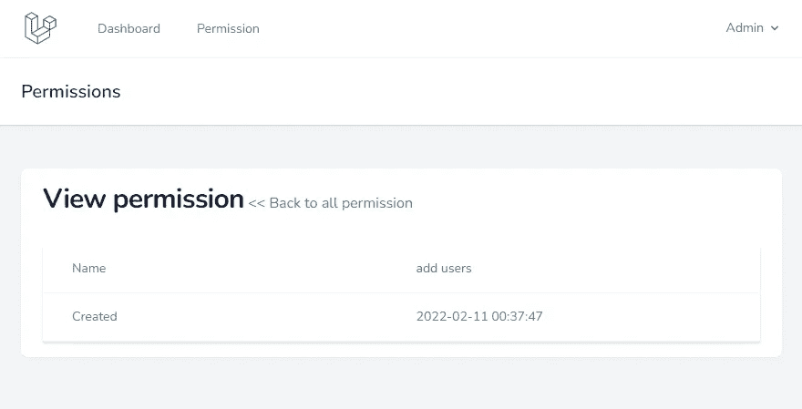

# 基本 Laravel 管理面板—用于权限管理的基本 Laravel CRUD 创建

> 原文：<https://blog.devgenius.io/basic-laravel-admin-panel-basic-laravel-crud-creation-for-permission-management-6bd93fb0e1a2?source=collection_archive---------0----------------------->

## Laravel 从头开始创建管理面板——第 4 部分



Laravel 许可 CRUD

在最后的[部分](/laravel-user-roles-and-permissions-6dbfd4abfcf8)，我们安装了 Spatie[Laravel-permission](https://github.com/spatie/laravel-permission)包。这个软件包没有用户界面。因此，我们将为管理面板角色和权限管理创建 3 个以下的 CRUD。

*   权限管理
*   角色管理
*   用户管理

相应的表已经在 Laravel Breeze starter kit 和 Spatie Laravel-permission 包安装部分创建。

# 许可管理

以下步骤涉及到为我们的 Laravel 管理面板创建权限 CRUD。

*   1.创建模型
*   2.创建控制器
*   3.添加路线
*   4.带有操作链接的索引页面
*   5.创建操作
*   6.更新操作
*   7.查看操作
*   8.向导航添加链接

## 1.创建模型

首先，我们要为许可 CRUD 创建一个模型。使用下面的`make:model` Artisan 命令创建你的模型将会在`app/Models`文件夹中创建一个`Permission.php`文件

我们也可以手动创建模型和控制器。`make`artisan 命令将创建具有骨架功能的文件。

```
sail artisan make:model Permission
```

用`Spatie\Permission\Models\Permission`扩展我们的权限模型，用下面的代码更新模型。

app/Models/Permission.php

```
<?php
namespace App\Models;
use Spatie\Permission\Models\Permission as OriginalPermission;
class Permission extends OriginalPermission
{
    protected $fillable = [
        'name',
        'guard_name',
        'updated_at',
        'created_at'
    ];
}
```

## 2.创建控制器

`make:controller` Artisan 命令用于创建控制器。

```
sail artisan make:controller Admin/PermissionController --model=Permission --resource
```

`--resource`选项可以快速创建一个控制器来处理创建、读取、更新和删除(“CRUD”)操作。

## 3.添加路线

我们将在 app/routes 文件夹中创建一个新的 admin.php 文件。这个文件将包含我们所有的管理路径，在 URL 中带有一个管理前缀。

routes/admin.php

```
<?php
Route::group([
    'namespace'  => 'App\Http\Controllers\Admin',
    'prefix'     => 'admin',
    'middleware' => ['auth'],
], function () {
    Route::resource('permission', 'PermissionController');
});
```

这些新的管理路由需要包含在 RouteServiceProvider.php
的`boot`函数中，用下面的代码更新`boot()`函数

app/Providers/routeserviceprovider . PHP

```
public function boot()
{
    $this->configureRateLimiting();
$this->routes(function () {
        Route::prefix('api')
            ->middleware('api')
            ->namespace($this->namespace)
            ->group(base_path('routes/api.php'));
Route::middleware('web')
            ->namespace($this->namespace)
            ->group(base_path('routes/web.php'));
Route::middleware('web')
            ->namespace($this->namespace)
            ->group(base_path('routes/admin.php'));
    });
}
```

现在进入`/admin/permission`页面，显示空白页。

## 4.带有操作链接的索引页面

使用权限分页更新索引函数。

app/Http/Controllers/Admin/permission controller . PHP

```
public function index()
{
    $permissions = Permission::latest()->paginate(5);
    return view('admin.permission.index',compact('permissions'))
        ->with('i', (request()->input('page', 1) - 1) * 5);
}
```

在管理/权限文件夹中创建 index.blade.php 视图文件

资源/视图/管理/权限/索引. blade.php

```
<x-app-layout>
    <x-slot name="header">
        <h2 class="font-semibold text-xl text-gray-800 leading-tight">
            {{ __('Permissions') }}
        </h2>
    </x-slot>
<div class="py-12">
        <div class="max-w-7xl mx-auto sm:px-6 lg:px-8">
            <div class="bg-white overflow-hidden shadow-sm sm:rounded-lg">
                <div class="p-6 bg-white border-b border-gray-200">
                    <div class="flex flex-col mt-8">
                    <div class="d-print-none with-border mb-8">
                        <a href="{{ route('permission.create') }}" class="text-white bg-blue-700 hover:bg-blue-800 focus:ring-4 focus:ring-blue-300 font-medium rounded-lg text-sm px-5 py-2.5 text-center mr-2 mb-2 dark:bg-blue-600 dark:hover:bg-blue-700 dark:focus:ring-blue-800">{{ __('Add Permission') }}</a>
                    </div>
                        <div class="py-2">
                        @if(session()->has('message'))
                            <div class="mb-8 text-green-400 font-bold">
                                {{ session()->get('message') }}
                            </div>
                        @endif
                            <div class="min-w-full border-b border-gray-200 shadow">
                                <table class="border-collapse table-auto w-full text-sm">
                                    <thead>
                                        <tr>
                                            <th class="py-4 px-6 bg-grey-lightest font-bold uppercase text-sm text-grey-dark border-b border-grey-light text-left">
                                                {{ __('Name') }}
                                            </th>
                                            <th class="py-4 px-6 bg-grey-lightest font-bold uppercase text-sm text-grey-dark border-b border-grey-light text-left">
                                                {{ __('Actions') }}
                                            </th>
                                        </tr>
                                    </thead>
<tbody class="bg-white dark:bg-slate-800">
                                        @foreach($permissions as $permission)
                                        <tr>
                                            <td class="border-b border-slate-100 dark:border-slate-700 p-4 pl-8 text-slate-500 dark:text-slate-400">
                                                <div class="text-sm text-gray-900">
                                                    <a href="{{route('permission.show', $permission->id)}}" class="no-underline hover:underline text-cyan-600 dark:text-cyan-400">{{ $permission->name }}</a>
                                                </div>
                                            </td>
<td class="border-b border-slate-100 dark:border-slate-700 p-4 pl-8 text-slate-500 dark:text-slate-400">
                                                <form action="{{ route('permission.destroy', $permission->id) }}" method="POST">
                                                    <a href="{{route('permission.edit', $permission->id)}}" class="px-4 py-2 text-white mr-4 bg-blue-600">
                                                        {{ __('Edit') }}
                                                    </a>
@csrf
                                                    @method('DELETE')
                                                    <button class="px-4 py-2 text-white bg-red-600">
                                                        {{ __('Delete') }}
                                                    </button>
                                                </form>
                                            </td>
</tr>
                                        @endforeach
                                    </tbody>
                                </table>
                            </div>
                            <div class="py-8">
                                {{ $permissions->links() }}
                            </div>
                        </div>
                    </div>
                </div>
            </div>
        </div>
    </div>
</x-app-layout>
```

这个页面必须创建，读取和更新链接。还在表单中添加了一个删除按钮。

用下面的代码更新销毁函数

app/Http/Controllers/Admin/permission controller . PHP

```
public function destroy(Permission $permission)
{
    $permission->delete();
    return redirect()->route('permission.index')
                    ->with('message','Permission deleted successfully');
}
```

## 5.创建操作

用以下代码更新`create`函数，并创建`create.blade.php`视图文件

app/Http/Controllers/Admin/permission controller . PHP

```
public function create()
{
    return view('admin.permission.create');
}
```

资源/视图/管理/权限/创建. blade.php

```
<x-app-layout>
    <x-slot name="header">
        <h2 class="font-semibold text-xl text-gray-800 leading-tight">
            {{ __('Permissions') }}
        </h2>
    </x-slot>
<div class="py-12">
        <div class="max-w-7xl mx-auto sm:px-6 lg:px-8">
            <div class="bg-white overflow-hidden shadow-sm sm:rounded-lg">
                <div class="px-6">
                    <h1 class="inline-block text-2xl sm:text-3xl font-extrabold text-slate-900 tracking-tight dark:text-slate-200 py-4 block sm:inline-block flex">{{ __('Create permission') }}</h1>
                    <a href="{{route('permission.index')}}" class="no-underline hover:underline text-cyan-600 dark:text-cyan-400">{{ __('<< Back to all permission') }}</a>
                    @if ($errors->any())
                        <ul class="mt-3 list-none list-inside text-sm text-red-400">
                            @foreach ($errors->all() as $error)
                                <li>{{ $error }}</li>
                            @endforeach
                        </ul>
                    @endif
                </div>
                <div class="w-full px-6 py-4 bg-white overflow-hidden">
<form method="POST" action="{{ route('permission.store') }}">
                    @csrf
<div class="py-2">
                            <label for="name" class="block font-medium text-sm text-gray-700{{$errors->has('name') ? ' text-red-400' : ''}}">{{ __('Name') }}</label>
<input id="name" class="rounded-md shadow-sm border-gray-300 focus:border-indigo-300 focus:ring focus:ring-indigo-200 focus:ring-opacity-50 block mt-1 w-full{{$errors->has('name') ? ' border-red-400' : ''}}"
                                            type="text"
                                            name="name"
                                            value="{{ old('name') }}"
                                            />
                        </div>
<div class="flex justify-end mt-4">
                            <button type='submit' class='inline-flex items-center px-4 py-2 bg-gray-800 border border-transparent rounded-md font-semibold text-xs text-white uppercase tracking-widest hover:bg-gray-700 active:bg-gray-900 focus:outline-none focus:border-gray-900 focus:ring ring-gray-300 disabled:opacity-25 transition ease-in-out duration-150'>
                                {{ __('Create') }}
                            </button>
                        </div>
                    </form>
                </div>
            </div>
        </div>
    </div>
</x-app-layout>
```

在浏览器中浏览`http://localhost/admin/permission/create`网址。



创建表单

提交动作将调用`store`函数。所以复制下面的代码`store`函数

app/Http/Controllers/Admin/permission controller . PHP

```
public function store(Request $request)
{
    $request->validate([
        'name' => 'required|string|max:255|unique:'.config('permission.table_names.permissions', 'permissions').',name',
    ]);
    Permission::create($request->all());
    return redirect()->route('permission.index')
                    ->with('message','Permission created successfully.');
}
```

`$request->validate`用于验证创建的表单。

## 6.更新操作

类似于创建两个用于更新的函数。显示表格的`edit`功能和保存表格的`update`功能。

app/Http/Controllers/Admin/permission controller . PHP

```
public function edit(Permission $permission)
{
    return view('admin.permission.edit',compact('permission'));
}
public function update(Request $request, Permission $permission)
{
    $request->validate([
        'name' => 'required|string|max:255|unique:'.config('permission.table_names.permissions', 'permissions').',name,'.$permission->id,
    ]);
    $permission->update($request->all());
    return redirect()->route('permission.index')
                    ->with('message','Permission updated successfully.');
}
```

资源/视图/管理/权限/编辑. blade.php

```
<x-app-layout>
    <x-slot name="header">
        <h2 class="font-semibold text-xl text-gray-800 leading-tight">
            {{ __('Permissions') }}
        </h2>
    </x-slot>
<div class="py-12">
        <div class="max-w-7xl mx-auto sm:px-6 lg:px-8">
            <div class="bg-white overflow-hidden shadow-sm sm:rounded-lg">
                <div class="px-6">
                    <h1 class="inline-block text-2xl sm:text-3xl font-extrabold text-slate-900 tracking-tight dark:text-slate-200 py-4 block sm:inline-block flex">{{ __('Update permission') }}</h1>
                    <a href="{{route('permission.index')}}" class="no-underline hover:underline text-cyan-600 dark:text-cyan-400">{{ __('<< Back to all permission') }}</a>
                    @if ($errors->any())
                        <ul class="mt-3 list-none list-inside text-sm text-red-400">
                            @foreach ($errors->all() as $error)
                                <li>{{ $error }}</li>
                            @endforeach
                        </ul>
                    @endif
                </div>
                <div class="w-full px-6 py-4 bg-white overflow-hidden">
<form method="POST" action="{{ route('permission.update', $permission->id) }}">
                    @csrf
                    @method('PUT')
<div class="py-2">
                            <label for="name" class="block font-medium text-sm text-gray-700{{$errors->has('name') ? ' text-red-400' : ''}}">{{ __('Name') }}</label>
<input id="name" class="rounded-md shadow-sm border-gray-300 focus:border-indigo-300 focus:ring focus:ring-indigo-200 focus:ring-opacity-50 block mt-1 w-full{{$errors->has('name') ? ' border-red-400' : ''}}"
                                            type="text"
                                            name="name"
                                            value="{{ old('name', $permission->name) }}"
                                            />
                        </div>
<div class="flex justify-end mt-4">
                            <button type='submit' class='inline-flex items-center px-4 py-2 bg-gray-800 border border-transparent rounded-md font-semibold text-xs text-white uppercase tracking-widest hover:bg-gray-700 active:bg-gray-900 focus:outline-none focus:border-gray-900 focus:ring ring-gray-300 disabled:opacity-25 transition ease-in-out duration-150'>
                                {{ __('Update') }}
                            </button>
                        </div>
                    </form>
                </div>
            </div>
        </div>
    </div>
</x-app-layout>
```



更新表单

## 7.查看操作

我们权限 CRUD 中的最后一个操作。`show`功能用于查看操作。

app/Http/Controllers/Admin/permission controller . PHP

```
public function show(Permission $permission)
{
    return view('admin.permission.show',compact('permission'));
}
```

资源/视图/管理/权限/显示. blade.php

```
<x-app-layout>
    <x-slot name="header">
        <h2 class="font-semibold text-xl text-gray-800 leading-tight">
            {{ __('Permissions') }}
        </h2>
    </x-slot>
<div class="py-12">
        <div class="max-w-7xl mx-auto sm:px-6 lg:px-8">
            <div class="bg-white overflow-hidden shadow-sm sm:rounded-lg">
                <div class="px-6">
                    <h1 class="inline-block text-2xl sm:text-3xl font-extrabold text-slate-900 tracking-tight dark:text-slate-200 py-4 block sm:inline-block flex">{{ __('View permission') }}</h1>
                    <a href="{{route('permission.index')}}" class="no-underline hover:underline text-cyan-600 dark:text-cyan-400">{{ __('<< Back to all permission') }}</a>
                    @if ($errors->any())
                        <ul class="mt-3 list-none list-inside text-sm text-red-400">
                            @foreach ($errors->all() as $error)
                                <li>{{ $error }}</li>
                            @endforeach
                        </ul>
                    @endif
                </div>
                <div class="w-full px-6 py-4">
                    <div class="min-w-full border-b border-gray-200 shadow">
                        <table class="table-fixed w-full text-sm">
                            <tbody class="bg-white dark:bg-slate-800">
                                <tr>
                                    <td class="border-b border-slate-100 dark:border-slate-700 p-4 pl-8 text-slate-500 dark:text-slate-400">{{ __('Name') }}</td>
                                    <td class="border-b border-slate-100 dark:border-slate-700 p-4 text-slate-500 dark:text-slate-400">{{$permission->name}}</td>
                                </tr>
                                <tr>
                                    <td class="border-b border-slate-100 dark:border-slate-700 p-4 pl-8 text-slate-500 dark:text-slate-400">{{ __('Created') }}</td>
                                    <td class="border-b border-slate-100 dark:border-slate-700 p-4 text-slate-500 dark:text-slate-400">{{$permission->created_at}}</td>
                                </tr>
                            </tbody>
                        </table>
                    </div>
                </div>
            </div>
        </div>
    </div>
</x-app-layout>
```



查看页面

## 8.向导航添加链接

我们已经完成了 CRUD 的创建。在 navigation.blade.php 的导航链接下添加许可链接

资源/视图/布局/导航. blade.php

```
<!-- Navigation Links -->
<div class="hidden space-x-8 sm:-my-px sm:ml-10 sm:flex">
    <x-nav-link :href="route('dashboard')" :active="request()->routeIs('dashboard')">
        {{ __('Dashboard') }}
    </x-nav-link>
    <x-nav-link :href="route('permission.index')" :active="request()->routeIs('permission.index')">
        {{ __('Permission') }}
    </x-nav-link>
</div>
```

对于移动导航

```
<!-- Responsive Navigation Menu -->
    <div :class="{'block': open, 'hidden': ! open}" class="hidden sm:hidden">
        <div class="pt-2 pb-3 space-y-1">
            <x-responsive-nav-link :href="route('dashboard')" :active="request()->routeIs('dashboard')">
                {{ __('Dashboard') }}
            </x-responsive-nav-link>
            <x-responsive-nav-link :href="route('permission.index')" :active="request()->routeIs('permission.index')">
                {{ __('Permission') }}
            </x-responsive-nav-link>
        </div>
```

我们成功地创造了我们的第一个 Laravel CRUD。这个许可 CRUD 对所有经过认证的用户开放。因此，在接下来的部分，我们需要将基于权限的访问限制添加到我们的权限 CRUD 中。

还需要添加到我们的索引页面搜索。

[](/how-to-enable-xdebug-on-laravel-sail-and-debugging-code-with-vs-code-872fd750b340) [## 如何在 Laravel Sail 上启用 Xdebug 并用 VS 代码调试代码

### 用 XDebug 和 Visual Studio 代码调试 Laravel

blog.devgenius.io](/how-to-enable-xdebug-on-laravel-sail-and-debugging-code-with-vs-code-872fd750b340) 

# GitHub 知识库

许可代码可在 [1.0.2](https://github.com/balajidharma/basic-laravel-admin-panel/tree/archive/1.0.2) 分支上获得

上一部分—第 3 部分:[用户角色和权限](/laravel-user-roles-and-permissions-6dbfd4abfcf8)

下一部分—第 5 部分:[基于角色和权限的 Laravel CRUD 访问控制](/laravel-crud-access-control-based-on-role-and-permission-f190d03f1fa2)