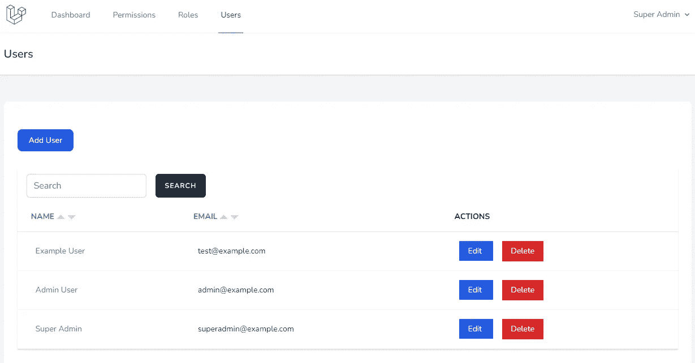
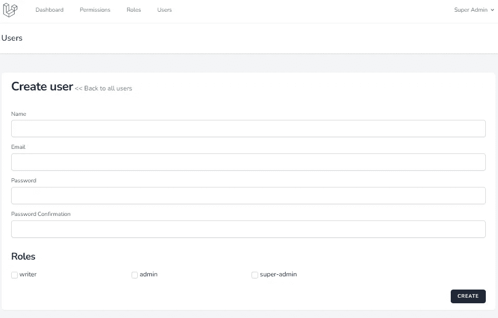
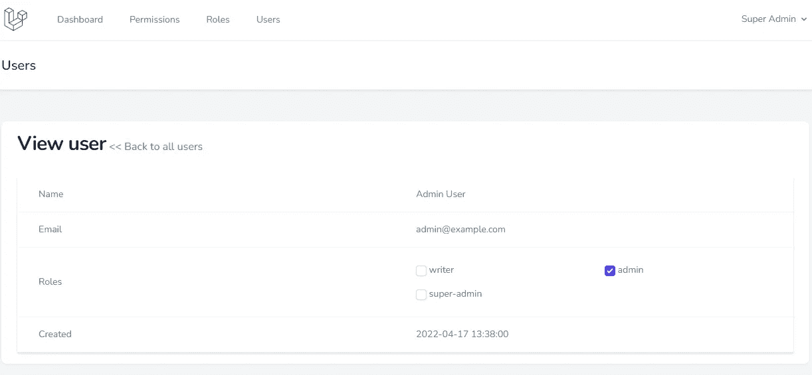

# 基本 Laravel 管理面板-用户管理 CRUD

> 原文：<https://blog.devgenius.io/basic-laravel-admin-panel-user-management-crud-45f694ef60cc?source=collection_archive---------1----------------------->

## Laravel 从头开始创建一个管理面板——第 8 部分


由[扬·安东宁·科拉尔](https://unsplash.com/@jankolar?utm_source=medium&utm_medium=referral)在 [Unsplash](https://unsplash.com?utm_source=medium&utm_medium=referral) 上拍摄

我们将创建用户管理 CRUD。用户 CRUD 类似于[角色管理 CRUD](https://medium.com/dev-genius/create-ui-for-role-management-to-laravel-admin-panel-dce72b09d2ea) 。

# 用户管理

以下步骤涉及到为我们的 Laravel 管理面板创建用户 CRUD。

*   1.创建控制器
*   2.添加路线
*   3.创建视图

## 1.创建控制器

用户模型已经在[认证](/laravel-create-an-admin-panel-from-scratch-part-2-authentication-f0eb0bbd6139)部件上创建。

`make:controller` Artisan 命令用于创建控制器。

```
sail artisan make:controller Admin/UserController --model=User --resource
```

将以下代码复制到 UserController

app/Http/Controllers/Admin/user controller . PHP

```
<?php
namespace App\Http\Controllers\Admin;
use App\Http\Controllers\Controller;
use App\Models\User;
use App\Models\Role;
use Illuminate\Http\Request;
use Illuminate\Support\Facades\Hash;
use Illuminate\Validation\Rules;
class UserController extends Controller
{
    function __construct()
    {
         $this->middleware('can:user list', ['only' => ['index','show']]);
         $this->middleware('can:user create', ['only' => ['create','store']]);
         $this->middleware('can:user edit', ['only' => ['edit','update']]);
         $this->middleware('can:user delete', ['only' => ['destroy']]);
    }
    /**
     * Display a listing of the resource.
     *
     * @return \Illuminate\Http\Response
     */
    public function index()
    {
        $users = (new User)->newQuery();
        if (request()->has('search')) {
            $users->where('name', 'Like', '%' . request()->input('search') . '%');
        }
        if (request()->query('sort')) {
            $attribute = request()->query('sort');
            $sort_order = 'ASC';
            if (strncmp($attribute, '-', 1) === 0) {
                $sort_order = 'DESC';
                $attribute = substr($attribute, 1);
            }
            $users->orderBy($attribute, $sort_order);
        } else {
            $users->latest();
        }
        $users = $users->paginate(5);
        return view('admin.user.index',compact('users'))
            ->with('i', (request()->input('page', 1) - 1) * 5);
    }
    /**
     * Show the form for creating a new resource.
     *
     * @return \Illuminate\Http\Response
     */
    public function create()
    {
        $roles = Role::all();
        return view('admin.user.create', compact('roles'));
    }
    /**
     * Store a newly created resource in storage.
     *
     * @param  \Illuminate\Http\Request  $request
     * @return \Illuminate\Http\Response
     */
    public function store(Request $request)
    {
        $request->validate([
            'name' => ['required', 'string', 'max:255'],
            'email' => ['required', 'string', 'email', 'max:255', 'unique:users'],
            'password' => ['required', 'confirmed', Rules\Password::defaults()],
        ]);
        $user = User::create([
            'name' => $request->name,
            'email' => $request->email,
            'password' => Hash::make($request->password),
        ]);
        if(! empty($request->roles)) {
            $user->assignRole($request->roles);
        }
        return redirect()->route('user.index')
                        ->with('message','User created successfully.');
    }
    /**
     * Display the specified resource.
     *
     * @param  \App\Models\User  $user
     * @return \Illuminate\Http\Response
     */
    public function show(User $user)
    {
        $roles = Role::all();
        $userHasRoles = array_column(json_decode($user->roles, true), 'id');
        return view('admin.user.show', compact('user', 'roles', 'userHasRoles'));
    }
    /**
     * Show the form for editing the specified resource.
     *
     * @param  \App\Models\User  $user
     * @return \Illuminate\Http\Response
     */
    public function edit(User $user)
    {
        $roles = Role::all();
        $userHasRoles = array_column(json_decode($user->roles, true), 'id');
        return view('admin.user.edit', compact('user', 'roles', 'userHasRoles'));
    }
    /**
     * Update the specified resource in storage.
     *
     * @param  \Illuminate\Http\Request  $request
     * @param  \App\Models\User  $user
     * @return \Illuminate\Http\Response
     */
    public function update(Request $request, User $user)
    {
        $request->validate([
            'name' => ['required', 'string', 'max:255'],
            'email' => ['required', 'string', 'email', 'max:255', 'unique:users,email,'.$user->id],
            'password' => ['nullable','confirmed', Rules\Password::defaults()],
        ]);
        $user->update([
            'name' => $request->name,
            'email' => $request->email,
        ]);
        if($request->password){
            $user->update([
                'password' => Hash::make($request->password),
            ]);
        }
        $roles = $request->roles ?? [];
        $user->syncRole($roles);
        return redirect()->route('user.index')
                        ->with('message','User updated successfully.');
    }
    /**
     * Remove the specified resource from storage.
     *
     * @param  \App\Models\User  $user
     * @return \Illuminate\Http\Response
     */
    public function destroy(User $user)
    {
        $user->delete();

        return redirect()->route('user.index')
                        ->with('message','User deleted successfully');
    }
}
```

## 2.添加路线

在 routes/admin.php 上添加用户路由

```
<?php
Route::group([
    'namespace'  => 'App\Http\Controllers\Admin',
    'prefix'     => 'admin',
    'middleware' => ['auth'],
], function () {
    Route::resource('user', 'UserController');
    Route::resource('role', 'RoleController');
    Route::resource('permission', 'PermissionController');
});
```

## 3.创建视图

在 admin/user 文件夹中创建 index.blade.php、create.blade.php、edit.blade.php 和 show.blade.php 文件

资源/视图/管理/用户/索引. blade.php

```
<x-app-layout>
    <x-slot name="header">
        <h2 class="font-semibold text-xl text-gray-800 leading-tight">
            {{ __('Users') }}
        </h2>
    </x-slot>
<div class="py-12">
        <div class="max-w-7xl mx-auto sm:px-6 lg:px-8">
            <div class="bg-white overflow-hidden shadow-sm sm:rounded-lg">
                <div class="p-6 bg-white border-b border-gray-200">
                    <div class="flex flex-col mt-8">
                    @can('user create')
                    <div class="d-print-none with-border mb-8">
                        <a href="{{ route('user.create') }}" class="text-white bg-blue-700 hover:bg-blue-800 focus:ring-4 focus:ring-blue-300 font-medium rounded-lg text-sm px-5 py-2.5 text-center mr-2 mb-2 dark:bg-blue-600 dark:hover:bg-blue-700 dark:focus:ring-blue-800">{{ __('Add User') }}</a>
                    </div>
                    @endcan
                        <div class="py-2">
                        @if(session()->has('message'))
                            <div class="mb-8 text-green-400 font-bold">
                                {{ session()->get('message') }}
                            </div>
                        @endif
                            <div class="min-w-full border-b border-gray-200 shadow">
                                <form method="GET" action="{{ route('user.index') }}">
                                <div class="py-2 flex">
                                    <div class="overflow-hidden flex pl-4">
                                        <input type="search" name="search" value="{{ request()->input('search') }}" class="rounded-md shadow-sm border-gray-300 focus:border-indigo-300 focus:ring focus:ring-indigo-200 focus:ring-opacity-50" placeholder="Search">
                                        <button type='submit' class='ml-4 inline-flex items-center px-4 py-2 bg-gray-800 border border-transparent rounded-md font-semibold text-xs text-white uppercase tracking-widest hover:bg-gray-700 active:bg-gray-900 focus:outline-none focus:border-gray-900 focus:ring ring-gray-300 disabled:opacity-25 transition ease-in-out duration-150'>
                                            {{ __('Search') }}
                                        </button>
                                    </div>
                                </div>
                                </form>
                                <table class="border-collapse table-auto w-full text-sm">
                                    <thead>
                                        <tr>
                                            <th class="py-4 px-6 bg-grey-lightest font-bold uppercase text-sm text-grey-dark border-b border-grey-light text-left">
                                                @include('admin.includes.sort-link', ['label' => 'Name', 'attribute' => 'name'])
                                            </th>
                                            <th class="py-4 px-6 bg-grey-lightest font-bold uppercase text-sm text-grey-dark border-b border-grey-light text-left">
                                                @include('admin.includes.sort-link', ['label' => 'Email', 'attribute' => 'email'])
                                            </th>                                            
                                            @canany(['user edit', 'user delete'])
                                            <th class="py-4 px-6 bg-grey-lightest font-bold uppercase text-sm text-grey-dark border-b border-grey-light text-left">
                                                {{ __('Actions') }}
                                            </th>
                                            @endcanany
                                        </tr>
                                    </thead>
<tbody class="bg-white dark:bg-slate-800">
                                        @foreach($users as $user)
                                        <tr>
                                            <td class="border-b border-slate-100 dark:border-slate-700 p-4 pl-8 text-slate-500 dark:text-slate-400">
                                                <div class="text-sm text-gray-900">
                                                    <a href="{{route('user.show', $user->id)}}" class="no-underline hover:underline text-cyan-600 dark:text-cyan-400">{{ $user->name }}</a>
                                                </div>
                                            </td>
                                            <td class="border-b border-slate-100 dark:border-slate-700 p-4 pl-8 text-slate-500 dark:text-slate-400">
                                                <div class="text-sm text-gray-900">
                                                    {{ $user->email }}
                                                </div>
                                            </td>                                            
                                            @canany(['user edit', 'user delete'])
                                            <td class="border-b border-slate-100 dark:border-slate-700 p-4 pl-8 text-slate-500 dark:text-slate-400">
                                                <form action="{{ route('user.destroy', $user->id) }}" method="POST">
                                                    @can('user edit')
                                                    <a href="{{route('user.edit', $user->id)}}" class="px-4 py-2 text-white mr-4 bg-blue-600">
                                                        {{ __('Edit') }}
                                                    </a>
                                                    @endcan
@can('user delete')
                                                    @csrf
                                                    @method('DELETE')
                                                    <button class="px-4 py-2 text-white bg-red-600">
                                                        {{ __('Delete') }}
                                                    </button>
                                                    @endcan
                                                </form>
                                            </td>
                                            @endcanany
                                        </tr>
                                        @endforeach
                                    </tbody>
                                </table>
                            </div>
                            <div class="py-8">
                                {{ $users->appends(request()->query())->links() }}
                            </div>
                        </div>
                    </div>
                </div>
            </div>
        </div>
    </div>
</x-app-layout>
```

现在访问`/admin/user`页面，它显示了用户索引页面。



Laravel 用户 CRUD 索引页面

资源/视图/管理/用户/创建. blade.php

```
<x-app-layout>
    <x-slot name="header">
        <h2 class="font-semibold text-xl text-gray-800 leading-tight">
            {{ __('Users') }}
        </h2>
    </x-slot>
<div class="py-12">
        <div class="max-w-7xl mx-auto sm:px-6 lg:px-8">
            <div class="bg-white overflow-hidden shadow-sm sm:rounded-lg">
                <div class="px-6">
                    <h1 class="inline-block text-2xl sm:text-3xl font-extrabold text-slate-900 tracking-tight dark:text-slate-200 py-4 block sm:inline-block flex">{{ __('Create user') }}</h1>
                    <a href="{{route('user.index')}}" class="no-underline hover:underline text-cyan-600 dark:text-cyan-400">{{ __('<< Back to all users') }}</a>
                    @if ($errors->any())
                        <ul class="mt-3 list-none list-inside text-sm text-red-400">
                            @foreach ($errors->all() as $error)
                                <li>{{ $error }}</li>
                            @endforeach
                        </ul>
                    @endif
                </div>
                <div class="w-full px-6 py-4 bg-white overflow-hidden">
<form method="POST" action="{{ route('user.store') }}">
                    @csrf
<div class="py-2">
                            <label for="name" class="block font-medium text-sm text-gray-700{{$errors->has('name') ? ' text-red-400' : ''}}">{{ __('Name') }}</label>
<input id="name" class="rounded-md shadow-sm border-gray-300 focus:border-indigo-300 focus:ring focus:ring-indigo-200 focus:ring-opacity-50 block mt-1 w-full{{$errors->has('name') ? ' border-red-400' : ''}}"
                                            type="text"
                                            name="name"
                                            value="{{ old('name') }}"
                                            />
                        </div>
<div class="py-2">
                            <label for="email" class="block font-medium text-sm text-gray-700{{$errors->has('email') ? ' text-red-400' : ''}}">{{ __('Email') }}</label>
<input id="email" class="rounded-md shadow-sm border-gray-300 focus:border-indigo-300 focus:ring focus:ring-indigo-200 focus:ring-opacity-50 block mt-1 w-full{{$errors->has('email') ? ' border-red-400' : ''}}"
                                            type="email"
                                            name="email"
                                            value="{{ old('email') }}"
                                            />
                        </div>
<div class="py-2">
                            <label for="password" class="block font-medium text-sm text-gray-700{{$errors->has('password') ? ' text-red-400' : ''}}">{{ __('Password') }}</label>
<input id="password" class="rounded-md shadow-sm border-gray-300 focus:border-indigo-300 focus:ring focus:ring-indigo-200 focus:ring-opacity-50 block mt-1 w-full{{$errors->has('password') ? ' border-red-400' : ''}}"
                                            type="password"
                                            name="password"
                                            />
                        </div>
<div class="py-2">
                            <label for="password_confirmation" class="block font-medium text-sm text-gray-700{{$errors->has('password') ? ' text-red-400' : ''}}">{{ __('Password Confirmation') }}</label>
<input id="password_confirmation" class="rounded-md shadow-sm border-gray-300 focus:border-indigo-300 focus:ring focus:ring-indigo-200 focus:ring-opacity-50 block mt-1 w-full{{$errors->has('password') ? ' border-red-400' : ''}}"
                                            type="password"
                                            name="password_confirmation"
                                            />
                        </div>
<div class="py-2">
                            <h3 class="inline-block text-xl sm:text-2xl font-extrabold text-slate-900 tracking-tight dark:text-slate-200 py-4 block sm:inline-block flex">Roles</h3>
                            <div class="grid grid-cols-4 gap-4">
                                @forelse ($roles as $role)
                                    <div class="col-span-4 sm:col-span-2 md:col-span-1">
                                        <label class="form-check-label">
                                            <input type="checkbox" name="roles[]" value="{{ $role->name }}" class="rounded border-gray-300 text-indigo-600 shadow-sm focus:border-indigo-300 focus:ring focus:ring-indigo-200 focus:ring-opacity-50">
                                            {{ $role->name }}
                                        </label>
                                    </div>
                                @empty
                                    ----
                                @endforelse
                            </div>
                        </div>
<div class="flex justify-end mt-4">
                            <button type='submit' class='inline-flex items-center px-4 py-2 bg-gray-800 border border-transparent rounded-md font-semibold text-xs text-white uppercase tracking-widest hover:bg-gray-700 active:bg-gray-900 focus:outline-none focus:border-gray-900 focus:ring ring-gray-300 disabled:opacity-25 transition ease-in-out duration-150'>
                                {{ __('Create') }}
                            </button>
                        </div>
                    </form>
                </div>
            </div>
        </div>
    </div>
</x-app-layout>
```



Laravel 用户 CRUD 创建页面

资源/视图/管理/用户/编辑. blade.php

```
<x-app-layout>
    <x-slot name="header">
        <h2 class="font-semibold text-xl text-gray-800 leading-tight">
            {{ __('Users') }}
        </h2>
    </x-slot>
<div class="py-12">
        <div class="max-w-7xl mx-auto sm:px-6 lg:px-8">
            <div class="bg-white overflow-hidden shadow-sm sm:rounded-lg">
                <div class="px-6">
                    <h1 class="inline-block text-2xl sm:text-3xl font-extrabold text-slate-900 tracking-tight dark:text-slate-200 py-4 block sm:inline-block flex">{{ __('Update user') }}</h1>
                    <a href="{{route('user.index')}}" class="no-underline hover:underline text-cyan-600 dark:text-cyan-400">{{ __('<< Back to all users') }}</a>
                    @if ($errors->any())
                        <ul class="mt-3 list-none list-inside text-sm text-red-400">
                            @foreach ($errors->all() as $error)
                                <li>{{ $error }}</li>
                            @endforeach
                        </ul>
                    @endif
                </div>
                <div class="w-full px-6 py-4 bg-white overflow-hidden">
<form method="POST" action="{{ route('user.update', $user->id) }}">
                    @csrf
                    @method('PUT')
<div class="py-2">
                            <label for="name" class="block font-medium text-sm text-gray-700{{$errors->has('name') ? ' text-red-400' : ''}}">{{ __('Name') }}</label>
<input id="name" class="rounded-md shadow-sm border-gray-300 focus:border-indigo-300 focus:ring focus:ring-indigo-200 focus:ring-opacity-50 block mt-1 w-full{{$errors->has('name') ? ' border-red-400' : ''}}"
                                            type="text"
                                            name="name"
                                            value="{{ old('name', $user->name) }}"
                                            />
                        </div>
<div class="py-2">
                            <label for="email" class="block font-medium text-sm text-gray-700{{$errors->has('email') ? ' text-red-400' : ''}}">{{ __('Email') }}</label>
<input id="email" class="rounded-md shadow-sm border-gray-300 focus:border-indigo-300 focus:ring focus:ring-indigo-200 focus:ring-opacity-50 block mt-1 w-full{{$errors->has('email') ? ' border-red-400' : ''}}"
                                            type="email"
                                            name="email"
                                            value="{{ old('email', $user->email) }}"
                                            />
                        </div>
<div class="py-2">
                            <label for="password" class="block font-medium text-sm text-gray-700{{$errors->has('password') ? ' text-red-400' : ''}}">{{ __('Password') }}</label>
<input id="password" class="rounded-md shadow-sm border-gray-300 focus:border-indigo-300 focus:ring focus:ring-indigo-200 focus:ring-opacity-50 block mt-1 w-full{{$errors->has('password') ? ' border-red-400' : ''}}"
                                            type="password"
                                            name="password"
                                            />
                        </div>
<div class="py-2">
                            <label for="password_confirmation" class="block font-medium text-sm text-gray-700{{$errors->has('password') ? ' text-red-400' : ''}}">{{ __('Password Confirmation') }}</label>
<input id="password_confirmation" class="rounded-md shadow-sm border-gray-300 focus:border-indigo-300 focus:ring focus:ring-indigo-200 focus:ring-opacity-50 block mt-1 w-full{{$errors->has('password') ? ' border-red-400' : ''}}"
                                            type="password"
                                            name="password_confirmation"
                                            />
                        </div>
<div class="py-2">
                            <h3 class="inline-block text-xl sm:text-2xl font-extrabold text-slate-900 tracking-tight dark:text-slate-200 py-4 block sm:inline-block flex">Roles</h3>
                            <div class="grid grid-cols-4 gap-4">
                                @forelse ($roles as $role)
                                    <div class="col-span-4 sm:col-span-2 md:col-span-1">
                                        <label class="form-check-label">
                                            <input type="checkbox" name="roles[]" value="{{ $role->name }}" {{ in_array($role->id, $userHasRoles) ? 'checked' : '' }} class="rounded border-gray-300 text-indigo-600 shadow-sm focus:border-indigo-300 focus:ring focus:ring-indigo-200 focus:ring-opacity-50">
                                            {{ $role->name }}
                                        </label>
                                    </div>
                                @empty
                                    ----
                                @endforelse
                            </div>
                        </div>
<div class="flex justify-end mt-4">
                            <button type='submit' class='inline-flex items-center px-4 py-2 bg-gray-800 border border-transparent rounded-md font-semibold text-xs text-white uppercase tracking-widest hover:bg-gray-700 active:bg-gray-900 focus:outline-none focus:border-gray-900 focus:ring ring-gray-300 disabled:opacity-25 transition ease-in-out duration-150'>
                                {{ __('Update') }}
                            </button>
                        </div>
                    </form>
                </div>
            </div>
        </div>
    </div>
</x-app-layout>
```

资源/视图/管理/用户/show.blade.php

```
<x-app-layout>
    <x-slot name="header">
        <h2 class="font-semibold text-xl text-gray-800 leading-tight">
            {{ __('Users') }}
        </h2>
    </x-slot>
<div class="py-12">
        <div class="max-w-7xl mx-auto sm:px-6 lg:px-8">
            <div class="bg-white overflow-hidden shadow-sm sm:rounded-lg">
                <div class="px-6">
                    <h1 class="inline-block text-2xl sm:text-3xl font-extrabold text-slate-900 tracking-tight dark:text-slate-200 py-4 block sm:inline-block flex">{{ __('View user') }}</h1>
                    <a href="{{route('user.index')}}" class="no-underline hover:underline text-cyan-600 dark:text-cyan-400">{{ __('<< Back to all users') }}</a>
                    @if ($errors->any())
                        <ul class="mt-3 list-none list-inside text-sm text-red-400">
                            @foreach ($errors->all() as $error)
                                <li>{{ $error }}</li>
                            @endforeach
                        </ul>
                    @endif
                </div>
                <div class="w-full px-6 py-4">
                    <div class="min-w-full border-b border-gray-200 shadow">
                        <table class="table-fixed w-full text-sm">
                            <tbody class="bg-white dark:bg-slate-800">
                                <tr>
                                    <td class="border-b border-slate-100 dark:border-slate-700 p-4 pl-8 text-slate-500 dark:text-slate-400">{{ __('Name') }}</td>
                                    <td class="border-b border-slate-100 dark:border-slate-700 p-4 text-slate-500 dark:text-slate-400">{{$user->name}}</td>
                                </tr>
                                <tr>
                                    <td class="border-b border-slate-100 dark:border-slate-700 p-4 pl-8 text-slate-500 dark:text-slate-400">{{ __('Email') }}</td>
                                    <td class="border-b border-slate-100 dark:border-slate-700 p-4 text-slate-500 dark:text-slate-400">{{$user->email}}</td>
                                </tr>
                                <tr>
                                <td class="border-b border-slate-100 dark:border-slate-700 p-4 pl-8 text-slate-500 dark:text-slate-400">{{ __('Roles') }}</td>
                                    <td class="border-b border-slate-100 dark:border-slate-700 p-4 text-slate-500 dark:text-slate-400">
<div class="py-2">
                                        <div class="grid grid-cols-4 gap-4">
                                            @forelse ($roles as $role)
                                                <div class="col-span-4 sm:col-span-2 md:col-span-2">
                                                    <label class="form-check-label">
                                                        <input type="checkbox" name="roles[]" value="{{ $role->name }}" {{ in_array($role->id, $userHasRoles) ? 'checked' : '' }} disabled="disabled" class="rounded border-gray-300 text-indigo-600 shadow-sm focus:border-indigo-300 focus:ring focus:ring-indigo-200 focus:ring-opacity-50">
                                                        {{ $role->name }}
                                                    </label>
                                                </div>
                                            @empty
                                                ----
                                            @endforelse
                                        </div>
                                    </div>
                                    </td>
                                </tr>
                                <tr>
                                    <td class="border-b border-slate-100 dark:border-slate-700 p-4 pl-8 text-slate-500 dark:text-slate-400">{{ __('Created') }}</td>
                                    <td class="border-b border-slate-100 dark:border-slate-700 p-4 text-slate-500 dark:text-slate-400">{{$user->created_at}}</td>
                                </tr>
                            </tbody>
                        </table>
                    </div>
                </div>
            </div>
        </div>
    </div>
</x-app-layout>
```



Laravel 用户 CRUD 编辑页面

我们已经创建了我们的管理面板用户管理 CRUD。下一部分，我们将为管理面板用户创建一个配置文件更新页面。

# GitHub 知识库

角色代码可在[https://github.com/balajidharma/basic-laravel-admin-panel](https://github.com/balajidharma/basic-laravel-admin-panel)上获得

上一部分—第 7 部分:[创建角色管理的 UI 到 Laravel 管理面板](/create-ui-for-role-management-to-laravel-admin-panel-dce72b09d2ea)

下一部分—第 9 部分:[创建账户更新页面](/laravel-create-an-account-update-page-for-admin-users-e123cd88f24b)