# 我们应该知道的基本 Linux 命令

> 原文：<https://blog.devgenius.io/basic-linux-commands-that-we-should-know-717b573cfa77?source=collection_archive---------15----------------------->

马库斯·斯皮斯克在 [Unsplash](https://unsplash.com?utm_source=medium&utm_medium=referral) 上的照片

Linux 是一个功能强大的操作系统，今天被广泛使用，尽管你可能不太明白。来自 TOP500 的数据显示，Linux 为世界 500 强超级计算机提供了 100%的动力，这是一个惊人的统计数据。

当您开始使用 Linux 时，您会发现尽管存在许多桌面环境，但该系统比其他操作系统更依赖命令行。

在这篇文章中，我们将看看一些基本的 Linux 命令，我们应该知道如何使用 Linux 命令行。

# **1。pwd**

它用来识别你正在工作的目录是 **pwd** 命令。它显示当前的工作目录路径，在目录频繁更改时非常有用。

为了前任。

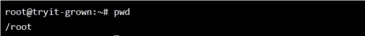

你可以看到上面显示我的当前目录是根目录。

# **2。cd**

要浏览目录，请使用 **cd** 命令。它需要目录的完整路径或名称，这取决于您所在的当前工作目录。

为了前任。绝对路径

在上面的中，您可以看到您正在指定以“/”开头的完整绝对路径

你也可以像下面这样一个接一个地移动到它的子目录

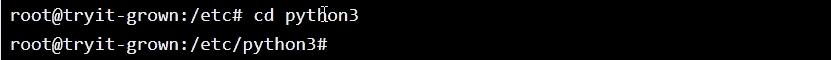

在上面的例子中，你可以看到你当前在/ **etc** 目录中，现在你正移动到它的子目录 **python3**

**→ cd..**(带两点)上移一个目录

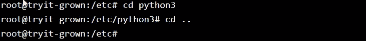

**→ cd** 直接转到主文件夹(这里主文件夹是根文件夹)

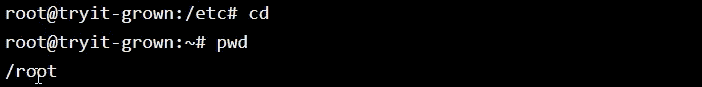

**→ cd -** (带连字符)移至上一个目录

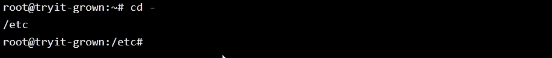

# **3。ls**

ls 命令用于查看目录的内容。

为了前任。目前我在 **/etc** 目录下，想查看这个文件夹下的所有文件和文件夹

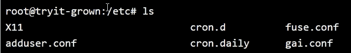

**→ ls -R** 也会列出子目录中的所有文件

为了前任。假设我想看看**主文件夹**的文件和子目录。在这里你可以看到**主文件夹**有一个 **ubuntu 目录**和 ubuntu 目录有一个 **alex 目录**

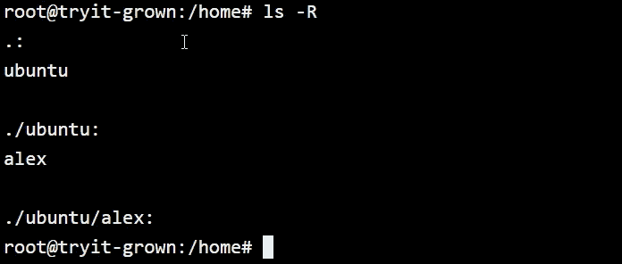

**→ ls -a** 将显示隐藏的文件

首先，我将向您展示简单的 **ls** 命令

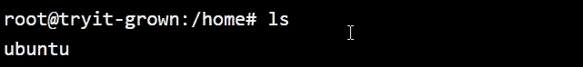

然后 **ls -a**

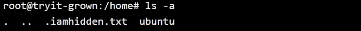

在上面你可以看到名为 **iamhidden.txt** 的隐藏文件没有用简单的 ls 命令显示

→ **ls -al** 将列出文件和目录的详细信息，如权限、大小、所有者等。

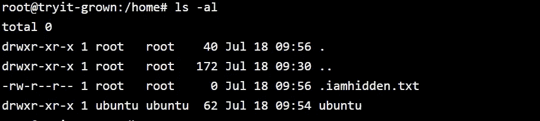

# **4。mkdir**

mkdir 命令创建一个目录。命令是这样写的:→ *mkdir【目录名】*

在这里，我正在创建亚历克斯目录

你可以在这个文件夹下看到创建的目录。

# **5。卡特彼勒**

**cat**(concatenate 的缩写)是 Linux 中最常用的命令之一。它用于在标准输出(sdout)中列出文件的内容。

假设有 readme.txt 文件

在该文件中，文本内容类似于**我是亚历克斯。**现在你要阅读那些内容。

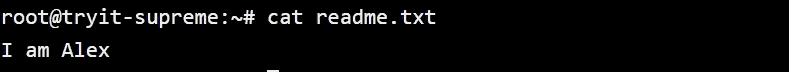

以下是使用**卡特彼勒**命令的其他方法:

*   **cat > filename** 创建一个新文件，并将内容放到新文件中。

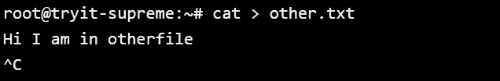

在这里你可以看到，我已经使用了 **cat > other.txt** ，因此将使用 other.txt 创建新文件。现在如果我按 **enter** ，它将允许我输入文本。这里我加了一句，**你好我在其他文件里。**现在为了保存这个，我按下了 **CTRL + C**

现在用 ls 命令，我可以看到有两个文件。

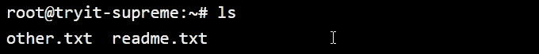

现在，我想读 other.txt 的内容

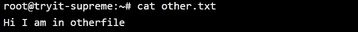

*   **cat filename 1 filename 2>filename 3**连接两个文件(1 和 2)并将它们的输出存储在一个新文件(3)中

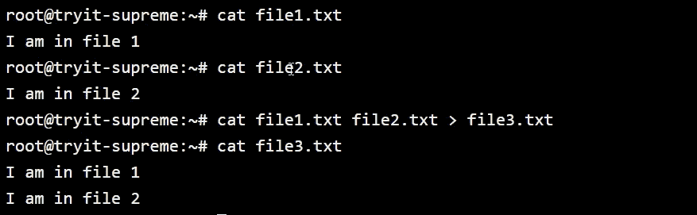

感谢你阅读这篇文章，❤

如果我做错了什么？让我在评论中。我很想进步。

拍手声👏如果这篇文章对你有帮助。