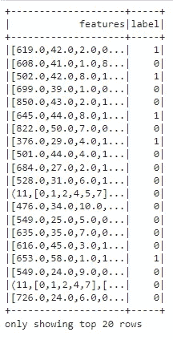

# PySpark 上的基本机器学习

> 原文：<https://blog.devgenius.io/basic-machine-learning-on-pyspark-f6264bdd9012?source=collection_archive---------15----------------------->

银行流失分类

马库斯·温克勒在 [Unsplash](https://unsplash.com/) 上的照片

如果你有处理数据的经验，你可能以前用过[熊猫](https://pandas.pydata.org/docs/index.html)库。我们主要使用熊猫进行数据处理。这是一个非常强大的库，我们可以用它进行各种各样的数据预处理，比如处理缺失值、过滤和特征提取。问题是，如果我们处理的大数据的大小无法容纳在一台机器的内存中，我们就不能再使用“正常”的熊猫了，我们需要能够处理大数据的工具。最流行的大数据工具之一是 [Apache Spark](https://spark.apache.org/) 。Apache Spark 是用 Scala 编写的，但是有了 PySpark，我们可以使用 Python API 编写 Spark 应用程序。此外，在 Apache Spark 3.2 上，他们已经提供了 [Pandas API](https://spark.apache.org/docs/latest/api/python/user_guide/pandas_on_spark/index.html) ，使 Pandas 用户能够毫无问题地使用 Spark。

## 介绍

在本文中，我们将尝试使用 PySpark 创建一个分类模型。我不会在 Spark 上使用 Pandas API，而是使用 PySpark API 来显示两个 API 之间的相似性。将要使用的数据集来自 [Kaggle](https://www.kaggle.com/datasets/parisanahmadi/bank-data-churn-classification) 。我还在 [GitHub](https://github.com/triesonyk/churn-classification-pyspark) 上传了完整的 python 笔记本代码

## 导入库

在 PySpark 中开始制作机器学习模型，我们要做的第一件事就是导入我们需要的库。常用的库:

*   SparkSession:无论我们使用 Scala、Java、Python 还是 r，启动任何 Spark 功能都需要它。
*   StructField、StructType 和任何常见的数据类型，如 StringType、Integer
*   常见函数，如 count、countDistinct、avg、mean 等。
*   管道来为我们想要预测的新数据集创建机器学习管道
*   我们想要使用的算法，在这种情况下，我们想要建立一个分类模型，因此我将导入 DecisionTreeClassifier、RandomForestClassifier、GBTClassifier 和 LogisticRegression
*   矢量和矢量装配器将用于装配特征
*   用于数据预处理的 StringIndexer、OneHotEncoder、Imputer、StandardScaler
*   评估库，用于评估我们创建的模型

## Spark 会话和加载数据集

每当我们想要使用任何种类的 spark 功能时，我们都必须执行 Spark 会话。appName 可以是我们想要的任何东西，我将使用`Churn` 作为 appName。我们要做的下一件事是加载数据集，我将在这个项目中使用一个普通的 CSV 数据集。`inferSchema=True` 意味着我们让 Spark 自动推断每个列的类型，而`header=True`意味着我们将使用 CSV 的第一行作为列名。

## 数据理解

在制作模型之前，我们必须先了解数据。使用`printSchema()`我们可以看到每一列的名称和类型。

为了显示前 20 行，我们可以使用`show()`。不像熊猫，每次要展示数据框都要用`show()`。

如果加上`vertical=True`参数，我们也可以垂直看到数据。当数据有很多列时，我通常使用这个参数，这样更容易查看所有的值。

要查看每一列的统计数据，我们可以使用`describe().show()`。我添加了参数，因为数据框太宽了，如果我们水平地看数据框，将会有一些行被分成两行，这使得数据框看起来很乱。

## 缺少值

要检查我们是否有丢失的值，我们可以使用下面的代码。因为我们没有丢失的值，所以我们不必做任何事情，但是如果您有丢失的值，您可以使用`DataFrame.na.fill({‘col_name’:any_value})`来填充丢失的值。

## 字符串索引器

一些列值仍然是字符串数据类型，所以在将它们放入模型之前，我们必须先将它们转换成数字。我们可以用`StringIndexer()`把字符串变成数字。这类似于标签编码。

## OneHot 编码器

地理不是一个顺序特征，这就是为什么我们必须一次性编码它。这和 Scikitlearn 的 OneHotEncoder 有点不同，在 PySpark 上它会创建一个带有二进制向量值的列。

## 汇编数据

当我们使用 PySpark 机器学习库时，他们希望输入是一种特定的格式，这就是为什么我们必须在拟合数据之前先组装数据。幸运的是，他们还提供了一个模块，可以将数据组装成正确的格式。为了更容易地显示数据框，我将创建另一个仅包含要素和标注的数据框。

## 列车测试分离

为了确保我们的模型不会过度拟合，让我们将数据分成训练和测试数据集。

## 使标准化

一些算法对距离很敏感，所以让我们标准化这些特征，以确保我们创建了一个好的模型。我们在截图中看不出区别，因为列宽太小，但是`featuresScaled`上的数据已经标准化

## 模型拟合

下一步是拟合模型。我们将尝试使用 4 种不同的算法创建 4 个模型，并检查哪一个具有更好的度量评估。

## 模型评估

我们将使用准确性和 AUC-ROC 来评估模型。正如我们在下面看到的，梯度提升树分类器具有最好的准确性，而决策树具有最好的 AUC-ROC。

## 特征重要性

对于商业智能或数据分析师来说，机器学习的重要性不是模型本身，而是特征重要性。特征重要性可以作为商业推荐的基础。下面是如何在 PySpark 中展示该特性的重要性。我们可以看到所有的模型都认同`Age` 是客户流失的最大因素。根据这些信息，他们可以创建基于年龄的营销来降低流失率。

基于决策树模型的特征重要性

基于随机森林模型的特征重要性

基于梯度增强树模型的特征重要性

## 结论

正如我们所看到的，PySpark 很容易学，并且和熊猫有很多相似之处。目前，[Spark 上的 Pandas API 还没有正式支持结构化流](https://spark.apache.org/docs/latest/api/python/user_guide/pandas_on_spark/faq.html)，所以我希望这篇文章能在你想在 Spark 上使用结构化流的时候给你一点帮助。如果你对完整的代码感兴趣，你可以访问我的 [GitHub Repo](https://github.com/triesonyk/churn-classification-pyspark) 。