# 基本注意事项，在开始 DSA 之前，您应该保持对阵列的了解。

> 原文：<https://blog.devgenius.io/basic-notes-you-should-keep-about-an-array-before-starting-dsa-3267b37dac9b?source=collection_archive---------8----------------------->

由[absolute vision](https://unsplash.com/es/@freegraphictoday?utm_source=medium&utm_medium=referral)在 [Unsplash](https://unsplash.com?utm_source=medium&utm_medium=referral) 拍摄的照片

这个基本的注意事项，你应该在开始 LeetCodes 或任何 DSA 面试之前保持一个数组，

## **数组:→**

数组是**相同数据类型**的变量的**顺序**集合，可以使用整数作为**索引**进行访问，通常从 **0** 开始。

> **声明一个数组:→**

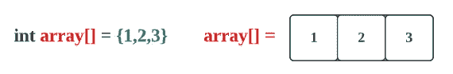

用空格初始化数组(当数据类型为 int 时，创建的数组每个元素的值都为 0):→

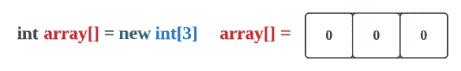

> **访问数组:→**

索引从 0 到 n-1 开始。这里 n 是元素的数量。

让我们看一个例子，

这里元素的数量是 3，所以索引应该是 0，1，2。

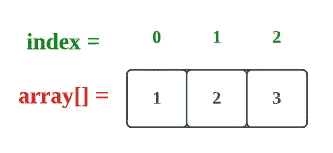

现在要访问第二个元素，我们需要做(n-1)的方法

= >(n-1)= >(2–1)= > 1。

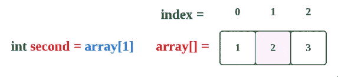

> **获取数组总长度:→**

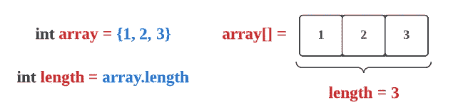

> **改变数组元素:→**

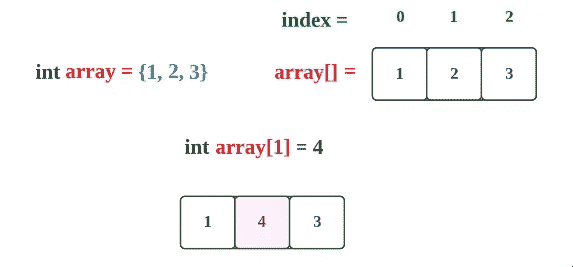

> **对数组排序:→**

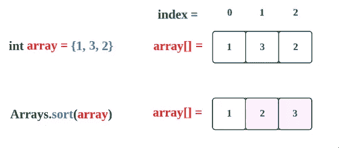

> **用某个值填充一个数组:→**

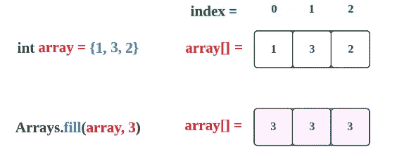

> **其他备注:→**

假设一个数组的大小是 **N** 。

*   **访问时间:** **O(1): →**

这里请记住，访问单个元素是**没有找到值为** `**x**`的元素。

只是找一个**元素**而已。这可以通过**索引**容易地找到。

*   **搜索时间:→**

对于****【O(n)】**。**

**在最坏的情况下，我们想要的值在数组的最后一个元素，然后我们必须检查整个数组。**

**例如，我们想找到一个值为 2 的元素。**

**这里 2 位于一个数组的最后一个位置，所以我们必须采取**步骤**，这些步骤**与数组**的大小相同。**

**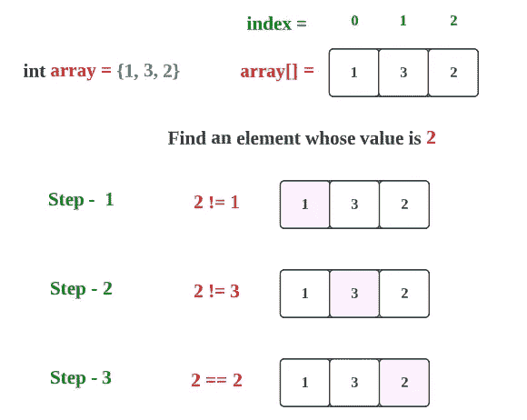**

**对于**二分搜索法**，它将是**O(log n)**[如果数组已排序]**

**这里，在给定的一个**排序数组**中，我们找到了**最中间的**元素并检查该元素的值。如果**最中间的**元素**等于**到**值**，我们就找到了那个元素。如果**最中间的**元素的**大于**值，我们在**最中间的**元素的**左半部分**上搜索，否则我们在**右半部分**上搜索。**

*   ****插入时间:O(n): →****

**假设一个给定的数组，你想在数组的开始增加一些值(最坏的情况)。**

**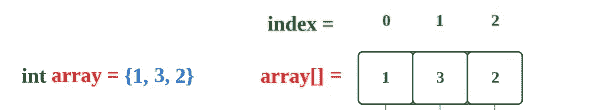**

**我在开始时加了“0”。**

**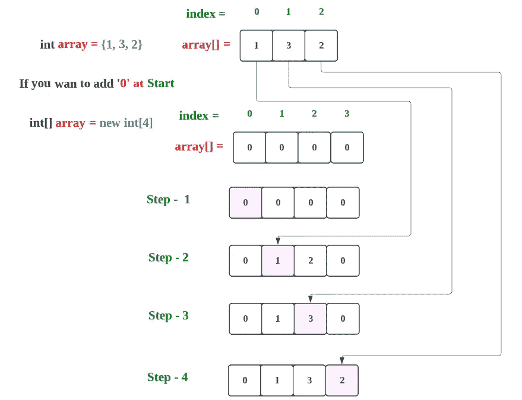**

**因此，这里由于 4 个元素，需要 4 个步骤，因此对于 N 个元素，将需要 N 个步骤。**

*   ****删除时间:O(n): →****

**与插入类似，最糟糕的情况发生在删除发生在数组的开头，需要移动所有的元素。**

**让我们看一个例子:**

**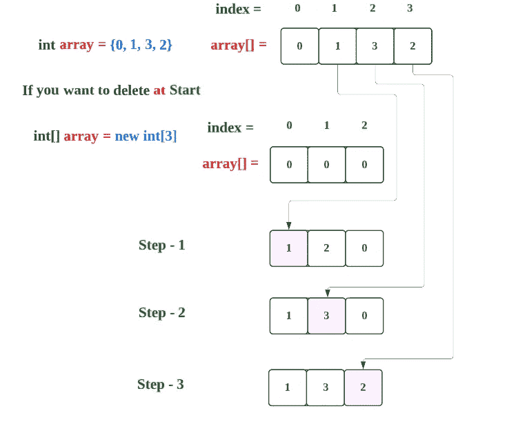**

**在这里，你可以看到 4 个元素的数组，所需的步骤是 4–1 = 3。**

**所以对于 N，它是 N-1，用大 O 符号表示，N == N-1。**

**所以会是 **O(n)** 。**

**我将发布同样的关于**链接列表**、**集合**、**散列表** …所以请关注我以获得关于这些的通知。**

**感谢你阅读这篇文章，❤**

**如果我做错了什么？让我在评论中。我很想进步。**

**拍手声👏如果这篇文章对你有帮助。**