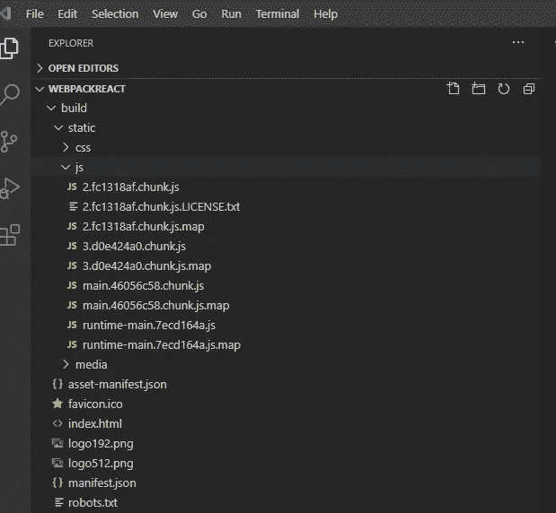

# webpack 如何编译 React 应用程序的基本概述

> 原文：<https://blog.devgenius.io/basic-overview-of-how-webpack-compiles-react-application-3e04e9317f20?source=collection_archive---------6----------------------->

ez。—[马克斯韦尔·尼尔森](https://unsplash.com/@maxcodes?utm_source=medium&utm_medium=referral)在 [Unsplash](https://unsplash.com?utm_source=medium&utm_medium=referral) 上拍摄的照片

如果您是 react 开发人员，您可能想知道浏览器如何理解 react 和 jsx 语法并显示我们构建的所有漂亮的 UI。事情是这样的。

它不懂 react 和 jsx！

等等……什么？那么 react 应用程序是如何呈现的呢？

照片由[詹尼斯·沃尔夫](https://unsplash.com/@janiswolf?utm_source=medium&utm_medium=referral)在 [Unsplash](https://unsplash.com?utm_source=medium&utm_medium=referral) 上拍摄

输入 webpack。

那么，什么是 webpack，webpack 是如何工作的？

Webpack 是一个实用程序，它将多个 javascript 和 css 模块编译成浏览器可以理解的单个 javascript 文件。

在我们深入探讨之前，让我们问自己这样一个问题:我们所说的 javascript 模块是什么？

如果我们谈论的是 react 应用程序，javascript 模块通常存储在 jsx、js 或 tsx 文件中。它们是构成整个应用程序的构件。

让我们通过 create-react-app 从头开始设置一个 react 应用程序。然后我们将看到 webpack 如何将所有这些编译成浏览器可以理解的捆绑 javascript 文件。

步骤 1:在终端上运行 npx create-react-app react webpack。这应该会创建一个基本的 react 应用程序。

第 2 步:转到 src 文件夹，用以下内容创建 MyComponent.js:

第三步:转到 src 文件夹下的 App.js。清除内容并替换为以下内容:

没什么复杂的，对吧？现在去终端，去你的目录所在的地方。运行 npm run build，您将看到正在生成一个构建目录:

现在您可能想知道:这个构建目录是什么？它是用来做什么的？

构建文件夹包含一个可以部署到任何环境生产构建。它由几个完全优化包文件组成。

让我们看看您的 src 目录下的 package.json:

在“脚本”部分，我们指定生成产品就绪构建的命令，该命令被指定为“react-scripts build”。

当运行其中一个脚本时，它将运行主 Facebook/create-react-app(github.com)的[create-react-app/packages/react-scripts/bin 下的“react-scripts.js”。它将解析第二个参数，并生成一组简化的 javascript 文件，作为可以在任何其他环境中轻松部署的包。](https://github.com/facebook/create-react-app/tree/main/packages/react-scripts/bin)

让我们看看这些 chunk.js 文件是什么。我们不需要理解代码在做什么，但是我们可以想象一下缩小后的 javascript 是什么样子:

这可能没有多大意义，但我们可以这样理解:所有这些 javascript 代码都将我们在 react 中构建的内容附加到元素 id 为“root”的根 div 中，它由网页的所有 html 标记组成。

在 [Unsplash](https://unsplash.com?utm_source=medium&utm_medium=referral) 上由 [Tachina Lee](https://unsplash.com/@chne_?utm_source=medium&utm_medium=referral) 拍摄的照片

现在你可能在想:webpack 还能做什么？

默认情况下，当您运行 react-scripts build 或 start 时，它会寻找一个入口点。什么是入口点？

入口点是 webpack 希望捆绑的文件。默认情况下，这个入口点是 index.js，它呈现 app.js 和所有被利用的 js/css 文件。

想知道它是如何工作的吗？请关注我的 medium，我将在本文中对此进行讨论:[如何使用 babel 和 webpack 从头开始创建 react 应用程序|作者 Michael Tong | 2021 年 8 月| Medium](https://kaleongtong282.medium.com/how-to-create-a-react-application-from-scratch-with-babel-and-webpack-a5524ee8c8b3)